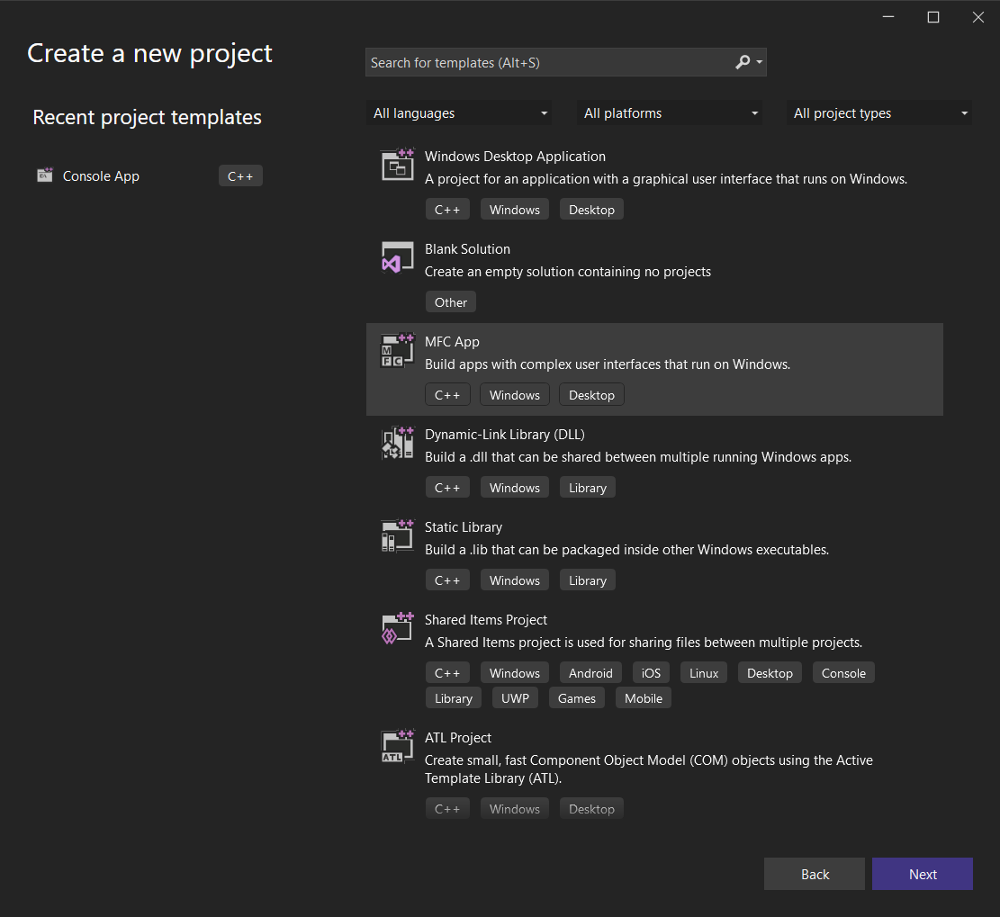

# **Оглавление**

[Лабораторная работа № 1. Основы создания графических приложений в системе Windows](#_toc95259784)

&emsp;[Работа с окнами](#_toc95259785)

&emsp;&emsp;[Окно рабочего стола (Desktop Window)](#_toc95259786)

&emsp;&emsp;[Окна приложений](#_toc95259787)

&emsp;&emsp;[Создание простейшего оконного приложения](#_toc95259788)

&emsp;&emsp;[Создание главного окна приложения](#_toc95259789)

&emsp;&emsp;[Создание главного окна приложения при помощи MFC](#_toc95259790)

&emsp;&emsp;[Создание главного окна приложения при помощи библиотеки WTL](#_toc95259791)

&emsp;[Основы вывод графической информации в системе Windows](#_toc95259792)

&emsp;&emsp;[Контекст устройства](#_toc95259793)

&emsp;&emsp;[Сообщение WM_PAINT](#_toc95259794)

&emsp;&emsp;[Работа с объектами GDI](#_toc95259795)

&emsp;&emsp;[Использование таймера для создания анимированных изображений](#_toc95259796)

&emsp;[Практические задания](#_toc95259797)

&emsp;&emsp;[Обязательные задания](#_toc95259798)

&emsp;&emsp;[Дополнительные задания](#_toc95259799)

# Лабораторная работа № 1. Основы создания графических приложений в системе Windows

## <a name="_toc95259785"></a>**Работа с окнами**

Операционная система Windows является многозадачной операционной системой, что позволяет пользователю работать с несколькими одновременно запущенными
приложениями. Для вывода информации, а также для получения информации от пользователя приложения используют **окна**.

В системе Windows **окном** называется прямоугольная область экрана, которую приложение использует для вывода информации и получения данных от
пользователя. Каждое окно приложения совместно использует экран с окнами других приложений. В один момент времени лишь одно окно может получать
данные, вводимые пользователем. Такое окно называется **активным**. С помощью мыши, клавиатуры и других устройств пользователь может взаимодействовать
с окном и создавшим его приложением.

С каждым окном в системе Windows связан **дескриптор окна** – специальное значение типа **HWND**, которое уникально идентифицирует окно в системе.
После создания окна приложение получает его дескриптор и может управлять окном, передавая дескриптор окна в соответствующие функции управления окнами.

### <a name="_toc95259786"></a>**Окно рабочего стола (Desktop Window)**

Сразу после своего запуска система создает окно рабочего стола. Данное окно используется для заполнения заднего фона экрана и является основой для
размещения окон, создаваемых приложениями.

### <a name="_toc95259787"></a>**Окна приложений**

Каждое графическое приложение создает, по крайней мере, одно[^1] окно, называемое **главным окном приложения**. Данное окно обеспечивает основной
интерфейс между пользователем и приложением. Для отображения или получения дополнительной информации, приложение может создавать и другие окна.

На следующем рисунке показаны типичные компоненты главного окна приложения:


#### ***Клиентская и неклиентская область окна***

**Клиентская область** окна служит для вывода текстовой и графической информации. **К неклиентской области** окна относится строка заголовка окна,
меню, полосы прокрутки, рамка для изменения размеров окна. Как правило, большинство приложений управляют содержимым клиентской области окна, в то
время как управление содержимым неклиентской области окна управляет операционная система.

#### ***Элементы управления и диалоговые окна***

**Элемент управления** (Control) – окно, используемое приложением для получения небольшого фрагмента информации от пользователя. К стандартным
элементам управления относятся текстовые поля, кнопки, надписи, радио-кнопки, флажки, выпадающие списки и др. Пользователь может создавать свои
элементы управлений.

Элементы управления часто используются совместно с **диалоговыми окнами** (Dialog Boxes) – окна, содержащие один или больше элемент управления. Как
правило, диалоговые окна не содержат полос прокрутки, кнопок максимизации и минимизации, меню, а также не позволяют выполнять изменение своего
размера:


**Окна сообщений** (Message Boxes) – специальный тип диалоговых окон, используемый для вывода сообщений, предупреждений или сообщений об ошибках:


#### ***Классы окон***

**Класс окна** – это набор атрибутов, которые система использует для создания нового окна. Каждое окно – это экземпляр одного из зарегистрированных в
системе классов окон. Классы окон, определенные в рамках текущего процесса, используются независимо от классов окон, определенных в других процессах.

Прежде чем создавать окна, приложение должно зарегистрировать в системе соответствующий класс окна. Для этого необходимо заполнить структуру [*
*WNDCLASSEX**](http://msdn.microsoft.com/en-us/library/ms633577%28v=VS.85%29.aspx), объявленную следующим образом:

```cpp
typedef struct {
    UINT cbSize;            // размер структуры в байтах
    UINT style;             // стили класса
    WNDPROC lpfnWndProc;    // адрес оконной процедуры
    int cbClsExtra;         // количество дополительных байт, занимаемых классом
    int cbWndExtra;         // количество дополнительных байт, занимаемых окном
    HINSTANCE hInstance;    // дескриптор экземпляра приложения или DLL-модуля
    HICON hIcon;            // дескриптор большой иконки окна
    HCURSOR hCursor;        // дескриптор курсора окна
    HBRUSH hbrBackground;   // дескриптор кисти, используемой для заливки фона LPCTSTR lpszMenuName; // имя меню (в ресурсах приложения)
    LPCTSTR lpszClassName;  // имя класса окна
    HICON hIconSm;          // дескриптор маленькой иконки окна
} WNDCLASSEX, *PWNDCLASSEX;
```

**Стили класса окна** – набор флагов, определяющих различные аспекты поведения и внешнего вида окна. Стили класса окна можно произвольным образом
комбинировать при помощи побитовой операции |.

**Оконная процедура** – это функция, определяемая приложением, которая служит для обработки сообщений, посылаемых окну. Все окна, создаваемые на
основе некоторого класса окна, имеют общую оконную процедуру.

**Дескриптор экземпляра приложения** используется для разделения классов окон, создаваемых различными модулями в рамках одного процесса. При запуске
графического приложения либо загрузке динамической библиотеки (DLL), им передается дескриптор экземпляра приложения.

**Дескрипторы иконок** задают внешний вид большой и маленькой иконок, отображаемых в панели задач, а также в заголовке окна.

**Дескриптор кисти** определяет способ заливки клиентской области окна

**Имя меню** – имя **ресурса**[^2] меню, используемого окнами данного класса

**Имя класса окна** – имя, под которым будет зарегистрирован данный класс окна. При создании нового окна приложение указывает имя класса окна, а также
дескриптор экземпляра приложения, в котором данный класс был объявлен.

После заполнения полей структуры **WNDCLASSEX**, приложение должно вызвать системную
функцию [RegisterClassEx](http://msdn.microsoft.com/en-us/library/ms633587%28v=VS.85%29.aspx), передав ей адрес данной структуры.

#### ***Сообщения и очередь сообщений***

##### Оконная процедура

Графические приложения, в отличие от консольных приложений, в системе Windows используют **событийно-ориентированную архитектуру**. В частности, для
получения информации они не осуществляют вызов явных функций вроде **getchar()** и т.п. Вместо этого, большую часть времени они пребывают в состоянии
ожидания определенных событий от операционной системы. Такой подход позволяет одновременно запускать несколько приложений, не требуя больших
вычислительных ресурсов. С другой стороны, разработка графических приложений слегка отличается от разработки консольных.

При необходимости передать приложению некоторую информацию, операционная система уведомляет приложение, посылая необходимое **сообщение**  в
соответствующее окно приложения. Каждое окно имеет особую функцию, называемую **оконной процедурой** (window procedure), которую система вызывает
всякий раз, когда для окна имеются входные данные. Оконная процедура обрабатывает эти данные и возвращает управление операционной системе.

Уведомления отправляются окнам в виде сообщений. Система посылает сообщение в оконную процедур с набором четырех параметров: дескриптор окна, *
*идентификатор сообщения** и два параметра, несущие дополнительную информацию о сообщении.

Оконная процедура объявляется следующим образом:

```cpp
LRESULT CALLBACK WindowProc(
    HWND hwnd,      // дескриптор окна
    UINT uMsg,      // идентификатор сообщения
    WPARAM wParam,  // дополнительный параметр 1
    LPARAM lParam); // дополнительный параметр 2
```

Квалификатор CALLBACK задает способ вызова функции[^3], используемый ОС Windows для осуществления вызовов пользовательских процедур.

Дескриптор окна используется системой и приложением для идентификации окна, которому предназначается сообщение.

**Идентификатор сообщения** – именованная целочисленная константа, идентифицирующая цель сообщения. Оконная процедура использует идентификатор
сообщения для того, чтобы определить, каким образом следует обработать полученное сообщение. Например, сообщение с
идентификатором [WM_PAINT](http://msdn.microsoft.com/en-us/library/dd145213%28v=VS.85%29.aspx) сообщает приложению о том, что клиентская область окна
или ее часть нуждается в перерисовке.

Параметры используются для передачи данных, либо для передачи расположения данных, связанных с сообщением, которые могут быть использованы оконной
процедурой. То, как эти данные должны интерпретироваться, зависит от конкретного сообщения. Приложение должно проверить идентификатор сообщения,
прежде чем интерпретировать параметры сообщения.

Возвращаемое значение имеет целочисленный тип **LRESULT** и зависит от того, какое сообщение было обработано.

Оконная процедура может быть вызвана рекурсивно неявным образом. Например, при обработке некоторого сообщения приложение может выполнить над окном
операцию, которая приведет к отправке окну нового сообщения. В этом случае оконная процедура будет вызвана рекурсивно неявным образом. Это
обстоятельство следует учитывать при разработке оконной процедуры – она должна допускать возможность своего рекурсивного вызова.

В частности, следует минимизировать количество локальных переменных, объявляемых внутри оконной процедуры. При получении сообщения оконная процедура
должна вызвать соответствующую функцию. В противном случае при чрезмерном использовании локальных переменных и глубокой рекурсии, в приложении может
возникнуть нехватка размера области стека.

Кроме того, одна и та же оконная процедура используется для обработки сообщений всех окон одного и того же класса. В случае, когда одновременно в
программе могут существовать несколько окон одного и того же класса, следует исключить хранение специфичных для окна данных в области глобальных
переменных. Решить данную проблему может применение ООП, когда для каждого окна приложения создается соответствующий экземпляр C++-класса, данные
которого хранят специфичную для экземпляра окна информацию, а методы занимаются обработкой сообщений. В этом случае оконная процедура должна по
дескриптору окна-адресата сообщения определить соответствующий ему экземпляр C++-класса обработчика и перенаправить обработку сообщения данному
обработчику. Для этих целей можно использовать, например, класс std::map.

Использование готовых фреймворков, вроде MFC, WTL, Qt, wxWidgets и др., может также существенно облегчить процесс создания графических приложений для
системы Windows на C++.

##### Оконная процедура по умолчанию

Функция операционной системы [DefWindowProc](http://msdn.microsoft.com/en-us/library/ms633572\(v=VS.85\).aspx) определяет некоторые фундаментальные
аспекты поведения, свойственные всем окнам, обеспечивая минимально необходимый функционал окна.

Сообщения, не обрабатываемые в оконной процедуре явно, следует передавать функции **DefWindowProc** для обработки по умолчанию

##### Очередь обработки сообщений

В Windows используется два способа маршрутизации сообщений – помещение сообщения в **очередь сообщений**[^4] и отправка сообщений напрямую в оконную
процедуру.

Сообщения попадают в очередь сообщений, главным образом, в результате действий
пользователя ([WM_MOUSEMOVE](http://msdn.microsoft.com/en-us/library/ms645616%28VS.85%29.aspx), [WM_LBUTTONDOWN](http://msdn.microsoft.com/en-us/library/ms645607%28v=VS.85%29.aspx), [WM_KEYDOWN](D:\teaching\2011\cg\labs\01.1\WM_KEYDOWN)
и другие).
Сообщения [WM_TIMER](http://msdn.microsoft.com/en-us/library/ms644902\(v=VS.85\).aspx), [WM_PAINT](http://msdn.microsoft.com/en-us/library/dd145213\(v=VS.85\).aspx)
и [WM_QUIT](http://msdn.microsoft.com/en-us/library/ms632641\(v=VS.85\).aspx) также всегда помещаются в очередь сообщений.

Большинство других сообщений попадают напрямую в оконную процедуру.

В операционной системе существует одна системная очередь сообщений. Кроме того, для каждого
GUI [потока](http://ru.wikipedia.org/wiki/%D0%9C%D0%BD%D0%BE%D0%B3%D0%BE%D0%BF%D0%BE%D1%82%D0%BE%D1%87%D0%BD%D0%BE%D1%81%D1%82%D1%8C) приложения
создается своя очередь сообщения потока. Всякий раз, когда пользователь двигает мышь, щелкает кнопками мыши, либо нажимает на клавиши клавиатуры,
драйвер устройства помещает сообщение в системную очередь сообщений. Операционная система извлекает сообщения одно за другим из системной очереди
сообщений, изучает их на предмет определения окна назначения и помещает сообщение в очередь сообщений потока, создавшего окно назначения. Поток
периодически извлекает сообщения из своей очереди сообщений в **цикле выборки сообщений** и направляет их нужному окну.


##### Цикл выборки сообщений (Message Loop)

Графическое приложение в системе Windows должно[^5] извлекать и обрабатывать сообщения, отправленные в очереди сообщений своих потоков. Однопоточные
приложения используют цикл выборки сообщений (message loop) для обработки и отправки сообщений в соответствующие оконные процедуры.

Простейший цикл выборки представляет собой цикл *while*, в котором приложение извлекает очередное сообщение из очереди сообщений при помощи
функции [GetMessage](http://msdn.microsoft.com/en-us/library/ms644936%28v=VS.85%29.aspx), обрабатывает полученное сообщение при помощи
функции [TranslateMessage](http://msdn.microsoft.com/en-us/library/ms644955%28v=VS.85%29.aspx), а затем передает его в оконную процедуру
соответствующего окна при помощи функции [DispatchMessage](http://msdn.microsoft.com/en-us/library/ms644934%28v=VS.85%29.aspx).

Обычно, цикл выборки сообщений продолжается до тех пор, пока функция **GetMessage** не вернет нулевое значение, сигнализируя о необходимости
завершения работы текущего потока.

Простейший цикл выборки сообщений выглядит следующим образом:

```cpp
MSG msg;
BOOL res;
while ((res = GetMessage(&msg, NULL, 0, 0)) != 0)
{
    if (res == -1)
    {
        // произошла ошибка - нужно обработать ее и, вероятно,
        // завершить работу приложения
    }
    else
    {
        // Если это сообщение о нажатии виртуальной клавиши,
        // то добавляем в очередь сообщений сообщения, несущие информацию о
        // коде вводимого пользователем символа
        TranslateMessage(&msg);
        // передаем сообщение в соответствующую оконную процедуру
        DispatchMessage(&msg);
    }
}
```

Функция **GetMessage** не возвращает управления, если очередь сообщений пуста, либо в ней нет сообщения, удовлетворяющего заданным параметрам. Все это
время поток, вызывавший данную функцию, пребывает в состоянии ожидания, практически не занимая процессорного времени. В отличие от нее, другая
функция, [PeekMessage](http://msdn.microsoft.com/en-us/library/ms644943\(v=VS.85\).aspx), позволяющая узнать о наличии сообщений в очереди сообщений,
возвращает управление немедленно.

### <a name="_toc95259788"></a>**Создание простейшего оконного приложения**

Рассмотрим процесс создания оконного приложения с помощью Microsoft Visual C++.
Нужно создать Desktop-приложение.


#### ***Функция WinMain - точка входа в приложение***

Если точкой входа в консольное приложение на C/C++ является функция **main()**, то для графических приложений Windows такой функцией является
функция [WinMain](http://msdn.microsoft.com/en-us/library/ms633559%28VS.85%29.aspx).

Прототип данной функции описан ниже:

```cpp
int WINAPI WinMain(
    HINSTANCE hInstance,
    HINSTANCE hPrevInstance,
    LPSTR lpCmdLine,
    int nCmdShow);
```

Параметр **hInstance** (handle of the instance) задает дескриптор текущего экземпляра приложения. Важно сохранить значение данного параметра в
переменной, т.к. он нам понадобится для создания окна.

Параметр **hPrevInstance** использовался в ранних версиях Windows для определения факта предыдущего запуска приложений. В настоящее время он не
используется и всегда равен NULL. Его можно смело игнорировать.

Параметр **lpCmdLine** хранит командную строку приложения (за исключением имени программы).

Параметр **nCmdShow** определяет, каким образом должно быть показано главное окно приложения (развернутое на весь экран, минимизированное, или
обычное) – данный режим обычно задается в свойствах ярлыка для запуска программы. Разумеется, разработчика приложения никто не обязывает принимать во
внимание данный параметр, хотя это является правилом хорошего тона.

Возвращаемое целочисленное значение содержит код возврата, который может использоваться вызывающей программой для определения результата работы
приложения. Общепринятой практикой является возврат нулевого значений в случае отсутствия ошибок.

Подробно, параметры функции WinMain описаны в MSDN:

<http://msdn.microsoft.com/en-us/library/ms633559%28VS.85%29.aspx>

Чтобы компилятору стало известно о новых типах аргументов HINSTANCE, LPTSTR, необходимо подключить заголовочный файл **windows.h**.

#### ***Программа “Hello World”***

Воспользуемся функцией [MessageBox](http://msdn.microsoft.com/en-us/library/ms645505%28VS.85%29.aspx) для вывода классического сообщения «Hello
world»:

```cpp
#include <windows.h>
#include <tchar.h>

int WINAPI WinMain(
    HINSTANCE /*hInstance*/,
    HINSTANCE /*hPrevInstance*/,
    LPSTR /*lpCmdLine*/,
    int /*nCmdShow*/)
{
    MessageBox(NULL, _T("Hello world"), _T("My first windows program"), MB_OK);
    return 0;
}
```

При помощи функции **MessageBox** можно вывести стандартное окно сообщения. В качестве первого параметра задается дескриптор родительского окна, либо
NULL, если в качестве родительского окна должно быть окно рабочего стола. Другие параметры задают текст сообщения, заголовок окна, а также управляют
наличием кнопок и иконок в окне.


Функция MessageBox не возвращает управление до тех пор, пока пользователь не нажмет на одну из кнопок в окне. Возвращенное функцией целочисленное
значение может использоваться приложением для определения нажатой кнопки. Например:

```cpp
#include <windows.h>
#include <tchar.h>
int WINAPI WinMain(
    HINSTANCE /*hInstance*/,
    HINSTANCE /*hPrevInstance*/,
    LPSTR /*lpCmdLine*/,
    int /*nCmdShow*/)
{
    if (MessageBox(NULL, _T("Do you like to study?"),
        _T("Yes/no example"), MB_YESNO | MB_ICONQUESTION) == IDYES)
    {
        MessageBox(NULL, _T("Good boy!"), _T("Wow"), MB_OK);
    }
    else // IDNO
    {
        MessageBox(NULL, _T("You are so lazy!"), _T("I'm so sad"), MB_OK);
    }
    return 0;
}
```


#### ***Пару слов о Unicode[^6]***

Следует отметить, что фактическое значение типа LPTSTR (а также других типов, так или иначе связанных со строками и символами в Windows), зависят от
того, в каком режиме было скомпилировано приложение. В случае, если приложение было скомпилировано как поддерживающее Unicode, тип LPTSTR превращается
в LPWSTR (каждый символ в такой строке является типом SHORT), в противном случае (ANSI-приложение) – LPSTR (каждый символ в такой строке является
типом CHAR).

Операционные системы Windows семейства NT (Windows NT, 2000, и выше) поддерживают Unicode. В то же время, для совместимости с приложениями,
написанными для Windows 95, 98, ME, в них остались ANSI-версии многих функций, работающих со строками. В частности, существуют две версии функции *
*MessageBox**: MessageBoxA и MessageBoxW, принимающие, соответственно, ANSI и Unicode-строки. Строго говоря, MessageBox – это не функция, а макрос,
который в зависимости от определения макроса **UNICODE**, разворачивается в ту или иную версию функции.

Макрос **_T** позволяет задавать строковые и символьные литералы в формате Unicode, либо Multi-byte. Например, строка

```cpp
TCHAR message[] = _T("Hello");
```

будет развернута в

```cpp
CHAR message[] = "Hello";
```

либо в

```cpp
SHORT message[] = L"Hello";
```

в зависимости от наличия макроса UNICODE.

Для использования макроса _T необходимо подключить заголовочный файл **tchar.h**

Заголовочные файлы Windows содержат множество конструкций вида (файл **WinUser.h**):

```cpp
WINUSERAPI
int
WINAPI
MessageBoxA(
    __in_opt HWND hWnd,
    __in_opt LPCSTR lpText,
    __in_opt LPCSTR lpCaption,
    __inUINT uType);
WINUSERAPI
int
WINAPI
MessageBoxW(
    __in_opt HWND hWnd,
    __in_opt LPCWSTR lpText,
    __in_opt LPCWSTR lpCaption,
    __inUINT uType);
#ifdef UNICODE
#define MessageBox MessageBoxW
#else
#define MessageBox MessageBoxA
#endif // !UNICODE
```

Задать тип используемого приложением набора символов (в частности, включить или выключить определение макроса UNICODE при компиляции) - Unicode или
Multibyte (ANSI) – можно в свойствах проекта в разделе **Configuration Properties**→**General**.

Следует отметить, что эта настройка, как правило, оказывает влияние лишь на заголовочные файлы Windows. Другие библиотеки (в частности, STL, boost) их
не учитывают


Какой тип приложения использовать (Unicode или нет) программист решает самостоятельно, однако в 21 веке каждое уважающее себя Windows-приложение
должно поддерживать Unicode.

### <a name="_toc95259789"></a>**Создание главного окна приложения**

После того, как мы разобрались с выводом окон сообщений, рассмотрим процесс создания главного окна приложения. Здесь нам потребуется выполнить ряд
подготовительных действий.

#### ***Шаг 1 – Регистрируем класс главного окна приложения***

Для регистрации класса окна заполним структуру WNDCLASSEX необходимыми данными и при помощи RegisterClassEx зарегистрируем класс главного окна нашего
приложения. Заметим, что здесь как раз нам и пригодится параметр **hInstance**, передаваемый в функцию WinMain.

```cpp
TCHAR const CLASS_NAME[] = _T("MainWndClass");
LRESULT CALLBACK WindowProc
    (HWND hwnd, UINT uMsg, WPARAM wParam, LPARAM lParam);
bool RegisterWndClass(HINSTANCE hInstance)
{
    WNDCLASSEX wndClass =
    {
        sizeof(wndClass), //UINT cbSize;
        CS_HREDRAW | CS_VREDRAW, //UINT style;
        &WindowProc, //WNDPROC lpfnWndProc;
        0, //int cbClsExtra;
        0, //int cbWndExtra;
        hInstance, //HINSTANCE hInstance;
        NULL, //HICON hIcon;
        LoadCursor(NULL, IDC_ARROW), //HCURSOR hCursor;
        (HBRUSH)(COLOR_BTNFACE + 1), //HBRUSH hbrBackground;
        NULL, //LPCTSTR lpszMenuName;
        CLASS_NAME, //LPCTSTR lpszClassName;
        NULL, //HICON hIconSm;
    };
    return RegisterClassEx(&wndClass) != FALSE;
}
```

Стили класса окна CS_HREDRAW и CS_VREDRAW означают, что горизонтальное и вертикальное размеров окна должно приводить к очистке всего окна, а не
только его части.

Функцию RegisterWndClass вызовем из функции WinMain:

```cpp
int WINAPI WinMain(
    HINSTANCE hInstance,
    HINSTANCE /*hPrevInstance*/,
    LPSTR /*lpCmdLine*/,
    int /*nCmdShow*/)
{
    if (!**RegisterWndClass**(hInstance))
    {
        return 1;
    }
    return 0;
}
```

#### ***Шаг 2 – Создаем оконную процедуру***

В нашем случае мы ограничимся достаточно простой оконной процедурой, в которой будем обрабатывать очень важное
сообщение – [WM_DESTROY](http://msdn.microsoft.com/en-us/library/ms632620%28VS.85%29.aspx), а все остальные сообщения перенаправлять стандартной
оконной процедуре.

Сообщение **WM_DESTROY** система посылает окну перед тем, как его разрушить. При обработке данного сообщения в оконной процедуре главного окна
приложения, вполне естественным поведением было бы завершить работу приложения.

```cpp
LRESULT CALLBACK WindowProc(
    HWND hwnd,
    UINT uMsg,
    WPARAM wParam,
    LPARAM lParam)
{
    switch (uMsg)
    {
    case WM_DESTROY:
        // Помещаем сообщение WM_QUIT в очередь сообщений текущего потока
        PostQuitMessage(0);
        break;
    default:
        return DefWindowProc(hwnd, uMsg, wParam, lParam);
    }
    return 0;
}
```

Наш обработчик сообщения WM_DESTROY помещает в очередь сообщений текущего потока сообщение WM_QUIT. Данное сообщение будет являться признаком
завершения цикла выборки сообщений.

#### ***Шаг 3 – Создаем главное окно приложения***

После того, как класс главного окна приложения зарегистрирован, можно приступить к созданию окон на его основе. Для этого следует воспользоваться
функцией[^7] [CreateWindowEx](http://msdn.microsoft.com/en-us/library/ms632680%28VS.85%29.aspx).

```cpp
HWND WINAPI CreateWindowEx(
    DWORD dwExStyle, // расширенные стили окна
    LPCTSTR lpClassName, // имя класса окна
    LPCTSTR lpWindowName, // имя окна (заголовок)
    DWORD dwStyle, // стили окна
    int x, // координата X верхнего левого угла окна
    int y, // координата Y верхнего левого угла окна
    int nWidth, // ширина окна (в пикселях)
    int nHeight, // высота окна (в пикселях)
    HWND hWndParent, // дескриптор родительского окна
    HMENU hMenu, // дескриптор меню
    HINSTANCE hInstance, // дескриптор экземпляра приложения или DLL-модуля
    LPVOID lpParam // параметр, передаваемый окну при его создании
);
```

В качестве **имени класса окна** мы должны указать имя класса главного окна нашего приложения.

Для окон, содержащих строку заголовка, параметр «**имя окна**» задает текст, отображаемый в строке заголовка окна. Если функция CreateWindowEx
используется для создания окон элементов управления (кнопки, флажки, радио-кнопки, надписи), данный параметр указывает текст, отображаемый элементом
управления.

**Стили окна** и **расширенные стили окна** определяют такие параметры окна, как наличие заголовка, тип рамки окна, расположение выше всех окон, и
другие.

Координаты окна задаются в пикселях относительно **верхнего левого угла клиентской области родительского окна**. Размеры также задаются в пикселях.

В качестве **дескриптора родительского окна** следует указать окно, выступающее в качестве **родительского окна**[^8], либо NULL, если окно должно
быть дочерним окном рабочего стола.

**Дескриптор меню** позволяет задать для окна строку меню. При передаче NULL в качестве данного параметра, создаваемое окно не будет иметь меню.

И вновь нам пригодился hInstance, **дескриптор экземпляра приложения**, передаваемый в WinMain. Напомним, что каждый модуль (само приложение, или
используемые им динамические библиотеки) в пределах одного процесса могут регистрировать собственные классы окон. Дескриптор загруженного модуля как
раз позволяет отличать классы одного модуля от классов другого.

Параметр lpParam позволяет передать создаваемому окну дополнительную информацию, например, данные связанные с окном. Данный параметр используется
также при создании окон в приложениях с многодокументным интерфейсом (MDI-приложения).

При успешном создании окна функция возвращает дескриптор созданного окна, который приложение может использовать для управления окном.

В нашем случае функция создания главного окна приложения **CreateMainWindow()** будет выглядеть следующим образом:

```cpp
TCHAR const CLASS_NAME[] = _T("MainWndClass");
TCHAR const WINDOW_TITLE[] = _T("My first window");
...
HWND CreateMainWindow(HINSTANCE hInstance)
{
    HWND hMainWindow = CreateWindowEx(
    0,                                  // расширенные стили окна
        CLASS_NAME,
        WINDOW_TITLE,
        WS_OVERLAPPEDWINDOW,            // стили окна
        CW_USEDEFAULT, CW_USEDEFAULT,   // координаты по-умолчанию
        CW_USEDEFAULT, CW_USEDEFAULT,   // размер по умолчанию
        NULL,                           // дескриптор родительского окна
        NULL,                           // дескриптор меню
        hInstance,
        NULL);                          // доп. параметры окна
        
    return hMainWindow;
}
```

#### ***Шаг 4 – Показываем главное окно***

Окно мы создали, но окно создается изначально скрытым. Окно можно было бы создать видимым изначально, добавив флаг WS_VISIBLE к флагу
WS_OVERLAPPEDWINDOW при помощи операции побитовой операции | (ИЛИ). В нашем случае мы это сделали специально, чтобы продемонстрировать использование
параметра **nCmdShow**, передаваемого в WinMain. При помощи функций [ShowWindow](http://msdn.microsoft.com/en-us/library/ms633548%28v=VS.85%29.aspx)
и [UpdateWindow](http://msdn.microsoft.com/en-us/library/dd145167%28VS.85%29.aspx) выполним отображение окна и обновление его содержимого.

ShowWindow(hMainWindow, nCmdShow);

UpdateWindow(hMainWindow);

#### ***Шаг 5 – Запускаем цикл выборки сообщений***

После того, как окно создано и показано на экране, необходимо запустить цикл выборки сообщений, извлекающий сообщения из очереди сообщений.

```cpp
int MainLoop()
{
    MSG msg;
    BOOL res;
    while ((res = GetMessage(&msg, NULL, 0, 0)) != 0)
    {
        if (res == -1)
        {
            // произошла ошибка - нужно обработать ее и, вероятно,
            // завершить работу приложения
        }
        else
        {
            // Если это сообщение о нажатии виртуальной клавиши,
            // то добавляем в очередь сообщений сообщения, несущие информацию о
            // коде вводимого пользователем символа
            TranslateMessage(&msg);
            // передаем сообщение в соответствующую оконную процедуру
            DispatchMessage(&msg);
        }
    }
    // сюда мы попадем только в том случае извлечения сообщения WM_QUIT
    // msg.wParam содержит код возврата, помещенный при помощи функции
    // PostQuitMessage()
    return msg.wParam;
}
```

#### ***Шаг 6 – Собираем все функции воедино***

Теперь, когда все подготовительные шаги выполнены, приведем окончательный вариант функции WinMain:

```cpp
int WINAPI WinMain(
    HINSTANCE hInstance,
    HINSTANCE /*hPrevInstance*/,
    LPSTR /*lpCmdLine*/,
    int nCmdShow)
{
    // Регистрируем класс главного окна
    if (!RegisterWndClass(hInstance))
    {
        return 1;
    }

    // Создаем главное окно приложения
    HWND hMainWindow = CreateMainWindow(hInstance);
    if (hMainWindow == NULL)
    {
        return 1;
    }

    // Показываем главное окно приложения
    ShowWindow(hMainWindow, nCmdShow);
    UpdateWindow(hMainWindow);

    // Запускаем цикл выборки сообщений, пока не получим
    // сигнал о завершении приложения
    return MainLoop();
}
```

#### ***Подводим итоги***

Нам пришлось немного потрудиться, чтобы создать минимальное графическое приложение с использованием функций WinAPI.

Прежде чем создать главное окно нашего приложения, мы зарегистрировали его **класс**. С каждым классом окна связана соответствующая **оконная
процедура**, которая обрабатывает сообщения всех окон, созданных на основе данного класса. Именно код оконной процедуры во многом определяет то, как
будут себя вести окна класса.

Наша оконная процедура обрабатывает только сообщение **WM_DESTROY**, которое посылается окну непосредственно перед его разрушением. Разрушение окна
происходит после его закрытия, либо может быть осуществлено программистом явно при помощи
функции [DestroyWindow](http://msdn.microsoft.com/en-us/library/ms632682%28v=VS.85%29.aspx)(). Для того, чтобы известить приложение о необходимости
завершения работы, обработчик сообщения WM_DESTROY использует функцию PostQuitMessage(), которая помещает в очередь сообщений текущего потока
сообщение WM_QUIT.

После создания главного окна приложения мы делаем его видимым, используя параметр nCmdShow, переданный в функцию WinMain.

После того, как главное окно было показано, запускаем цикл выборки сообщений, внутри которого осуществляется извлечение сообщений, адресуемых нашему
окну, их обработка и перенаправление нужной оконной процедуре.

### <a name="_toc95259790"></a>**Создание главного окна приложения при помощи MFC**




Библиотека классов MFC (Microsoft Foundation Classes), поставляемая в составе Microsoft Visual Studio, содержит широкий спектр классов и функций,
значительно упрощающих процесс создания графических приложений.

### <a name="_toc95259791"></a>**Создание главного окна приложения при помощи библиотеки WTL**

[Windows Template Library](http://ru.wikipedia.org/wiki/WTL) (WTL) – свободно распространяемая библиотека шаблонов C++, предназначенная для создания
стандартных GUI приложений Windows, являющаяся расширением библиотеки [ATL](http://ru.wikipedia.org/wiki/Microsoft_ATL). Данная библиотека
представляет собой объектно-ориентированную обертку над интерфейсом Win32 API, и в первую очередь разрабатывалась как облегченная альтернатива
библиотеке MFC.

## <a name="_toc95259792"></a>**Основы вывод графической информации в системе Windows**

В операционной системе Windows приложения, как правило, осуществляют вывод информации не напрямую на экран, а внутри своих окон. Такой способ
организации графического вывода позволяет приложениям выводить информацию, не вступая в конфликт друг с другом.

Приложение осуществляет графический вывод в окно в следующих случаях:

- Непосредственно после создания и показа окна
- При изменении размеров окна
- При перемещении окна из-под вышестоящего окна
- При отображении данных (например, из открытого файла)
- При изменении или выделении порции выводимой информации

Операционная система управляет такими действиями, как изменение размеров или перемещение окна. Если операция оказывает влияние на содержимое окна, то
система помечает нужную область окна как нуждающуюся в перерисовке и посылает окну
сообщение [WM_PAINT](http://msdn.microsoft.com/en-us/library/dd145213\(v=VS.85\).aspx). Это сообщение является сигналом для окна о необходимости
обновления его содержимого.

В ряде случаев необходимость перерисовки окна или его части может быть определена только самим приложением (например, в ответ на действия
пользователя). В таких случаях приложением может самостоятельно пометить область окна как нуждающуюся в перерисовке, которая будет обновлена при
следующей обработке сообщения WM_PAINT. Приложение также может выполнить немедленное обновление области окна, не дожидаясь получения следующего
сообщения WM_PAINT.

В этом случае для получения контекста устройства приложение должно воспользоваться
функцией [BeginPaint](http://msdn.microsoft.com/en-us/library/dd183362\(v=VS.85\).aspx).

### <a name="_toc95259793"></a>**Контекст устройства**

Прежде чем рисовать в окне, приложение должно получить дескриптор **контекста устройства монитора** (Display Device Context, или просто Device
Context – контекст устройства) для данного окна. Контекст графического устройства задает набор графических объектов и их атрибутов, а также
графических режимов, которые оказывают влияние на графический вывод. Подсистема Windows, отвечающая за графический вывод с использованием контекста
устройства называется [**GDI** **– Graphic Device Interface**](http://msdn.microsoft.com/en-us/library/dd145203%28v=VS.85%29.aspx). С ее помощью
приложения могут осуществлять графический вывод на любые графические устройства, такие как дисплей и принтер.

### <a name="_toc95259794"></a>**Сообщение WM_PAINT**

Сообщение [WM_PAINT](http://msdn.microsoft.com/en-us/library/dd145213\(v=VS.85\).aspx) посылается окну в том случае, когда часть клиентской области
окна нуждается в перерисовке. При получении данного сообщения, приложение может вызвать
функцию [BeginPaint](http://msdn.microsoft.com/en-us/library/dd183362\(v=VS.85\).aspx) для получения дескриптора контекста устройства, связанного с
клиентской областью окна, нуждающейся в перерисовке. После выполнения операций графического вывода приложение должно вызвать
функцию [EndPaint](http://msdn.microsoft.com/en-us/library/dd162598\(v=VS.85\).aspx), для освобождения полученного таким образом дескриптора контекста
устройства. В идеале, большую часть графического вывода (если не весь вывод) окно должно осуществлять в обработчике сообщения WM_PAINT. Во всех
остальных случаях для получения контекста устройства приложение должно использовать
функцию [GetDC](http://msdn.microsoft.com/en-us/library/dd144871\(v=VS.85\).aspx),
либо [GetDCEx](http://msdn.microsoft.com/en-us/library/dd144873%28v=VS.85%29.aspx).

Если контекст устройства был получен при помощи [GetDC](http://msdn.microsoft.com/en-us/library/dd144871\(v=VS.85\).aspx)
или [GetDCEx](http://msdn.microsoft.com/en-us/library/dd144873%28v=VS.85%29.aspx), освобождать его следует при помощи
функции [ReleaseDC](http://msdn.microsoft.com/en-us/library/dd162920\(v=VS.85\).aspx).

#### ***Добавляем обработчик сообщения WM_PAINT в оконную процедуру главного окна приложения***

Наш обработчик сообщения WM_PAINT будет пока выполнять лишь необходимый минимум действий – получать дескриптор контекста устройства и сразу же
освобождать его:

```cpp
LRESULT CALLBACK WindowProc(
    HWND hwnd,
    UINT uMsg,
    WPARAM wParam,
    LPARAM lParam)
{
    switch (uMsg)
    {
    case WM_DESTROY:
        // Помещаем сообщение WM_QUIT в очередь сообщений текущего потока
        PostQuitMessage(0);
        break;
    case WM_PAINT:
        {
            PAINTSTRUCT ps;
            HDC dc = **BeginPaint**(hwnd, &ps);
            **EndPaint**(hwnd, &ps);
        }
        break;
    default:
        return DefWindowProc(hwnd, uMsg, wParam, lParam);
    }
    return 0;
}
```

Посмотрим, что можно улучшить в оконной процедуре. Очевидно, что по мере доработки приложения, оконная процедура станет неприемлемо большой и сложной.
Кроме того, необходимо стремиться к уменьшению числа объявляемых в ней локальных переменных.

Решение напрашивается само собой – вынести обработчики сообщений в соответствующие внешние функции. И здесь разработчики Windows SDK припасли нам
приятный сюрпризы – распаковщики сообщений (Message Crackers) – набор специальных макросов, объявленных в заголовочном файле **windowsx.h**,
облегчающих процесс написания оконной процедуры.

Например, распаковщик сообщения WM_DESTROY выглядит следующим образом:

```cpp
/* void Cls_OnDestroy(HWND hwnd) */
#define HANDLE_WM_DESTROY(hwnd, wParam, lParam, fn) \
    ((fn)(hwnd), 0L)
#define FORWARD_WM_DESTROY(hwnd, fn) \
    (void)(fn)((hwnd), WM_DESTROY, 0L, 0L)
```

Макрос **HANDLE_WM_DESTROY** осуществляет вызов обработчика сообщения WM_DESTROY, объявленного в форме функции (или метода) с типом возвращаемого
значения void, принимающей один аргумент типа HWND. Использованием макроса HANDLE_WM_DESTROY в оконной процедуре главного окна приложения выглядело
бы следующим образом:

```cpp
void OnDestroy(HWND /*hWnd*/)
{
    PostQuitMessage(0);
}

LRESULT CALLBACK WindowProc(
    HWND hwnd,
    UINT uMsg,
    WPARAM wParam,
    LPARAM lParam)
{
    switch (uMsg)
    {
    case WM_DESTROY:
        return HANDLE_WM_DESTROY(hwnd, wParam, lParam, OnDestroy);
    ... // аналогичные макросы для обработки других сообщений
    }
    return DefWindowProc(hwnd, uMsg, wParam, lParam);
}
```

Но, оказывается, есть еще один весьма полезный макрос в Windowsx.h, облегчающий нашу задачу еще больше:

```cpp
#define HANDLE_MSG(hwnd, message, fn)    \
    case (message): return HANDLE_##message((hwnd), (wParam), (lParam), (fn))
```

Данный макрос разворачивается в соответствующее case-условие с вызовом макроса HANDLE_*, согласно обрабатываемому сообщению.

С помощью данных макросов мы можем сделать код нашей оконной процедуры более элегантным. Код оконной процедуры и обработчиков сообщений WM_DESTROY и
WM_PAINT представлен ниже:

```cpp
void OnDestroy(HWND /*hWnd*/)
{
    PostQuitMessage(0);
}

void OnPaint(HWND hwnd)
{
    PAINTSTRUCT ps;
    HDC dc = BeginPaint(hwnd, &ps);
    EndPaint(hwnd, &ps);
}

LRESULT CALLBACK WindowProc(
    HWND hwnd,
    UINT uMsg,
    WPARAM wParam,
    LPARAM lParam)
{
    switch (uMsg)
    {
    HANDLE_MSG(hwnd, WM_DESTROY, OnDestroy);
    HANDLE_MSG(hwnd, WM_PAINT, OnPaint);
    }
    return DefWindowProc(hwnd, uMsg, wParam, lParam);
}
```

Для иллюстрации графических возможностей GDI выполним рисование [эллипса](http://msdn.microsoft.com/en-us/library/dd162468%28v=VS.85%29.aspx) при
помощи функции [Ellipse](http://msdn.microsoft.com/en-us/library/dd162510\(v=VS.85\).aspx):

```cpp
void OnPaint(HWND hwnd)
{
    PAINTSTRUCT ps;
    HDC dc = BeginPaint(hwnd, &ps);
    Ellipse(dc,           // дескриптор контекста устройства
        100, 50,        // x и y верхнего левого угла ограничивающего прямоугольника
        250, 150        // x и y нижнего правого угла ограничивающего прямоугольника
        );
    EndPaint(hwnd, &ps);
}
```

В GDI эллипс задается путем указания координат левого верхнего и правого нижнего углов относительно верхнего левого угла клиентской области окна.
Координаты задаются в логических единицах устройства (для монитора эти единицы совпадают с пикселями):


В результате будет выведен вот такой эллипс:


### <a name="_toc95259795"></a>**Работа с объектами GDI**

Нарисованный нами эллипс имеет черную границу и белую заливку, т.к. GDI изображает его границу с использованием текущего пера (Pen) и заливает
внутреннюю область с использованием текущей кисти (Brush).

Для осуществления графического вывода в GDI используются следующие графические объекты:

- Перо (Pen)
- Кисть (Brush)
- Шрифт (Font)
- Растровое изображение (Bitmap)
- Метафайл (Metafile)
- Путь (Path)
- Регион (Region)

Более подробно о Windows GDI можно почерпнуть на сайте MSDN:

<http://msdn.microsoft.com/en-us/library/dd183394%28v=VS.85%29.aspx>

В один момент времени в контексте устройства может быть выбран **только один объект каждого типа**, который и будет являться текущим при выполнении
графических операций с контекстом устройства.

Для смены текущего объекта GDI в контексте устройства необходимо выбрать его в контекст устройства при помощи
функции [SelectObject](http://msdn.microsoft.com/en-us/library/dd162957%28v=VS.85%29.aspx), при этом будет возвращен дескриптор ранее выбранного
объекта GDI, который можно сохранить для последующего восстановления состояния контекста устройства.

Приложение должно возвращать контекст устройства в состояние, в котором он находился при его получении. В частности, сменив текущий объект GDI в
контексте устройства, после окончания использования контекста устройства приложение должно восстановить в нем ранее выбранный объект.

Приложение не должно выполнять удаление объектов GDI, если они выбраны в том или ином контексте устройства.

Пренебрежение данным правилом может привести к утечкам GDI объектов в приложении или к искажению графического вывода в приложении. Исчерпав отведенный
приложению лимит GDI объектов (не более 12000 объектов на процесс, но не более 16000 объектов на все процессы в системе), приложение не сможет
осуществлять графический вывод и, скорее всего, аварийно завершит свою работу.

#### ***Мониторинг количества объектов GDI***

Получить информацию о количестве объектов GDI, используемых процессом, можно при помощи диспетчера задач (Task Manager). Для этого нужно включить
отображение соответствующего столбца (GDI Objects) в настройках системы.

Другой способ – использование функции [GetGuiResources](http://msdn.microsoft.com/en-us/library/ms683192.aspx):

DWORD gdiObjectsCount = GetGuiResources(GetCurrentProcess(), GR_GDIOBJECTS);


#### ***Работа с объектами GDI с использованием WinAPI***

Доработаем приложение таким образом, чтобы нарисовать эллипс, имеющий красную границу и желтую заливку.

Для этого в обработчике сообщения WM_PAINT создадим перо при помощи
функции [CreatePen](http://msdn.microsoft.com/en-us/library/dd183509\(v=VS.85\).aspx) и кисть при помощи
функции [CreateBrushIndirect](http://msdn.microsoft.com/en-us/library/dd183487\(v=VS.85\).aspx). Затем при помощи
функции [SelectObject](http://msdn.microsoft.com/en-us/library/dd162957\(v=VS.85\).aspx) либо вспомогательных макросов SelectPen и SelectBrush,
объявленных в заголовочном файле WindowsX.h, выберем кисть и перо в контексте устройства. Полученные дескрипторы ранее выбранной кисти и пера сохраним
во временных переменных, а затем восстановим после завершения работы с контекстом устройства.

По окончании работы с пером и кистью выполним их удаление при помощи
функции [DeleteObject](http://msdn.microsoft.com/en-us/library/dd183539%28v=VS.85%29.aspx) либо макросов DeletePen и DeleteBrush.

```cpp
void OnPaint(HWND hwnd)
{
    PAINTSTRUCT ps;
    HDC dc = BeginPaint(hwnd, &ps);
    
    // создаем красное перо
    HPEN pen = CreatePen(PS_SOLID, 2, RGB(255, 0, 0));
    
    // создаем желтую кисть
    LOGBRUSH brushInfo;
    brushInfo.lbStyle = BS_SOLID;
    brushInfo.lbColor = RGB(255, 255, 0);
    brushInfo.lbHatch = 0;
    HBRUSH brush = CreateBrushIndirect(&brushInfo);
    
    // выбираем перо и кисть в контексте устройства,
    // запоминая ранее выбранные объекты
    HPEN oldPen = SelectPen(dc, pen);
    HBRUSH oldBrush = SelectBrush(dc, brush);
    Ellipse(dc,     // дескриптор контекста устройства
        100, 50,    // x и y верхнего левого угла ограничивающего прямоугольника
        250, 150    // x и y нижнего правого угла ограничивающего прямоугольника
        );
        
    // выбираем ранее сохраненные объекты GDI в контексте устройства
    // при этом pen и brush автоматически становятся в нем не выбраны
    SelectPen(dc, oldPen);
    SelectBrush(dc, oldBrush);
    
    // объекты GDI можно удалять если они не выбраны ни в одном из контекстов
    DeletePen(pen);
    DeleteBrush(brush);
    EndPaint(hwnd, &ps);
}
```

Примечание: SelectPen и SelectBrush – это макросы над функцией SelectObject, объявленные в заголовочном файле **windowsx.h**, при помощи которых
осуществляется более удобный выбор объектов GDI в контексте устройства. Без использования данных макросов выбрать перо, например, можно было бы
следующим образом:

HPEN oldPen = (HPEN)SelectObject(dc, pen);


#### ***Работа с объектами GDI с использованием MFC***

Доработаем созданное нами MFC приложение таким образом, добавив в него надлежащую обработку события WM_PAINT. Сгенерированное с помощью мастера
приложение уже содержит такой обработчик - метод CChildView::OnPaint(). Чтобы MFC определил необходимость использования обработчика WM_PAINT, в файле
реализации класса CChildView содержится т.н. **карта сообщений** - специальным образом оформленное описание событий, обрабатываемых классом окна
CChildView:

```cpp
BEGIN_MESSAGE_MAP(CChildView, CWnd)
    ON_WM_PAINT()
END_MESSAGE_MAP()
```

Для доступа к карте сообщений класса внутри объявления класса CChildView содержится объявление карты сообщений с помощью макроса *
*DECLARE_MESSAGE_MAP()**. Рекомендуется изучить исходный код упомянутых макросов для укрепления представления об принципах их работы.

Исходный код обновленного метода OnPaint, выполняющий действия, аналогичные предыдущему приложения, представлен ниже.

```cpp
void CChildView::OnPaint()
{
    CPaintDC dc(this); // device context for painting

    // создаем перо и кисть с использованием классов библиотеки MFC
    CPen pen(PS_SOLID, 2, RGB(255, 0, 0));
    CBrush brush(RGB(255, 255, 0));

    // Выбираем их в контекст устройства
    CPen * pOldPen = dc.SelectObject(&pen);
    CBrush * pOldBrush = dc.SelectObject(&brush);

    // Рисуем эллипс
    dc.Ellipse(100, 50, 250, 150);

    // Выбираем прежние объекты
    dc.SelectObject(pOldPen);
    dc.SelectObject(pOldBrush);

    // деструкторы CPen и CBrush автоматически уничтожат объекты
    // pen и brush при выходе из данной функции
}
```

Как видно и исходного кода, классы CPen и CBrush, представляющие из себя объектно-ориентированные обертки над HPEN и HBRUSH снимают с программиста
обязанность по своему уничтожению (это происходит автоматически в их деструкторах). Однако, по-прежнему, требуется восстанавливать объекты GDI в
контексте устройства, которые были заменены в ходе работы.

Класс CPaintDC автоматически получает контекст устройства заданного окна приложения, вызывая BeginPaint в конструкторе, и EndPaint в деструкторе. Так
что, в конечном итоге, данный код мало чем конструктивно отличается от кода предыдущего приложения.


#### ***Работа с объектами GDI с использованием WTL.***

Библиотека WTL так же использует карту сообщений в классах окон для задания обработчиков сообщений. Например, в классе видового окна приложения
CApplicationView карта сообщений объявляется следующим образом:

```cpp
class CApplicationView : public CWindowImpl< CApplicationView >
{
public:
    DECLARE_WND_CLASS(NULL)
    BOOL PreTranslateMessage(MSG* pMsg);
    
    // Карта сообщений
    BEGIN_MSG_MAP(CApplicationView)
        MESSAGE_HANDLER(WM_PAINT, OnPaint)
    END_MSG_MAP()
    
// Прототипы обработчиков сообщений, команд и уведомлений:
// LRESULT MessageHandler(UINT /*uMsg*/, WPARAM /*wParam*/, LPARAM /*lParam*/, BOOL& /*bHandled*/)
// LRESULT CommandHandler(WORD /*wNotifyCode*/, WORD /*wID*/, HWND /*hWndCtl*/, BOOL& /*bHandled*/)
// LRESULT NotifyHandler(int /*idCtrl*/, LPNMHDR /*pnmh*/, BOOL& /*bHandled*/)

    LRESULT OnPaint(UINT /*uMsg*/, WPARAM /*wParam*/, LPARAM /*lParam*/, BOOL& /*bHandled*/);
};
```

Библиотека WTL также предоставляет набор классов-оберток над объектами GDI, сходных по возможностям и по синтаксису с классами MFC. Рассмотрим тело
метода OnPaint, разработанного с их помощью:

```cpp
LRESULT CApplicationView::OnPaint(UINT /*uMsg*/, WPARAM /*wParam*/, LPARAM /*lParam*/, BOOL& /*bHandled*/)
{
    CPaintDC dc(m_hWnd);

    // создаем перо и кисть
    CPen pen;
    pen.CreatePen(PS_SOLID, 2, RGB(255, 0, 0));
    CBrush brush;
    brush.CreateSolidBrush(RGB(255, 255, 0));

    // Выбираем перо и кисть
    // CPenHandle и CBrushHandle не выполняют удаление
    // соответствующего объекта GDI в отличие от CPen и CBrush
    CPenHandle oldPen = dc.SelectPen(pen);
    CBrushHandle oldBrush = dc.SelectBrush(brush);

    // Рисуем эллипс
    dc.Ellipse(100, 50, 250, 150);

    // Восстанавливаем в контексте устройсвта прежнюю кисть и перо
    dc.SelectPen(oldPen);
    dc.SelectBrush(oldBrush);
    return 0;
}
```

В целом, решение с использованием библиотеки WTL является практически идентичным решению на базе MFC.


### <a name="_toc95259796"></a>**Использование таймера для создания анимированных изображений**

Таймером в Windows называется процедура, вызываемая периодически операционной системой через определенный промежуток времени.

Приложение может создать таймер при помощи функции [SetTimer](http://msdn.microsoft.com/en-us/library/ms644906\(v=VS.85\).aspx). При помощи этой же
функции можно изменить интервал вызова процедуры таймера. Ставший ненужным таймер можно удалить при помощи
функции [KillTimer](http://msdn.microsoft.com/en-us/library/ms644903\(v=VS.85\).aspx). Для эффективного использования ресурсов операционной системы
приложение должно своевременно удалять таймеры, которые оно больше не использует. Как правило, приложение связывает создаваемый таймер с некоторым
окном. В этом случае окну будет посылаться сообщение [WM_TIMER](http://msdn.microsoft.com/en-us/library/ms644902%28v=VS.85%29.aspx).

С каждым таймером связан уникальный целочисленный идентификатор. Данный идентификатор передается в виде одного из параметров сообщения WM_TIMER.

Проиллюстрируем использование таймеров для создания простейшей анимации вращающегося отрезка прямой.

Создавать и инициализировать таймер мы будем в обработчике сообщения WM_CREATE. Данное сообщение посылается окну после его создания. Для уничтожения
созданного таймера воспользуемся обработчиком сообщения WM_DESTROY. В обработчике WM_TIMER будем выполнять необходимые действия по созданию
анимированного изображения.

#### ***Использование таймера в WinAPI приложениях***

Модифицированная оконная процедура:

```cpp
LRESULT CALLBACK WindowProc(
    HWND hwnd,
    UINT uMsg,
    WPARAM wParam,
    LPARAM lParam)
{
    switch (uMsg)
    {
    HANDLE_MSG(hwnd, WM_DESTROY, OnDestroy);
    HANDLE_MSG(hwnd, WM_PAINT, OnPaint);
    HANDLE_MSG(hwnd, WM_TIMER, OnTimer);
    HANDLE_MSG(hwnd, WM_CREATE, OnCreate);
    }
    return DefWindowProc(hwnd, uMsg, wParam, lParam);
}
```

Инициализация и удаление таймера:

```cpp
enum
{
    ANIMATION_TIMER_ID = 1
};

DWORD g_lastTick;
UINT_PTR g_timerId = 0;

BOOL OnCreate(HWND hwnd, LPCREATESTRUCT /*lpCreateStruct*/)
{
    // запоминаем текущее значение счетчика миллисекунд
    g_lastTick = GetTickCount();
    
    g_timerId = **SetTimer**(hwnd, ANIMATION_TIMER_ID, 20, NULL);
    
    return (g_timerId != 0);
}

void OnDestroy(HWND hWnd)
{
    // уничтожаем ранее созданный таймер
    KillTimer(hWnd, ANIMATION_TIMER_ID);

    PostQuitMessage(0);
}
```

Сообщение от созданного нами таймера с идентификатором ANIMATION_TIMER_1 будет посылаться окну примерно через каждые 20 миллисекунд. Действительный
интервал зависит от точности системных часов, а также от загруженности процессора. Сообщение WM_TIMER имеет низкий приоритет и извлекается из очереди
сообщений, только если в ней нет других более важных сообщений. Для равномерного обновления изображения в окне мы воспользуемся
функцией [GetTickCount](http://msdn.microsoft.com/en-us/library/ms724408%28VS.85%29.aspx), возвращающей количество миллисекунд, прошедших с момента
загрузки операционной системы. Вычисление фазы анимации в зависимости от текущего времени осуществляется гораздо точнее, чем от неравномерной частоты
получения сообщения WM_TIMER.

В обработчике сообщения WM_TIMER мы будем вызывать функцию Animate, выполняющую изменение угла поворота отрезка. Поскольку обновление содержимого
окна наше приложение выполняет в обработчике WM_PAINT, для принудительной обработки данного сообщения будем при
помощи [InvalidateRect](http://msdn.microsoft.com/en-us/library/dd145002%28VS.85%29.aspx) помечать всю клиентскую область окна нуждающейся в
перерисовке, а при помощи функции [UpdateWindow](http://msdn.microsoft.com/en-us/library/dd145167\(VS.85\).aspx) форсировать вызов обработчика
WM_PAINT.

```cpp
// текущий угол вращения (в градусах)
double g_rotationAngle = 0;
// скорость вращения стрелки (градусов/сек)
const double ROTATION_SPEED = 30;
const double M_PI = 3.14159265;

void Animate(HWND hwnd)
{
    // определяем промежуток времени (в миллисекундах)
    // с момента предыдущего кадра
    DWORD currentTick = GetTickCount();
    int delta = currentTick - g_lastTick;
    g_lastTick = currentTick;

    // разница по времени в секундах
    double deltaSeconds = delta * 0.001;

    // увеличиваем угол вращения
    g_rotationAngle += ROTATION_SPEED * deltaSeconds;
    // приводим угол вращения к диапазону от 0 до 360 градусов
    g_rotationAngle = fmod(g_rotationAngle, 360);

    // Объявляем всю клиентскую область окна недействительной
    // и перерисовываем окно
    InvalidateRect(hwnd, NULL, TRUE);
    UpdateWindow(hwnd);
}

void OnTimer(HWND hwnd, UINT id)
{
    // Обрабатываем сообщение от таймера
    switch (id)
    {
    case ANIMATION_TIMER_ID:
        Animate(hwnd);
        break;
    }
}
```

Обработчик сообщения WM_PAINT будет выполнять рисование отрезка прямой в зависимости от текущего угла поворота, рассчитываемого в процедуре Animate.

```cpp
void OnPaint(HWND hwnd)
{
    PAINTSTRUCT ps;
    HDC dc = BeginPaint(hwnd, &ps);

    // Создаем перо и выбираем его в контексте устройства
    HPEN pen = CreatePen(PS_SOLID, 2, RGB(255, 0, 0));
    HPEN oldPen = SelectPen(dc, pen);

    // Получаем размеры клиентской области окна и находим его центр
    RECT rcClient;
    GetClientRect(hwnd, &rcClient);
    int centerX = rcClient.right / 2;
    int centerY = rcClient.bottom / 2;
    // вычисляем угол вращения стрелки в радианах
    double angleInRadians = g_rotationAngle * M_PI / 180.0;

    // рисуем стрелку
    MoveToEx(dc, centerX, centerY, NULL);
    LineTo(
        dc,
        int(centerX + 100 * cos(angleInRadians)),
        int(centerY + 100 * sin(angleInRadians))
        );

    // Восстанавливаем ранее выбранное перо и удаляем наше
    SelectPen(dc, oldPen);
    DeletePen(pen);
    
    EndPaint(hwnd, &ps);
}
```

Создание и уничтожение объектов GDI при каждой обработке WM_PAINT является расточительством ресурсов компьютера и здесь используется только для
простоты. В реальных приложениях рекомендуется создавать набор необходимых ресурсов заранее, например, во время инициализации приложения, использовать
их на протяжении его работы, и освободить как только в них отпала необходимость (например, при выходе).

В результате получим приложение, выполняющее рисование вращающегося относительно центра экрана отрезка:


**Примечание**: в данном примере используются глобальные переменные для хранения состояния анимированного изображения (угол вращения, счетчик времени)
лишь для простоты. В реальных приложениях следует отказываться от хранения данных, связанных с конкретным экземпляром окна, в области глобальных
переменных, отдавая предпочтение объектно-ориентированному подходу, предоставляемому, например, MFC и WTL. В частности, глобальные переменные
осложнили бы нашу задачу, задумай мы создать приложение с несколькими главными окнами, в каждом из которых был бы индивидуально вращающийся отрезок
прямой.

#### ***Использование таймера в WTL-проектах***

Добавим в класс видового окна приложения переменную m_pen типа CPen, а в конструкторе выполним ее инициализацию:

```cpp
class CApplicationView : public CWindowImpl<CApplicationView>
{
public:
    CApplicationView();
...
private:
    CPen m_pen;
};

CApplicationView::CApplicationView()
{
    m_pen.CreatePen(PS_SOLID, 2, RGB(255, 0, 0));
}
```

Удалять перо явно не потребуется – это произойдет автоматически при вызове деструктора класса CApplicationView.

Добавим обработчики сообщений WM_TIMER, WM_CREATE и WM_DESTROY к карте сообщений класса. Самый простой способ это сделать – воспользоваться
вкладкой Properties класса CApplicationView, в которой выбрать раздел Messages.


Альтернативный вариант – сделать нужные обработчики это вручную. В результате наших действий мы получим класс видового окна нашего WTL-приложения
аналогичный по функционалу приложению, использующему только возможности Windows API:

```cpp
class CApplicationView : public CWindowImpl<CApplicationView>
{
    enum
    {
        ANIMATION_TIMER_ID = 1
    };

    static const double ROTATION_SPEED;

public:
    DECLARE_WND_CLASS(NULL)

    CApplicationView();

    BOOL PreTranslateMessage(MSG* pMsg);

    BEGIN_MSG_MAP(CApplicationView)
        MESSAGE_HANDLER(WM_PAINT, OnPaint)
        MESSAGE_HANDLER(WM_TIMER, OnTimer)
        MESSAGE_HANDLER(WM_CREATE, OnCreate)
        MESSAGE_HANDLER(WM_DESTROY, OnDestroy)
    END_MSG_MAP()

    LRESULT OnTimer(UINT /*uMsg*/, WPARAM /*wParam*/, LPARAM /*lParam*/, BOOL& /*bHandled*/);
    LRESULT OnCreate(UINT /*uMsg*/, WPARAM /*wParam*/, LPARAM /*lParam*/, BOOL& /*bHandled*/);
    LRESULT OnDestroy(UINT /*uMsg*/, WPARAM /*wParam*/, LPARAM /*lParam*/, BOOL& /*bHandled*/);
    LRESULT OnPaint(UINT /*uMsg*/, WPARAM /*wParam*/, LPARAM /*lParam*/, BOOL& /*bHandled*/);
    
private:
    void Animate(void);

    double m_rotationAngle;
    DWORD m_lastTick;

    CPen m_pen;
};

static const double M_PI = 3.14159265;

const double CApplicationView::ROTATION_SPEED = 30;

CApplicationView::CApplicationView()
:m_rotationAngle(0)
{
    m_pen.CreatePen(PS_SOLID, 2, RGB(255, 0, 0));
}

BOOL CApplicationView::PreTranslateMessage(MSG* pMsg)
{
    pMsg;
    return FALSE;
}

// Обновляем клиентскую область окна – рисуем вршащающийся отрезок
LRESULT CApplicationView::OnPaint(UINT /*uMsg*/, WPARAM /*wParam*/, LPARAM /*lParam*/, BOOL& /*bHandled*/)
{
    CPaintDC dc(m_hWnd);

    CPenHandle oldPen = dc.SelectPen(m_pen);

    CRect rc;
    GetClientRect(rc);

    int centerX = rc.Width() / 2;
    int centerY = rc.Height() / 2;

    double angleInRadians = m_rotationAngle * M_PI / 180.0;

    dc.MoveTo(centerX, centerY);
    dc.LineTo(
        int(centerX + 100 * cos(angleInRadians)),
        int(centerY + 100 * sin(angleInRadians))
        );

    dc.SelectPen(oldPen);

    return 0;
}

// Инициализируем таймер и счетчик времени при инициализации окна
LRESULT CApplicationView::OnCreate(UINT /*uMsg*/, WPARAM /*wParam*/, LPARAM /*lParam*/, BOOL& /*bHandled*/)
{
    m_lastTick = GetTickCount();
    SetTimer(ANIMATION_TIMER_ID, 20, NULL);
    return 0;
}

// Уничтожаем таймер при уничтожении окна
LRESULT CApplicationView::OnDestroy(UINT /*uMsg*/, WPARAM /*wParam*/, LPARAM /*lParam*/, BOOL& /*bHandled*/)
{
    KillTimer(ANIMATION_TIMER_ID);
    return 0;
}

// Обрабатываем сообщение WM_TIMER
LRESULT CApplicationView::OnTimer(UINT /*uMsg*/, WPARAM wParam, LPARAM /*lParam*/, BOOL& /*bHandled*/)
{
    UINT_PTR timerId = wParam;
    switch (timerId)
    {
    case ANIMATION_TIMER_ID:
        Animate();
        break;
    }
    return 0;
}

// Обновляем параметры анимации содержимого окна
void CApplicationView::Animate(void)
{
    DWORD currentTick = GetTickCount();
    double delta = (currentTick - m_lastTick) * 0.001;
    m_lastTick = currentTick;

    m_rotationAngle += ROTATION_SPEED * delta;
    m_rotationAngle = fmod(m_rotationAngle, 360);

    Invalidate();
    UpdateWindow();
}
```

Достоинством нашего WTL приложения является то, что все связанные с видовым окном инкапсулированы внутри класса видового окна, не загрязняя область
глобальных переменных. Кроме того, в приложении мы можем создать произвольное количество экземпляров данного класса, и они не будут конфликтовать друг
с другом.

Результат работы WTL-приложения показан на рисунке ниже:


## <a name="_toc95259797"></a>**Практические задания**

Задание лабораторной работы делятся на обязательные и дополнительные. Дополнительные задания принимаются только после выполнения и защиты хотя бы
одного обязательного задания.

Работа рассчитана на индивидуальное выполнение в течение одной недели.

Для получения оценки «**удовлетворительно**» необходимо выполнить хотя бы **часть** обязательных заданий, набрав при этом **не менее 50 баллов**.

Для получения оценки «**хорошо**» необходимо выполнить хотя бы **часть** обязательных заданий и, возможно, часть дополнительных, набрав при этом **не
менее 150 баллов**.

Для получения оценки «**отлично**» необходимо выполнить **часть** обязательных заданий, и, возможно, часть дополнительных, набрав при этом не менее *
*250 баллов**.

### <a name="_toc95259798"></a>**Обязательные задания**

#### ***Задание 1. 30 баллов***

В этом задании для визуализации разрешается использовать произвольные графическое API и UI-framework. Допускается использовать и веб-технологии (HTML,
CSS, JavaScript).

Разработайте GUI-приложение, отображающее при помощи векторных примитивов (прямоугольники, многоугольники и другие) Ваши инициалы разноцветными
буквами.

Пример визуализации инициалов студента Петра Ильича Чайковского:


##### Бонус 20 баллов за создание анимированного изображения

Доработайте приложение так, чтобы буквы Ваших инициалов подпрыгивали (равноускоренное движение). Фаза прыжка каждой буквы должна несколько отличаться
от фазы прыжка предыдущей.

На возможное мерцание букв пока не обращайте внимание.

#### ***Задание 2 – 60 баллов***

В этом задании для визуализации разрешается использовать произвольное графическое API. Разрешается использовать и веб-технологии (HTML, CSS,
JavaScript).

Разработайте GUI-приложение графическое приложение, визуализирующее с использованием векторных примитивов картинку на одну из следующих тем:

- **Домик в деревне**. Домик с крышей, трубой, окном, дверью и забором.
- **Троллейбус**. Троллейбус с несколькими окнами, колесами, а также токоприемниками, соединенными с проводами.
- **Один из героев мультсериала South Park.** Постараться соблюсти визуальное сходство с прототипом
- **Системный блок компьютера и монитор (вид спереди).** У системного блока должен быть виден CD-ROM, кнопка включения и цветные индикаторы (питание,
  жесткий диск).
- **Цветок**. У цветка должно быть несколько листьев и лепестков, а также стебель.
- **Грузовик (вид сбоку)**. Кузов, колеса, окна, дверь.
- **Космическая ракета**.**
- **Тема по выбору студента**. Тема, предложенная студентом не должна уступать по сложности предложенным выше вариантам.

##### Бонус 30 баллов за возможность таскания объектов при помощи мыши

Пользователь должен иметь возможность «таскать» картинку при помощи мыши методом drag-and-drop.

### <a name="_toc95259799"></a>**Дополнительные задания**

#### ***Задание 3***

##### Вариант 1. Линии. 30 баллов

Ознакомьтесь с существующими алгоритмами построения отрезков прямых и разработайте графическое приложение, выполняющее визуализацию отрезка прямой
заданного цвета между двумя произвольными точками экрана. Построение отрезка должно выполняться вручную (точка за точкой), без использования
встроенных функций используемого графического API вроде LineTo.

Отрезок задается координатами начала и конца, которые могут выходить за пределы области экрана. Координаты концов отрезка могут выходить за пределы
экрана. Программа должна эффективно отсекать части отрезка, выходящие за пределы окна.

##### Вариант 2. Рисование кругов и окружностей. 50 баллов

Ознакомьтесь с существующими алгоритмами построения окружностей и разработайте графическое приложение, выполняющее визуализацию окружности заданного
цвета. Построение окружности должно выполняться вручную (точка за точкой) без использования встроенных функций используемого графического API, таких
как Ellipse.

Окружность задается координатами центра и радиусом, любая часть окружности может выходить за пределы области экрана. Программа должна эффективно
отсекать части окружности, выходящие за пределы экрана (окна).

###### *Бонус до 20 баллов за возможность закрашивания внутренней части окружности*

Бонус начисляется за возможность закрашивания внутренностей окружности цветом, задаваемым отдельно от цвета самой окружности.

###### *Бонус до 60 баллов за устранение ступенчатости окружностей*

Бонус начисляется за применение методик, обеспечивающих сглаживание.

###### *Бонус до 30 баллов за управление толщиной окружности*

Бонус начисляется за управление толщиной линий.

##### Вариант 3. Рисование треугольников. 60 баллов

Изучите алгоритмы рисования треугольников и напишите программу, которая рисовала бы треугольник, внутренность которого заполнена заданным цветом. Построение треугольника должно выполняться вручную (точка за точкой) без использования функций графического API.

Треугольник задаётся координатами вершин. Любая его часть может выходить за пределы области экрана. Программа должна эффективно осекать части треугольника за пределами экрана.

При рисовании треугольников, имеющих смежную сторону, между ними не должно быть щелей.

Протестируйте работу программы на разных видах треугольников, убедитесь в отсутствии визуальных артефактов.

#### ***Задание 4. 150 баллов***

Разработайте с использованием произвольного графического API и UI-фреймворка компьютерную игру «Виселица».

Суть игры заключается в том, что компьютер загадывает слово и дает игроку некоторую подсказку. Игрок за ограниченное количество попыток должен угадать
это слово, называя его по буквам. За каждую неверно названную букву игрок лишается попытки, что графически изображается рисованием новой части тела
«висельника» (веревка, голова, тело, нога, нога, рука, рука). При правильно угаданной букве показываются все ее вхождения внутри слова. Игра
заканчивается либо победой игрока при угадывании всех букв слова, либо его проигрышем при исчерпании имеющегося количества попыток. Примерный вид
экрана программы показан на рисунке:


Выбор букв осуществляется игроком при помощи мыши. По окончании игры пользователю показывается сообщение с информацией о выигрыше/проигрыше с
предложением начать новую игру. При утвердительном ответе программа должна предложить пользователю новое слово, в противном случае программа завершить
свою работу.

Правильно угаданные буквы выделяются зеленым цветом, а неправильно угаданные – красным. Программа не должна позволять повторный выбор букв (при их
выборе ничего не должно происходить).

Слова и задания должны загружаться программой из внешнего текстового файла (необходимо выбрать подходящий формат для их хранения) и предлагаться
пользователю случайным образом.

##### Бонус до 50 баллов за возможность переключения визуального представления игры

Бонус начисляется за возможность в любой момент переключаться между основным и альтернативным вариантами визуального представления игрового при помощи
меню. Состояние игры при этом изменяться не должно. Пример альтернативного способа визуализации


[^1]: Некоторые приложения (например, браузеры) могут создавать несколько главных окон. Работа таких приложений продолжается до тех пор, пока
пользователь не закроет все окна.

[^2]: [**Ресурс**](http://msdn.microsoft.com/en-us/library/ms632583%28v=VS.85%29.aspx) – двоичные данные, которые программист может добавить в
исполняемый файл или динамическую библиотеку.

[^3]: [**Соглашение вызова функции**](http://ru.wikipedia.org/wiki/Calling_convention) или **модель вызова** (англ. Calling convention) – часть
двоичного интерфейса приложений, регламентирующая технические особенности вызова подпрограмм и функций, передачи параметров, возврата из подпрограммы
и передачи результата вычисления в точку вызова

[^4]: **Очередь сообщений** – системный объект, предназначенный для временного хранения сообщений

[^5]: Если приложение не будет обрабатывать адресованные ему сообщения, либо обработка какого-либо сообщения будет занимать длительное время (больше
нескольких секунд), операционная система будет считать такое приложение зависшим и предложит пользователю завершить работу такого приложения насильно.

[^6]: **Юнико́д**, или **Унико́д**
([англ.](http://ru.wikipedia.org/wiki/%D0%90%D0%BD%D0%B3%D0%BB%D0%B8%D0%B9%D1%81%D0%BA%D0%B8%D0%B9_%D1%8F%D0%B7%D1%8B%D0%BA "Английский язык")
*Unicode*)— стандарт кодирования символов, позволяющий представить знаки практически всех письменных языков - <http://ru.wikipedia.org/wiki/Unicode>

[^7]: Как уже говорилось выше, **CreateWindowEx** – это макрос, который в Unicode-приложениях преобразовывается в функцию CreateWindowExW, а в
не-Unicode – в CreateWindowExA.

[^8]: Создаваемое окно будет считаться дочерним для окна, указанного в качестве родительского. Перемещение родительского окна вызывает соответствующее
перемещение его дочерних окон.
