# **Оглавление**

[Лабораторная работа №2. Программирование компьютерной графики с использованием GDI+](#_toc96795984)

&emsp;[Знакомство с библиотекой GDI+](#_toc96795985)

&emsp;&emsp;[Инициализация GDI+](#_toc96795986)

&emsp;&emsp;[Рисование векторных примитивов](#_toc96795987)

&emsp;&emsp;[Рисование растровых изображений](#_toc96795988)

&emsp;&emsp;[Вывод текста](#_toc96795989)

&emsp;&emsp;[Загрузка и сохранение графических файлов](#_toc96795990)

&emsp;&emsp;[Использование двойной буферизации для устранения мерцания изображения](#_toc96795991)

&emsp;[Практические задания](#_toc96795992)

&emsp;&emsp;[Рекомендуемое программное обеспечение](#_toc96795993)

&emsp;&emsp;[Простые задания](#_toc96795994)

&emsp;&emsp;[Задание №3 (повышенной сложности)](#_toc96795995)

# <a name="_toc96795984"></a>**Лабораторная работа №2. Программирование компьютерной графики с использованием GDI+.**

## <a name="_toc96795985"></a>**Знакомство с библиотекой GDI+**

Библиотека GDI+ - это API, появившееся начиная Windows XP основанное на классах для разработчиков на C/C++. Оно позволяет приложениям использовать
графический и текстовый вывод на такие графические устройства как монитор и принтер без необходимости осуществлять непосредственное взаимодействие с
аппаратурой. Вместо этого, GDI+ взаимодействует с драйвером устройства по запросу приложения.

Классы и функции GDI+ располагаются внутри пространства имен **Gdiplus**. Для использования библиотеки GDI+ в приложениях на C/C++ необходимо
подключить заголовочный файл **gdiplus.h**, а также добавить библиотеку **gdiplus.lib** в список дополнительных зависимостей в настройках
компоновщика (во всех конфигурациях):

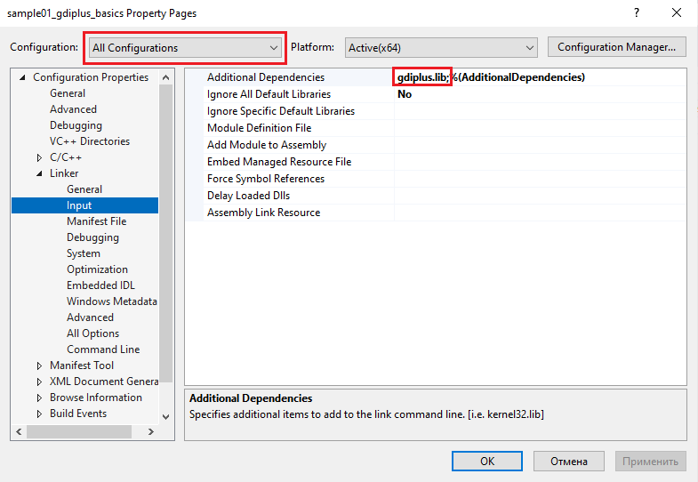

**Рисунок 1. Компоновка приложения с библиотекой gdiplus.lib.**

### <a name="_toc96795986"></a>**Инициализация GDI+**

Для инициализации GDI+ приложение должно вызывать функцию [GdiplusStartup](http://msdn.microsoft.com/en-us/library/ms534077\(v=VS.85\).aspx). Обычно,
инициализация проводится при запуске приложения:

```cpp
UINT_PTR token = 0;
Gdiplus::GdiplusStartupInput input;
Gdiplus::GdiplusStartupOutput output;

if (Gdiplus::GdiplusStartup(&token, &input, &output) != Gdiplus::Ok)
{
    // Не удалось инициализировать GDI+
}
// Инициализация GDI+ завершена успешно
```

Все функции и методы классов GDI+ для сообщения об успехе или неудаче своего вызова возвращают значение перечислимого
типа [Gdiplus::Status](http://msdn.microsoft.com/en-us/library/ms534175%28v=VS.85%29.aspx), единственное значение которого, равное Gdiplus::Ok,
используется для сообщения об успешном выполнении. Ни один из методов классов и функций Gdiplus не генерирует исключений.

Для деинициализации GDI+ необходимо вызвать функцию [GdiplusShutdown](http://msdn.microsoft.com/en-us/library/ms534076\(v=VS.85\).aspx), передав ей в
качестве аргумента значение token, инициализированное при вызове GdiplusStartup:

```cpp
Gdiplus::GdiplusShutdown(token);
```

Для облегчения задачи по инициализации GDI+ можно создать класс CGdiplusInitializer:

```cpp
class CGdiplusInitializer
{
public:
    CGdiplusInitializer()
    {
        Gdiplus::GdiplusStartupInput input;
        Gdiplus::GdiplusStartupOutput output;

        if (Gdiplus::GdiplusStartup(&m_token, &input, &output) != Gdiplus::Ok)
        {
            // Не удалось инициализировать GDI+
            throw std::runtime_error("Failed to initialize GDI+");
        }
    }

    ~CGdiplusInitializer()
    {
        Gdiplus::GdiplusShutdown(m_token);
    }
private:
    ULONG_PTR m_token;
};
```

Для использования класса CGdiplusInitializer достаточно создать экземпляр данного класса, например, в процедуре WinMain:

```cpp
int WINAPI WinMain(
    HINSTANCE hInstance,
    HINSTANCE /*hPrevInstance*/,
    LPSTR /*lpCmdLine*/,
    int nCmdShow)
{
    try
    {
        // Выполняем инициализацию GDI+
        CGdiplusInitializer initializer;
        // При выходе из блока try произойдет автоматическая деинициализация GDI+

        // Регистрируем класс главного окна
        if (!RegisterWndClass(hInstance))
        {
            return 1;
        }

        // Создаем главное окно приложения
        HWND hMainWindow = CreateMainWindow(hInstance);
        if (hMainWindow == NULL)
        {
            return 1;
        }

        // Показываем главное окно приложения
        ShowWindow(hMainWindow, nCmdShow);
        UpdateWindow(hMainWindow);

        // Запускаем цикл выборки сообщений, пока не получим
        // сигнал о завершении приложения
        return MainLoop();
    }
    catch (std::runtime_error &)
    {
        // ошибка инициализации gdi+
        return 2;
    }
}
```

### <a name="_toc96795987"></a>**Рисование векторных примитивов**

Как и в библиотеке GDI, в GDI+ также используются перья, кисти и другие графические объекты, при помощи которых приложение осуществляет построение
изображений на графическом устройстве.

Одним из наиболее важных классов GDI+ является класс [Gdiplus::Graphics](http://msdn.microsoft.com/en-us/library/ms534453\(v=VS.85\).aspx),
предоставляющий методы для рисования линий, кривых, фигур, изображений и текста. В этом смысле его можно считать аналогом контекста устройства GDI.
Однако, в отличие от контекста устройства GDI, функции рисования которого используют текущие графические объекты, выбранные в контексте при помощи
функции **SelectObject**, в GDI+ отсутствует понятие текущего графического объекта, и в методы класса **Graphics** приложение должно явно передавать
графический объект, который должен использоваться в процессе рисования. Такой подход упрощает разработку приложений и делает код более понятным, т.к.
программист не должен заботиться о восстановлении графических объектов в контексте устройства.

Другим важным отличием GDI+ от GDI является отделение методов по рисованию границ замкнутых фигур от заливки их внутренней части. Если в GDI функция *
*Ellipse** выполняла рисование контура эллипса текущим пером и его заливку текущей кистью, то в GDI+ для этих целей служат методы **DrawEllipse** и *
*FillEllipse** класса Graphics. Аналогично предоставлены методы для рисования и заливки других базовых геометрических фигур.

Кроме того, в GDI+ используются возможности языка C++ по перегрузке функций и методов, и для вышеупомянутых DrawEllipse и FillEllipse (и многих
других) методов существует по нескольку версий:

```cpp
Status DrawEllipse(IN const Pen* pen,
    IN REAL x,
    IN REAL y,
    IN REAL width,
    IN REAL height);

Status DrawEllipse(IN const Pen* pen,
    IN const Rect& rect);

Status DrawEllipse(IN const Pen* pen,
    IN INT x,
    IN INT y,
    IN INT width,
    IN INT height);
```

Наличие нескольких версий одного и того же метода дает приложению большую гибкость при их вызове.

Как уже было сказано выше, в классе **Graphics** собраны методы, выполняющие рисование. Для создания экземпляра класса Graphics приложение должно
воспользоваться одним из конструкторов данного класса:

- [Graphics::Graphics(Image*)](http://msdn.microsoft.com/en-us/library/ms536159\(v=VS.85\).aspx) – создает объект Graphics, ассоциированный с
  некоторым изображением. Команды рисования такого объекта Graphics будут осуществлять графический вывод в содержимое изображения в памяти.
- [Graphics::Graphics(HDC)](http://msdn.microsoft.com/en-us/library/ms536160\(v=VS.85\).aspx) – создает объект Graphics, ассоциированный с некоторым
  контекстом устройства
- [Graphics::Graphics(HDC, HANDLE)](http://msdn.microsoft.com/en-us/library/ms536161\(v=VS.85\).aspx) – создает объект Graphics, ассоциированный с
  некоторым контекстом устройства и устройством
- [Graphics::Graphics(HWND, BOOL)](http://msdn.microsoft.com/en-us/library/ms536162\(v=VS.85\).aspx) – создает объект Graphics, ассоциированный с
  указанным окном

Рассмотрим пример обработчика сообщения WM_PAINT, в котором при помощи GDI+ выполним рисование эллипса, имеющего красную границу толщиной 2 пикселя и
желтую сплошную заливку. Рисование внутренней части эллипса мы выполним с использованием
объекта  [Gdiplus::SolidBrush](http://msdn.microsoft.com/en-us/library/ms534508\(v=VS.85\).aspx) и
метода [Gdiplus::Graphics::FillEllipse](https://learn.microsoft.com/ru-ru/windows/win32/gdiplus/-gdiplus-class-graphics-fillellipse-methods). Рисование контура эллипса будет
осуществляться с использованием объекта [Gdiplus::Pen](http://msdn.microsoft.com/en-us/library/ms534485\(v=VS.85\).aspx) и
метода [Gdiplus::Graphics::DrawEllipse](https://learn.microsoft.com/ru-ru/windows/win32/gdiplus/-gdiplus-class-graphics-drawellipse-methods):

```cpp
void OnPaint(HWND hwnd)
{
  PAINTSTRUCT ps;
  HDC dc = BeginPaint(hwnd, &ps);

  // Создаем объект Graphics, посредством которого будем рисовать
  Gdiplus::Graphics g(dc);

  // Устанавливаем режим сглаживания границ векторных примитивов,
  // обеспечивающий высокое качество рисования
  g.SetSmoothingMode(Gdiplus::SmoothingModeHighQuality);

  // Закрашиваем эллипс кистью желтого цвета
  Gdiplus::SolidBrush brush(Gdiplus::Color(255, 255, 0));
  g.FillEllipse(&brush, 100, 100, 200, 100);

  // Рисуем границу эллипса красным пером толщиной 2 пикселя
  Gdiplus::Pen pen(Gdiplus::Color(255, 0, 0), 2);
  g.DrawEllipse(&pen, 100, 100, 200, 100);

  EndPaint(hwnd, &ps);
}
```

Данный пример также демонстрирует еще одну возможность GDI+ – управление качеством рисования векторных фигур, что позволяет устранить ступенчатость в
их границах. При выходе из функции OnPaint деструкторы объектов GDI+ сами позаботятся о том, чтобы освободить связанные с ними ресурсы.

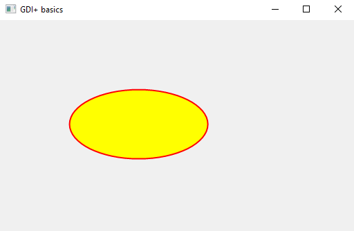

**Рисунок 2. Рисование эллипса средствами GDI+.**

### <a name="_toc96795988"></a>**Рисование растровых изображений**

GDI+ отличается от GDI значительно более мощными возможностями по работе с растровыми изображениями и метафайлами. Прежде всего, это встроенная
поддержка форматов BMP, PNG, GIF, JPEG, WMF, EMF и TIFF. Кроме того, GDI+ позволяет управлять режимом интерполяции изображений, что позволяет
устранить ступенчатость при их масштабировании.

Для загрузки изображения из файла достаточно передать его имя (в формате Unicode) в конструктора
класса [Gdiplus::Image](http://msdn.microsoft.com/en-us/library/ms534462\(v=VS.85\).aspx). Для рисования изображения следует воспользоваться
методом [Gdiplus::Graphics::DrawImage](https://learn.microsoft.com/ru-ru/windows/win32/gdiplus/-gdiplus-class-graphics-drawimage-methods):

```cpp
void OnPaint(HWND hwnd)
{
  PAINTSTRUCT ps;
  HDC dc = BeginPaint(hwnd, &ps);

  // Создаем объект Graphics для рисования в контексте устройства
  Gdiplus::Graphics g(dc);

  // Создаем объект изображение из файла
  Gdiplus::Image img(L"car.jpg");

  // Рисуем изображение при помощи Graphics в контексте устройства
  g.DrawImage(&img, 20, 20);

  EndPaint(hwnd, &ps);
}
```

**Никогда, ни при каких обстоятельствах так не делайте.** Проблема заключается в том, что объект Image в данном примере будет создаваться при каждом
вызове обработчика WM_PAINT, что приведет к необходимости загрузки и декодирования изображения всякий раз, когда приложению понадобится обновить
содержимое своей клиентской области. В результате производительность приложения будет ужасающе низкая.

Чтобы исправить проблему с производительностью следует создать изображение только один раз – при запуске приложения. Важно помнить о том, что
создаваться изображение должно между инициализацией и деинициализацией GDI+. В противном случае изображение создано не будет.

```cpp
Gdiplus::Image * g_pImage = NULL;
int WINAPI WinMain(
    HINSTANCE hInstance,
    HINSTANCE /*hPrevInstance*/,
    LPSTR /*lpCmdLine*/,
    int nCmdShow)
{
    // Выполняем инициализацию GDI+
    try
    {
        CGdiplusInitializer initializer;
        
        // C++ гарантирует, что объект img будет разрушен ДО объекта initializer
        // т.к. деструкторы ранее созданных объектов всегда вызываются позже
        Gdiplus::Image img(L"car.jpg");
        
        // Сохраняем указатель на изображение в глобальной переменной
        // для функции OnPaint
        g_pImage = &img;
        …
    }
    catch (std::runtime_error &)
    {
        return 2;
    }
}
```

В обработчике OnPaint воспользуемся сохраненной глобальной переменной g_pImage для вывода загруженного лишь единожды изображения:

```cpp
void OnPaint(HWND hwnd)
{
    PAINTSTRUCT ps;
    HDC dc = BeginPaint(hwnd, &ps);

    // Создаем объект Graphics
    Gdiplus::Graphics g(dc);

    // Рисуем изображение в Graphics
    g.DrawImage(g_pImage, 20, 20);

    EndPaint(hwnd, &ps);
}
```

**Так делать тоже не рекомендуется.** Несмотря на то, что данное решение выполняет загрузку изображения лишь единожды, оно может иметь проблемы с
производительностью, т.к. GDI+ может отложить декодирование изображения до того момента, как его содержимое будет востребовано (например, при
рисовании). Даже после того, как изображение будет впервые декодировано, GDI+ может посчитать необходимым освободить память, занимаемую
раскодированным изображением, и выполнить повторное декодирование позже. Таким образом, существует риск снижения быстродействия рисования такого
изображения.

Кроме того, файл изображения остается заблокированным на протяжении всего времени жизни объекта Image. В частности, невозможно будет сохранить
внесенные в объект Image изменения в тот же файл.

Ссылка на источник:

<http://support.microsoft.com/?scid=kb%3Ben-us%3B814675&x=9&y=11>

Самым лучшим решением в данном случае будет создание нового
объекта [Gdiplus::Bitmap](http://msdn.microsoft.com/en-us/library/ms534420\(v=VS.85\).aspx) (растровое изображение) нужного размера и формата пикселей
и последующее рисование оригинального изображения в созданный растр. После чего оригинальный объект Image можно удалить, что автоматически снимет
блокировку с используемого им файла, и впоследствии использовать растровое изображение (которое гарантированно будет храниться в памяти в
раскодированном виде).

Обновленный код инициализации и загрузки изображения:

```cpp
#include <memory>    // нужен для подключения умного указателя std::auto_ptr
…
Gdiplus::Bitmap * g_pBitmap = NULL;

int WINAPI WinMain(
    HINSTANCE hInstance,
    HINSTANCE /*hPrevInstance*/,
    LPSTR /*lpCmdLine*/,
    int nCmdShow)
{
    // Выполняем инициализацию GDI+
    try
    {
        CGdiplusInitializer initializer;

        // Создаем объект Image в динамической памяти и сохраняем
        // указатель на него в умном указателе std::auto_ptr
        std::auto_ptr<Gdiplus::Image> pImage(new Gdiplus::Image(L"car.jpg"));

        // Создаем растровое изображение соответствующего размера
        // с форматом пикселей RGBA 32 bit
        Gdiplus::Bitmap bmp(pImage->GetWidth(), pImage->GetHeight(),
            PixelFormat32bppARGB);

        // Создаем объект Graphics дли рисования в растре bmp
        Gdiplus::Graphics g(&bmp);

        // Рисуем исходное изображение внутрь созданного нами растра
        g.DrawImage(pImage.get(), 0, 0);

        // удаляем объект Image
        pImage.release();

        // Сохраняем указатель на раст в глобальной переменной
        // для функции OnPaint
        g_pBitmap = &bmp;

        // Регистрируем класс главного окна
        if (!RegisterWndClass(hInstance))
        {
            return 1;
        }

        // Создаем главное окно приложения
        HWND hMainWindow = CreateMainWindow(hInstance);
        if (hMainWindow == NULL)
        {
            return 1;
        }

        // Показываем главное окно приложения
        ShowWindow(hMainWindow, nCmdShow);
        UpdateWindow(hMainWindow);

        // Запускаем цикл выборки сообщений, пока не получим
        // сигнал о завершении приложения
        return MainLoop();
    }
    catch (std::runtime_error &)
    {
        return 2;
    }
}
```

Обновленный код обработчика сообщения WM_PAINT:

```cpp
void OnPaint(HWND hwnd)
{
  PAINTSTRUCT ps;
  HDC dc = BeginPaint(hwnd, &ps);

  // Создаем объект Graphics
  Gdiplus::Graphics g(dc);

  // Рисуем изображение в Graphics
  g.DrawImage(g_pBitmap, 20, 20);

  EndPaint(hwnd, &ps);
}
```

Обновленный вариант нашей программы использует класс Bitmap для хранения раскодированного jpg-изображения. Рисование раскодированных растровых
изображений класс Graphics выполняет наиболее быстро. Впрочем, за повышение быстродействия мы, возможно, заплатили немного большим объемом
используемой программой оперативной памяти.

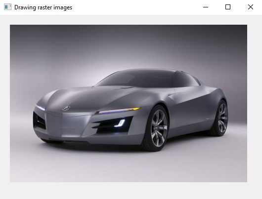

**Рисунок 3. Результат работы приложения.**

#### ***Объектно-ориентированный вариант приложения***

Решив проблему быстродействия, мы ухудшили архитектуру нашей программы, добавив в область глобальных переменных указатель для хранения адреса
растрового изображения. Кроме того, появился риск случайного использования данного указателя уже после разрушения самого объекта Bitmap, объявленного
внутри блока try.

Продемонстрируем решение данной проблемы на примере WTL-приложения[^1].

Добавим[^2] в сгенерированную мастером функцию _tWinMain код инициализации GDI+:

```cpp
class CGdiplusInitializer
{
...
};
int WINAPI _tWinMain(
    HINSTANCE hInstance,
    HINSTANCE /*hPrevInstance*/,
    LPTSTR lpstrCmdLine,
    int nCmdShow)
{
    try
    {
        // Инициализируем GDI+
        CGdiplusInitializer initializer;

        HRESULT hRes = ::CoInitialize(NULL);

        // If you are running on NT 4.0 or higher you can use the following call
        // instead to make the EXE free threaded.
        // This means that calls come in on a random RPC thread.
        // HRESULT hRes = ::CoInitializeEx(NULL, COINIT_MULTITHREADED);
        ATLASSERT(SUCCEEDED(hRes));

        // this resolves ATL window thunking problem when Microsoft Layer
        // for Unicode (MSLU) is used
        ::DefWindowProc(NULL, 0, 0, 0L);

        // add flags to support other controls
        AtlInitCommonControls(ICC_COOL_CLASSES | ICC_BAR_CLASSES);

        hRes = _Module.Init(NULL, hInstance);
        ATLASSERT(SUCCEEDED(hRes));

        int nRet = Run(lpstrCmdLine, nCmdShow);

        _Module.Term();
        ::CoUninitialize();

        return nRet;
    }
    catch(std::runtime_error &)
    {
        // ошибка инициализации GDI+, либо прочая ошибка
        return -2;
    }
}
```

Доработаем класс видового окна приложения. Для хранения распакованного изображения заведем соответствующую переменную класса, а также явно зададим
конструктор по умолчанию:

```cpp
class CApplicationView : public CWindowImpl<CApplicationView>
{
public:
    CApplicationView();
    DECLARE_WND_CLASS(NULL)

    BOOL PreTranslateMessage(MSG* pMsg);

    BEGIN_MSG_MAP(CApplicationView)
        MESSAGE_HANDLER(WM_PAINT, OnPaint)
    END_MSG_MAP()

    LRESULT OnPaint(UINT /*uMsg*/, WPARAM /*wParam*/, LPARAM /*lParam*/, BOOL& /*bHandled*/);
private:
    std::auto_ptr<Gdiplus::Bitmap> m_pBitmap;
};
```

Для хранения растра мы используем умный указатель [std::auto_ptr](https://ru.cppreference.com/w/cpp/memory/auto_ptr), а не просто Bitmap. Связано
это с тем, что размеры растра пришлось бы передавать конструктору класса Bitmap в списке инициализации класса CApplicationView, а они становятся
известными лишь после загрузки изображения в теле конструктора. Поэтому для хранения растра используется область в динамической памяти. Управляет
временем жизни растра автоматизируется при помощи класса auto_ptr.

Разместим в теле конструктора класса загрузку изображения и инициализацию растра:

```cpp
using namespace Gdiplus;

CApplicationView::CApplicationView()
{
    Image img(L"car.jpg");

    if (img.GetLastStatus() != Ok)
    {
        throw std::runtime_error("Failed to open image");
    }

    // создаем Bitmap необходимых размеров
    m_pBitmap = std::auto_ptr<Bitmap>(new Bitmap(
        img.GetWidth(), img.GetHeight()));

    // рисуем в Bitmap содержимое img
    Graphics g(m_pBitmap.get());
    g.DrawImage(&img, 0, 0);
}
```

Обработчик WM_PAINT реализован практически идентично предыдущему приложению:

```cpp
LRESULT CApplicationView::OnPaint(
    UINT /*uMsg*/, WPARAM /*wParam*/, LPARAM /*lParam*/, BOOL& /*bHandled*/)
{
    CPaintDC dc(m_hWnd);

    // создаем Graphics для рисования в контексте устройства
    Graphics g(dc);

    // рисуем изображение
    g.DrawImage(m_pBitmap.get(), 20, 20);

    return 0;
}
```

Деструкторы используемых объектов GDI+ освободят используемые ими ресурсы в процессе разрушения класса видового окна.

Объектно-ориентированное решение избавило нашу программу от необходимости использования глобальных переменных, чем улучшило архитектуру программы и
сделало ее код, связанный с рисованием, более понятным.

### <a name="_toc96795989"></a>**Вывод текста**

GDI+ для вывода текста использует объект «шрифт» ([Gdiplus::Font](http://msdn.microsoft.com/en-us/library/ms534437\(v=VS.85\).aspx)). При помощи
метода [Gdiplus::Graphics::DrawString](https://learn.microsoft.com/ru-ru/windows/win32/gdiplus/-gdiplus-class-graphics-drawstring-methods) осуществляет вывод строки, с использованием
заданного шрифта.

Создание шрифта может быть достаточно ресурсоемкой операцией, поэтому его следует создавать только один раз, например, в конструкторе класса видового
окна:

```cpp
class CApplicationView : public CWindowImpl<CApplicationView>
{
public:
    CApplicationView ();
    DECLARE_WND_CLASS(NULL)

    BOOL PreTranslateMessage(MSG* pMsg);

    BEGIN_MSG_MAP(CApplicationView)

        MESSAGE_HANDLER(WM_PAINT, OnPaint)
    END_MSG_MAP()

    LRESULT OnPaint(
        UINT /*uMsg*/, WPARAM /*wParam*/, LPARAM /*lParam*/, BOOL& /*bHandled*/);
private:
    Gdiplus::Font m_font;
};

CApplicationView::CApplicationView()
// создаем шрифт с заданными характеристиками
:m_font(L"Courier New", 25, FontStyleBoldItalic)
{
}
```

GDI+ рисует текст, закрашивая его символы заданной кистью. Также есть возможность задать режим рендеринга (т.е. отображения) текста, при помощи
метода [Gdiplus::Graphics::SetTextRenderingHint](http://msdn.microsoft.com/en-us/library/ms535728\(v=VS.85\).aspx), что позволяет управлять сглаживаем
символов.

```cpp
LRESULT CApplicationView::OnPaint(UINT /*uMsg*/, WPARAM /*wParam*/, LPARAM /*lParam*/, BOOL& /*bHandled*/)
{
CPaintDC dc(m_hWnd);

	// создаем Graphics для рисования в контексте устройства
	Graphics g(dc);

	// устанавливаем режим устранения ступенчатости при рисовании текста
	g.SetTextRenderingHint(TextRenderingHintAntiAlias);

	// создаем кисть, которой будут зкрашиваться буквы
	SolidBrush brush(Color(255, 0, 0));

	// рисуем строку Hello созданным нами шрифтом
	// -1 означает, что выводимая строка заканчивается нулевым символом
	g.DrawString(L"Hello", -1, &m_font, PointF(30, 40), &brush);

	return 0;
}
```

### <a name="_toc96795990"></a>**Загрузка и сохранение графических файлов**

Если с загрузкой графических файлов с помощью GDI+ мы уже разобрались, то прежде чем рассмотреть их сохранение (возможно, в формате, отличном от
оригинального), познакомимся с принципами создания и использования меню в приложениях для системы Windows.

#### ***Создание и загрузка меню***

Для создания меню можно воспользоваться функцией [CreateMenu](http://msdn.microsoft.com/en-us/library/ms647624%28VS.85%29.aspx), создающей пустое
меню, которое можно в дальнейшем заполнить при помощи
функций [InsertMenuItem](http://msdn.microsoft.com/en-us/library/ms647988\(v=VS.85\).aspx), [AppendMenu](http://msdn.microsoft.com/en-us/library/ms647616\(v=VS.85\).aspx),
и [InsertMenu](http://msdn.microsoft.com/en-us/library/ms647987\(v=VS.85\).aspx). Для удаления ставшего ненужным меню следует воспользоваться
функцией [DestroyMenu](http://msdn.microsoft.com/en-us/library/ms647631\(v=VS.85\).aspx). Если меню связано с некоторым окном, то при разрушении окна
автоматически будут освобождены системные ресурсы (в том числе и меню), связанные с окном, поэтому функцию DestroyMenu в таких случаях вызывать не
следует.

Однако проще всего создать меню, добавив необходимую информацию в ресурсы приложения.

Для начала следует добавить в состав проекта новый ресурс «Меню» при помощи пункта Add->Resource контекстного меню проекта в окне Solution Explorer.

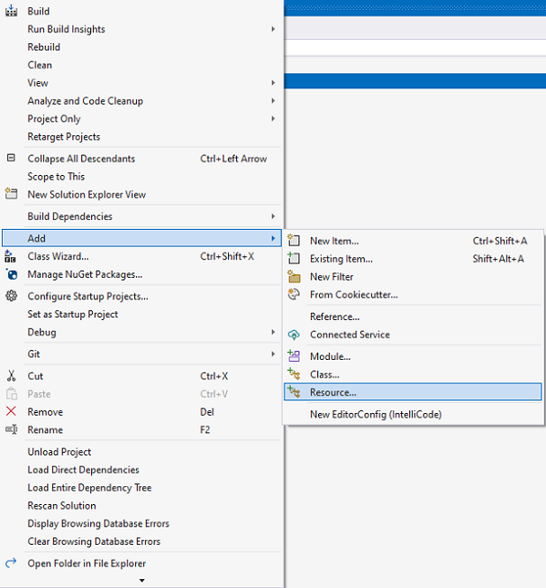

**Рисунок 4. Добавление нового ресурса в состав проекта.**

В диалоге выбора типа ресурса выберем «Menu» и нажмем кнопку New

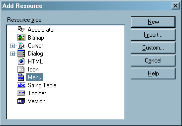

**Рисунок 5. Окно создания нового ресурса.**

Т.к. в нашем проекте изначально отсутствовал файл ресурсов (файл с расширением .rc), то он будет добавлен вместе с соответствующим ему заголовочным
файлом resource.h.

В панели **Resource View** (ее можно включить из меню View->Resource View), в разделе Menu будет отображаться добавленное нами меню с автоматически
сгенерированным идентификатором **IDR_MENU1**. Дадим ему более благозвучное имя **IDR_MAIN_MENU**[^3], воспользовавшись панелью Properties:

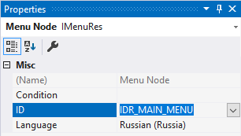

**Рисунок 6. Редактирование свойств меню.**

Щелкнем дважды по ресурсу меню и перейдем в режим его визуального редактирования. При помощи редактора создадим меню, как показано на следующем
рисунке:

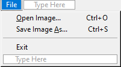

**Рисунок 7. Меню в режиме редактирования.**

Пункт Exit отделим от остальных пунктов, вставив перед ним разделитель (separator), воспользовавшись контекстным меню. Зададим для пунктов меню File
следующие идентификаторы: ID_FILE_OPEN, ID_FILE_SAVEAS и ID_FILE_EXIT.

В поле Caption можно также ввести информацию о комбинации клавиш, используемых, соответствующих пунктам меню, отделив их от заголовка при помощи
символа табуляции. Амперсанд (&) перед одной из букв в заголовке пункта меню не выводится и используется для указания клавиши доступа к данному пункту
меню. Следующая за ним буква выделяется путем подчеркивания:


**Рисунок 8. Использование символа "&" и табуляции для управления внешним видом пункта меню.**

Доработаем функцию CreateMainWindow, добавив загрузку меню из ресурсов при помощи
функции [LoadMenu](http://msdn.microsoft.com/en-us/library/ms647990\(v=VS.85\).aspx). Дескриптор загруженного меню передается в качестве одного из
параметров функции CreateWindowEx:

```cpp
HWND CreateMainWindow(HINSTANCE hInstance)
{
	HMENU hMainMenu = LoadMenu(hInstance, MAKEINTRESOURCE(IDR_MAIN_MENU));

	HWND hMainWindow = CreateWindowEx(
		0,
		CLASS_NAME,
		WINDOW_TITLE,
		WS_OVERLAPPEDWINDOW,
		CW_USEDEFAULT, CW_USEDEFAULT,
		CW_USEDEFAULT, CW_USEDEFAULT,
		NULL,
		hMainMenu,
		hInstance,
		NULL);

	return hMainWindow;
}
```

В качестве имени ресурса меню может выступать как строка, задающая имя ресурса, так и его целочисленный идентификатор. В последнем случае следует
воспользоваться макросом [MAKEINTRESOURCE](http://msdn.microsoft.com/en-us/library/ms648029\(v=VS.85\).aspx) для приведения целочисленного
идентификатора в диапазоне от 1 до 65535 к нужному типу.

В созданном нами окне будет присутствовать меню с созданными нами пунктами:

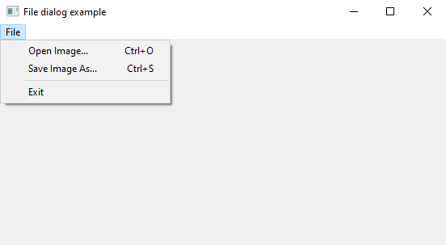

**Рисунок 9. Главное меню приложения.**

#### ***Обработка сообщений от меню***

При выборе пункта меню окну посылается сообщение [WM_COMMAND](http://msdn.microsoft.com/en-us/library/ms647591%28VS.85%29.aspx). Добавим обработчик
данного сообщения в оконную процедуру главного окна приложения соответствующий обработчик:

```cpp
void OnOpenFile(HWND hwnd, UINT codeNotify)
{
}

void OnSaveFile(HWND hwnd, UINT codeNotify)
{
}

void OnExit(HWND hwnd, UINT codeNotify)
{
    DestroyWindow(hwnd);
}

void OnCommand(HWND hwnd, int id, HWND hwndCtl, UINT codeNotify)
{
    switch (id)
    {
    case ID_FILE_OPEN_IMAGE:
        OnOpenFile(hwnd, codeNotify);
        break;
    case ID_FILE_SAVE_IMAGE_AS:
        OnSaveFile(hwnd, codeNotify);
        break;
    case ID_FILE_EXIT:
        OnExit(hwnd, codeNotify);
        break;
    }
}

LRESULT CALLBACK WindowProc(
    HWND hwnd,
    UINT uMsg,
    WPARAM wParam,
    LPARAM lParam)
{
    switch (uMsg)
    {
        HANDLE_MSG(hwnd, WM_DESTROY, OnDestroy);
        HANDLE_MSG(hwnd, WM_PAINT, OnPaint);
        HANDLE_MSG(hwnd, WM_COMMAND, OnCommand);
    }
    return DefWindowProc(hwnd, uMsg, wParam, lParam);
}
```

#### ***Отображение диалога выбора файла***

Для отображения диалога открытия файла воспользуемся функцией [GetOpenFileName](http://msdn.microsoft.com/en-us/library/ms646927%28VS.85%29.aspx),
предварительно заполнив структуру [OPENFILENAME](http://msdn.microsoft.com/en-us/library/ms646839\(v=VS.85\).aspx). Нам понадобится дескриптор
экземпляра приложения, который мы сохраним в глобальной переменной g_hInstance.

```cpp
HINSTANCE g_hInstance = NULL;

using namespace Gdiplus;
using namespace std;

auto_ptr<Bitmap> g_pBitmap;

...

int WINAPI WinMain(
    HINSTANCE hInstance,
    HINSTANCE /*hPrevInstance*/,
    LPSTR /*lpCmdLine*/,
    int nCmdShow)
{
    g_hInstance = hInstance;
    // Выполняем инициализацию GDI+
    try
    {
        CGdiplusInitializer initializer;

        ...

        // Запускаем цикл выборки сообщений, пока не получим
        // сигнал о завершении приложения
        int result = MainLoop();

        // Удаляем растр перед выходом
        g_pBitmap.release();

        return result;
    }
    catch (std::runtime_error &)
    {
        return 2;
    }
}

void OnOpenFile(HWND hwnd, UINT codeNotify)
{
    OPENFILENAME ofn;
    ZeroMemory(&ofn, sizeof(ofn));

    TCHAR fileName[MAX_PATH + 1] = _T("");

    ofn.lStructSize = sizeof(ofn);
    ofn.hwndOwner = hwnd;
    ofn.hInstance = g_hInstance;
    ofn.lpstrFile = fileName;
    ofn.nMaxFile = MAX_PATH;
    ofn.lpstrFilter =
        _T("Images (BMP, PNG, JPG, TIFF)\0*.bmp;*.png;*.jpg;*.tif\0")
        _T("All files\0*.*\0")
        _T("\0");

    if (GetOpenFileName(&ofn))
    {
        Image img(ofn.lpstrFile);

        if (img.GetLastStatus() == Ok)
        {
            g_pBitmap = auto_ptr<Bitmap>(
                new Bitmap(img.GetWidth(), img.GetHeight(), PixelFormat32bppARGB)
            );

            Graphics g(g_pBitmap.get());
            g.DrawImage(&img, 0, 0);

            InvalidateRect(hwnd, NULL, TRUE);
    }
}
```

Выбранное имя файла используется для открытия изображения. Здесь мы также создаем растровое изображение нужных размеров и выполняем рисование
загруженного изображения в него. Для своевременного обновления содержимого окна после выбора файла используется функция
[InvalidateRect](https://learn.microsoft.com/ru-ru/windows/win32/api/winuser/nf-winuser-invalidaterect).

Код обработчика WM_PAINT также подвергся небольшой доработке – в случае, когда растр не загружен, код его рисования не выполняется:

```cpp
void OnPaint(HWND hwnd)
{
    PAINTSTRUCT ps;
    HDC dc = BeginPaint(hwnd, &ps);
    
    if (g_pBitmap.get() != NULL)
    {
        Graphics g(dc);
        g.DrawImage(g_pBitmap.get(), 0, 0);
    }
    
    EndPaint(hwnd, &ps);
}
```

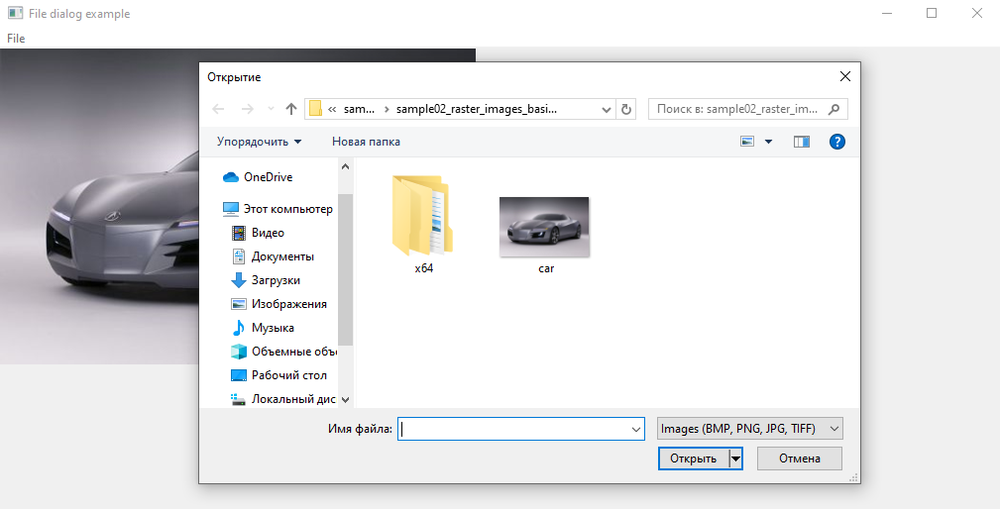

**Рисунок 10. Основное окно программы.**

#### ***Сохранение файла***

Теперь реализуем в нашем приложении возможность сохранения открытого файла в одном из поддерживаемых форматов. Для открытия диалога сохранения файла
нам понадобится функция [GetSaveFileName](http://msdn.microsoft.com/en-us/library/ms646928%28VS.85%29.aspx). Поскольку перед ее вызовом нам также
понадобится заполнить структуру OPENFILENAME, логично будет вынести общий код в отдельную функцию **InitFileNameStructure**:

```cpp
void InitFileNameStructure(
    HWND hwndOwner,
    OPENFILENAME * pOpenFileName,
    TCHAR * pFileName,
    DWORD maxFileName)
{
    ZeroMemory(pOpenFileName, sizeof(OPENFILENAME));
    
    pOpenFileName->lStructSize = sizeof(OPENFILENAME);
    pOpenFileName->hwndOwner = hwndOwner;
    pOpenFileName->hInstance = g_hInstance;
    pOpenFileName->nMaxFile = maxFileName;
    pOpenFileName->lpstrFile = pFileName;
    pOpenFileName->lpstrFilter =
        _T("Images (BMP, PNG, JPG, TIFF)\0*.bmp;*.png;*.jpg;*.tif\0")
        _T("All files\0*.*\0")
        _T("\0");
}

void OnOpenFile(HWND hwnd, UINT codeNotify)
{
    OPENFILENAME ofn;
    TCHAR fileName[MAX_PATH + 1] = _T("");
    InitFileNameStructure(hwnd, &ofn, fileName, MAX_PATH);
    
    if (GetOpenFileName(&ofn))
    {
        Image img(ofn.lpstrFile);
        
        if (img.GetLastStatus() == Ok)
        {
            g_pBitmap = auto_ptr<Bitmap>(new Bitmap(
                img.GetWidth(), img.GetHeight(), PixelFormat32bppARGB));
                
            Graphics g(g_pBitmap.get());
            g.DrawImage(&img, 0, 0);
            
            InvalidateRect(hwnd, NULL, TRUE);
        }
    }
}

void SaveBitmap(
    Bitmap & bitmap, std::wstring const& fileName, int quality = 0)
{
    ...
}

void OnSaveFile(HWND hwnd, UINT codeNotify)
{
    // Если изображение не открыто, то его и сохранить нельзя
    if (!g_pBitmap.get())
    {
        return;
    }
    
    OPENFILENAME ofn;
    TCHAR fileName[MAX_PATH + 1] = _T("");
    InitFileNameStructure(hwnd, &ofn, fileName, MAX_PATH);
    
    if (GetSaveFileName(&ofn))
    {
        SaveBitmap(*g_pBitmap, fileName, 75);
    }
}
```

Для сохранения изображения в файл мы можем воспользоваться методом [Image::Save](https://learn.microsoft.com/ru-ru/windows/win32/api/gdiplusheaders/nf-gdiplusheaders-image-save(istream_constclsid_constencoderparameters)).
В данный метод помимо имени файла требуется передать [CLSID](http://msdn.microsoft.com/en-us/library/aa908849.aspx) (уникальный идентификатор класса)
класса кодировщика изображений, а также параметры, передаваемые кодировщику. В GDI+ зарегистрировано несколько встроенных кодировщиков изображений,
которые могут выполнить сохранение изображения в заданном формате (BMP, JPG, PNG и т.п.).

Для того чтобы определить CLSID кодировщика необходимо получить у библиотеки GDI+ информацию об установленных кодировщиках при помощи
функции [GetImageEncoders](http://msdn.microsoft.com/en-us/library/ms534080%28v=VS.85%29.aspx), предварительно узнав их количество и требуемый для
хранения информации объем памяти при помощи функции [GetImageEncodersSize](http://msdn.microsoft.com/en-us/library/ms534081%28v=VS.85%29.aspx). Среди
списка полученных кодеков мы выберем тот, которому соответствует расширение сохраняемого файла. Код, возвращающий идентификатор кодировщика по
расширению файла, вынесем в функцию **GetEncoderCLSID**:

```cpp
// приводим строку к нижнему регистру

std::wstring WStringToLower(std::wstring const& str)
{
    std::wstring result(str);
    
    std::transform(result.begin(), result.end(), result.begin(), [](wchar_t ch) { return static_cast<wchar_t>(std::tolower(ch)); });
    
    return result;
}

CLSID GetEncoderCLSID(std::wstring const& fileExtension)
{
    // Приводим разрешение к виду "*.разрешение"
    std::wstring extensionMask = L"*." + WStringToLower(fileExtension) + L";";
    
    // Запрашиваем у GDI+ количество кодировщиков изображений
    // и размер блока данных для хранения их описания
    UINT numEncoders;
    UINT encodersSize;
    GetImageEncodersSize(&numEncoders, &encodersSize);
    
    // Выделяем буфер для хранения информации о кодировщиках
    std::vector<BYTE> encodersBuffer(encodersSize);
    
    // Запрашиваем у GDI+ информацию обо всех кодировщиков
    ImageCodecInfo* pInstalledCodecs =
        reinterpret_cast<ImageCodecInfo *>(&encodersBuffer[0]);
    GetImageEncoders(numEncoders, encodersSize, pInstalledCodecs);
    
    // ищем подходящий кодировщик изображений
    for (unsigned i = 0; i < numEncoders; ++i)
    {
        ImageCodecInfo & codec = pInstalledCodecs[i];
        
        // получаем расширения файлов, поддерживаемых данным кодировщиком
        // в формате: *.jpg;*.jpe;*.jpeg;
        std::wstring extensions = WStringToLower(codec.FilenameExtension) + L";";
        
        // Если в списке расширений содержится маска расширения файла
        // то кодек считается найденным
        if (extensions.find(extensionMask) != wstring::npos)
        {
            return codec.Clsid;
        }
    }
    
    // не нашли подходящий кодировщик, возвращаем нулевой идентификатор
    return CLSID_NULL;
}
```

Формат JPEG позволяет управлять степенью компрессии изображения. Данная информация может быть передана кодировщику в
структуре [EncoderParameters](http://msdn.microsoft.com/en-us/library/ms534435\(v=VS.85\).aspx). Исходный код функции SaveBitmap представлен ниже:

```cpp
/*
Возвращаем расширение файла (все, что после последней точки в имени)
Строго говоря, для ситуаций вроде c:\some_folder.ext\someFile-without-extension
будет работать неправильно, но для примера сойдет
*/
std::wstring GetFileExtension(std::wstring const& fileName)
{
    size_t dotPos = fileName.find_last_of(L'.');
    if (dotPos != std::wstring::npos)
    {
        return fileName.substr(dotPos + 1);
    }
    else
    {
        return std::wstring();
    }
}

void SaveBitmap(
    Bitmap & bitmap, std::wstring const& fileName, int quality = 0)
{
    // получаем расширение выходного файла
    std::wstring fileExtension = GetFileExtension(fileName);
    
    // Получаем идентификатор по расширению файла
    CLSID codecId = GetEncoderCLSID(fileExtension);
    
    // Если вернули CLSID_NULL (кодек не найден), то выходим
    if (IsEqualCLSID(codecId, CLSID_NULL))
    {
        return;
    }
    
    // заполняем параметры кодировщика
    EncoderParameters params;
    params.Count = 1;// у нас только один параметр (степень компресии 0-100)
    
    // заполняем характеристики параметра качество сжатия
    EncoderParameter & param0 = params.Parameter[0];
    
    LONG qualityParam = quality;
    
    param0.Guid = EncoderCompression; // идентификатор параметра "компрессия"
    param0.NumberOfValues = 1; // в массиве параметров содержится одно значение
    param0.Type = EncoderParameterValueTypeLong; // тип значений LONG
    param0.Value = &qualityParam; // адрес массива параметров
    
    // сохраняем изображение с использованием подобранного кодировщика
    // и параметра Quality (на практике используется только в JPEG-е)
    bitmap.Save(fileName.c_str(), &codecId, &params);
}
```

#### ***Добавляем поддержку горячих клавиш***

Несмотря на то, что мы рядом с пунктами меню написали горячие клавиши, приложение не будет реагировать на их нажатия. За горячие клавиши отвечает
другой объект пользовательского интерфейса – таблица клавиш быстрого доступа (**Accelerators table**).

Как и меню, данная таблица может размещаться в файле ресурсов. Добавим новый ресурс в наше приложение, выбрав в меню пункт **Accelerator**:

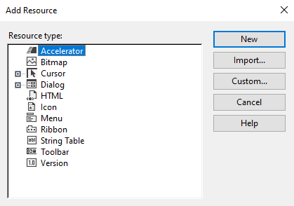

Зададим для данного ресурса идентификатор IDR_MAIN_MENU (в приложении может быть несколько меню). Добавим две клавиши быстрого доступа Ctrl+O и
Ctrl+S, задав им идентификаторы, совпадающие с идентификаторами пунктов меню Open Image и Save As.

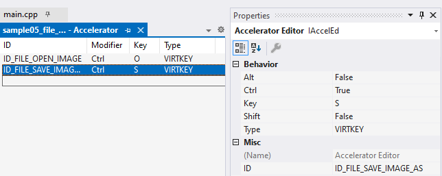

Загрузить таблицу клавиш быстрого доступа из ресурсов можно при помощи
функции [LoadAccelerators](http://msdn.microsoft.com/en-us/library/ms646370\(v=VS.85\).aspx).

События о нажатии клавиш быстрого доступа поступают приложению от клавиатуры. В цикле выборки сообщений поступившее сообщение предварительно
обрабатывается функцией [TranslateAccelerator](http://msdn.microsoft.com/en-us/library/ms646373\(v=VS.85\).aspx). Данная функция сравнивает сообщение
о нажатии комбинации клавиш с содержимым таблицы клавиш быстрого доступа и при обнаружении искомой комбинации клавиш генерирует сообщение WM_COMMAND,
передавая идентификатор комбинации в качестве параметра сообщения. Поскольку для клавиш быстрого доступа мы задали идентификаторы, совпадающие с
идентификаторами соответствующих пунктов меню, нажатия виртуальных клавиш будут для нашего приложения абсолютно идентичны выбору пунктов меню. Если
сообщение не является сообщение о нажатии одной из комбинаций клавиш быстрого доступа, это сообщение следует отправить на дальнейшую обработку при
помощи функций TranslateMessage и DispatchMessage.

Исходный код обновленного цикла сообщений представлен ниже. Из нововведений в ней – загрузка таблицы клавиш быстрого доступа и их обработка для
главного окна приложения.

```cpp
int MainLoop(HWND hMainWindow)
{
    HACCEL accel = LoadAccelerators(g_hInstance,
        MAKEINTRESOURCE(IDR_MAIN_MENU));
        
    MSG msg;
    BOOL res;
    while ((res = GetMessage(&msg, NULL, 0, 0)) != 0)
    {
        if (res == -1)
        {
            // произошла ошибка - нужно обработать ее и, вероятно,
            // завершить работу приложения
        }
        else
        {
            // Пытаемся обработать сообщение как сообщение от нажатия клавиш
            // быстрого доступа
            if (!TranslateAccelerator(hMainWindow, accel, &msg))
            {
                // Это не сообщение о нажатии клавиш быстрого доступа
                // обрабатываем сообщение стандартным образом
        
                // Если это сообщение о нажатии виртуальной клавиши,
                // то добавляем в очередь сообщений сообщения, несущие информацию о
                // коде вводимого пользователем символа
                TranslateMessage(&msg);
                // передаем сообщение в соответствующую оконную процедуру
                DispatchMessage(&msg);
            }
        }
    }
    
    // сюда мы попадем только в том случае извлечения сообщения WM_QUIT
    // msg.wParam содержит код возврата, помещенный при
    // помощи функции PostQuitMessage()
    return msg.wParam;
}
```

Вот и получилась у нас простейшая программа просмотра графических файлов форматов JPEG, BMP, PNG и TIFF. С целью упрощения кода автором были опущены
некоторые проверки на успешность выполнения операций ввода/вывода и сообщения пользователю в случае ошибки. Кроме того, пункт меню File->Save следует
сделать недоступным, если изображение не было открыто.

### <a name="_toc96795991"></a>**Использование двойной буферизации для устранения мерцания изображения**

Разрабатываемые нами до настоящего момента программы обладали следующим недостатком – при перерисовке изображения наблюдается его мерцание. Связано
это с тем, что изображение на экране приложение строит не мгновенное, а постепенно:

- Происходит очистка клиентской области окна
- Происходит рисование изображения в клиентской области окна

При этом происходит постоянное обновление экрана монитора – данные из видеопамяти графического адаптера строка за строкой передаются на экран
монитора. При этом на экране может запечатлеться лишь частично построенное изображение окна, например, в середине процесса рисования содержимого окна
изображением. В этом случае пользователь увидит частично сформированное изображение. Если обновление изображения приложением происходит постоянно (например, при визуализации анимированного изображения или взаимодействия с пользователем), то такие частично построенные изображения пользователь
будет видеть на каждом кадре с частотой кадровой развертки монитора (60-120 раз в секунду), что и будет создавать неприятный эффект мерцания.

Так или иначе, с этим эффектом следует бороться. В таких случаях приложение строит изображение сначала во внеэкранном (теневом) растровом
изображении (невидимо для пользователя) размером с клиентскую область окна и лишь после того, как изображение полностью построено, перебрасывает растр
на экран. Кроме этого, приложение может переопределить сообщение WM_ERASEBKGND для того, чтобы запретить очистку клиентской области окна – при
использовании двойной буферизации в этом, как правило, нет необходимости.

Рассмотрим это на примере WTL-приложения, выводящего прыгающий мяч.

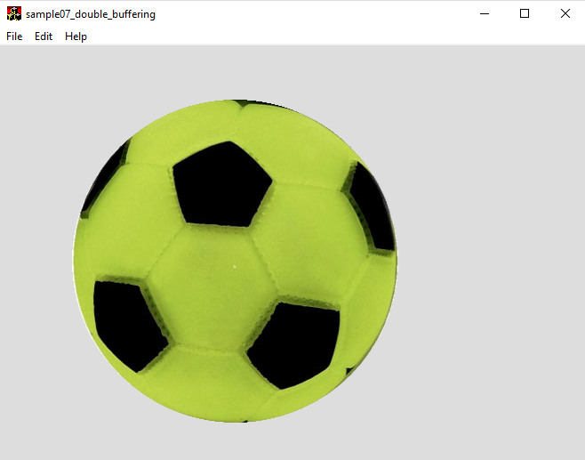

**Рисунок 11. Пример "Прыгающий мяч".**

В обработчике сообщения WM_CREATE выполним создание теневого буфера размером с экран, инициализацию счетчика времени, а также загрузку изображения
мячика.

```cpp
LRESULT CMainFrame::OnCreate(UINT /*uMsg*/, WPARAM /*wParam*/, LPARAM /*lParam*/, BOOL& /*bHandled*/)
{
    // register object for message filtering and idle updates
    CMessageLoop* pLoop = _Module.GetMessageLoop();
    ATLASSERT(pLoop != NULL);
    pLoop->AddMessageFilter(this);
    pLoop->AddIdleHandler(this);
    
    // Создаем внеэкранный буфер
    int screenWidth = GetSystemMetrics(SM_CXSCREEN);
    int screenHeight = GetSystemMetrics(SM_CYSCREEN);
    m_pBackBuffer.reset(
        new Bitmap(screenWidth, screenHeight, PixelFormat32bppARGB));
        
    // Загружаем изображение мячика
    LoadBall();
    
    // Инициализируем таймер
    SetTimer(ANIMATION_TIMER, 20);
    m_lastTick = GetTickCount();
    
    return 0;
}
```

При изменении размеров окна может возникнуть ситуация, когда размер клиентской области станет больше, чем размер теневого буфера кадра. В этом случае
необходимо в обработчике WM_PAINT удалить старый буфер кадра и создать новый соответствующего размера.

```cpp
LRESULT CMainFrame::OnSize(UINT /*uMsg*/, WPARAM /*wParam*/, LPARAM /*lParam*/, BOOL& /*bHandled*/)
{
    CRect rcClient;
    GetClientRect(&rcClient);
    unsigned clientWidth = rcClient.Width();
    unsigned clientHeight = rcClient.Height();
    
    if (!m_pBackBuffer.get() ||
        (clientWidth > m_pBackBuffer->GetWidth()) ||
        (clientHeight > m_pBackBuffer->GetHeight())
        )
    {
        m_pBackBuffer.reset(
            new Bitmap(clientWidth, clientHeight, PixelFormat32bppARGB));
    }
    
    return 0;
}
```

Обработчик сообщения WM_PAINT будет вызывать метод RedrawBackBuffer для построения изображения в теневом буфере, а затем выводить теневой буфер на
экран:

```cpp
LRESULT CMainFrame::OnPaint(UINT /*uMsg*/, WPARAM /*wParam*/, LPARAM /*lParam*/, BOOL& /*bHandled*/)
{
    CPaintDC dc(*this);
    
    RedrawBackBuffer();
    
    Graphics g(dc);
    
    if (m_pBackBuffer.get())
    {
        // перекидываем внеэкранный буфер на экран
        g.DrawImage(m_pBackBuffer.get(), 0, 0);
    }
    
    return 0;
}

void CMainFrame::RedrawBackBuffer(void)
{
    Graphics g(m_pBackBuffer.get());
    
    // очищаем внеэкранный буфер
    g.Clear(Color(0xdd, 0xdd, 0xdd));
    
    g.DrawImage(m_pBall.get(), m_ballPosition);
}
```

В обработчике сообщения WM_TIMER мы будем вызывать метод Animate, выполняющий расчет положения мяча и обрабатывающий его столкновение с краями
клиентской области:

```cpp
LRESULT CMainFrame::OnTimer(UINT /*uMsg*/, WPARAM wParam, LPARAM /*lParam*/, BOOL& /*bHandled*/)
{
    UINT timerId = wParam;
    switch (timerId)
    {
    case ANIMATION_TIMER:
        Animate();
        break;
    }
    
    return 0;
}

void CMainFrame::Animate(void)
{
    DWORD currentTick = GetTickCount();
    float delta = (currentTick - m_lastTick) * 0.001f;
    m_lastTick = currentTick;
    
    CRect rc;
    GetClientRect(&rc);
    int w = rc.Width();
    int h = rc.Height();
    
    // размеры шара
    int bw = m_pBall->GetWidth();
    int bh = m_pBall->GetHeight();
    
    // рассчитываем движение шара по горизонтали
    m_ballPosition.X =
        min(w - bw, max(0, m_ballPosition.X + m_ballSpeed.X * delta));
    if (
        ((m_ballSpeed.X >= 0) && (bw + m_ballPosition.X >= w)) ||
        ((m_ballSpeed.X < 0) && (m_ballPosition.X <= 0))
        )
    {
        m_ballSpeed.X = -m_ballSpeed.X; // отскакиваем от боков
    }
    
    // рассчитываем движение шара по вертикали
    m_ballSpeed.Y =
        max(-MAX_SPEED, min(MAX_SPEED, m_ballSpeed.Y + ACCELERATION * delta));
        
    m_ballPosition.Y = min(h - bh, m_ballPosition.Y + m_ballSpeed.Y * delta);
    if ((m_ballSpeed.Y > 0) && (m_ballPosition.Y >= h - bh))
    {
        m_ballSpeed.Y = -m_ballSpeed.Y; // отскакиваем от пола
    }
    
    InvalidateRect(NULL);
}
```

Важно также обрабатывать сообщение WM_ERASEBKGND, чтобы помешать операционной системе очистить содержимое клиентской области окна. Нашему приложению
это не нужно, т.к. клиентская область окна будет перерисовываться каждый раз полностью содержимым теневого буфера:

```cpp
LRESULT CMainFrame::OnEraseBkgnd(UINT /*uMsg*/, WPARAM /*wParam*/,
    LPARAM /*lParam*/, BOOL& /*bHandled*/)
{
    // ничего не делаем
    return 0;
}
```

Объявление класса показано ниже:

```cpp
class CMainFrame : public CFrameWindowImpl<CMainFrame>, public CUpdateUI<CMainFrame>,
        public CMessageFilter, public CIdleHandler
{
    enum
    {
        ANIMATION_TIMER = 1
    };
public:
    CMainFrame();
    DECLARE_FRAME_WND_CLASS(NULL, IDR_MAINFRAME)
    
    virtual BOOL PreTranslateMessage(MSG* pMsg);
    virtual BOOL OnIdle();
    
    BEGIN_UPDATE_UI_MAP(CMainFrame)
    END_UPDATE_UI_MAP()
    
    BEGIN_MSG_MAP(CMainFrame)
        MESSAGE_HANDLER(WM_CREATE, OnCreate)
        MESSAGE_HANDLER(WM_DESTROY, OnDestroy)
        COMMAND_ID_HANDLER(ID_APP_EXIT, OnFileExit)
        COMMAND_ID_HANDLER(ID_FILE_NEW, OnFileNew)
        COMMAND_ID_HANDLER(ID_APP_ABOUT, OnAppAbout)
        MESSAGE_HANDLER(WM_SIZE, OnSize)
        MESSAGE_HANDLER(WM_ERASEBKGND, OnEraseBkgnd)
        MESSAGE_HANDLER(WM_PAINT, OnPaint)
        MESSAGE_HANDLER(WM_TIMER, OnTimer)
        CHAIN_MSG_MAP(CUpdateUI<CMainFrame>)
        CHAIN_MSG_MAP(CFrameWindowImpl<CMainFrame>)
    END_MSG_MAP()
    
private:
    LRESULT OnCreate(UINT /*uMsg*/, WPARAM /*wParam*/, LPARAM /*lParam*/, BOOL& /*bHandled*/);
    LRESULT OnDestroy(UINT /*uMsg*/, WPARAM /*wParam*/, LPARAM /*lParam*/, BOOL& bHandled);
    LRESULT OnFileExit(WORD /*wNotifyCode*/, WORD /*wID*/, HWND /*hWndCtl*/, BOOL& /*bHandled*/);
    LRESULT OnFileNew(WORD /*wNotifyCode*/, WORD /*wID*/, HWND /*hWndCtl*/, BOOL& /*bHandled*/);
    LRESULT OnAppAbout(WORD /*wNotifyCode*/, WORD /*wID*/, HWND /*hWndCtl*/, BOOL& /*bHandled*/);
    LRESULT OnSize(UINT /*uMsg*/, WPARAM /*wParam*/, LPARAM /*lParam*/, BOOL& /*bHandled*/);
    LRESULT OnEraseBkgnd(UINT /*uMsg*/, WPARAM /*wParam*/, LPARAM /*lParam*/, BOOL& /*bHandled*/);
    LRESULT OnPaint(UINT /*uMsg*/, WPARAM /*wParam*/, LPARAM /*lParam*/, BOOL& /*bHandled*/);

    void RedrawBackBuffer(void);
    void LoadBall(void);
    void Animate(void);
private:
    std::auto_ptr<Gdiplus::Bitmap> m_pBackBuffer;
    std::auto_ptr<Gdiplus::Bitmap> m_pBall;
    
    Gdiplus::PointF m_ballPosition;
    Gdiplus::PointF m_ballSpeed;
    DWORD m_lastTick;
    static const float ACCELERATION;
    static const float MAX_SPEED;
public:
	LRESULT OnTimer(UINT /*uMsg*/, WPARAM /*wParam*/, LPARAM /*lParam*/, BOOL& /*bHandled*/);
};

const float CMainFrame::ACCELERATION = 100; // ускорение свободного падения

const float CMainFrame::MAX_SPEED = 500; //максимальная скорость движения
```

## <a name="_toc96795992"></a>**Практические задания**

Вы можете использовать в этом задании любые фреймворки, графические и звуковые библиотеки и языки программирования. Приложение может быть либо
desktop, либо мобильным, либо web-приложением для браузера.

На оценку «**удовлетворительно**» необходимо набрать **не менее 50 баллов**

На оценку «**хорошо**» необходимо набрать **не менее 150 баллов**

На оценку «**отлично**» необходимо набрать **не менее 300 баллов**.

Вы можете выбрать любые из предложенных заданий.

### <a name="_toc96795993"></a>**Рекомендуемое программное обеспечение**

Для подготовки и обработки растровых изображений дли оформления заданий можно воспользоваться бесплатным графическим редактором Paint.NET, скачать
который можно с сайта <http://www.getpaint.net/>, либо редактором Gimp (<https://www.gimp.org/>).

### <a name="_toc96795994"></a>**Простые задания**

#### ***Задание 1. 50 баллов***

Разработайте приложение для просмотра растровых изображений. При помощи меню File -> Open должен открыться стандартный диалог выбора файла. Должна
поддерживаться возможность открытия хотя бы одного из стандартных типов файлов изображений: PNG, JPEG, BMP. Для файлов формата PNG-файлов должна
поддерживаться полупрозрачность (под изображением нарисуйте просвечивающую сквозь него подложку, например, в виде шахматной доски).


При изменении размеров окна изображение должно центрироваться в клиентской области окна. За пределы окна изображение выходить не должно – при нехватке
места оно должно ресайзиться с сохранением оригинальных пропорций.

##### Бонус – 20 баллов за возможность перемещения изображения внутри окна при помощи мыши

Вместо автоматического изменения размеров и центрирования изображения при изменении размеров окна реализовать возможность перемещения изображения
картинки при помощи курсора мыши методом drag and drop

#### ***Задание 2. 100 баллов***

Разработайте приложение, позволяющее рисовать при помощи мыши на растровом изображении. Изображение пользователь может либо создать с нуля (File->
New), либо выбрать существующий файл изображения (File->Open). Программа должна поддерживать хотя бы один из стандартных форматов изображений: PNG,
JPEG, BMP. Рисование начинается при нажатии левой кнопки мыши внутри клиентской области и продолжается при перемещении мыши при нажатой кнопке мыши
аналогично инструментам «Кисть» или «Карандаш» в графическом редакторе Paint. Толщину рисуемых линий выберите на своё усмотрение.

Пункт меню File->Save As позволяет пользователю сохранить рисунок в одном из следующих форматов: PNG, BMP, JPEG.

##### Бонус - 20 баллов

Бонус начисляется за возможность выбора цвета рисования. Используйте либо стандартный диалог выбора цвета, либо разработайте собственный.

### <a name="_toc96795995"></a>**Задание №3 (повышенной сложности)**

Выберите один из предложенных вариантов

#### ***Вариант 1 – Игра «Алхимия» - 400 баллов***

Разработайте упрощенный аналог игры «**Алхимия**», позволяющей игроку создавать новые элементы, комбинируя существующие, путем переноса с помощью мыши
изображение одного элемента на изображение другого.


**Рисунок 13. Визуальное представление элементов в игре "Алхимия"**

Цель игры – начав с четырех базовых элементов (земля, огонь, вода, воздух), открыть все предусмотренные в игре элементы (придумать не менее 20
элементов). Некоторые пары элементов являются нейтральными (т.е. не образовывают новых элементов), в то время как другие – могут образовывать один или
два новых элемента при своём соприкосновении.


**Рисунок 14. Элемент "Земля" перенесен на элемент "Огонь".**


**Рисунок 15. Образование нового элемента "Лава" в результате объединения двух существующих.**

Видео с примером геймплея игры: <https://www.youtube.com/watch?v=459UcDpAJAw>

После каждого образования новых элементов в нижней части игрового поля выводится сообщение, повествующее о том, что произошло.

Экран игры разделяется на 2 части: слева размещаются открытые элементы, справа - поле для экспериментов:


**Рисунок 16. Примерный макет игрового экрана игры "Алхимия".**

На панели открытых элементов каждый новый открытый элемент добавляется в конец списка. Щелчок по иконке «Сортировать» сортирует открытые элементы в
алфавитном порядке. Для добавления элемента на поле для экспериментов достаточно перенести его из левой половины на правую (при этом в списке открытых
элементов элемент никуда не пропадает).

Для удаления лишнего элемента с поля для экспериментов можно его перенести на иконку для удаления элементов (она показана на рисунке схематически в
виде красного крестика).

Примеры комбинаций элементов:

| Комбинация элементов | Результирующие элементы |                   |          |
|:---------------------|:------------------------|:------------------|:---------|
| Огонь                | Вода                    | Пар               |          |
| Огонь                | Земля                   | Лава              |          |
| Воздух               | Земля                   | Пыль              |          |
| Огонь                | Пыль                    | Порох             |          |
| Порох                | Огонь                   | Взрыв             | Дым      |
| Воздух               | Огонь                   | Энергия           |          |
| Лава                 | Вода                    | Пар               | Камень   |
| Воздух               | Энергия                 | Буря              |          |
| Огонь                | Камень                  | Металл            |          |
| Металл               | Энергия                 | Электричество     |          |
| Электричество        | Вода                    | Водород           | Кислород |
| Электричество        | Кислород                | Озон              |          |
| Пыль                 | Вода                    | Грязь             |          |
| Пар                  | Земля                   | Гейзер            |          |
| Пар                  | Металл                  | Паровой котел     |          |
| Паровой котел        | Пар                     | Давление          |          |
| Лава                 | Давление                | Вулкан            |          |
| Водород              | Кислород                | Гремучий газ      |          |
| Вода                 | Земля                   | Болото            |          |
| Огонь                | Вода                    | Спирт             |          |
| Спирт                | Огонь                   | Коктейль Молотова |          |
| Болото               | Энергия                 | Жизнь             |          |
| Жизнь                | Болото                  | Бактерии          |          |
| Спирт                | Вода                    | Водка             |          |

Дальше – проявите фантазию.

Игра заканчивается, как только пользователь откроет все элементы.

##### Бонус 30 баллов за звуковое оформление игры.

Бонус присуждается за наличие в игре фоновой музыки и звуковых эффектов:

- Образовался новый элемент
- Открылся новый, не существовавший ранее элемент

#### ***Вариант 2 - Игра «Color lines» - 400 баллов***

Разработайте клон игровой программы «[**Color Lines**](http://ru.wikipedia.org/wiki/Lines)». Суть игры: На квадратном игровом поле 9x9 клеток на
случайных свободных клетках появляются три шарика разных цветов (если свободных клеток меньше, то меньшее количество шариков). Всего шарики могут
иметь 6 цветов. За каждый ход игрок может выбрать один шарик и передвинуть его на любую пустую клетку игрового поля, при условии, что между клеткой с
шариком и конечной клеткой его перемещения существовал путь из свободных клеток. Процесс передвижения шарика по клеткам происходит с анимацией – шарик
перепрыгивает с клетки на клетку.


**Рисунок 17. Экран классической версии игры Color Lines.**

Экран оригинальной игры Lines 1992 года
Видео геймплея: <https://www.youtube.com/watch?v=R_V3R1-wz9Y>

Основная цель игры – удалить с игрового поля как можно больше шариков. Шарики удаляются с игрового поля, если в процессе игры выстроить из шариков
одного цвета линии из 5 и более штук по горизонтали, вертикали или диагонали. При удалении ряда три новых шарика не появляются. Исключение – при
удалении ряда исчезли все шарики. Игрок может видеть, шарики каких трех цветов появятся на следующем ходу.

Игра заканчивается, когда на игровом поле не останется ни одной свободной клетки.

За удаление шариков с поля игрок получает очки: за 5 шариков – 10 очков, за 6 – 15, за 7 – 20, за 8 – 30, за 9 – 50.

##### Бонус 30 баллов за звуковое оформление игры.

Бонус присуждается за проигрывание фоновой музыки и звуковые эффекты:

- Появление новых шариков
- Исчезновение собранного ряда шариков
- Перемещение шарика от начальной до конечной точки

#### ***Вариант 3 – Игра «Picture Puzzle» - 300 баллов***

Разработайте игровую программу «**Picture Puzzle**». Цель игры – собрать картинку из перемешанных квадратных кусочков, на игровом поле NxM клеток. На
каждой клетке игрового поля находится кусочек оригинальной картинки. При помощи мыши пользователь может обменивать произвольные клетки местами,
перетащив одну клетку на место другой.


**Рисунок 18. Примерный вид игрового поля.**

Пример внешнего вида типичных представителей данного жанра игр

Как только картинка будет правильно собрана необходимо поздравить игрока с победой и предложить ему перейти на другой уровень. Каждый последующий
уровень предлагает новую картинку. Через каждые 3 уровня количество плиток, на которые разбивается игровое поле, увеличивается.

##### Бонус 30 баллов за звуковое оформление игры.

Бонус присуждается за проигрывание фоновой музыки и звуковые эффекты:

- Обмен ячеек местами
- Обмен ячеек местами, при котором одна или две ячейки оказались на своих местах.

#### ***Вариант 4 – «Сгруппируй объекты» - 200 баллов***

Разработайте игровую программу «**Сгруппируй объекты**», в которой пользователь должен отнести предложенные ему объекты к той или иной группе путем
перетаскивания соответствующих изображений при помощи мыши в отводимые для них области. Некоторые из объектов могут не принадлежать ни к одной из
предложенных групп (например, орел на картинке ниже живет в степи, которая не представлена ни одной из групп).


**Рисунок 19. Схематическое изображение игрового экрана**

При успешном прохождении уровня игрока необходимо поздравить с этим, а затем перейти на новый уровень.

Количество объектов и категорий варьируется от уровня к уровню. **Необходимо реализовать не менее 3 уровней.** По окончании игры еще раз поздравить
игрока с победой и предложить сыграть еще раз.

Примеры заданий уровней (вы можете расширить данный список, предложив свои варианты):

- Разместить животных по средам их обитания
- Сгруппировать марки автомобилей по странам-производителям
- Распределить предметы между несколькими представителями нескольких профессий. Например:
    - Предметы: молоток, глобус, указка, мастерок, шприц, белый халат, телескоп, мел.
    - Профессии: строитель, врач, учитель
- Соотнести фотографии спортсменов с видами спорта, в которых они прославились
- Распределить картинки плодов растений по их типам – фрукты, овощи, ягоды, корнеплоды
- Разнести картинки животных по классам: млекопитающие, рыбы, рептилии, земноводные, птицы, насекомые

##### Бонус 30 баллов за звуковое оформление игры.

Бонус присуждается за проигрывание фоновой музыки и звуковые эффекты:

- Объект перенесён на своё место
- Уровень пройден

#### ***Вариант 5 – Симуляция «Луна и Земля» - 250 баллов***

Разработать программу, моделирующую движение Земли и Луны под действием закона всемирного тяготения:

$$
\vec{F}=\vec{r}G×\frac{m_{1}×m_{2}}{R^2}
$$

В начале симуляции в центре экрана размещается изображение Земли, а рядом с ней – Луны. Пользователь может при помощи мыши задать положение данных
космических тел, перетаскивая их, а при помощи клавиш управления курсором – направление (клавиши влево/вправо) и длину (клавиши вверх/вниз) начального
вектора скорости Луны.

При помощи команды меню, либо кнопки на панели инструментов, либо горячей клавиши запускается симуляция данного физического процесса – Луна начинает
двигаться с начальной скоростью в заданном направлении, в то время как Сила всемирного тяготения начинает добавлять к телам ускорение друг к другу.

При определенных начальных параметрах планеты столкнутся. В этом случае программа должна вывести картину, иллюстрирующую взрыв, и предложить
пользователю попробовать задать другие параметры, либо выйти.

При других параметрах Луна станет либо вращаться вокруг Земли, став ее спутником, либо улететь от нее и никогда больше не вернуться.

**Пользователь может перейти на начальный экран настройки симуляции в любой момент заново при помощи команды меню или кнопки на панели инструментов.**

Схематический внешний вид программы представлен на рисунке ниже. На заднем фоне должно быть изображение звездного неба. Луна и Земля представляют
собой изображения соответствующих планет (используйте для их хранения формат PNG с полупрозрачностью, объявив прозрачными части изображения за
пределами планеты). Перед запуском процесса симуляции пользователю показывается направление и длина начального вектора скорости Луны при помощи
стрелочки, направленной из центра спутника.


**Рисунок 20. Схематическое изображение экрана программы**

Параметры симуляции (гравитационную постоянную, размеры и массу планет) подобрать так, чтобы пользователю сравнительно легко можно было задать все три
исхода симуляции.

##### Бонус 30 баллов за звуковое оформление.

Бонус присуждается за проигрывание фоновой музыки и звуковые эффекты:

- Произошло столкновение Луны с Землёй

#### ***Вариант 6 – Симуляция «Прыгающие шарики» - до 300 баллов***

Разработать программу «Прыгающие шарики», моделирующую физику движения шариков (материальных точек) в замкнутом пространстве. В центре экрана
находится пушка, стреляющая шариками. На шарики действует сила тяжести, направленная вниз.

Внутри игрового пространства находится несколько тел прямоугольной формы, ориентированных под произвольным углом. При столкновении шарика с данными
телами или со стенками происходит отскок шарика (угол падения равен углу отражения). При этом теряется 20% скорости при каждом отскоке. Как только
шарики упадут вниз, они считаются выбывшими из процесса симуляции.


**Рисунок 21. Пример игрового пространства.**

Столкновением шариков друг с другом можно пренебречь, считая, что шарики друг с другом не сталкиваются, однако корректная обработка столкновений
шариков друг с другом является положительным фактором при начислении баллов за задание.

Выпуск шариков из пушки происходит по щелчку левой кнопкой мыши в направлении от центра пушки к курсору. Одновременно на экране может находиться не
более 50 шариков (в этом случае щелчки мыши не приводят к выстрелу шариков из пушки до тех пор, пока количество шариков не уменьшится, упав вниз).

При движении курсора мыши пушка должна менять направление, поворачиваясь в сторону текущего положения курсора.

Для симуляции физического взаимодействия объектов разрешается использовать сторонние библиотеки, например
Box2D ([www.box2d.org](http://www.box2d.org)).

##### Бонус 30 баллов за звуковое оформление.

Бонус присуждается за проигрывание фоновой музыки и звуковые эффекты:

- Выстрел шариком из пушки

[^1]: Автор по ходу профессиональной деятельности отдает свое предпочтение библиотеке WTL, нежели MFC, поэтому большинство примеров будут использовать
именно библиотеку WTL. Впрочем, для пытливого студента не составит проблем адаптировать код примеров для своего любимого framework-а.

[^2]: Необходимость добавления нужных заголовочных файлов в stdafx.h и библиотеки **gdliplus.lib** в настройках компоновщика, здесь и далее считается
не требующей отдельного напоминания.

[^3]: Префикс IDR используется для обозначения идентификаторов ресурсов, таких как меню