# **Оглавление**

[Лабораторная работа № 4. Основы визуализации трехмерных объектов при помощи OpenGL](#_toc100093334)

&emsp;[Трехмерные системы координат и преобразования](#_toc100093335)

&emsp;&emsp;[Система координат OpenGL](#_toc100093336)

&emsp;&emsp;[Матрицы OpenGL](#_toc100093337)

&emsp;&emsp;[Матрицы элементарных преобразований](#_toc100093338)

&emsp;&emsp;[Композиция матричных преобразований](#_toc100093339)

&emsp;&emsp;[Рисуем первую трехмерную сцену](#_toc100093340)

&emsp;&emsp;[Управляем положением виртуальной камеры.](#_toc100093341)

&emsp;[Визуализация объемных объектов](#_toc100093342)

&emsp;&emsp;[Порядок обхода вершин граней](#_toc100093343)

&emsp;&emsp;[Визуализация куба](#_toc100093344)

&emsp;[Использование материалов и освещения](#_toc100093345)

&emsp;&emsp;[Модели освещения, используемые в OpenGL](#_toc100093346)

&emsp;&emsp;[Разрабатываем класс «Направленный источник света»](#_toc100093347)

&emsp;&emsp;[Совершенствуем класс CVector3](#_toc100093348)

&emsp;&emsp;[Совершенствуем метод рисования куба](#_toc100093349)

&emsp;&emsp;[Настраиваем параметры освещения и рисуем объекты сцены](#_toc100093350)

&emsp;[Визуализация функционально заданных поверхностей](#_toc100093351)

&emsp;&emsp;[Аппроксимация поверхностей при помощи полигональных сеток](#_toc100093352)

&emsp;&emsp;[Разработка базового класса для визуализации функционально заданных поверхностей](#_toc100093353)

&emsp;&emsp;[Наша первая криволинейная поверхность](#_toc100093354)

&emsp;&emsp;[Создание класса для управления свойствами материала](#_toc100093355)

&emsp;&emsp;[Собираем компоненты программы воедино](#_toc100093356)

&emsp;[Практические задания](#_toc100093357)

&emsp;&emsp;[Обязательные задания](#_toc100093358)

# <a name="_toc100093334"></a>**Лабораторная работа № 4. Основы визуализации трехмерных объектов при помощи OpenGL**

## <a name="_toc100093335"></a>**Трехмерные системы координат и преобразования**

### <a name="_toc100093336"></a>**Система координат OpenGL**

В OpenGL используется **правосторонняя**[^1] система координат, в которой пользователь может задавать вершины примитивов, из которых состоят
трехмерные объекты.


Правосторонняя система координат

При отображении объектов внутри окна в OpenGL используется **преобразование в порт просмотра**[^2]. Данное преобразование выполняет отображение
системы координат таким образом, чтобы часть пространства, заключенная внутри воображаемого куба размером 2x2x2 с центром в начале координат линейно
отображалась целиком внутри видового порта. Координата Z при этом отображается в глубину в диапазоне от 0 до 1. Такая система координат называется *
*нормализованной системой координат устройства**.

Данное отображение можно изменить с помощью функции [glDepthRange](https://www.khronos.org/registry/OpenGL-Refpages/gl4/html/glDepthRange.xhtml), хотя
в большинстве случаев в этом необходимости нет.


Как правило, удобным было бы задавать объекты в иной системе координат, отличной от данной, поскольку при изменении соотношения сторон видового
порта (например, при изменении размеров окна) может произойти соответствующее изменение соотношения сторон изображения. Окружность может быть
отображена в виде эллипса и т.п. Кроме того, при рисовании трехмерных сцен непременно возникает необходимость построения перспективной или
ортографической проекции трехмерных объектов на плоскость экрана, и проекционные преобразования хотелось бы отделить от преобразований объектов сцены.

### <a name="_toc100093337"></a>**Матрицы OpenGL**

Для решения данных задач в OpenGL введены матрицы, позволяющие выполнять преобразования вершин объектов и систем координат. Стандартно доступны
следующие матрицы:

- **Матрица моделирования-вида** (model-view matrix). Задает преобразование вершин и нормалей в **систему координат наблюдателя**[^3], которое
  применяется к ним перед проецированием объектов. С ее помощью программист может задать объекту желаемое положение и ориентацию в трехмерном
  пространстве, а также выполнить его масштабирование.
- **Матрица проецирования** (projection matrix). Задает преобразование вершин примитивов для их преобразования в нормализованные координаты
  устройства. С ее помощью можно задать параметры ортографической или перспективной проекции.
- **Матрица текстурных координат** (texture coordinate matrix). Используется для трансформации текстурных координат вершин примитивов. С ее помощью,
  как правило, задают ориентацию и масштабирование текстуры на поверхности примитивов.

Данные матрицы являются квадратными и имеют размер 4*4. С их помощью можно задавать
как [аффинные](http://ru.wikipedia.org/wiki/%D0%90%D1%84%D1%84%D0%B8%D0%BD%D0%BD%D1%8B%D0%B5_%D0%BF%D1%80%D0%B5%D0%BE%D0%B1%D1%80%D0%B0%D0%B7%D0%BE%D0%B2%D0%B0%D0%BD%D0%B8%D1%8F),
так
и [перспективные](http://ru.wikipedia.org/wiki/%D0%9F%D1%80%D0%BE%D0%B5%D0%BA%D1%82%D0%B8%D0%B2%D0%BD%D0%BE%D0%B5_%D0%BF%D1%80%D0%B5%D0%BE%D0%B1%D1%80%D0%B0%D0%B7%D0%BE%D0%B2%D0%B0%D0%BD%D0%B8%D0%B5)
преобразования координат вершин и нормалей. Для этого необходимо умножить матрицу соответствующего преобразования на вектор, заданный в **однородных
координатах**[^4]:

$$
T \cdot V = 
\begin{pmatrix}
    a & b & c & d \\
    e & f & g & h \\
    i & j & k & l \\
    m & n & o & p \\
\end{pmatrix}
\*
\begin{pmatrix}
    x \\
    y \\
    z \\
    w \\
\end{pmatrix} ,
$$

где T – матрица преобразования, а V – это вектор или точка

Матрицу аффинного преобразования также можно рассматривать в виде четырех векторов-столбцов, задающих трехмерный базис с координатными осями v<sub>
1</sub>, v<sub>2</sub>, v<sub>3</sub> и началом координат O.

$$
T =
\begin{pmatrix}
    \left( \begin{array}{c}
        x_{1} \\
        y_{1} \\
        z_{1} \\
        0 \\
    \end{array} \right) &
    \left( \begin{array}{c}
        x_{2} \\
        y_{2} \\
        z_{2} \\
        0 \\
    \end{array} \right) &
    \left( \begin{array}{c}
        x_{3} \\
        y_{3} \\
        z_{3} \\
        0 \\
    \end{array} \right) &
    \left( \begin{array}{c}
        O_{x} \\
        O_{y} \\
        O_{z} \\
        1 \\
    \end{array} \right)
\end{pmatrix}
\=
\begin{pmatrix}
    \overline{v_{1}} & \overline{v_{2}} & \overline{v_{3}} & O \\
\end{pmatrix}
$$

Операция умножения матрицы T на точку P осуществляет отображение точки P в некоторую точку Q.

### <a name="_toc100093338"></a>**Матрицы элементарных преобразований**

#### ***Единичная матрица***

**Единичная матрица** (матрица идентичности) задает преобразование, при котором точки и векторы остаются без изменений, отображаясь сами в себя:

$$
I =
\begin{pmatrix}
    1 & 0 & 0 & 0 \\
    0 & 1 & 0 & 0 \\
    0 & 0 & 1 & 0 \\
    0 & 0 & 0 & 1 \\
\end{pmatrix}
$$

$$
I * P =
\begin{pmatrix}
    1 & 0 & 0 & 0 \\
    0 & 1 & 0 & 0 \\
    0 & 0 & 1 & 0 \\
    0 & 0 & 0 & 1 \\
\end{pmatrix}
\*
\begin{pmatrix}
    x \\
    y \\
    z \\
    1 \\
\end{pmatrix}
\=
\begin{pmatrix}
    x \\
    y \\
    z \\
    1 \\
\end{pmatrix}
\=
P
$$

Для загрузки единичной матрицы в OpenGL используется
функция [glLoadIdentity](https://www.khronos.org/registry/OpenGL-Refpages/gl2.1/xhtml/glLoadIdentity.xml).

#### ***Матрица переноса***

**Матрица переноса**. Выполняет перенос точки вдоль вектора dx, dy, dz:

$$
I =
\begin{pmatrix}
    1 & 0 & 0 & dx \\
    0 & 1 & 0 & dy \\
    0 & 0 & 1 & dz \\
    0 & 0 & 0 & 1 \\
\end{pmatrix}
$$

$$
T * P =
\begin{pmatrix}
    1 & 0 & 0 & dx \\
    0 & 1 & 0 & dy \\
    0 & 0 & 1 & dz \\
    0 & 0 & 0 & 1 \\
\end{pmatrix}
\*
\begin{pmatrix}
    x \\
    y \\
    z \\
    1 \\
\end{pmatrix}
\=
\begin{pmatrix}
    x+dx \\
    y+dy \\
    z+dz \\
    1 \\
\end{pmatrix}
$$


Матрица переноса, примененная к вектору, оставляет вектор без изменения (вектор не имеет положения в пространстве):

$$
T * V =
\begin{pmatrix}
    1 & 0 & 0 & dx \\
    0 & 1 & 0 & dy \\
    0 & 0 & 1 & dz \\
    0 & 0 & 0 & 1 \\
\end{pmatrix}
\*
\begin{pmatrix}
    x \\
    y \\
    z \\
    0 \\
\end{pmatrix}
\=
\begin{pmatrix}
    x \\
    y \\
    z \\
    0 \\
\end{pmatrix}
$$

Функции [glTranslate\[f,d\]](https://www.khronos.org/registry/OpenGL-Refpages/gl2.1/xhtml/glTranslate.xml) OpenGL умножают текущую матрицу на матрицу
переноса и заменяют результатом текущую матрицу:

$$
M = M*T
\begin{pmatrix}
    dx, & dy, & dz \\
\end{pmatrix}
\= 
M *
\begin{pmatrix}
    1 & 0 & 0 & dx \\
    0 & 1 & 0 & dy \\
    0 & 0 & 1 & dz \\
    0 & 0 & 0 & 1 \\
\end{pmatrix}
$$

#### ***Матрица масштабирования***

**Матрица масштабирования.** Выполняет масштабирование точки вдоль координатных осей на коэффициенты sx, sy, sz:

$$
S =
\begin{pmatrix}
    sx & 0 & 0 & 0 \\
    0 & sy & 0 & 0 \\
    0 & 0 & sz & 0 \\
    0 & 0 & 0 & 1 \\
\end{pmatrix}
$$

$$
S * P
\=
\begin{pmatrix}
    sx & 0 & 0 & 0 \\
    0 & sy & 0 & 0 \\
    0 & 0 & sz & 0 \\
    0 & 0 & 0 & 1 \\
\end{pmatrix}
\*
\begin{pmatrix}
    x \\
    y \\
    z \\
    1 \\
\end{pmatrix}
\=
\begin{pmatrix}
    sx \cdot x \\
    sy \cdot y \\
    sz \cdot z \\
    1 \\
\end{pmatrix}
$$


Матрица масштабирования, примененная к вектору, масштабирует его координаты вдоль координатных осей:

$$
S * P =
\begin{pmatrix}
    sx & 0 & 0 & 0 \\
    0 & sy & 0 & 0 \\
    0 & 0 & sz & 0 \\
    0 & 0 & 0 & 1 \\
\end{pmatrix}
\*
\begin{pmatrix}
    x \\
    y \\
    z \\
    0 \\
\end{pmatrix}
\=
\begin{pmatrix}
    sx \cdot x \\
    sy \cdot y \\
    sz \cdot z \\
    0 \\
\end{pmatrix}
$$

В OpenGL для умножения текущей матрицы на матрицу масштабирования служат
функции [glScale\[f, d\]](https://www.khronos.org/registry/OpenGL-Refpages/gl2.1/xhtml/glScale.xml):

$$
M = M*S
\begin{pmatrix}
    sx, & sy, & sz \\
\end{pmatrix}
\= 
M *
\begin{pmatrix}
    sx & 0 & 0 & 0 \\
    0 & sy & 0 & 0 \\
    0 & 0 & sz & 0 \\
    0 & 0 & 0 & 1 \\
\end{pmatrix}
$$

#### ***Матрицы поворота***

Матрицы поворота задают поворот вокруг координатных осей, либо поворот вокруг произвольной оси. Ось, вокруг которой осуществляется поворот, проходит
через начало координат.


**Матрица поворота** вокруг оси x:

$$
R_{x}(\alpha)
\=
\begin{pmatrix}
    1 & 0 & 0 & 0 \\
    0 & \cos \alpha & - \sin \alpha & 0 \\
    0 & \sin \alpha & \cos \alpha & 0 \\
    0 & 0 & 0 & 1 \\
\end{pmatrix}
$$

$$
R_{x}(\alpha) * P
\=
\begin{pmatrix}
    1 & 0 & 0 & 0 \\
    0 & \cos \alpha & - \sin \alpha & 0 \\
    0 & \sin \alpha & \cos \alpha & 0 \\
    0 & 0 & 0 & 1 \\
\end{pmatrix}
\*
\begin{pmatrix}
    x \\
    y \\
    z \\
    1 \\
\end{pmatrix}
\=
\begin{pmatrix}
    x \\
    y \cos \alpha \- z \sin \alpha \\
    y \sin \alpha \+ z \cos \alpha \\
    1 \\
\end{pmatrix}
$$

Матрица поворота вокруг оси y:

$$
R_{y}(\alpha)
\=
\begin{pmatrix}
    \cos \alpha & 0 & \sin \alpha & 0 \\
    0 & 1 & 0 & 0 \\
    - \sin \alpha & 0 & \cos \alpha & 0 \\
    0 & 0 & 0 & 1 \\
\end{pmatrix}
$$

$$
R_{y}(\alpha) * P
\=
\begin{pmatrix}
    \cos \alpha & 0 & \sin \alpha & 0 \\
    0 & 1 & 0 & 0 \\
    - \sin \alpha & 0 & \cos \alpha & 0 \\
    0 & 0 & 0 & 1 \\
\end{pmatrix}
\*
\begin{pmatrix}
    x \\
    y \\
    z \\
    1 \\
\end{pmatrix}
\=
\begin{pmatrix}
    x \cos \alpha \+ z \sin \alpha\\
    y \\
    - x \sin \alpha \+ z \cos \alpha \\
    1 \\
\end{pmatrix}
$$

Матрица поворота вокруг оси z:

$$
R_{z}(\alpha)
\=
\begin{pmatrix}
    \cos \alpha & - \sin \alpha & 0 & 0 \\
    \sin \alpha & \cos \alpha & 0 & 0 \\
    0 & 0 & 1 & 0 \\
    0 & 0 & 0 & 1 \\
\end{pmatrix}
$$

$$
R_{z}(\alpha) * P
\=
\begin{pmatrix}
    \cos \alpha & - \sin \alpha & 0 & 0 \\
    \sin \alpha & \cos \alpha & 0 & 0 \\
    0 & 0 & 1 & 0 \\
    0 & 0 & 0 & 1 \\
\end{pmatrix}
\*
\begin{pmatrix}
    x \\
    y \\
    z \\
    1 \\
\end{pmatrix}
\=
\begin{pmatrix}
    x \cos \alpha \- y \sin \alpha\\
    x \sin \alpha \+ y \cos \alpha \\
    z \\
    1 \\
\end{pmatrix}
$$

Матрица поворота вокруг произвольного единичного вектора u:

$$
R_{\pi}(\alpha)
\=
\begin{pmatrix}
    c\+ (1\-c)u_{x}^2 & (1\-c)u_{y}u_{x}\-su_{z} & (1\-c)u_{z}u_{x}+su_{y} & 0\\
    (1\-c)u_{x}u_{y}+su_{z} & c\+ (1\-c)u_{y}^2 & (1\-c)u_{z}u_{y}+su_{x} & 0 \\
    (1\-c)u_{x}u_{z}-su_{y} & (1\-c)u_{y}u_{z}+su_{x} & c\+ (1\-c)u_{x}^2 & 0 \\
    0 & 0 & 0 & 1 \\
\end{pmatrix}
$$

$$
\pi = 
\begin{pmatrix}
    u_{x}, & u_{y}, & u_{z} \\
\end{pmatrix},
$$

$$
\begin{equation}
|\pi| = 1, \quad s = \sin \alpha, \quad c = \cos \alpha
\end{equation}
$$


В OpenGL функции [glRotate\[f,d\]](https://www.khronos.org/registry/OpenGL-Refpages/gl2.1/xhtml/glRotate.xml) служат для умножения текущей матрицы на
матрицу поворота вокруг произвольной оси.

$$
M = M*R
\begin{pmatrix}
    \alpha, & U_{x}, & U_{y}, & U_{z} \\
\end{pmatrix}
\= 
M *
\begin{pmatrix}
    c\+ (1\-c)u_{x}^2 & (1\-c)u_{y}u_{x}\-su_{z} & (1\-c)u_{z}u_{x}+su_{y} & 0\\
    (1\-c)u_{x}u_{y}+su_{z} & c\+ (1\-c)u_{y}^2 & (1\-c)u_{z}u_{y}+su_{x} & 0 \\
    (1\-c)u_{x}u_{z}-su_{y} & (1\-c)u_{y}u_{z}+su_{x} & c\+ (1\-c)u_{x}^2 & 0 \\
    0 & 0 & 0 & 1 \\
\end{pmatrix},
$$

$$
где
\begin{equation}
\ \pi = \frac{\{U}}{|\{U}|} = (u_x, u_y, u_z), \quad s = \sin \alpha, \quad c = \cos \alpha
\end{equation}
$$

#### ***Матрица перспективного преобразования***

**Матрица перспективного преобразования** осуществляет перспективное преобразование.

$$
T = 
\begin{pmatrix}
\frac{2N}{?-??}0 & ? + \\frac{?}{?-??}0?0 & \frac{2N}{top-bottom} & \frac{top+bottom}{top-bottom} & 0\\
& & & & &0?-1?0? & \\
0 & 0 & \frac{\-F+N}{F-N} & ? & ? \\
\end{pmatrix}
$$

$$
T * P = 
\begin{pmatrix}
\frac{2N}{?-??}0 & ? + \\frac{?}{?-??}0?0 & \frac{2N}{top-bottom} & \frac{top+bottom}{top-bottom} & 0\\
& & & & &0?-1?0? & \\
0 & 0 & \frac{\-F+N}{F-N} & ? & ? \\
\end{pmatrix}
\*
\begin{pmatrix}
    x \\
    y \\
    z \\
    1 \\
\end{pmatrix}
\=
\begin{pmatrix}
    x' \\
    y' \\
    z' \\
    1 \\
\end{pmatrix}
$$

Параметры (left, bottom, N), (right, bottom, N) – задают координаты на ближней плоскости отсечения видимого объема, отображающиеся после
преобразования в порт просмотра, соответственно, в левый нижний и правый верхний углы видового порта. Параметр F задает координату Z дальней плоскости
отсечения. Параметры N и Z должны быть положительными.

В частном случае, при left=-right, top=-bottom, при известных угле обзора α по оси Y и соотношении сторон **aspect** ближней стороны усеченной
пирамиды видового объема, параметры left, right, top и bottom можно вычислить по следующим формулам:

$$
\text{top} = N \cdot \tan\left(\frac{\pi}{180} \cdot \frac{\alpha}{2}\right), \quad \text{bottom} = -\text{top}\quad\text{?} = {\text{top}}*{\text{aspect}}?-?
$$

После применения перспективного преобразования к точке необходимо выполнить **перспективное деление**, разделив координаты x’, y’ и z’ на четвертый
параметр w.


Для умножения текущей матрицы на матрицу перспективного преобразования в OpenGL используется
функция [glFrustum](https://www.khronos.org/registry/OpenGL-Refpages/gl2.1/xhtml/glFrustum.xml).

$$
M = M \cdot P?\text{buttom, top, N, F, ??} = \\
M \cdot
\begin{pmatrix}
\frac{2N}{?-??}0 & ? + \\frac{?}{?-??}0?0 & \frac{2N}{top-bottom} & \frac{top+bottom}{top-bottom} & 0\\
& & & & &0?-1?0? & \\
0 & 0 & \frac{\-F+N}{F-N} & ? & ? \\
\end{pmatrix}
$$

Фунция [gluPerspective](https://www.khronos.org/registry/OpenGL-Refpages/gl2.1/xhtml/gluPerspective.xml) библиотеки GLU выполняет построение матрицы
перспективного преобразования по известому углу просмотра по вертикали, соотношении ширины и высоты, а также расстояниям до ближней и дальней
плоскостей отсчечения. Полученная матрица умножается на текущую матрицу.

#### ***Матрица ортографического преобразования***

**Матрица ортографического преобразования** осуществляет ортографическое преобразование.

$$
O = 
\begin{pmatrix}
\frac{2}{?-??}0 & 0 & -? + \\frac{?}{?-??}0?\frac{2}{top-bottom} & 0 & \frac{-top+bottom}{top-bottom}\\
& & & & &0?0?-1? & \\
0 & 0 & \frac{\-2}{F-N} & ? & ? \\
\end{pmatrix}
$$

$$
O * P = 
\begin{pmatrix}
\frac{2}{?-??}0 & 0 & -? + \\frac{?}{?-??}0?\frac{2}{top-bottom} & 0 & \frac{-top+bottom}{top-bottom}\\
& & & & &0?0?-1? & \\
0 & 0 & \frac{\-2}{F-N} & ? & ? \\
\end{pmatrix}
\*
\begin{pmatrix}
    x \\
    y \\
    z \\
    1 \\
\end{pmatrix}
\=
\begin{pmatrix}
    x' \\
    y' \\
    z' \\
    1 \\
\end{pmatrix}
$$

Как и в случае с матрицей перспективного преобразования, после применения ортографического преобразования осуществляют перспективное деление.


Функция [glOrtho](https://www.khronos.org/registry/OpenGL-Refpages/gl2.1/xhtml/glOrtho.xml) осуществляет умножение текущей матрицы на матрицу
ортографического преобразования:

$$
M = M \cdot O?\text{buttom, top, N, F, ??} = \\
M \cdot
\begin{pmatrix}
\frac{2}{?-??}0 & 0 & -? + \\frac{?}{?-??}0?\frac{2}{top-bottom} & 0 & \frac{-top+bottom}{top-bottom}\\
& & & & &0?0?-1? & \\
0 & 0 & \frac{\-2}{F-N} & ? & ? \\
\end{pmatrix}
$$

Для частного случая zNear=-1, zFar = +1 можно воспользоваться
функцией [gluOrtho2D](https://www.khronos.org/registry/OpenGL-Refpages/gl2.1/xhtml/gluOrtho2D.xml), умножающей текущую матрицу на матрицу
ортографического преобразования.

#### ***Матрица камеры***

Матрица просмотра задает преобразование вершин объекта в систему координат наблюдателя по известной точке положения глаза наблюдателя **eye** и трех
взаимно перпендикулярным единичным векторам u,v и n, задающих, соответственно, направления координатных осей «вправо», «вверх» и «назад».

$$
R
\begin{pmatrix}
    u, & v, & n, & d \\
\end{pmatrix}
\begin{pmatrix}
    u_{x} & u_{y} & u_{z} & d_{x} \\
    v_{x} & v_{y} & v_{z} & d_{y} \\
    n_{x} & n_{y} & n_{z} & d_{z} \\
    0 & 0 & 0 & 1 \\
\end{pmatrix},\quad где \quad
d =
\begin{pmatrix}
    d_{x} \\
    d_{y} \\
    d_{z} \\
\end{pmatrix}
\=
\begin{pmatrix}
    - eye * u \\
    - eye * v \\
    - eye * n \\
\end{pmatrix}
$$

Сами векторы u, v и n можно вычислить по формулам, зная положение точки взгляда look и направление вектора «вверх».

$$
n = \frac{\text{eye-look}}{|\text{eye-look}|}
$$

$$
u = \frac{\text{up}}{|\text{up}|} * n
$$

$$
v = n * u
$$

При помощи функции [gluLookAt](https://www.khronos.org/registry/OpenGL-Refpages/gl2.1/xhtml/gluLookAt.xml) библиотеки GLU можно умножить текущую
матрицу на матрицу камеры:

$$
M = M * C
\begin{pmatrix}
    u, & v, & n, & d \\
\end{pmatrix}
\=M*
\begin{pmatrix}
    u_{x} & u_{y} & u_{z} & d_{x} \\
    v_{x} & v_{y} & v_{z} & d_{y} \\
    n_{x} & n_{y} & n_{z} & d_{z} \\
    0 & 0 & 0 & 1 \\
\end{pmatrix}
$$

### <a name="_toc100093339"></a>**Композиция матричных преобразований**

Для композиции преобразований, т.е. получения результата последовательного применения нескольких преобразований, необходимо в правильном порядке
умножить матрицы данных преобразований.

В виду некоммутативности операции умножения матриц, имеет значение порядок умножения матриц. В общем случае следует считать, что для произвольных
матриц P и Q имеет место неравенство:

$$
P \cdot Q \neq Q \cdot P
$$

Это полностью согласуется с наблюдаемыми эффектами. Например, если повернуть объект из начального положения на 90 градусов вокруг оси X, а затем на 90
градусов вокруг оси Y, то получится один результат. Если же сначала осуществить поворот на 90 градусов вокруг оси Y, а потом на 90 градусов вокруг оси
X, мы получим совершенно другой результат:

 

С помощью матричных преобразований можно осуществлять как преобразования объектов, так и преобразования систем координат (например, системы координат
виртуального наблюдателя), причем, преобразования матрица преобразования координат является обратной матрице соответствующего преобразования объекта.
Например, вместо переноса объект вдоль вектора (dx, dy, dz) можно перенести его систему координат объекта на вектор (-dx, -dy, -dz), оставив объект на
месте. Самое время вспомнить пословицу: «Если гора не идет к Магомету, значит, Магомет идет к горе».

Такое деление на преобразование объектов и систем координат, является достаточно условным, т.к. одно и то же преобразование можно трактовать двояко.
Тем не менее, порядок умножения матриц отличается при применении преобразований объектов и преобразований систем координат. В первом случае (при
трансформации объектов), порядок умножения матриц **обратен** порядку применения преобразований. Во втором случае они совпадают.

### <a name="_toc100093340"></a>**Рисуем первую трехмерную сцену**

Разработаем программу, выполняющую построение перспективной проекции двух цветных квадратов.

Первый квадрат красного цвета имеет размер 2*2 и располагается в плоскости Z=0. Центр квадрата находится в точке (0, 0, 0).

Второй квадрат синего цвета имеет размер 1*1. Центр квадрата располагается в точке (0, 0, 0.2). Сам квадрат находится в плоскости, полученной путем
поворота плоскости Z=0.2 вокруг оси, проходящей через центр квадрата параллельно оси Y на 60 градусов по часовой стрелке.

Камера располагается в точке (1, -2, 0.2) и направлена в начало координат. Угол обзора камеры по вертикали составляет 60 градусов.

Для работы с OpenGL воспользуемся классом CGLApplication из предыдущей лабораторной работы. В нашем приложении понадобится перегрузить методы
OnDisplay, onReshape и OnInit.

```cpp
class CMyApplication : public CGLApplication
{
public:
    CMyApplication(const char * title, int width, int height);
    ~CMyApplication(void);
protected:
    virtual void OnInit();
    virtual void OnDisplay();
    virtual void OnReshape(int width, int height);
private:
    // Угол обзора по вертикали
    static const double FIELD_OF_VIEW;

    // Расстояние до ближней и дальней плоскостей отсечения
    static const double ZNEAR;
    static const double ZFAR;
};
```

При изменении размеров окна нам необходимо сконфигурировать должным образом порт просмотра и матрицу проецирования. Согласно условию задачи мы должны
сформировать матрицу перспективного преобразования. Расстояние до ближней и дальней плоскостей отсечения выберем таким образом, чтобы интересующие нас
объекты сцены целиком попали в отображаемый объем. Числа 0.5 и 10 вполне подойдут для этой цели. Зададим необходимые характеристики матрицы
проецирования при помощи функции [gluPerspective](http://msdn.microsoft.com/en-us/library/ms537451.aspx).

```cpp
// Расстояние до ближней плоскости отсечения отображаемого объема
const double CMyApplication::ZNEAR = 0.5;
// Расстояние до дальей плоскости отсечения отображаемого объема
const double CMyApplication::ZFAR = 10;
// Угол обзора по вертикали
const double CMyApplication::FIELD_OF_VIEW = 60;

void CMyApplication::OnReshape(int width, int height)
{
    glViewport(0, 0, width, height);

    // Вычисляем соотношение сторон клиентской области окна
    double aspect = double(width) / double(height);

    glMatrixMode(GL_PROJECTION);
    glLoadIdentity();
    gluPerspective(FIELD_OF_VIEW, aspect, ZNEAR, ZFAR);
    glMatrixMode(GL_MODELVIEW);
}
```

Внимание, от значений zFar и zNear зависит точность представления значений в буфере глубины. **Чем больше отношение
** 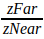, тем
ниже
точность**. Поэтому zNear рекомендуется устанавливать как можно дальше от наблюдателя, но так, чтобы ближней плоскостью отсечения не отсекло
интересующие нас объекты.

В методе OnDisplay зададим матрицу моделирования-вида в нужную точку сцены, и направим ее в начало координат. Направление вертикальной оси разместим в
одной плоскости с вектором взгляда и осью Z. Для этого воспользуемся
функцией [gluLookAt](http://msdn.microsoft.com/en-us/library/dd368663%28VS.85%29.aspx). Поскольку сцена у нас трехмерная, то нам понадобится буфер
глубины для удаления невидимых линий и поверхностей. Для очистки буфера глубины, как и для очистки буфера цвета, воспользуемся функцией glClear,
передав ей в качестве параметра комбинацию флагов GL_COLOR_BUFFER_BIT и GL_DEPTH_BUFFER_BIT.

Реализации OpenGL могут выполнять очистку нескольких буферов за один вызов glClear более эффективно, нежели по одному буферу за несколько вызовов.

```cpp
void CMyApplication::OnDisplay()
{
    glClear(GL_COLOR_BUFFER_BIT | GL_DEPTH_BUFFER_BIT);
    glLoadIdentity();

    gluLookAt(
        1, 2, 0.2, // Положение глаза наблюдателя
        0, 0, 0, // Точка, в которую направлена камера
        0, 0, 1 // Вектор, служащий для определения вектора "вверх"
        );
```

Рассмотрим подробнее смысл данных трансформаций.

Изначально матрица моделирования-вида содержит единичную матрицу, что соответствует положению глаза наблюдателя, совпадающему с началом координат.


Умножение единичной матрицы на матрицу камеры выполняет перенос системы координат наблюдателя в заданную точку и ориентирование ее заданным образом.


Данное преобразование также можно рассматривать как перенос мировой системы координат в противоположном направлении и ориентирование в пространстве:


Результирующему преобразованию соответствует матрица M, равная произведению единичной матрицы на видовую матрицу View. Матрица View выполняет
преобразование из мировой системы координат в систему координат наблюдателя.

$$M=I*View$$

Нарисуем для начала первый квадрат (красного цвета). Квадрат можно было бы задать при помощи примитивов GL_QUADS, однако в OpenGL есть
функция [glRect](http://msdn.microsoft.com/en-us/library/dd374025%28VS.85%29.aspx), облегчающая рисование прямоугольников в плоскости z = 0.
Воспользуемся ею:

```cpp
    // Рисуем красный квадрат
    glColor3f(1, 0, 0);
    glRectf(-1, -1, 1, 1);
```

Каждая вершина P квадрата будет преобразована OpenGL в вершину P’ системы координат наблюдателя при помощи умножения матрицы моделирования вида на
координаты вершины:

$$P' = M \cdot P = I \cdot \text{View} \cdot P$$

Результат работы программы представлен на следующем рисунке. Так выглядит наш прямоугольник с точки зрения камеры.

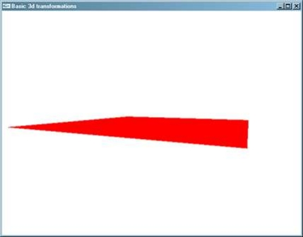

Для рисования синего квадрата потребуется выполнить ряд предварительных трансформаций, а именно:

- Повернуть плоскость, с квадратом вокруг оси Y на 60 градусов
- Поместить центр квадрата в точку (0, 0, 0.2)

Данные действия можно выполнить с квадратом 1*1*1, расположенным в плоскости Z=0, предварительно задав ему соответствующие трансформации:

```cpp
    // Рисуем синий квадрат в плоскости Z=0, предварительно задав для него
    // трансформацию повоота вокруг оси Y и а затем переноса на 0.2 вдоль оси Z
    glTranslatef(0, 0, 0.2);
    glRotatef(60, 0, 1, 0);

    glColor3f(0, 0, 1);
    glRectf(-0.5, -0.5, +0.5, +0.5);
}
```

Обратите внимание на порядок применения трансформаций. При трансформации вершин матрицы преобразований следует применять в порядке, обратном порядку
применения трансформаций:

$$M'' = M' \cdot T \cdot R = I \cdot \text{View}\cdot T \cdot R$$

Вершины при этом подвергаются следующим пребразованиям:

$$P'' = M'' \cdot P = I \cdot \text{View}\cdot T \cdot R \cdot P$$

Если рассматривать данную цепочку преобразований справа налево, получится следующая последовательность преобразований объекта:

- Поворот вершин вокруг оси Y на 90 градусов
- Перенос вершин вдоль вектора Z
- Перенос точек квадрата в точку взгляда камеры.

Если рассматривать данную цепочку слева направо, получится последовательность преобразований систем координат:

- Перенос камеры в заданную точку и ее ориентирование
- Перенос камеры вдоль вектора Z
- Поворот камеры вокруг оси Y на -90 градусов

Результат работы программы представлен на следующем рисунке:

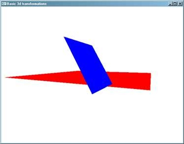

По изображению видно, что квадраты нарисованы некорректно, т.к. они должны пересекаться, а, фактически, синий квадрат собой просто заслонил ранее
нарисованный красный. Если бы мы нарисовали сперва синий квадрат, а потом красный, то результат был бы ничем не лучше – синий квадрат был бы заслонен
красным.

Для корректного отображения данных объектов следует включить тест глубины, который проходит каждый из фрагментов, прежде чем попадет в буфер кадра.
Данный тест заключается в том, чтобы выполнить сравнение глубины выводимого фрагмента примитива с глубиной фрагмента, хранящегося в буфере глубины.
Включается тест глубины при помощи вызова функции **glEnable(GL_DEPTH_TEST)**. Произведем установку данного свойства в методе OnInit:

```cpp
void CMyApplication::OnInit()
{
    glEnable(GL_DEPTH_TEST);
    glClearColor(1, 1, 1, 1);
}
```

Теперь картинка будет нарисована корректно, независимо от того, в каком порядке будет осуществлено рисование примитивов.


Итак, в данной программе мы познакомились с построением перспективных проекций, установкой положения виртуальной камеры, а также научились
комбинировать трехмерные преобразования для того, чтобы придать желаемое положение объектам сцены. Для корректного удаления скрытых линий и
поверхностей мы воспользовались тестом глубины.

### <a name="_toc100093341"></a>**Управляем положением виртуальной камеры.**

Познакомимся поближе с комбинированием матричных преобразований для управления положением камеры.

Разработаем программу, визуализирующую координатные оси мировой системы координат с заданной точки и позволяющую вращать виртуальную камеру вокруг
начала координат при помощи мыши.

#### ***Визуализируем координатный фрейм***

Для визуализации координатных осей (координатного фрейма) разработаем класс CFrame, инкапсулирующий необходимый нам функционал. Объявление класса
выглядит следующим образом:

```cpp
/*
Класс "Координатный фрейм" для визуализации осей координат
*/
class CFrame
{
public:
    // Инициализация координатного фрейма
    // size - длина стрелки,
    CFrame(float size = 1, float endSize = 0.1);
    // Рисуем координатные оси
    void Draw(void)const;
private:
    float m_size;
    float m_endSize;
};
```

Реализация данного класса будет рисовать координатные оси при помощи отрезков прямых линий. Каждая ось имеет длину и размер наконечника.


```cpp
CFrame::CFrame(float size, float endSize)
:m_size(size)
,m_endSize(endSize)
{
}

void CFrame::Draw(void)const
{
    float arrowOffset = m_size * m_endSize;
    float arrowOffset2 = arrowOffset * 0.5;

    glBegin(GL_LINES);
    // Ось X
    {
        glColor3ub(255, 0, 0);

        // Рисуем ось X
        glVertex3f(0, 0, 0);
        glVertex3f(m_size, 0, 0);
        // Рисуем наконечник оси X
        glVertex3f(m_size, 0, 0);
        glVertex3f(m_size - arrowOffset, -arrowOffset2, 0);
        glVertex3f(m_size, 0, 0);
        glVertex3f(m_size - arrowOffset, +arrowOffset2, 0);
    }
    // Ось Y
    {
        glColor3ub(0, 255, 0);

        // Рисуем ось Y
        glVertex3f(0, 0, 0);
        glVertex3f(0, m_size, 0);
        // Рисуем наконечник оси Y
        glVertex3f(0, m_size, 0);
        glVertex3f(-arrowOffset2, m_size - arrowOffset, 0);
        glVertex3f(0, m_size, 0);
        glVertex3f(+arrowOffset2, m_size - arrowOffset, 0);
    }
    // Ось Z
    {
        glColor3ub(0, 0, 255);
        // Рисуем ось Z
        glVertex3f(0, 0, 0);
        glVertex3f(0, 0, m_size);
        // Рисуем наконечник оси Z
        glVertex3f(0, 0, m_size);
        glVertex3f(-arrowOffset2, 0, m_size - arrowOffset);
        glVertex3f(0, 0, m_size);
        glVertex3f(+arrowOffset2, 0, m_size - arrowOffset);
    }
    glEnd();
}
```

В классе приложения перегрузим метод OnReshape для отслеживания изменений размеров окна пользователем и соответствующей настройки видового порта и
матрицы проецирования.

```cpp
class CMyApplication : public CGLApplication
{
public:
    CMyApplication(const char * title, int width, int height);
    ~CMyApplication(void);
protected:
    virtual void OnInit();
    virtual void OnDisplay();
    virtual void OnReshape(int width, int height);
    …
private:
    …

    // Размеры окна
    int m_windowWidth;
    int m_windowHeight;

    // Размер видимой области (по вертикали и горизонтали)
    static const double FRUSTUM_SIZE;

    // Расстояние от камеры до центра координатной оси
    static const double DISTANCE_TO_ORIGIN;
};
```

Реализуем метод OnReshape таким образом, чтобы при любых размерах окна ближняя плоскость видового объема вмещала в себя квадрат размером FRUSTUM_SIZE
x FRUSTUM_SIZE:


Этого можно достичь следующим образом. В том случае, когда ширина окна больше высоты, задать расстояние между bottom и top, равным FRUSTUM_SIZE, а
расстояние между left и right вычислить, зная соотношение сторон окна. В случае, когда высота окна больше ширины, мы, наоборот, должны расстояние
между левой и правой границами задать равным FRUSTUM_SIZE, а расстояние между нижней и верхней вычислить по соотношению сторон окна.

 

Указанные свойства матрицы проецирования зададим в обработчике **OnReshape** с использованием функции glFrustum:

```cpp
// Размер видимого объема, которые должен поместиться в порт просмотра
const double CMyApplication::FRUSTUM_SIZE = 2;
// Расстояние от камеры до точки вращения
const double CMyApplication::DISTANCE_TO_ORIGIN = 2;

CMyApplication::CMyApplication(const char * title, int width, int height)
:CGLApplication(title, width, height)
,m_windowWidth(width)
,m_windowHeight(height)
{
}

void CMyApplication::OnReshape(int width, int height)
{
    m_windowWidth = width;
    m_windowHeight = height;

    glViewport(0, 0, width, height);


    // Вычисляем соотношение сторон клиентской области окна
    double aspect = double(width) / double(height);

    // Считаем, что высота видимой области равна FRUSTUM_SIZE
    // (на расстоянии до ближней плоскости отсечения)
    double frustumHeight = FRUSTUM_SIZE;
    // Ширина видимой области рассчитывается согласно соотношению сторон окна
    // (шире окно - шире область видимости и наоборот)
    double frustumWidth = frustumHeight * aspect;

    // Если ширина видимой области получилась меньше, чем FRUSTUM_SIZE,
    // то корректируем размеры видимой области
    if (frustumWidth < FRUSTUM_SIZE && (aspect != 0))
    {
        frustumWidth = FRUSTUM_SIZE;
        frustumHeight = frustumWidth / aspect;
    }

    glMatrixMode(GL_PROJECTION);
    glLoadIdentity();
    glFrustum(
        -frustumWidth * 0.5, frustumWidth * 0.5, // left, right
        -frustumHeight * 0.5, frustumHeight * 0.5, // top, bottom
        FRUSTUM_SIZE * 0.5, FRUSTUM_SIZE * 20 // znear, zfar
        );
    glMatrixMode(GL_MODELVIEW);
}
```

В методе OnInit зададим толщину линий и цвет заливки, а также перенесем отображаемые объекты на некоторое расстояние вдоль оси Z. Для сокрытия
невидимых линий и поверхностей включим тест глубины. Для рисования координатного фрейма вызовем метод Draw у экземпляра класса CFrame.

```cpp
void CMyApplication::OnInit()
{
    // Переносим точку камеры на заданное расстояние от начала координат
    // вдоль оси Z
    glTranslatef(0, 0, -DISTANCE_TO_ORIGIN);

    // Задаем ширину линий
    glLineWidth(2);
    // И цвет очистки буфера цвета
    glClearColor(1, 1, 1, 1);

    // Включаем тест глубины для удаления невидимых линий и поверхностей
    glEnable(GL_DEPTH_TEST);
}

void CMyApplication::OnDisplay()
{
    glClear(GL_COLOR_BUFFER_BIT | GL_DEPTH_BUFFER_BIT);

    // Создаем координатный фрейм и рисуем его
    CFrame frame;
    frame.Draw();
}
```

Результат работы программы будет следующим:

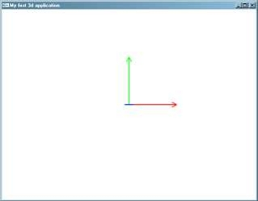

Как видно, при единичной матрице моделирования-вида, начало координат совпадает с центром видового порта.

#### ***Обрабатываем события от мыши***

Следующим нашим шагом будет отслеживание событий от мыши и модифицирование матрицы моделирования-вида для изменения положения виртуальной камеры.
Движения мыши по горизонтали будут выполнять вращение камеры вокруг оси Y, а движения мыши по вертикали будут осуществлять вращение вокруг оси X.
Величина угла вращения будет пропорциональна величине перемещения мыши.


Сконфигурируем коэффициенты для расчета углов вращения таким образом, чтобы перемещение мыши на ширину клиентской области окна осуществляло поворот на
180 градусов по вертикальной оси, аналогично сделаем для поворотов вокруг горизонтальной оси.

Внимательный читатель наверняка задастся вопросом: «**А что произойдет, если движение мыши будет осуществлено одновременно вдоль горизонтальной и
вдоль вертикальной оси?**». Вокруг какой оси будет осуществляться поворот в первую очередь, ведь как мы убедились раньше, последовательность
применения преобразований (в частности, поворотов) оказывает существенное влияние на результат.

Важность порядка применения преобразований, конечно же, никто не отменял. Однако при малых углах поворота разницы на глаз заметно не будет. Поэтому мы
сначала повернем вокруг оси X, а потом вокруг оси Y.

Итак, приступим. Прежде всего, нам понадобятся обработчики сообщений о нажатии/отпускании кнопки мыши (поворот будем осуществлять только при нажатой
левой кнопке мыши), а также обработчик события о перемещении курсора.

Класс CGLApplication предоставляет виртуальные методы **OnMouse** и **OnMotion**, вызываемые им при получении от библиотеки GLUT соответствующих
уведомлений. Данные методы мы перегрузим в классе CMyApplication.

Для вычисления смещения курсора мыши нам понадобятся переменные для хранения прежней позиции курсора. Кроме того, заведем переменную, хранящую
состояние левой кнопки мыши.

```cpp
class CMyApplication : public CGLApplication
{
public:
    …
protected:
    …
    virtual void OnMouse(int button, int state, int x, int y);
    virtual void OnMotion(int x, int y);
private:
    …
    // Вращаем камеру вокруг начала кординат на заданный угол
    static void RotateCamera(GLfloat rotateX, GLfloat rotateY);
    // Флаг, свидетельствующий о состоянии левой кнопки мыши
    bool m_leftButtonPressed;

    // Старые координаты курсора мыши
    int m_mouseX;
    int m_mouseY;
};

```

Инициализацию переменной m_leftButtonPressed осуществим в конструкторе класса CMyApplication:

```cpp
CMyApplication::CMyApplication(const char * title, int width, int height)
:CGLApplication(title, width, height)
,m_windowWidth(width)
,m_windowHeight(height)
,**m_leftButtonPressed(false)**
,m_mouseX(0)
,m_mouseY(0)
{
}
```

В обработчике OnMouse выполним инициализацию переменных m_leftButtonPressed, m_mouseX и m_mouseY в зависимости от состояния кнопок мыши и положения
курсора.

```cpp
void CMyApplication::OnMouse(int button, int state, int x, int y)
{
    // Событие от левой кнопки мыши
    if (button == GLUT_LEFT_BUTTON)
    {
        // Сохраняем состояние левой кнопки мыши
        m_leftButtonPressed = (state == GLUT_DOWN);
        // Сохраняем координаты мыши
        m_mouseX = x;
        m_mouseY = y;
    }
}
```

В обработчике OnMotion в том случае, если перемещение мыши происходит при нажатой левой кнопке мыши, вычислим углы поворота вокруг осей X и Y и
осуществим поворот камеры. Поскольку результат поворота камеры должен увидеть пользователь, при помощи метода PostRedisplay сообщим библиотеке GLUT о
необходимости перерисовать окно.

```cpp
void CMyApplication::OnMotion(int x, int y)
{
    // Если нажата левая кнопка мыши
    if (m_leftButtonPressed)
    {
        // Вычисляем смещение курсора мыши
        int dx = x - m_mouseX;
        int dy = y - m_mouseY;

        // Вычисляем угол поворота вокруг осей Y и X как линейно зависящие
        // от смещения мыши по осям X и Y
        GLfloat rotateX = GLfloat(dy) * 180 / m_windowHeight;
        GLfloat rotateY = GLfloat(dx) * 180 / m_windowWidth;
        RotateCamera(rotateX, rotateY);

        // Сохраняем текущие координаты мыши
        m_mouseX = x;
        m_mouseY = y;

        // Инициируем перерисовку окна
        PostRedisplay();
    }
}
```

#### ***Вращаем камеру***

Простейшая реализация функции RotateCamera могла бы быть такой:

```cpp
// Вращаем камеру вокруг начала кординат на заданный угол
void CMyApplication::RotateCamera(GLfloat rotateX, GLfloat rotateY)
{
    glRotatef(rotateX, 1, 0, 0);
    glRotatef(rotateY, 0, 1, 0);
}
```

Однако после запуска программы мы заметим странное поведение нашей программы.

Во-первых, вращение будет происходить вокруг осей X и Y мировых координат, а не координат камеры, что весьма неудобно с точки зрения ориентирования
камеры. Интуитивно понятнее для пользователя было бы вращать камеру вокруг осей X и Y камеры.

Во-вторых, из-за того, что команды glRotate выполняют модификацию текущей матрицы, умножая ее на матрицу соответствующего поворота, при этом в ходе
вычислений накапливаются погрешности, искажающие матрицу моделирования вида – она перестает быть ортонормированной[^5]. Чем это грозит? Например, тем,
что после многократного[^6] применения трансформаций матрица может оказаться вырожденной[^7], и объекта мы уже не увидим.

Для вращения вокруг осей X и Y камеры нужно найти обратную матрицу матрицы моделирования вида. Однако для нахождения обратной матрицы к
ортонормированной матрице достаточно выполнить транспонировать матрицу координатных осей (матрица 3*3 полученная удалением последнего столбца и
последней строки матрицы моделирования-вида), а четвертый столбец вычислить путем нахождения скалярного произведения вектора четвертого столбца
исходной матрицы и соответствующей строки транспонированной матрицы, взятого с противоположным знаком:

$$
T \cdot V = 
\begin{pmatrix}
    a & b & c & d \\
    e & f & g & h \\
    i & j & k & l \\
    m & n & o & p \\
\end{pmatrix}
\*
\begin{pmatrix}
    x \\
    y \\
    z \\
    w \\
\end{pmatrix}
$$

Следует запомнить, что данный способ подходит только для быстрого инвертирования **ортонормированных матриц аффинных преобразований**. Для
произвольной матрицы нахождение обратной матрицы осуществляется одним из [стандартных способов](http://ru.wikipedia.org/wiki/Обратная_матрица),
например с помощью [метода Гаусса](http://ru.wikipedia.org/wiki/%D0%9C%D0%B5%D1%82%D0%BE%D0%B4_%D0%93%D0%B0%D1%83%D1%81%D1%81%D0%B0)
или [союзных матриц](http://ru.wikipedia.org/wiki/%D0%A1%D0%BE%D1%8E%D0%B7%D0%BD%D0%B0%D1%8F_%D0%BC%D0%B0%D1%82%D1%80%D0%B8%D1%86%D0%B0).

В нашем случае вычислять коэффициенты D нет необходимости, т.к. нужны лишь направления координатных осей, поэтому достаточно лишь выполнить
транспонирование союзной матрицы.

Чтобы избежать искажения матрицы моделирования-вида, после применения трансформаций, необходимо приводить матрицу моделирования вида к
ортонормированному виду. Для этого необходимо извлечь направления координатных осей камеры из коэффициентов матрицы моделирования-вида, вычислить
направление оси Z через векторное произведение нормализованных осей X и Y, то же самое проделать для вычисления оси X и Y. Тем самым, будут
компенсированы искажения.

##### Реализовываем класс для работы с трехмерными векторами

Для решения данных задач нам понадобится выполнять операции над трехмерными векторами. В частности, нахождение скалярного произведения и нормирование.
Разработаем класс CVector3, реализующий минимально необходимый для нашей текущей задачи набор операций. Сам класс сделаем шаблонным, чтобы с его
помощью можно было выполнять операции над векторами чисел с плавающей запятой одинарной и двойной точности:

```cpp
template <class T>
class CVector3
{
public:
    T x, y, z;

    CVector3(void)
        :x(0), y(0), z(0)
    {
    }

    CVector3(T x0, T y0, T z0)
        :x(x0), y(y0), z(z0)
    {
    }

    T GetLength()const
    {
        return static_cast<T>(sqrt(x * x + y * y + z * z));
    }
    // Нормализуем

    void Normalize()
    {
        float invLength = 1 / GetLength();
        x *= invLength;
        y *= invLength;
        z *= invLength;
    }
};

// Вычисляем векторное произведение a и b
template <class T>
CVector3<T> const Cross(CVector3<T> const & a, CVector3<T> const & b)
{
    /*
    Векторное произведение векторов A и B равно определителю матрицы:
          |i  j  k |
    AxB = |Ax Ay Az|
          |Bx By Bz|
    */
    return CVector3<T>(
        a.y * b.z - a.z * b.y,
        a.z * b.x - a.x * b.z,
        a.x * b.y - a.y * b.x );
}

typedef CVector3<float> CVector3f;
typedef CVector3<double> CVector3d;
```

Метод вращения матрицы моделирования-вида будет выглядеть следующим образом. Для получения коэффициентов матрицы моделирования-вида в виде массива
чисел с плавающей запятой воспользуемся функцией [glGetFloatv](http://msdn.microsoft.com/en-us/library/ee872026\(v=VS.85\).aspx) с параметром
GL_MODELVIEW_MATRIX.

```cpp
// Вращаем камеру вокруг начала кординат на заданный угол
void CMyApplication::RotateCamera(GLfloat rotateX, GLfloat rotateY)
{
    // Извлекаем текущее значение матрицы моделирования-вида
    GLfloat modelView[16];
    glGetFloatv(GL_MODELVIEW_MATRIX, &modelView[0]);

    // Извлекаем направления координатных осей камеры в 3д пространстве
    // как коэффициенты строк матрицы моделирования-вида
    CVector3f xAxis(modelView[0], modelView[4], modelView[8]);
    CVector3f yAxis(modelView[1], modelView[5], modelView[9]);

    // Поворачиваем вокруг осей x и y камеры
    glRotatef(rotateX, xAxis.x, xAxis.y, xAxis.z);
    glRotatef(rotateY, yAxis.x, yAxis.y, yAxis.z);

    // В ходе умножения матриц могут возникать погрешности, которые,
    // накапливаясь могут сильно искажать картинку
    // Для их компенсации после каждой модификации матрицы моделирования-вида
    // проводим ее ортонормирование
    NormalizeModelViewMatrix();
}
```

##### Приводим матрицу моделирования вида к ортонормированному виду

Добавим в класс CMyApplication статический метод NormalizeModelViewMatrix для нормализации матрицы моделирования вида:

```cpp
class CMyApplication : public CGLApplication
{
…
private:
    …
    // Производим ортонормирование матрицы моделирования-вида
    static void NormalizeModelViewMatrix(void);
};

// Производим ортонормирование матрицы моделирования-вида
void CMyApplication::NormalizeModelViewMatrix(void)
{
    GLfloat modelView[16];
    glGetFloatv(GL_MODELVIEW_MATRIX, modelView);
    /*
    Ортонормирование - приведение координатных осей к единичной длине (нормирование)
    и взаимной перпендикулярности (ортогонализация)
    Достичь этого можно при помощи нормализации координатных осей
    и векторного произведения
    */
    CVector3f xAxis(modelView[0], modelView[4], modelView[8]);
    xAxis.Normalize();
    CVector3f yAxis(modelView[1], modelView[5], modelView[9]);
    yAxis.Normalize();

    // Ось Z вычисляем через векторное произведение X и Y
    // Z будет перпендикулярна плоскости векторов X и Y
    CVector3f zAxis = Cross(xAxis, yAxis);
    // И иметь единичную длину
    zAxis.Normalize();
    // То же самое проделываем с осями x и y
    xAxis = Cross(yAxis, zAxis);
    xAxis.Normalize();
    yAxis = Cross(zAxis, xAxis);
    yAxis.Normalize();

    // Сохраняем вектора координатных осей обратно в массив
    modelView[0] = xAxis.x; modelView[4] = xAxis.y, modelView[8] = xAxis.z;
    modelView[1] = yAxis.x; modelView[5] = yAxis.y, modelView[9] = yAxis.z;
    modelView[2] = zAxis.x; modelView[6] = zAxis.y, modelView[10] = zAxis.z;

    // И загружаем матрицу моделирвания-вида
    glLoadMatrixf(modelView);
}
```

Ну вот, теперь управлять вращением объекта стало намного проще.

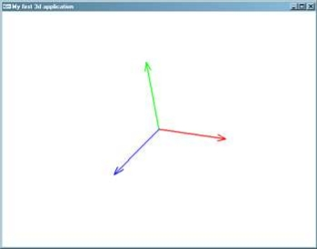

## <a name="_toc100093342"></a>**Визуализация объемных объектов**

Теперь пришло самое время для визуализации какого-нибудь несложного объемного объекта. Например, куба.

Куб можно представить в виде набора 6 квадратных граней и 8 вершин:


### <a name="_toc100093343"></a>**Порядок обхода вершин граней**

Для того чтобы нарисовать куб, необходимо нарисовать составляющие его квадратные грани. Важно соблюдать определенный порядок перечисления вершин
граней трехмерного объекта, поскольку OpenGL использует порядок перечисления вершин для определения того, какой стороной повернут плоский полигон к
наблюдателю. При визуализации монолитного объекта из любой точки снаружи трехмерного объекта видны только лицевые стороны составляющих его граней, что
позволяет при рисовании объекта смело отбросить грани, повернутые к камере оборотной стороной[^8]. В OpenGL такая возможность называется face
culling (отбраковка граней) и включается при помощи команды **glEnable(GL_CULL_FACE)**. Для того, чтобы указать какие из граней должны отбраковываться
следует воспользоваться[^9] функцией [glCullFace](https://www.khronos.org/registry/OpenGL-Refpages/gl2.1/xhtml/glCullFace.xml), передав ей в качестве
параметра одну из следующих символических констант GL_FRONT, GL_BACK, GL_FRONT_AND_BACK.
Функция [glFrontFace](https://www.khronos.org/registry/OpenGL-Refpages/gl2.1/xhtml/glFrontFace.xml) сообщает OpenGL о направлении обхода вершин на
лицевой стороне грани. Данная функция принимает один из параметров GL_CW и GL_CCW, задающих, соответственно, порядок обхода вершин грани по часовой и
против часовой стрелки. По умолчанию выбран порядок обхода вершин против часовой стрелки.

В нашем случае мы также будем перечислять вершины граней куба против часовой стрелки.

### <a name="_toc100093344"></a>**Визуализация куба**

Куб будет характеризоваться размером своей стороны, а также цветом каждой грани. Для представления и рисования куба разработаем класс CCube.

```cpp
class CCube
{
public:
    enum CubeSide
    {
        CS_NEGATIVE_X,
        CS_POSITIVE_X,
        CS_NEGATIVE_Y,
        CS_POSITIVE_Y,
        CS_NEGATIVE_Z,
        CS_POSITIVE_Z,

        CS_MIN_CUBE_SIDE_INDEX = CS_NEGATIVE_X,
        CS_MAX_CUBE_SIDE_INDEX = CS_POSITIVE_Z,
    };
public:
    // Создаем куб с заданной длиной стороны
    CCube(float size = 1);
    // Рисуем куб
    void Draw()const;
    // Задаем цвет стороны куба
    void SetSideColor(
        CubeSide side, GLubyte r, GLubyte g, GLubyte b, GLubyte a = 255);
private:
    float m_size;

    // Цвета сторон куба
    GLubyte m_sideColors[6][4];
};
```

В конструкторе куба будет задаваться белый цвет для всех граней куба:

```cpp
CCube::CCube(float size)
:m_size(size)
{
    SetSideColor(CS_NEGATIVE_X, 255, 255, 255);
    SetSideColor(CS_POSITIVE_X, 255, 255, 255);
    SetSideColor(CS_NEGATIVE_Y, 255, 255, 255);
    SetSideColor(CS_POSITIVE_Y, 255, 255, 255);
    SetSideColor(CS_NEGATIVE_Z, 255, 255, 255);
    SetSideColor(CS_POSITIVE_Z, 255, 255, 255);
}

void CCube::SetSideColor(
    CubeSide side, GLubyte r, GLubyte g, GLubyte b, GLubyte a )
{
    if (side < CS_MIN_CUBE_SIDE_INDEX || side > CS_MAX_CUBE_SIDE_INDEX)
    {
        throw std::invalid_argument("Invalid cube side");
    }

    m_sideColors[side][0] = r;
    m_sideColors[side][1] = g;
    m_sideColors[side][2] = b;
    m_sideColors[side][3] = a;
}
```

Для рисования куба создадим два массива: массив вершин и массив индексов вершин, перечисляющих индексы вершин из массива вершин против часовой
стрелки. Перед рисованием каждой грани устанавливаем цвет грани. Т.к. в массиве координаты вершин граней куба заданы в диапазоне от -1 до +1, при
помощи glScale применим трансформацию масштабирования перед рисованием куба. Для восстановления матрицы моделирования-вида предварительно сохраним ее
при помощи [glPushMatrix](https://www.khronos.org/registry/OpenGL-Refpages/gl2.1/xhtml/glPushMatrix.xml) до рисования куба и восстановим с
помощью [glPopMatrix](https://www.khronos.org/registry/OpenGL-Refpages/gl2.1/xhtml/glPushMatrix.xml) после рисования. Стоит отметить также удобство
функции [glVertex3fv](https://www.khronos.org/registry/OpenGL-Refpages/gl2.1/xhtml/glVertex.xml) и ей подобных, позволяющих задать координаты вершины
по указателю на ее первый элемент.

```cpp
void CCube::Draw()const
{
    /*
         Y
         |
         |
         |
         +---X
        /
       /
      Z
         3----2
        /    /|
       /    / |
      7----6  |
      |  0 |  1
      |    | /
      |    |/
      4----5
    */
    // Массив координат вершин
    static const float vertices[8][3] =
    {
        {-1, -1, -1}, // 0
        {+1, -1, -1}, // 1
        {+1, +1, -1}, // 2
        {-1, +1, -1}, // 3
        {-1, -1, +1}, // 4
        {+1, -1, +1}, // 5
        {+1, +1, +1}, // 6
        {-1, +1, +1}, // 7
    };

    // Массив координат граней (в порядке, совпадающем с
    // порядком объявления их в массиве цветов)
    // индексы вершин граней перечисляются в порядке их обхода
    // против часовой стрелки (если смотреть на грань снаружи)
    static const unsigned char faces[6][4] =
    {
        {4, 7, 3, 0}, // грань x<0
        {5, 1, 2, 6}, // грань x>0
        {4, 0, 1, 5}, // грань y<0
        {7, 6, 2, 3}, // грань y>0
        {0, 3, 2, 1}, // грань z<0
        {4, 5, 6, 7}, // грань z>0
    };
    static size_t const faceCount = sizeof(faces) / sizeof(*faces);

    // Сохраняем текущую матрицу моделирования-вида в стеке матриц
    // т.к. следующей строкой она будет модифицирована при помощи glScale
    glPushMatrix();
    // Задаем масштабирование вершин граней
    glScalef(m_size * 0.5f, m_size * 0.5f, m_size * 0.5f);

    glBegin(GL_QUADS);
    {
        for (size_t face = 0; face < faceCount; ++face)
        {
            // устанавливаем цвет грани
            glColor4ubv(m_sideColors[face]);

            // задаем четырехугольную грань, перечисляя ее вершины
            for (size_t i = 0; i < 4; ++i)
            {
                size_t vertexIndex = faces[face][i];
                glVertex3fv(vertices[vertexIndex]);
            }
        }
    }
    glEnd();

    // Восстанавливаем матрицу моделирования вида из стека матриц
    glPopMatrix();
}
```

В конструкторе класса CMyApplication произведем инициализацию цветов граней куба.

```cpp
CMyApplication::CMyApplication(const char * title, int width, int height)
:CGLApplication(title, width, height)
{
    m_cube.SetSideColor(CCube::CS_NEGATIVE_X, 255, 0, 0);
    m_cube.SetSideColor(CCube::CS_POSITIVE_X, 0, 255, 0);
    m_cube.SetSideColor(CCube::CS_NEGATIVE_Y, 0, 0, 255);
    m_cube.SetSideColor(CCube::CS_POSITIVE_Y, 255, 255, 0);
    m_cube.SetSideColor(CCube::CS_NEGATIVE_Z, 0, 255, 255);
    m_cube.SetSideColor(CCube::CS_POSITIVE_Z, 255, 0, 255);
}
```

Метод OnInit настраивает режим отбраковки граней, а также включает тест глубины (хотя куб и без него будет нарисован корректно):

```cpp
void CMyApplication::OnInit()
{
    // Включаем режим отбраковки граней
    glEnable(GL_CULL_FACE);
    // Отбраковываться будут нелицевые стороны граней
    glCullFace(GL_BACK);
    // Сторона примитива считается лицевой, если при ее рисовании
    // обход верших осуществляется против часовой стрелки
    glFrontFace(GL_CCW);

    // Включаем тест глубины для удаления невидимых линий и поверхностей
    glEnable(GL_DEPTH_TEST);
}
```

Функция рисования куба просто устанавливает камеру в нужную точку и вызывает метод Draw куба.

```cpp
void CMyApplication::OnDisplay()
{
    glClear(GL_COLOR_BUFFER_BIT | GL_DEPTH_BUFFER_BIT);

    // Инициализируем матрицу моделирования вида
    glLoadIdentity();
    // и умножаем ее на матрицу просмотра из точки (2, 2, 2) в точку (0, 0, 0)
    // с вертикальным вектором (0, 1, 0)
    gluLookAt(
        2, 2, 2,
        0, 0, 0,
        0, 1, 0
        );

    m_cube.Draw();
}
```

Результат визуализации куба представлен на следующем рисунке:

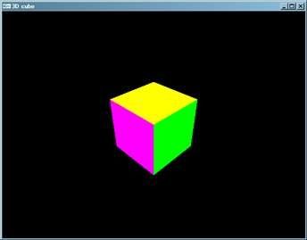

## <a name="_toc100093345"></a>**Использование материалов и освещения**

Нарисованная нами перспективная проекция куба выглядит трехмерной лишь благодаря тому, что каждую грань куба мы окрасили в свой цвет, что отделяет ее
от цвета остальных граней. Интерпретацию построенной проекции как трехмерного объекта выполняет уже наш мозг, который привык видеть перспективные
проекции окружающих нас объектов.

Однако стоит лишь окрасить все грани куба в один и тот же цвет, как полученная картинка уже меньше напоминает куб, а кажется похожей на плоский
многоугольник.

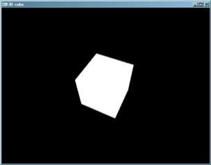

Происходит так потому, что изображение куба построено без учета освещенности. Именно свет от источников света, отражаясь от поверхности трехмерных
объектов, попадает к нам в глаза и делает объекты видимыми. Интенсивность отраженного света зависит не только от интенсивности самого источника света
и его расстояния до объекта, но и от параметров материала, а также от угла, под которым свет падает на поверхность. Например, лучи солнца в зимнее
время падают на северное полушарие под меньшим углом к поверхности, передавая ей меньшее количество света и тепла. Кроме того, от гладких поверхностей
лучи отражаются больше вдоль вектора полного зеркального отражения и в меньшей степени в остальных направлениях.

### <a name="_toc100093346"></a>**Модели освещения, используемые в OpenGL**

Свет от источника света попадает на разные грани куба под разными углами, передавая им меньшее количество светового излучения. В результате, каждая
грань куба отражает различное количество света и отличается визуально по цвету от остальных граней. В результате объект выглядит гораздо реалистичнее.

По-умолчанию, в OpenGL освещение выключено. Для включения стандартного механизма освещения следует воспользоваться функцией glEnable с параметром *
*GL_LIGHTING**. После этого OpenGL для расчета цвета вершин примитивов будет использовать параметры источников света, направление вектора нормали в
вершине, а также текущие параметры материала.

Всего в OpenGL стандартно доступны 8 источников света, включить и выключить которые можно при помощи функций glEnable/glDisable с параметрами от
GL_LIGHT0 до GL_LIGHT1. Каждый источник света характеризуется интенсивностью фонового[^10], диффузного[^11] и зеркального[^12] света. OpenGL вычисляет
результирующий цвет вершины как суммарный результат взаимодействия интенсивностей света от источника света с коэффициентами фонового, диффузного и
зеркального отражения материала.


Модель освещения Ламберта для расчета интенсивности диффузной составляющей отраженного света


Модель Фонга для расчета интенсивности зеркальной составляющей отраженного света.

Здесь f – степень зеркального отражения материала. Чем он больше, тем острее получаются блики на поверхности.

$$I_{\text{sp}} = I_s \rho_s \max\left(\left(\frac{h}{|h|} \cdot \frac{m}{|m|}\right)^f, 0\right), \quad \text{где } h = s + v$$

Альтернативное приближение модели Фонга

Нахождение результирующей интенсивности света находится как сумма интенсивностей фоновой, диффузной и зеркальной составляющих отраженного света:

$$I = I_a \rho_a + I_d \rho_d \cdot \text{lambert} + I_s P_\rho \cdot \text{phong}^f$$

$$\text{lambert} = \max(0, \frac{s \cdot m}{\|s\| \|m\|})$$

$$\text{phong} = \max(0, \frac{h \cdot m}{\|h\| \|m\|})$$

В случае цветных источников света приемлемое приближение дает вычисление интенсивностей красной, зеленой и синей составляющих по вышеуказанным
формулам

$$I_r=I_{ar} \rho_{ar} + I_{dr} \rho_{dr} \cdot \text{lambert} + I_{sr} \rho_{sr} \cdot \text{phong}^f$$

$$I_g=I_{ag} \rho_{ag} + I_{dg} \rho_{dg} \cdot \text{lambert} + I_{sg} \rho_{sg} \cdot \text{phong}^f$$

$$I_b=I_{ab} \rho_{ab} + I_{db} \rho_{db} \cdot \text{lambert} + I_{sb} \rho_{sb} \cdot \text{phong}^f$$

Параметры источника света в OpenGL задаются при помощи семейства
функций [glLight](https://www.khronos.org/registry/OpenGL-Refpages/gl2.1/xhtml/glLight.xml). К параметрам источника света относятся интенсивности
диффузной, зеркальной и фоновой составляющих цвета, положение источника света (или направление на него), степень зеркального отражения для модели
Фонга. Для конических источников света можно задать величину угла разброса света. Кроме того, можно задать коэффициенты ослабления интенсивности света
в зависимости от расстояния.

### <a name="_toc100093347"></a>**Разрабатываем класс «Направленный источник света»**

Разработаем класс CDirectLight, задающий параметры направленного источника света. Особенностью направленного источника света является то, что вместо
положения источника света (точка), задается направление на источник. Кроме того, свет от направленного источника света считается не зависящим от
расстояния до объекта.

Примером направленного источника света может служить достаточно удаленный источник света, такой как Солнце: расстояние до Солнца во много раз
превышает размеры отображаемой сцены. Однако если сценой является вся Солнечная система, то Солнце будет в таких масштабах представлять собой точечный
источник, нежели направленный. ведь размеры Солнечной системы соизмеримы с расстоянием от планет до Солнца.

```cpp
class CDirectLight
{
public:
    CDirectLight(CVector3f const& lightDirection = CVector3f(0, 0, 1));
    void SetDirection(CVector3f const& direction);

    void SetDiffuseIntensity(GLfloat r, GLfloat g, GLfloat b, GLfloat a = 1);
    void SetAmbientIntensity(GLfloat r, GLfloat g, GLfloat b, GLfloat a = 1);
    void SetSpecularIntensity(GLfloat r, GLfloat g, GLfloat b, GLfloat a = 1);

    void SetLight(GLenum light);
private:
    CVector3f m_direction;
    GLfloat m_diffuse[4];
    GLfloat m_ambient[4];
    GLfloat m_specular[4];
};
```

Конструктор класса выполняет инициализацию параметров источника света по умолчанию.

```cpp
CDirectLight::CDirectLight(CVector3f const& lightDirection)
:m_direction(lightDirection)
{
    SetDiffuseIntensity(0.8, 0.8, 0.8, 1);
    SetAmbientIntensity(0.2, 0.2, 0.2, 1);
    SetSpecularIntensity(0.5, 0.5, 0.5, 1);
}
```

Следующие методы служат для установки параметров источника света:

```cpp
void CDirectLight::SetDirection(CVector3f const& direction)
{
    m_direction = direction;
}

void CDirectLight::SetDiffuseIntensity(GLfloat r, GLfloat g, GLfloat b, GLfloat a)
{
    m_diffuse[0] = r;
    m_diffuse[1] = g;
    m_diffuse[2] = b;
    m_diffuse[3] = a;
}

void CDirectLight::SetAmbientIntensity(GLfloat r, GLfloat g, GLfloat b, GLfloat a /* = 1 */)
{
    m_ambient[0] = r;
    m_ambient[1] = g;
    m_ambient[2] = b;
    m_ambient[3] = a;
}

void CDirectLight::SetSpecularIntensity(GLfloat r, GLfloat g, GLfloat b, GLfloat a /* = 1 */)
{
    m_specular[0] = r;
    m_specular[1] = g;
    m_specular[2] = b;
    m_specular[3] = a;
}
```

Метод SetLight задает параметры указанного источника света OpenGL.

```cpp
void CDirectLight::SetLight(GLenum light)
{
    GLfloat lightDirection[4] =
    {
        m_direction.x,
        m_direction.y,
        m_direction.z,
        0
    };
    glLightfv(light, GL_POSITION, lightDirection);
    glLightfv(light, GL_DIFFUSE, m_diffuse);
    glLightfv(light, GL_AMBIENT, m_ambient);
    glLightfv(light, GL_SPECULAR, m_specular);
}
```

### <a name="_toc100093348"></a>**Совершенствуем класс CVector3**

Для корректного расчета освещения необходимо указать нормали к вершинам нашего куба. Т.к. грани куба являются плоскими, во всех вершинах каждой грани
вектор нормали будет одинаковым. Для расчета вектора нормали нам понадобится расширить класс CVector3, добавив операторы вычитания, приведения к
указателю на первый компонент, умножения на скаляр, а также дополнительный конструктор.

```cpp
template <class T>
class CVector3
{
public:
    T x, y, z;

    CVector3(void)
        :x(0), y(0), z(0)
    {
    }

    explicit CVector3(const T * p)
        :x(p[0]), y(p[1]), z(p[2])
    {
    }


    CVector3(T x0, T y0, T z0)
        :x(x0), y(y0), z(z0)
    {
    }

    operator T const*()const
    {
        return &x;
    }

    CVector3 & operator *= (T scale)
    {
        x *= scale;
        y *= scale;
        z *= scale;
        return *this;
    }

    CVector3 const operator-(CVector3 const& v)const
    {
        return CVector3(x - v.x, y - v.y, z - v.z);
    }

    T GetLength()const
    {
        return static_cast<T>(sqrt(x * x + y * y + z * z));
    }

    // Нормализуем
    void Normalize()
    {
        float invLength = 1 / GetLength();
        x *= invLength;
        y *= invLength;
        z *= invLength;
    }
};
```

### <a name="_toc100093349"></a>**Совершенствуем метод рисования куба**

Метод рисования куба претерпел небольшие изменения – теперь в нем для каждой грани рассчитывается вектор нормали. Здесь-то нам и пригодились
добавленные в класс CVector3 возможности. Отметим, что мы отказались от использования функции glScale для масштабирования куба и используем явное
вычисление координат его вершин. Сделано это по следующей причине – функция glScale выполняет масштабирование не только вершин, но и нормалей, а
стандартный механизм освещения OpenGL требует, чтобы нормали в вершинах имели единичную длину, иначе возможен некорректный расчет освещения.

```cpp
void CCube::Draw()const
{
    /*
         Y
         |
         |
         |
         +---X
        /
       /
      Z
         3----2
        /   /|
       /   / |
      7----6 |
      | 0  | 1
      |    | /
      |    |/
      4----5
    */
    // Массив координат вершин
    static const float vertices[8][3] =
    {
        {-1, -1, -1}, // 0
        {+1, -1, -1}, // 1
        {+1, +1, -1}, // 2
        {-1, +1, -1}, // 3
        {-1, -1, +1}, // 4
        {+1, -1, +1}, // 5
        {+1, +1, +1}, // 6
        {-1, +1, +1}, // 7
    };

    // Массив координат граней (в порядке, совпадающем с
    // порядком объявления их в массиве цветов)
    // индексы вершин граней перечисляются в порядке их обхода
    // против часовой стрелки (если смотреть на грань снаружи)
    static const unsigned char faces[6][4] =
    {
        {4, 7, 3, 0}, // грань x<0
        {5, 1, 2, 6}, // грань x>0
        {4, 0, 1, 5}, // грань y<0
        {7, 6, 2, 3}, // грань y>0
        {0, 3, 2, 1}, // грань z<0
        {4, 5, 6, 7}, // грань z>0
    };
    static size_t const faceCount = sizeof(faces) / sizeof(*faces);

    glBegin(GL_QUADS);
    {
        for (size_t face = 0; face < faceCount; ++face)
        {
            // устанавливаем цвет грани
            glColor4ubv(m_sideColors[face]);
            const unsigned char * facePoints = faces[face];

            // получаем вершины очередной грани куба
            CVector3f p0(vertices[facePoints[0]]);
            CVector3f p1(vertices[facePoints[1]]);
            CVector3f p2(vertices[facePoints[2]]);
            CVector3f p3(vertices[facePoints[3]]);
            // Вычисляем координаты вершин куба с учетом его размера
            p0 *= m_size * 0.5f;
            p1 *= m_size * 0.5f;
            p2 *= m_size * 0.5f;
            p3 *= m_size * 0.5f;

            // Вычисляем нормаль к грани куба через
            // векторное произведение его смежных сторон
            CVector3f v01 = p1 - p0;
            CVector3f v02 = p2 - p0;
            CVector3f normal = Cross(v01, v02);
            normal.Normalize();
            glNormal3fv(normal);

            // В классе CVector3f перегружен оператор приведения к типу
            // const float* поэтому, фактически, следующая строка эквивалентна
            // glVertex3fv(&p0.x);
            glVertex3fv(p0);
            glVertex3fv(p1);
            glVertex3fv(p2);
            glVertex3fv(p3);
        }
    }
    glEnd();
}
```

### <a name="_toc100093350"></a>**Настраиваем параметры освещения и рисуем объекты сцены**

В методе OnInit класса CMyApplication проинициализируем параметры источника света, а также включим освещение. Отметим, что направление на источник
света (или его местоположение) умножаются на текущую матрицу моделирования. Поэтому мы задали источник света до установки камеры, тем самым «привязав»
источник света к системе координат наблюдателя. Т.е. источник света у нас всегда находится по направлению вектора (1, 1, 3) относительно глаза
наблюдателя.

```cpp
void CMyApplication::OnInit()
{
    // Создаем и инициализируем источник света
    // направление на источник света
    CDirectLight light(CVector3f(1, 1, 3));
    // интенсивность диффузной составляющей
    light.SetDiffuseIntensity(0.5f, 0.5f, 0.5f);
    // интенсивность фоновой составляющей
    light.SetAmbientIntensity(0.2f, 0.2f, 0.2f);
    // интенсивность зеркальной составляющей
    light.SetSpecularIntensity(0.3f, 0.3f, 0.3f);
    // копируем параметры источника света в OpenGL
    light.SetLight(GL_LIGHT0);

    // Включаем освещение и источник света №0
    glEnable(GL_LIGHTING);
    glEnable(GL_LIGHT0);

    // Переносим точку камеры на заданное расстояние от начала координат
    // вдоль оси Z
    gluLookAt(
        2, 2, 2,
        0, 0, 0,
        0, 1, 0
        );

    // Включаем режим отбраковки граней
    glEnable(GL_CULL_FACE);
    // Отбраковываться будут нелицевые стороны граней
    glCullFace(GL_BACK);
    // Сторона примитива считается лицевой, если при ее рисовании
    // обход верших осуществляется против часовой стрелки
    glFrontFace(GL_CCW);

    // Включаем тест глубины для удаления невидимых линий и поверхностей
    glEnable(GL_DEPTH_TEST);
}
```

Если перенести код установки параметров источника света в метод OnDisplay (т.е. после установки камеры), то источник света будет задан в системе
координат объекта, а не наблюдателя (поэкспериментируйте дома самостоятельно).

В методе OnDisplay мы включаем режим GL_COLOR_MATERIAL, и конфигурируем при помощи
функции [glColorMaterial](https://www.khronos.org/registry/OpenGL-Refpages/gl2.1/xhtml/glColorMaterial.xml) режим управления коэффициентами диффузного
и фонового отражения материала цвет вершин. Кроме того, зададим коэффициент и степень зеркального отражения материала куба. После того, как свойства
материала будут заданы, вызовем метод Draw для рисования куба.

```cpp
void CMyApplication::OnDisplay()
{
    glClear(GL_COLOR_BUFFER_BIT | GL_DEPTH_BUFFER_BIT);

    // Включаем режим, управляющий цветом материала
    // посредством текущего цвета вершины
    glEnable(GL_COLOR_MATERIAL);
    // Цвет вершины будет определять диффузную и фоновую
    // составляющие цвета материала
    glColorMaterial(GL_FRONT, GL_AMBIENT_AND_DIFFUSE);

    // Задаем коэффициент зеркального отражения материала
    GLfloat specularColor[4] = {0.3, 0.3, 0.3, 1};
    glMaterialfv(GL_FRONT, GL_SPECULAR, specularColor);

    // Задаем степень зеркального отражения материала
    glMaterialf(GL_FRONT, GL_SHININESS, 20);

    m_cube.Draw();
}
```

Кроме того, добавим в наше приложение методы для вращения вокруг координатных осей камеры (взяв их из программы, визуализирующей координатный фрейм),
чтобы иметь возможность рассмотреть куб со всех сторон.

При включенном освещении даже монохромный куб выглядит более реалистично:

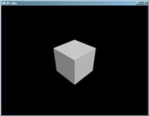

А в цвете и того краше:

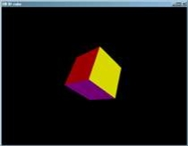

## <a name="_toc100093351"></a>**Визуализация функционально заданных поверхностей**

### <a name="_toc100093352"></a>**Аппроксимация поверхностей при помощи полигональных сеток**

Мы рассмотрели визуализацию объектов, состоящих из плоских граней. Воспользуемся накопленным оптом для следующего шага – визуализации криволинейных
поверхностей. И начнем с визуализации поверхностей, заданных функционально. А именно, функций вида z=f(x, y).

В OpenGL отсутствуют средства визуализации кривых линий и поверхностей, поэтому нам придется аппроксимировать их с помощью отрезков прямых линий и
треугольников.

Для начала, равномерно разобьем отображаемую область функции на область N*M ячеек и вычислим значение функции в узлах сетки и используем ее в качестве
координаты z.


Далее соединим данные вершины при помощи лент из треугольников (GL_TRIANGLE_STRIP):


В качестве альтернативы можно было бы соединить вершины в виде набора вееров из треугольников (GL_TRIANGLE_FAN), но это потребовало бы большего
количества групп примитивов.


Для сокращения количества групп примитивов, можно «сшивать» соседние ленты треугольников, добавляя пару дополнительных вершин в конце каждой ленты для
образования пары вырожденных треугольных граней для смены направления обхода рядов ленты:


Такой прием позволит нарисовать всю сетку с помощью одной ленты из треугольников, что положительно скажется на эффективности ее обработки OpenGL.

С использованием расширения [GL_NV_primitive_restart](http://www.opengl.org/registry/specs/NV/primitive_restart.txt) можно выполнять «перезапуск»
группы примитивов и без добавления вырожденных граней и необходимости менять направление обхода рядов ленты.

В нашем примере мы не будем жертвовать легкостью восприятия кода ради производительности и нарисуем сетку, используя несколько лент треугольников.

### <a name="_toc100093353"></a>**Разработка базового класса для визуализации функционально заданных поверхностей**

Каждая вершина сетки будет характеризоваться координатами и нормалью. Для хранения данных параметров создадим структуру Vertex:

```cpp
struct Vertex
{
    float x, y, z;
    float nx, ny, nz;
};
```

Создадим класс CSurface, предоставляющий базовые возможности визуализации функционально заданных поверхностей.

```cpp
class CSurface
{
public:
    CSurface(
        int columns, int rows, float xMin, float xMax, float yMin, float yMax);
    void Draw()const;
    virtual ~CSurface(void);
protected:
    // Метод вычисления параметров вершины в точке (x, y)
    virtual Vertex CalculateVertex(double x, double y)const;
private:
    // Дисплейный список для хранения команд рисования поверхности
    mutable GLuint m_displayList;

    // количество строк и столбцов в сетке
    int m_columns;
    int m_rows;

    // область определения функции
    float m_xMin;
    float m_xMax;
    float m_yMin;
    float m_yMax;
};
```

Конструктор данного класса не делает ничего особенного, лишь только сохраняя переданные ему параметры в переменных класса.

```cpp
CSurface::CSurface(
int columns, int rows, float xMin, float xMax, float yMin, float yMax)
:m_rows(rows)
,m_columns(columns)
,m_xMin(xMin)
,m_xMax(xMax)
,m_yMin(yMin)
,m_yMax(yMax)
,m_displayList(0)
{
}
```

Для расчета координаты z и нормали в узлах сетки служит виртуальный метод **CalculateVertex**, который может быть перегружен в дочерних классах для
создания произвольных функций. В базовом же классе мы зададим координату Z равной нулю, а вектор нормали направим вдоль оси z:

```cpp
Vertex CSurface::CalculateVertex(double x, double y)const
{
    Vertex result =
    {
        float(x), float(y), 0,
        0, 0, 1
    };
    return result;
}
```

Обратите внимание на то, что координаты x и y передаются в виде чисел с плавающей запятой двойной, а не одинарной точности. Это позволит дочерним
классам более точно выполнить расчет нормали к поверхности (для расчета нормалей к некоторым функциям точности типа float может быть недостаточно).

Метод рисования полигональной сетки, аппроксимирующей функционально заданную поверхность, воплощает ранее описанный подход к ее построению с помощью
лент из треугольников. Для повышения быстродействия, все же, воспользуемся дисплейными списками OpenGL для записи и последующего воспроизведения
команд рисования поверхности.

```cpp
void CSurface::Draw()const
{
    // При первом обращении к данной функции запишем команды
    // рисования поверхности в дисплейный список
    if (m_displayList == 0)
    {
        m_displayList = glGenLists(1);
        glNewList(m_displayList, GL_COMPILE);

        // вычисляем шаг узлов сетки
        const float dy = (m_yMax - m_yMin) / (m_rows - 1);
        const float dx = (m_xMax - m_xMin) / (m_columns - 1);

        float y = m_yMin;
        // пробегаем по строкам сетки
        for (int row = 0; row < m_rows - 1; ++row, y += dy)
        {
            // каждой строке будет соответствовать своя лента из треугольников
            glBegin(GL_TRIANGLE_STRIP);
            float x = m_xMin;

            // пробегаем по столбцам текущей строки
            for (int column = 0; column <= m_columns; ++column, x += dx)
            {
                // вычисляем параметры вершины в узлах пары соседних вершин
                // ленты из треугольников
                Vertex v0 = CalculateVertex(x, y + dy);
                Vertex v1 = CalculateVertex(x, y);

                // задаем нормаль и координаты вершины на четной позиции
                glNormal3f(v0.nx, v0.ny, v0.nz);
                glVertex3f(v0.x, v0.y, v0.z);

                // задаем нормаль и координаты вершины на нечетной позиции
                glNormal3f(v1.nx, v1.ny, v1.nz);
                glVertex3f(v1.x, v1.y, v1.z);
            }
            glEnd();
        }

        glEndList();
    }

    // Вызовем ранее записанный дисплейный список команд рисования сетки
    glCallList(m_displayList);
}
```

В деструкторе класса CSurface не забудем освободить используемые ресурсы OpenGL, удалив созданный в процессе рисования дисплейный список.

```cpp
// Не забыли удалить дисплейный список при разрушении экземпляра класса
CSurface::~CSurface(void)
{
    if (m_displayList != 0)
    {
        glDeleteLists(m_displayList, 1);
    }
}
```

Теперь можно воспользоваться классом CSurface напрямую, не забыв предварительно установить параметры камеры. Для наглядного отображения ленты из
треугольников можно c помощью функции [glPolygonMode](https://www.khronos.org/registry/OpenGL-Refpages/gl2.1/xhtml/glPolygonMode.xml) с параметром
GL_LINE установить режим визуализации граней в виде контуров.

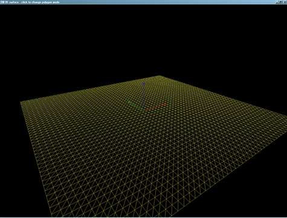

### <a name="_toc100093354"></a>**Наша первая криволинейная поверхность**

Теперь создадим класс CSincSurface, унаследовав его от класса CSurface. Данный класс будет визуализировать трехмерный вариант функции sinc:

$$\text{sinc}(r) = \frac{\sin(r)}{r}, \quad \text{где } r = \sqrt{x^2 + y^2}$$

```cpp
class CSincSurface :
    public CSurface
{
public:
    CSincSurface(
        int columns, int rows, float xMin, float xMax, float yMin, float yMax);
protected:
    // переопределяем метод вычисления вершины сетки
    Vertex CalculateVertex(double x, double y)const override;
private:
    // функция sinc=sin(x)/x
    static double Sinc(double x);
    // Представление поверхности виде функции F(x,y,z)=f(x, y) - z
    static double F(double x, double y, double z);
};
```

Конструктор класса CSincSurface просто перенаправляет свои аргументы конструктору родительского класса:

```cpp
CSincSurface::CSincSurface(
    int columns, int rows, float xMin, float xMax, float yMin, float yMax)
:CSurface(columns, rows, xMin, xMax, yMin, yMax)
{
}
```

Методы Sinc и F в более подробном описании не нуждаются:

```cpp
double CSincSurface::Sinc(double x)
{
    // Вычисляем первый замечательный предел
    return (fabs(x) < 1e-7) ? 1 : sin(x) / x;
}

double CSincSurface::F(double x, double y, double z)
{
    double r = sqrt(x * x + y * y);
    double f = Sinc(r);
    return f - z;
}
```

А вот про перегруженный метод CalculateVertex стоит рассказать поподробнее.

Сначала мы вычисляем координату z по формуле из задания. На этом можно было бы остановиться, но нам необходимо вычислить вектор нормали к поверхности
в точке (x, y, z). Для поверхностей, заданных в виде Fx,y,z=0 направление вектора нормали будет совпадать с вектором антиградиента данной функции в
точке (x, y, z).

Вектор антиградиента – вектор, обратный вектору частных производных функции F.

Вычислить вектор частных производных можно было бы аналитически, выполнив дифференцирование функции F по dx, dy и dz, однако вычисления получились бы
достаточно громоздкими. В нашем случае нас устроит приблизительное вычисление производной по ее определению:

«*Производная равна отношению приращения функции к приращению аргумента, при приращении аргумента стремящемуся к нулю*». В нашем случае «стремящееся к
нулю» число можно представить как просто «достаточно маленькое число», например, 10<sup>-6</sup>. Здесь нам пригодятся числа с плавающей запятой
двойной точности.

```cpp
Vertex CSincSurface::CalculateVertex(double x, double y)const
{
    // вычисляем значение координаты z
    double r = sqrt(x * x + y * y);
    double z = Sinc(r);

    // "бесконечно малое" приращение аргумента
    // для численного дифференцирования
    double delta = 1e-6;

    // Вычисляем значение функции в точке x, y, z
    // (строго говоря, оно должно быть равно нулю в точках,
    // принадлежащих поверхности)
    float f = F(x, y, z);

    // вычисляем приблизительно частные производные функции F по dx, dy и dz
    // их значения приблизительно равны координатам вектора
    // нормали к поверхности а точке (x, y, z)
    double dfdx = -(F(x + delta, y, z) - f) / delta;
    double dfdy = -(F(x, y + delta, z) - f) / delta;
    double dfdz = 1; // производная функции -F(x,y,z)=-(f(x,y)-z) по z

    // величина, обратная длине векора антиградиента
    double invLen = 1 / sqrt(dfdx * dfdx + dfdy * dfdy + dfdz * dfdz);

    // формируем результат
    Vertex result =
    {
        // координаты вершины
        float(x), float(y), float(z),

        // приводим вектор нормали к единичной длине
        float(dfdx * invLen), float(dfdy * invLen), float(dfdz * invLen)
    };
    return result;
}
```

Для визуализации данной поверхности необходимо создать экземпляр класса CSincSurface и вызывать у него метод Draw (предварительно настроив камеру).
Результат будет, примерно, таким:

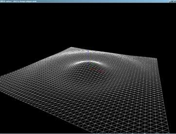

Осталось подключить освещенность и материалы для повышения реалистичности.

### <a name="_toc100093355"></a>**Создание класса для управления свойствами материала**

Для управления свойствами материала, создадим класс CMaterial:

```cpp
class CMaterial
{
public:
    CMaterial();

    // Коэффициент диффузного отражения
    void SetDiffuse(GLfloat r, GLfloat g, GLfloat b, GLfloat a = 1);

    // Коэффициент фонового отражения
    void SetAmbient(GLfloat r, GLfloat g, GLfloat b, GLfloat a = 1);

    // Коэффициент зеркального отражения
    void SetSpecular(GLfloat r, GLfloat g, GLfloat b, GLfloat a = 1);

    // Степень зеркального отражения (для модели Фонга)
    void SetShininess(GLfloat shininess);

    // Делаем материал активным для заданной грани объекта
    void Activate(GLenum side = GL_FRONT)const;
private:
    GLfloat m_shininess;
    GLfloat m_diffuse[4];
    GLfloat m_specular[4];
    GLfloat m_ambient[4];
};

CMaterial::CMaterial(void)
{
    SetDiffuse(1, 1, 1);
    SetAmbient(0.2f, 0.2f, 0.2f);
    SetSpecular(1, 1, 1);
    SetShininess(0);
}

void CMaterial::SetDiffuse(GLfloat r, GLfloat g, GLfloat b, GLfloat a)
{
    m_diffuse[0] = r;
    m_diffuse[1] = g;
    m_diffuse[2] = b;
    m_diffuse[3] = a;
}

void CMaterial::SetAmbient(GLfloat r, GLfloat g, GLfloat b, GLfloat a)
{
    m_ambient[0] = r;
    m_ambient[1] = g;
    m_ambient[2] = b;
    m_diffuse[3] = a;
}

void CMaterial::SetSpecular(GLfloat r, GLfloat g, GLfloat b, GLfloat a)
{
    m_specular[0] = r;
    m_specular[1] = g;
    m_specular[2] = b;
    m_specular[3] = a;
}

void CMaterial::SetShininess(GLfloat shininess)
{
    m_shininess = shininess;
}

void CMaterial::Activate(GLenum side)const
{
    glMaterialfv(side, GL_DIFFUSE, m_diffuse);
    glMaterialfv(side, GL_AMBIENT, m_ambient);
    glMaterialfv(side, GL_SPECULAR, m_specular);
    glMaterialf(side, GL_SHININESS, m_shininess);
}
```

### <a name="_toc100093356"></a>**Собираем компоненты программы воедино**

Поскольку класс CSurface оптимизирован для многократного вызова метода Draw, необходимо разместить экземпляр класса CSincSurface в переменной класса
CMyApplication, а не создавать его каждый раз в методе OnDisplay. По нажатию на левую кнопку мыши наше приложение будет переключаться между режимами
визуализации граней: GL_FILL, GL_LINE, GL_POINT. Для непрерывного вращения камеры вокруг оси Z поверхности добавим обработчик OnIdle, вызываемый
базовым классом из библиотеки GLUT всякий раз, когда наше приложение бездействует.

```cpp
class CMyApplication :
    public CGLApplication
{
public:
    CMyApplication(const char *title, int width, int height);
    ~CMyApplication(void);
protected:
    // Перегружаем необходимые виртуальные методы родительского класса
    virtual void OnInit();
    virtual void OnIdle();
    virtual void OnDisplay(void);
    virtual void OnReshape(int width, int height);
    virtual void OnMouse(int button, int state, int x, int y);


private:
    void SetupLightsAndMaterials();
    void SetupCamera();

    CSincSurface m_surface;
    CFrame m_frame;

    float m_rotationAngle;

    GLenum m_polygonMode;

    DWORD m_lastTick;

    static const float ROTATION_SPEED;
    static const double FOV;
    static const double ZNEAR;
    static const double ZFAR;
};
```

Конструктор класса CMyApplication просто инициализирует переменные класса начальными значениями.

```cpp
CMyApplication::CMyApplication(const char *title, int width, int height)
:CGLApplication(title, width, height)
,m_surface(50, 50, -10, 10, -10, 10)
,m_frame(3)
,m_rotationAngle(0)
,m_polygonMode(GL_FILL)
{
}
```

В обработчике OnInit настроим режим отбраковки граней, а также сохраним текущее значение счетчика миллисекунд с момента запуска Windows.

```cpp
void CMyApplication::OnInit()
{
    m_lastTick = GetTickCount();

    glEnable(GL_CULL_FACE);
    glCullFace(GL_BACK);
    glFrontFace(GL_CCW);
}
```

В обработчике OnDisplay произведем настройку камеры, источника света и материалов. Перед рисованием поверхности включим тест глубины для удаления
невидимых линий и поверхностей. После рисования поверхности отключим освещение и нарисуем координатный фрейм.

```cpp
void CMyApplication::OnDisplay(void)
{
    // Очищаем буфер цвета и буфер глубины
    glClear(GL_COLOR_BUFFER_BIT | GL_DEPTH_BUFFER_BIT);

    SetupCamera();
    SetupLightsAndMaterials();

    // Включаем тест глубины для удаления невидимых линий и поверхностей
    // перед рисованием 3D-поверхности
    glEnable(GL_DEPTH_TEST);
    glPolygonMode(GL_FRONT, m_polygonMode);
    m_surface.Draw();

    // Отключаем освещение и тест глубины перед рисованием координатного фрейма
    glDisable(GL_LIGHTING);
    glDisable(GL_DEPTH_TEST);
    m_frame.Draw();
}
```

Метод настройки камеры вычисляет время, прошедшее с предыдущего кадра и изменяет соответствующим образом угол поворота камеры вокруг оси Z.

```cpp
const float CMyApplication::ROTATION_SPEED = 20;
void CMyApplication::SetupCamera()
{
    DWORD currentTick = GetTickCount();

    float delta = (currentTick - m_lastTick) * 0.001;
    m_lastTick = currentTick;

    // вычисляем угол поворота камеры
    m_rotationAngle = fmodf(m_rotationAngle + ROTATION_SPEED * delta, 360);

    // Устанавливаем камеру
    glLoadIdentity();
    gluLookAt(
        12, 12, 8,
        0, 0, 0,
        0, 0, 1);

    // Вращаем камеру вокруг оси Z
    glRotatef(m_rotationAngle, 0, 0, 1);
}
```

В методе SetupLightsAndMaterials воспользуемся классами CLight и CMaterial для настройки параметров освещения и материалов, из которых состоит
поверхность.

```cpp
void CMyApplication::SetupLightsAndMaterials()
{
    // Включаем освещение и источник света №0
    glEnable(GL_LIGHTING);
    glEnable(GL_LIGHT0);

    // Задаем параметры направленного источника света
    CDirectLight light(CVector3f(2, 2, 2));
    light.SetSpecularIntensity(1, 1, 1);
    light.SetDiffuseIntensity(1, 1, 1);
    light.SetLight(GL_LIGHT0);

    // Задаем параметры материала
    CMaterial material;
    material.SetDiffuse(0.8f, 0.8f, 0.f);
    material.SetSpecular(0.3f, 0.3f, 0.3f);
    material.SetShininess(50);
    material.Activate();
}
```

Для непрерывного вращения камеры в обработчике OnIdle форсируем перерисовку буфера кадра:

```cpp
void CMyApplication::OnIdle()
{
    // Если приложению нечем заняться - то обонвляем экран
    PostRedisplay();
}
```

Обработчик OnMouse в данном приложении будет отслеживать щелчки левой кнопкой мыши и переключаться между режимами рисования граней.

```cpp
void CMyApplication::OnMouse(int button, int state, int /*x*/, int /*y*/)
{
    // Переключаем режимы визуализации полигонов
    // по нажатию левой кнопки мыши
    if (button == GLUT_LEFT_BUTTON && state == GLUT_UP)
    {
        m_polygonMode =
            (m_polygonMode == GL_FILL) ? GL_LINE :
            (m_polygonMode == GL_LINE) ? GL_POINT : GL_FILL;
    }
}
```

Собрав все воедино, мы получим анимированную визуализацию трехмерной поверхности:

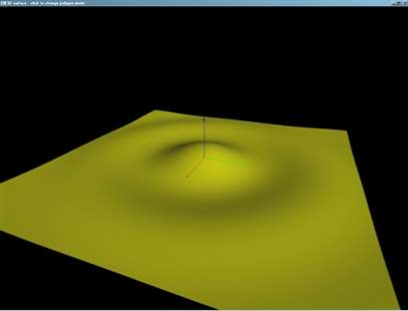

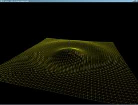 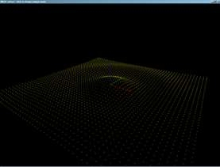

## <a name="_toc100093357"></a>**Практические задания**

Для получения оценки «**удовлетворительно**» необходимо набрать при этом **не менее 100 баллов**.

Для получения оценки «**хорошо**» необходимо часть обязательных и, возможно, дополнительное задание, набрав при этом **не менее 220 баллов**.

Для получения оценки «**отлично**» необходимо набрать **не менее 400 баллов**.

### <a name="_toc100093358"></a>**Обязательные задания**

#### ***Задание 1***

Разработайте OpenGL-приложение,
визуализирующее [правильный многогранник](http://ru.wikipedia.org/wiki/%D0%9F%D1%80%D0%B0%D0%B2%D0%B8%D0%BB%D1%8C%D0%BD%D1%8B%D0%B9_%D0%BC%D0%BD%D0%BE%D0%B3%D0%BE%D0%B3%D1%80%D0%B0%D0%BD%D0%BD%D0%B8%D0%BA), [полуправильный многогранник](http://ru.wikipedia.org/wiki/%D0%9F%D0%BE%D0%BB%D1%83%D0%BF%D1%80%D0%B0%D0%B2%D0%B8%D0%BB%D1%8C%D0%BD%D1%8B%D0%B9_%D0%BC%D0%BD%D0%BE%D0%B3%D0%BE%D0%B3%D1%80%D0%B0%D0%BD%D0%BD%D0%B8%D0%BA),
либо [звездчатый многогранник](http://ru.wikipedia.org/wiki/%D0%97%D0%B2%D1%91%D0%B7%D0%B4%D1%87%D0%B0%D1%82%D1%8B%D0%B9_%D0%BC%D0%BD%D0%BE%D0%B3%D0%BE%D0%B3%D1%80%D0%B0%D0%BD%D0%BD%D0%B8%D0%BA),
соответствующий одному из заданных вариантов. **Смежные грани многогранника должны быть окрашены в разные цвета**. **Ребра многогранника должны иметь
черный цвет.**

##### Бонус +15 баллов за освещение

Бонус начисляется, если грани объекта будут освещены с использованием стандартных механизмов OpenGL. Для этого необходимо рассчитать вектор нормали к
каждой грани многогранника, настроить источник света и параметры материала поверхности многогранника.

##### Бонус +10 баллов за возможность вращения камеры вокруг объекта

Бонус присуждается за возможность вращения камеры вокруг объекта при помощи мыши.

##### Бонус +20 баллов за визуализацию полупрозрачных граней объекта

Бонус начисляется за визуализацию полупрозрачных граней объекта. Для вывода полупрозрачных примитивов следует воспользоваться механизмом смешивания
цветов в OpenGL. Режим спешивания цветов включается при помощи функции **glEnable** с параметром **GL_BLEND**, а также указания нужной функции
смешивания при помощи [glBlendFunc](https://www.khronos.org/registry/OpenGL-Refpages/gl2.1/xhtml/glBlendFunc.xml). Для вывода полупрозрачных объектов
необходимо вызвать glBlendFunc с параметрами GL_SRC_ALPHA и GL_ONE_MINUS_SRC_ALPHA. Степень задается с помощью четвертой компоненты цвета функции
glColor4*. Внимание, сцена, содержащая полупрозрачные объекты, для корректной визуализации должна быть нарисована следующим образом:

- Включаем тест глубины с помощью glEnable(GL_DEPTH_TEST) и запись в буфер глубины с
  помощью [glDepthMask](https://www.khronos.org/registry/OpenGL-Refpages/gl2.1/xhtml/glDepthMask.xml)(GL_TRUE)
- Рисуем все непрозрачные объекты сцены (в данном случае – ребра многогранника)
- Выключаем запись в буфер глубины при помощи glDepthMask(GL_FALSE)
- Рисуем все полупрозрачные объекты сцены, сортируя их примитивы в порядке **от дальних[^13] к ближним**. Выводиться должны как лицевые, так и
  нелицевые стороны граней объекта.

Полупрозрачный выпуклый многогранник может быть визуализирован и без необходимости сортировки[^14] его граней. При любом положении камеры нелицевые
грани выпуклого многогранника будут находиться дальше лицевых граней. Поэтому достаточно нарисовать полупрозрачный выпуклый объект за два прохода:
сначала объект рисуется в режиме отбраковки лицевых граней, а потом в режиме отбраковки нелицевых граней

    glEnable(GL_CULL_FACE);

    glCullFace(GL_FRONT); // отбраковываем лицевые (ближние) грани

    // рисуем выпуклый многогранник

    // ...

    glCullFace(GL_BACK); // отбраковываем нелицевые (дальние) грани

    // рисуем этот же выпуклый многогранник

    // ...

##### Вариант 1 - [Октаэдр](http://ru.wikipedia.org/wiki/%D0%9E%D0%BA%D1%82%D0%B0%D1%8D%D0%B4%D1%80) – 50 баллов

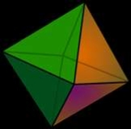

##### Вариант 2 – [Додекаэдр](http://ru.wikipedia.org/wiki/%D0%94%D0%BE%D0%B4%D0%B5%D0%BA%D0%B0%D1%8D%D0%B4%D1%80) – 80 баллов

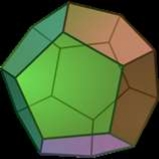

##### Вариант 3 – [Икосаэдр](http://ru.wikipedia.org/wiki/%D0%98%D0%BA%D0%BE%D1%81%D0%B0%D1%8D%D0%B4%D1%80) – 80 баллов

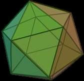

##### Вариант 4 – Тетраэдр – 30 баллов

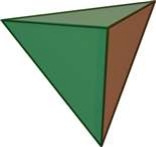

##### Вариант 5 - [Кубооктаэдр](http://ru.wikipedia.org/wiki/%D0%9A%D1%83%D0%B1%D0%BE%D0%BE%D0%BA%D1%82%D0%B0%D1%8D%D0%B4%D1%80) – 100 баллов

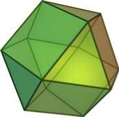

##### Вариант 6 - [Икосододекаэдр](http://ru.wikipedia.org/wiki/%D0%98%D0%BA%D0%BE%D1%81%D0%BE%D0%B4%D0%BE%D0%B4%D0%B5%D0%BA%D0%B0%D1%8D%D0%B4%D1%80) – 100 баллов

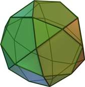

##### Вариант 7 – [Усеченный икосаэдр](http://ru.wikipedia.org/wiki/%D0%A3%D1%81%D0%B5%D1%87%D1%91%D0%BD%D0%BD%D1%8B%D0%B9_%D0%B8%D0%BA%D0%BE%D1%81%D0%B0%D1%8D%D0%B4%D1%80) – 100 баллов

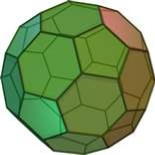

##### Вариант 8 – [Триакистетраэдр](http://en.wikipedia.org/wiki/Triakis_tetrahedron) – 70 баллов

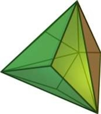

##### Вариант 9 – [Триакисоктаэдр](http://en.wikipedia.org/wiki/Triakis_octahedron) – 100 баллов

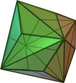

##### Вариант 10 - [Триакисгексаэдр](http://en.wikipedia.org/wiki/Tetrakis_hexahedron) – 70 баллов

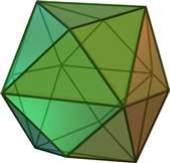

##### Вариант 11 – [Триакисикосаэдр](http://en.wikipedia.org/wiki/Triakis_icosahedron) – 100 баллов

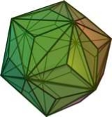

##### Вариант 12 - [Пентакисдодекаэдр](http://en.wikipedia.org/wiki/Pentakis_dodecahedron) – 100 баллов

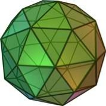

##### Вариант 13 – [Гекзакисоктаэдр](http://en.wikipedia.org/wiki/Disdyakis_dodecahedron) – 100 баллов

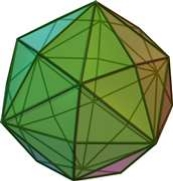

##### Вариант 14 - [Гекзакисикосаэдр](http://en.wikipedia.org/wiki/Disdyakis_triacontahedron) – 100 баллов


##### Вариант 15 – Усеченный тетраэдр – 70 баллов

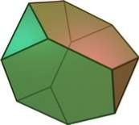

##### Вариант 16 – Усеченный куб – 70 баллов

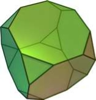

##### Вариант 17 – Усеченный октаэдр – 80 баллов

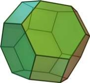

##### Вариант 18 – Усеченный додекаэдр – 90 баллов

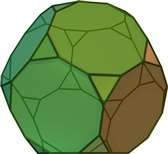

##### Вариант 19 – Ромбокубооктаэдр – 100 баллов

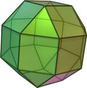

##### Вариант 20 – Ромбоусеченный кубоктаэдр – 120 баллов

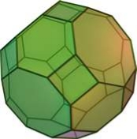

##### Вариант 21 – Ромбоикосододекаэдр – 120 баллов


##### Вариант 22 – Ромбоусеченный икосододекаэдр – 120 баллов

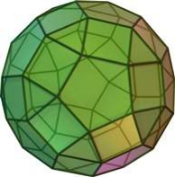

##### Вариант 23 – Курносый куб – 120 баллов

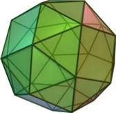 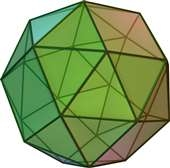

##### Вариант 24 – Курносый додекаэдр – 150 баллов

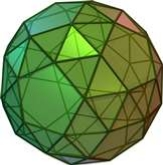 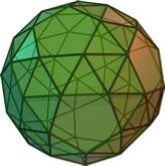

##### Вариант 25 – Ромбододекаэдр – 70 баллов

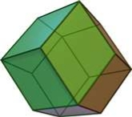

##### Вариант 26 – Ромботриаконтаэдр – 100 баллов

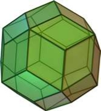

##### Вариант 27 – Дельтоидальный икоститетраэдр – 120 баллов

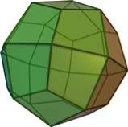

##### Вариант 28 – Дельтоидальный гексеконтаэдр – 150 баллов

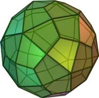

##### Вариант 29 – Пентагональный икоситетраэдр – 150 баллов

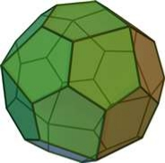 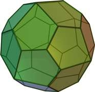

##### Вариант 30– Пентагональный гексеконтаэдр – 150 баллов

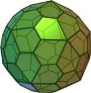 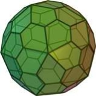

##### Вариант 31 – [Звездчатый октаэдр](http://ru.wikipedia.org/wiki/%D0%97%D0%B2%D1%91%D0%B7%D0%B4%D1%87%D0%B0%D1%82%D1%8B%D0%B9_%D0%BC%D0%BD%D0%BE%D0%B3%D0%BE%D0%B3%D1%80%D0%B0%D0%BD%D0%BD%D0%B8%D0%BA) (Стелла октангула) – 70 баллов

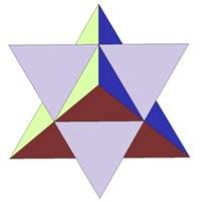

##### Вариант 32 – [Звездчатый додекаэдр](http://ru.wikipedia.org/wiki/%D0%97%D0%B2%D1%91%D0%B7%D0%B4%D1%87%D0%B0%D1%82%D1%8B%D0%B9_%D0%BC%D0%BD%D0%BE%D0%B3%D0%BE%D0%B3%D1%80%D0%B0%D0%BD%D0%BD%D0%B8%D0%BA) – 100 баллов

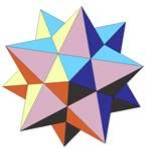

##### Вариант 33 – [Звездчатый икосаэдр](http://ru.wikipedia.org/wiki/%D0%97%D0%B2%D1%91%D0%B7%D0%B4%D1%87%D0%B0%D1%82%D1%8B%D0%B9_%D0%BC%D0%BD%D0%BE%D0%B3%D0%BE%D0%B3%D1%80%D0%B0%D0%BD%D0%BD%D0%B8%D0%BA) – 120 баллов

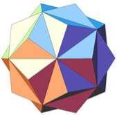

##### Вариант 34 – [Вторая звездчатая форма додекаэдра](http://ru.wikipedia.org/wiki/%D0%97%D0%B2%D1%91%D0%B7%D0%B4%D1%87%D0%B0%D1%82%D1%8B%D0%B9_%D0%BC%D0%BD%D0%BE%D0%B3%D0%BE%D0%B3%D1%80%D0%B0%D0%BD%D0%BD%D0%B8%D0%BA) – 150 баллов

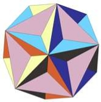

##### Вариант 35 – [Третья звездчатая форма додекаэдра](http://ru.wikipedia.org/wiki/%D0%97%D0%B2%D1%91%D0%B7%D0%B4%D1%87%D0%B0%D1%82%D1%8B%D0%B9_%D0%BC%D0%BD%D0%BE%D0%B3%D0%BE%D0%B3%D1%80%D0%B0%D0%BD%D0%BD%D0%B8%D0%BA) – 150 баллов


#### ***Задание 2***

Разработайте OpenGL-приложение, визуализирующее трехмерную, функционально заданную поверхность, соответствующую одному из заданных вариантов.

Поверхность может быть визуализирована в каркасном виде, так и с помощью сплошной закраски аппроксимирующих поверхность граней.

##### Бонус в 150% за визуализацию в виде сплошной освещенной поверхности

В случае использования сплошной закраски поверхность должна визуализироваться **при включенном механизме освещения** OpenGL, для корректной работы
которого необходимо выполнить расчет **нормалей к поверхности** в вершинах полигональной сетки, аппроксимирующей поверхность. Расчет нормали можно
произвести как аналитическим способом, так и с использованием численных методов. **За корректную и качественную визуализацию поверхности с освещением
баллы, указанные в варианте, будут умножены на коэффициент 1.5**. Подберите параметры освещения и материалов таким образом, чтобы поверхность
выглядела максимально наглядным образом.

Если поверхность не является монолитным объектом, то для ее визуализации не должен включаться режим отбраковки граней (иначе будет отображена только
одна сторона поверхности)

##### Бонус в 120% за визуализацию в виде сплошной поверхности с расчетом цвета, зависящего от координат

Допускается альтернативный способ визуализации сплошной поверхности – с использованием цвета, зависящего от координат. Например, для некоторой
поверхности z=f(x,y), цвет может зависеть от координаты z (чем больше z, тем ярче цвет). Параметры отображения координат в цвета следует задать таким
образом, чтобы подчеркнуть форму и кривизну поверхности. **За качественную визуализацию сплошной поверхности, баллы, указанные в варианте задания
будут умножены на коэффициент 1.2.**


##### Вариант 1 –[ Эллиптический параболоид](http://ru.wikipedia.org/wiki/%D0%AD%D0%BB%D0%BB%D0%B8%D0%BF%D1%82%D0%B8%D1%87%D0%B5%D1%81%D0%BA%D0%B8%D0%B9_%D0%BF%D0%B0%D1%80%D0%B0%D0%B1%D0%BE%D0%BB%D0%BE%D0%B8%D0%B4) – 50 баллов

$$2z = \frac{x^2}{a^2} + \frac{y^2}{b^2}$$


##### Вариант 2 – [Гиперболический параболоид](http://ru.wikipedia.org/wiki/%D0%9F%D0%B0%D1%80%D0%B0%D0%B1%D0%BE%D0%BB%D0%BE%D0%B8%D0%B4) – 50 баллов

$$2z = \frac{x^2}{a^2} - \frac{y^2}{b^2}$$


##### Вариант 3 – [Обезьянье седло](http://ru.wikipedia.org/wiki/%D0%9E%D0%B1%D0%B5%D0%B7%D1%8C%D1%8F%D0%BD%D1%8C%D0%B5_%D1%81%D0%B5%D0%B4%D0%BB%D0%BE) – 50 баллов

$$z = x^3 - 3xy^2$$


##### Вариант 4 – [Лента Мёбиуса](http://ru.wikipedia.org/wiki/%D0%9B%D0%B8%D1%81%D1%82_%D0%9C%D1%91%D0%B1%D0%B8%D1%83%D1%81%D0%B0) – 120 баллов

$$x(u, v) = \left(1 + \frac{v}{2}\cos\frac{u}{2}\right)\cos(u)$$

$$x(u, v) = \left(1 + \frac{v}{2}\cos\frac{u}{2}\right)\sin(u)$$

$$z(u, v) = \frac{v}{2}\sin\frac{u}{2}$$


##### Вариант 5 – [Бутылка Клейна](http://ru.wikipedia.org/wiki/%D0%91%D1%83%D1%82%D1%8B%D0%BB%D0%BA%D0%B0_%D0%9A%D0%BB%D0%B5%D0%B9%D0%BD%D0%B0) – 120 балов

$$
\begin{align*}
При \quad 0 \leq u \leq \pi \\
\end{align*}
$$

$$ x = 6 \cos(u)(1 + \sin(u)) + 4r\left(1 - \frac{\cos(u)}{2}\right)\cos(u)\cos(v) $$

$$ y = 16 \sin(u)+4r(1 -\frac{\cos(u)}{2})*sin(u)cos(v)$$

$$ z = 4r(1 -\frac{\cos(u)}{2})*sin(v)$$

$$
\begin{align*}
При \quad \pi \leq u \leq 2\pi \\
\end{align*}
$$

$$ x = 6 \cos(u)(1 + \sin(u)) - 4r\left(1 - \frac{\cos(u)}{2}\right)\cos(u) $$

$$ y = 16 \sin(u)$$

$$ z = 4r(1 -\frac{\cos(u)}{2})*sin(v)$$


##### Вариант 6 - [Геликоид](http://ru.wikipedia.org/wiki/%D0%93%D0%B5%D0%BB%D0%B8%D0%BA%D0%BE%D0%B8%D0%B4) – 80 баллов


##### Вариант 7 – [Катеноид](http://ru.wikipedia.org/wiki/%D0%9A%D0%B0%D1%82%D0%B5%D0%BD%D0%BE%D0%B8%D0%B4) – 80 баллов


##### Вариант 8 – [Тор](http://ru.wikipedia.org/wiki/Тор_\(поверхность\)) – 80 баллов


##### Бонус +10 баллов за возможность вращения камеры вокруг объекта

Данный бонус присуждается за возможность вращения камеры вокруг объекта при помощи мыши.

#### ***Задание 3***

Разработайте приложение, визуализирующее одну из следующих трехмерных сцен:

##### Вариант 1 – Детские качели – 80 баллов


###### *Бонус в 10 баллов за реализацию возможности вращения камеры вокруг качелей*

###### *Бонус в 10 баллов за реализацию анимации раскачивания качелей*

##### Вариант 2 – Прогулка по трехмерному лабиринту – 220 баллов


Программа визуализирует трехмерный лабиринт (размером не менее 16*16 блоков) с точки зрения находящегося в нем человека. Стены, пол и потолок
лабиринта окрашены в разные цвета. С помощью клавиатуры пользователь должен иметь возможность перемещать наблюдателя внутри лабиринта и вращать его
вокруг вертикальной оси. Не должно иметься возможности прохождения сквозь стены.

###### *Бонус в 20 баллов начисляется за наличие освещения*

Источник света должен быть привязан к точке наблюдателя.

##### Вариант 3 – Трехмерная круговая диаграмма – 80 баллов


Программа визуализирует трехмерную диаграмму, состоящую не менее чем из 5-6 разноцветных секторов. Некоторые секторы слегка извлечены.

###### *Бонус +30 баллов начисляется за наличие освещения*

(следует корректно рассчитать нормали для боковых сторон секторов).

##### Вариант 4 – Стенка – 90 баллов


Программа визуализирует стенку, состоящую из комода, книжного или посудного шкафа, а также полочек (телевизор и посуду визуализировать не надо).

###### *Бонус в +10 баллов начисляется за корректное освещение сцены*

###### *Бонус в +10 баллов начисляется за возможность вращения камеры вокруг стенки.*

##### Вариант 5 – Настольная лампа – 120 баллов


Программа визуализирует трехмерную настольную лампу.

###### *Бонус +10 начисляется за возможность вращения камеры вокруг лампы с помощью мыши*

##### Вариант 6 – Блюдце с чашкой – 120 баллов


###### *Бонус в 10 баллов начисляется за возможность вращения камеры вокруг чашки с блюдцем*

###### *Бонус в 25 баллов начисляется за наличие освещения*

##### Вариант 7 – модель города будущего – 120 баллов


Программа визуализирует модель города будущего (10-15 домов различной формы).

###### *Бонус в 10 баллов начисляется за возможность вращения камеры вокруг сцены*

###### *Бонус в 20 баллов начисляется за наличие освещения.*

##### Вариант 8 – здание с колоннами – 140 баллов


Программа визуализирует модель здания с колоннами (например, театр).

###### *Бонус в 10 баллов начисляется за возможность вращения камеры вокруг сцены*

###### *Бонус в 30 баллов начисляется за наличие освещения.*

[^1]: Правосторонней она называется потому, что ее можно образовать при помощи большого, указательного и среднего пальцев правой руки, задающих
направления координатных осей X, Y и Z соответственно

[^2]: **Портом просмотра** называется прямоугольная область окна (и буфера кадра), ограничивающая вывод примитивов. При помощи
функции [glViewport](https://www.khronos.org/registry/OpenGL-Refpages/gl4/html/glViewport.xhtml) программист может задать положение и размеры данной
области.

[^3]: **Видовая система координат** (система координат наблюдателя) – система координат с началом в точке, совпадающей с глазом виртуального
наблюдателя. В OpenGL координатная ось X в данной системе координат (ее еще называют u), направлена вправо, ось Y (ее еще называют v) – вверх, а ось
Z (другое имя данной оси – n) – в направлении, противоположном направлению взгляда

[^4]: В однородных координатах трехмерному вектору соответствует вектор (x, y, z, 0), а точке – вектор (x, y, z, 1)

[^5]: Проще говоря, координатные оси, задаваемые матрицей моделирования-вида, перестанут быть ортогональными (взаимно перпендикулярными) и их длина
будет отличаться от единицы.

[^6]: Вообще, нужно очень постараться, чтобы матрица сильно исказилась. Понадобится несколько десятков минут (порядка 60-80 тысяч операций вращения)
непрерывного вращения матрицы для того, чтобы почувствовать результат.

[^7]: Вырожденная матрица – матрица с определителем, равным нулю. Вырожденная матрица отображает различные точки в одну. Вообще, определитель матрицы
можно рассматривать как коэффициент изменения площади и объема фигур после преобразования. Например, матрица с определителем, равным 2, увеличивает
объем и площадь исходного объекта в 2 раза. Матрица с нулевым определителем – превращает любой объемный объект в точку.

[^8]: Визуализация произвольного одиночного выпуклого трехмерного объекта при включенном режиме отбраковки нелицевых граней автоматически решает
задачу удаления невидимых линий и поверхностей.

[^9]: Даже если режим отбраковки граней не используется, при включенном тесте глубины OpenGL позволит корректно решить проблему удаления невидимых
линий и поверхностей, независимо от того, в каком порядке перечислялись вершины граней. Тем не менее, для корректной работы освещения при
использовании различных свойств материалов для лицевой и нелицевой стороны грани, порядок перечисления вершин будет иметь значение. Поэтому следует
взять за правило, всегда использовать один и тот же порядок перечисления вершин для всех граней трехмерного объекта.

[^10]: Фоновый (ambient) свет в OpenGL служит для создания фонового света окружающей среды. Фоновый свет, взаимодействуя с материалом объекта,
отражается во всех направлениях с одинаковой интенсивностью, причем величина интенсивности зависит только от коэффициента фонового отражения материала
и не зависит ни от положения наблюдателя, ни от ориентации объекта относительно источника света

[^11]: Диффузная (diffuse) составляющая света в OpenGL используется для расчета диффузной составляющей отраженного света. Величина диффузного
отражения зависит косинуса угла между вектором нормали в вершине примитива, а также от интенсивности диффузной составляющей источника света и
коэффициента диффузного отражения материала

[^12]: Зеркальная (specular) составляющая света в OpenGL используется для расчета зеркальной составляющей отраженного света по модели Фонга. Величина
зеркального отражения имеет наибольшую величину в направлении абсолютного зеркального отражения

[^13]: Из двух непересекающихся плоских примитивов более дальним является тот, который частично, либо полностью заслоняется другим от наблюдателя.

[^14]: Существует многопроходная технология визуализации полупрозрачных невыпуклых объектов без необходимости сортировки граней объектов (т.н.
Order-independent transparency), однако ее использование требует поддержки со стороны реализации OpenGL специальных возможностей. Здесь использование
таких технологий не требуется.
