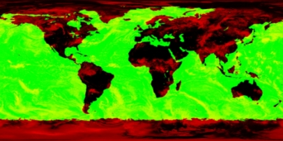

- [Лабораторная работа №7. Основы использования шейдеров](#лабораторная-работа-7-основы-использования-шейдеров)
  - [**Основы использования языка программирования шейдеров GLSL в OpenGL-приложениях**](#основы-использования-языка-программирования-шейдеров-glsl-в-opengl-приложениях)
    - [\*\*Заменяем стандартный механизм обработки вершин OpenGL собственным с использованием простейшего фрагментного шейдера](#заменяем-стандартный-механизм-обработки-вершин-opengl-собственным-с-использованием-простейшего-фрагментного-шейдера)
      - [***Рисуем тор с использованием возможностей стандартного конвейера OpenGL***](#рисуем-тор-с-использованием-возможностей-стандартного-конвейера-opengl)
      - [***Подключаем вершинный шейдер вместо стандартного механизма обработки вершин***](#подключаем-вершинный-шейдер-вместо-стандартного-механизма-обработки-вершин)
        - [Шаг 0 – Подключаем библиотеку GLEW и проверяем наличие необходимых расширений](#шаг-0--подключаем-библиотеку-glew-и-проверяем-наличие-необходимых-расширений)
        - [Шаг 1 – создаем вершинный шейдер и шейдерную программу, а затем присоединяем к ней шейдер](#шаг-1--создаем-вершинный-шейдер-и-шейдерную-программу-а-затем-присоединяем-к-ней-шейдер)
        - [Шаг 2 – загрузка исходного кода шейдера и его компиляция](#шаг-2--загрузка-исходного-кода-шейдера-и-его-компиляция)
        - [Шаг 3. Компоновка программы](#шаг-3-компоновка-программы)
        - [Шаг 4. Подключение скомпонованной шейдерной программы](#шаг-4-подключение-скомпонованной-шейдерной-программы)
        - [Результат](#результат)
    - [**Подключаем фрагментный шейдер для специализированной обработки фрагментов**](#подключаем-фрагментный-шейдер-для-специализированной-обработки-фрагментов)
      - [***Принцип работы шейдера шахматной доски***](#принцип-работы-шейдера-шахматной-доски)
      - [***Подготавливаем каркас приложения***](#подготавливаем-каркас-приложения)
      - [***Разрабатываем классы для управления шейдерами и программными объектами***](#разрабатываем-классы-для-управления-шейдерами-и-программными-объектами)
        - [Класс для работы с шейдерными объектами.](#класс-для-работы-с-шейдерными-объектами)
        - [Класс для работы с программными объектами](#класс-для-работы-с-программными-объектами)
        - [Класс «Загрузчик шейдеров»](#класс-загрузчик-шейдеров)
        - [Класс «Компилятор шейдеров»](#класс-компилятор-шейдеров)
        - [Класс «Компоновщик шейдерных программ»](#класс-компоновщик-шейдерных-программ)
      - [***Разрабатываем файлы исходных кодов вершинного и фрагментного шейдеров***](#разрабатываем-файлы-исходных-кодов-вершинного-и-фрагментного-шейдеров)
      - [***Загружаем и компонуем шейдеры в шейдерную программу***](#загружаем-и-компонуем-шейдеры-в-шейдерную-программу)
      - [***Подключаем шейдерную программу для нанесения изображения шахматной доски на примитив***](#подключаем-шейдерную-программу-для-нанесения-изображения-шахматной-доски-на-примитив)
      - [***Рисуем треугольник средствами фрагментного шейдера***](#рисуем-треугольник-средствами-фрагментного-шейдера)
    - [**Передача параметров шейдерной программе через uniform-переменные**](#передача-параметров-шейдерной-программе-через-uniform-переменные)
      - [***Получаем информацию об активных uniform-переменных программы***](#получаем-информацию-об-активных-uniform-переменных-программы)
      - [***Подключаем шейдерную программу***](#подключаем-шейдерную-программу)
    - [**Выборка данных из текстуры во фрагментном шейдере**](#выборка-данных-из-текстуры-во-фрагментном-шейдере)
      - [***Разрабатываем каркас приложения***](#разрабатываем-каркас-приложения)
      - [***Разрабатываем вершинный и фрагментный шейдеры***](#разрабатываем-вершинный-и-фрагментный-шейдеры)
      - [***Подключаем шейдеры к приложению***](#подключаем-шейдеры-к-приложению)
      - [***Выборка данных из нескольких текстур***](#выборка-данных-из-нескольких-текстур)
        - [Дорабатываем фрагментный шейдер](#дорабатываем-фрагментный-шейдер)
    - [**Передача параметров шейдеру через дополнительные атрибуты вершин**](#передача-параметров-шейдеру-через-дополнительные-атрибуты-вершин)
      - [***Технология создания морфинга***](#технология-создания-морфинга)
      - [***Разрабатываем класс CMorphShape***](#разрабатываем-класс-cmorphshape)
      - [***Объединяем компоненты приложения***](#объединяем-компоненты-приложения)
    - [**Генерирование примитивов с использованием геометрических шейдеров\[^13\]**](#генерирование-примитивов-с-использованием-геометрических-шейдеров13)
      - [***Обзор решения***](#обзор-решения)
        - [Вершинный шейдер](#вершинный-шейдер)
        - [Геометрический шейдер](#геометрический-шейдер)
        - [Фрагментный шейдер](#фрагментный-шейдер)
      - [***Загрузка и инициализация шейдеров***](#загрузка-и-инициализация-шейдеров)
        - [Объявление класса CMyApplication](#объявление-класса-cmyapplication)
        - [Добавляем метод, задающую значением параметров, связанных с программным объектом](#добавляем-метод-задающую-значением-параметров-связанных-с-программным-объектом)
        - [Код инициализации шейдеров](#код-инициализации-шейдеров)
      - [***Загрузка текстур***](#загрузка-текстур)
      - [***Визуализация точек***](#визуализация-точек)
      - [***Результат***](#результат-1)
  - [**Практические задания**](#практические-задания)
    - [**Обязательные задания**](#обязательные-задания)
      - [***Задание 1***](#задание-1)
        - [Вариант №1 – sinc-функция – 20 баллов](#вариант-1--sinc-функция--20-баллов)
        - [Вариант №2 – окружность – 20 баллов](#вариант-2--окружность--20-баллов)
        - [Вариант №3 – канабола – 30 баллов](#вариант-3--канабола--30-баллов)
        - [Вариант №4 – кардиоида – 20 баллов](#вариант-4--кардиоида--20-баллов)
      - [***Задание 2***](#задание-2)
        - [Вариант №1 – Флаг Российской Федерации – 20 баллов](#вариант-1--флаг-российской-федерации--20-баллов)
        - [Вариант №2 – Флаг Японии – 20 баллов](#вариант-2--флаг-японии--20-баллов)
        - [Вариант №3 – «Скорая Помощь» - 20 баллов](#вариант-3--скорая-помощь---20-баллов)
        - [Вариант №4 – Кольцо – 25 баллов](#вариант-4--кольцо--25-баллов)
        - [Вариант №5 – Пятиконечная звезда – 30 баллов](#вариант-5--пятиконечная-звезда--30-баллов)
        - [Вариант №6 – Флаг КНР – 40 баллов](#вариант-6--флаг-кнр--40-баллов)
        - [Вариант №7 – Смайлик – 30 баллов](#вариант-7--смайлик--30-баллов)
        - [Вариант №8 – Флаг СССР – 60 баллов](#вариант-8--флаг-ссср--60-баллов)
        - [Вариант №9 – Кирпичная стена – 25 баллов](#вариант-9--кирпичная-стена--25-баллов)
    - [**Дополнительные задания**](#дополнительные-задания)
      - [***Задание 3***](#задание-3)
        - [Бонус в 50 баллов за визуализацию поверхностей с учетом освещения](#бонус-в-50-баллов-за-визуализацию-поверхностей-с-учетом-освещения)
        - [Вариант №1 – Трансформация эллиптического параболоида в Гиперболический параболоид – 100 баллов](#вариант-1--трансформация-эллиптического-параболоида-в-гиперболический-параболоид--100-баллов)
        - [Вариант №2 – Трансформация Ленты Мёбиуса в Бутылку Клейна – 150 баллов](#вариант-2--трансформация-ленты-мёбиуса-в-бутылку-клейна--150-баллов)
        - [Вариант №3 – Трансформация сферы в тор – 120 баллов](#вариант-3--трансформация-сферы-в-тор--120-баллов)
      - [***Задание 4***](#задание-4)
        - [Вариант №1 – Полет в трехмерном туннеле – 100 баллов](#вариант-1--полет-в-трехмерном-туннеле--100-баллов)
          - [*Бонус за имитацию освещения – 30 баллов*](#бонус-за-имитацию-освещения--30-баллов)
          - [*Бонус за искривление стенок туннеля в зависимости от времени – 30 баллов*](#бонус-за-искривление-стенок-туннеля-в-зависимости-от-времени--30-баллов)
          - [*Бонус за возможность свободного вращения виртуальной камеры внутри туннеля – 50 баллов*](#бонус-за-возможность-свободного-вращения-виртуальной-камеры-внутри-туннеля--50-баллов)
        - [Вариант №2 – Волны – 250 баллов](#вариант-2--волны--250-баллов)
          - [*Бонус за возможность запуска волны по щелчку мыши – 50 баллов*](#бонус-за-возможность-запуска-волны-по-щелчку-мыши--50-баллов)
        - [Вариант №3 – Фрактал Мандельброта – 120 баллов](#вариант-3--фрактал-мандельброта--120-баллов)
      - [***Задание 5***](#задание-5)
        - [Вариант 1 – Стрелка - 60 баллов](#вариант-1--стрелка---60-баллов)
        - [Вариант 2 – Окружность - 40 баллов](#вариант-2--окружность---40-баллов)
  - [**Список литературы**](#список-литературы)


# Лабораторная работа №7. Основы использования шейдеров

[Шейдером](http://ru.wikipedia.org/wiki/Шейдер) (англ. Shader) называется программа для одной из ступеней графического конвейера, используемая для
определения окончательных параметров объекта или изображения.

Шейдерные языки содержат специальные типы данных (матрицы, векторы, сэмплеры), а также встроенные переменные и константы для удобной интеграции со
стандартной функциональностью 3D API.

Шейдерные языки, используемые для задач профессионального рендеринга (кино, телевидение), такие как RenderMan и Gelato нацелены на достижение
максимального качества визуализации изображения. Они обычно требуют больших вычислительных мощностей и не предназначены для рендеринга в реальном
времени.

Потребность в шейдерах для рендеринга в реальном времени возникла с появлением графических ускорителей, когда разработчики оказались ограниченными тем
набором эффектов, который заложен в графическое аппаратное обеспечение.

Шейдерные языки, используемые для рендеринга в реальном времени, такие как GLSL (используется в OpenGL), HLSL (испольузется в DirectX), Cg нацелены на
использование вычислительных мощностей современных графических ускорителей. Они позволяют заменить часть стандартных механизмов графического конвейера
по обработке вершин и фрагментов, а также (с появлением геометрических шейдеров) генерировать новые примитивы на основе данных, отправленных на вход
графического конвейера.

В данной лабораторной работе Вы познакомитесь с языком программирования шейдеров GLSL, а также с интеграцией шейдерных программ с приложениями на
OpenGL.

## <a name="_toc103151943"></a>**Основы использования языка программирования шейдеров GLSL в OpenGL-приложениях**

OpenGL предоставляет программисту достаточно гибкий, но статический интерфейс для рисования графики. Шейдеры предоставляют программисту переопределить
стандартный механизм обработки графики на определенных этапах работы графического конвейра, что позволяет применять продвинутые технологии
визуализации в реальном времени.


Работа вершинного и фрагментного шейдера в составе графического конвейера OpenGL версии 2.x

### <a name="_toc103151944"></a>**Заменяем стандартный механизм обработки вершин OpenGL собственным с использованием простейшего фрагментного шейдера

Для начала создадим приложение, визуализирующее некоторый трехмерный объект (например, тор) стандартными средствами OpenGL.

#### ***Рисуем тор с использованием возможностей стандартного конвейера OpenGL***

На основе каркаса OpenGL приложения, используемого нами в предыдущих лабораторных работах, создадим приложение, визуализирующее тор при помощи функции
glutSolidTorus библиотеки GLUT.

Для простоты, не будем использовать материалы и освещение, а лишь нарисуем объект в режиме «проволочного каркаса». Исходный код обработчика события
OnDisplay приведен ниже.

```cpp
void CMyApplication::OnDisplay()
{
    glClear(GL_COLOR_BUFFER_BIT | GL_DEPTH_BUFFER_BIT);

    glEnable(GL_CULL_FACE);
    glCullFace(GL_BACK);

    glColor3f(0, 0, 0);
    glPolygonMode(GL_FRONT_AND_BACK, GL_LINE);
    glutSolidTorus(0.2, 0.8, 20, 40);
}
```

Подключим класс CRotationController к классу CMyApplication, чтобы иметь возможность вращения объекта.

```cpp
class CMyApplication : public CGLApplication
{
public:
    CMyApplication(const char * title, int width, int height);
    ~CMyApplication(void);
protected:
    virtual void OnInit();
    virtual void OnDisplay();
    virtual void OnReshape(int width, int height);
    virtual void OnMouse(int button, int state, int x, int y);
    virtual void OnMotion(int x, int y);
private:
    // Угол обзора по вертикали
    static const double FIELD_OF_VIEW;
    static const double ZNEAR;
    static const double ZFAR;

    CRotationController m_rotationController;
};

// Угол обзора по вертикали
const double CMyApplication::FIELD_OF_VIEW = 60;

// Расстояине до ближней плоскости отсчечения камеры
const double CMyApplication::ZNEAR = 1;

// Расстояине до дальней плоскости отсчечения камеры
const double CMyApplication::ZFAR = 5;
CMyApplication::CMyApplication(const char * title, int width, int height)
:CGLApplication(title, width, height)
,m_rotationController(width, height)
{
}

…

void CMyApplication::OnReshape(int width, int height)
{
    m_rotationController.ResizeWindow(width, height);

    glViewport(0, 0, width, height);

    // Вычисляем соотношение сторон клиентской области окна
    double aspect = double(width) / double(height);

    glMatrixMode(GL_PROJECTION);
    glLoadIdentity();
    gluPerspective(FIELD_OF_VIEW, aspect, ZNEAR, ZFAR);
    glMatrixMode(GL_MODELVIEW);
}

void CMyApplication::OnMouse(int button, int state, int x, int y)
{
    m_rotationController.OnMouse(button, state, x, y);
}

void CMyApplication::OnMotion(int x, int y)
{
    if (m_rotationController.LeftButtonIsPressed())
    {
        m_rotationController.OnMotion(x, y);
        PostRedisplay();
    }
}
```

В результате работы программы будет нарисовано изображение, подобное показанному на следующем рисунке:


#### ***Подключаем вершинный шейдер вместо стандартного механизма обработки вершин***

Функции стандартного конвейера OpenGL осуществляют над каждой вершиной ряд преобразований:

- Трансформация координат вершин и нормалей в систему координат наблюдателя
- Расчет цвета вершины на основе материала и источников света
- Проецирование вершины и перспективное деление
- Генерирование текстурных координат

Разработаем приложение, выполняющее трансформацию вершин, аналогичную трансформации OpenGL, а также вычисление цвета вершины в зависимости от ее
координат в пространстве.

##### Шаг 0 – Подключаем библиотеку GLEW и проверяем наличие необходимых расширений

Функции работы с шейдерами и шейдерными программами в OpenGL для системы Windows доступны лишь с использованием расширения [**GL_ARB_shader_objects
**](http://www.opengl.org/registry/specs/ARB/shader_objects.txt) OpenGL. Для облегчения использования расширений воспользуемся возможности библиотеки
GLEW, предварительно подключив ее заголовочный файл и включив ее использование в настройках компоновщика Visual Studio

```cpp
int _tmain(int argc, _TCHAR* argv[])
{
    glewInit();
    if (!GLEW_ARB_shader_objects)
    {
        return -1;
    }

    …
    return 0;
}
```

##### Шаг 1 – создаем вершинный шейдер и шейдерную программу, а затем присоединяем к ней шейдер

Добавим в класс CMyApplication метод InitShaders, вызываемый из обработчика OnInit. Для создания шейдера воспользуемся
функцией [glCreateShader](http://www.opengl.org/sdk/docs/man/xhtml/glCreateShader.xml), передав ей в качестве типа шейдера именованную константу
GL_VERTEX_SHADER.

Для создания программного объекта воспользуемся функцией [glCreateProgram](http://www.opengl.org/sdk/docs/man/xhtml/glCreateProgram.xml). После его
создания можно присоединить к нему вершинный шейдер с помощью функции [glAttachShader](http://www.opengl.org/sdk/docs/man/xhtml/glAttachShader.xml).

```cpp
void CMyApplication::InitShaders()
{
    // Создаем вершинный шейдер
    GLuint vertexShader = glCreateShader(GL_VERTEX_SHADER);

    // Создаем программу
    m_program = glCreateProgram();

    // Присоединяем к ней шейдер
    glAttachShader(m_program, vertexShader);
```

##### Шаг 2 – загрузка исходного кода шейдера и его компиляция

На данном этапе нам необходимо сформировать исходный код шейдера в памяти в виде массива символов и передать его OpenGL при помощи
функции [glShaderSource](http://www.opengl.org/sdk/docs/man/xhtml/glShaderSource.xml). После того, как в шейдер будет загружен исходный код, его можно
откомпилировать при помощи функции [glCompileShader](http://www.opengl.org/sdk/docs/man/xhtml/glCompileShader.xml). Процесс компиляции может
осуществляться параллельно с работой нашей программы. Для получения статуса последней операции компиляции, а также получения другой информации о
шейдере, следует воспользоваться функцией [glGetShader](http://www.opengl.org/sdk/docs/man/xhtml/glGetShader.xml). В том случае, если компиляция
шейдера была завершена неудачей, приложение прервет свою работу, выбросив исключение.

```cpp
    // Формируем исходный код шейдера в памяти
    GLchar const shaderSource[] =
        "void main()\n"
        "{\n"
        "    gl_Position = ftransform();\n"
        "    gl_FrontColor = (gl_Position + vec4(1.0)) * 0.5;\n"
        "}";
    GLchar const * pShaderSource = shaderSource;
    GLchar const ** ppShaderSource = &pShaderSource;
    // И загружаем исходный код шейдера
    glShaderSource(vertexShader, 1, ppShaderSource, NULL);

    // Компилируем шейдер
    glCompileShader(vertexShader);

    // Получаем статус скомпилированности шейдера
    GLint compileStatus;
    glGetShaderiv(vertexShader, GL_COMPILE_STATUS, &compileStatus);
    if (compileStatus != GL_TRUE)
    {
        glDeleteShader(vertexShader);
        glDeleteProgram(m_program);
        throw std::runtime_error("Cannot compile shader");
    }
```

Рассмотрим исходный код вершинного шейдера более подробно.

```cpp
void main()
{
    gl_Position = ftransform();
    gl_FrontColor = (gl_Position + vec4(1.0)) * 0.5;
}
```

Переменная gl_Position – одна из стандартных выходных переменных вершинного шейдера. Это четырехмерный вектор, задающий трансформированные координаты
вершины после умножения на матрицу проецирования и моделирования-вида (но без перспективного деления). На основе значения данной переменной OpenGL
вычислит координаты вершины примитива в буфере кадра, а также ее глубину. Данную операцию можно выполнить при помощи стандартной функции ftransform,
доступной только из вершинного шейдера. Эта функция возвращает результат умножения матрицы gl_ModelViewProjectionMatrix на вектор gl_Vertex, однако
в отличие от явной операции умножения ее результат гарантированно равен результату аналогичной операции, выполняемой стандартным механизмом обработки
вершин.

Стандарт языка GLSL допускает использование различной точности вычислений в шейдере и в стандартном конвейере OpenGL, что может быть нежелательным в
многопроходных алгоритмах рендеринга, при которых часть проходов выполняется на стандартном конвейере OpenGL, а часть – при помощи вершинного шейдера,
где критически важна идентичность преобразования координат вершин. Функция ftransform()[^1] призвана обеспечить инвариантность преобразования
координат.

Следующее действие, выполняемое вершинным шейдером – занесение значения в выходную переменную gl_FrontColor, задающей цвет вершины для лицевой
стороны примитива. Значение данной переменной (а также переменной gl_BackColor) используется OpenGL при интерполяции цвета вершин примитива вдоль его
поверхности на этапе растеризации. Здесь мы заносим в данную переменную значение, зависящее от трансформированных координат вершины, что (по нашим
ожиданиям) должно обеспечить плавную зависимость цвета вершины от ее положения на экране.

##### Шаг 3. Компоновка программы

После успешного завершения компиляции шейдеров, присоединенных к программе, можно выполнить ее компоновку при помощи
функции [glLinkProgram](http://www.opengl.org/sdk/docs/man/xhtml/glLinkProgram.xml). Компоновка шейдерной программы также может происходить
параллельно с работой программы. Для получения статуса последней операции компоновки можно воспользоваться
функцией [glGetProgram](http://www.opengl.org/sdk/docs/man/xhtml/glGetProgram.xml).

После того, как программа скомпонована, можно удалить связанные с нею шейдеры, предварительно отсоединив их при помощи
фукнции [glDetachShader](http://www.opengl.org/sdk/docs/man/xhtml/glDetachShader.xml). Для ее использования шейдеры не нужны.

```cpp
    // Компонуем программу
    glLinkProgram(m_program);

    // Запрашиваем статус операции компоновки программы
    GLint linkStatus;
    glGetProgramiv(m_program, GL_LINK_STATUS, &linkStatus);

    if (linkStatus != GL_TRUE)
    {
        glDeleteShader(vertexShader);
        glDeleteProgram(m_program);
        throw std::runtime_error("Cannot link program");
    }

    // Шейдер можно пометить на удаление после компоновки программы
    // (и даже после присоединения его к ней)
    // Он будет удален после того, как будет отсоединен от нее)
    glDeleteShader(vertexShader);

    // После того, как программа скомпонована, можно отсоединить
    // от нее шейдер, т.к. он был нужен лишь на этапе ее компоновки
    glDetachShader(m_program, vertexShader);
    // После отсоединения от программы, шейдер будет удален, т.к.
    // мы пометили его на удаление при помощи glDeleteShader
}
```

##### Шаг 4. Подключение скомпонованной шейдерной программы

Доработаем метод CMyApplication::OnDisplay, добавив перед рисованием объекта вызов функции glUseProgram, передав ей в качестве аргумента идентификатор
скомпонованной программы. Для отключения шейдерной программы необходимо вызвать функцию glUseProgram с нулевым аргументом.

```cpp
void CMyApplication::OnDisplay()
{
    glClear(GL_COLOR_BUFFER_BIT | GL_DEPTH_BUFFER_BIT);

    glEnable(GL_CULL_FACE);
    glCullFace(GL_BACK);

    glUseProgram(m_program);

    glColor3f(0, 0, 0);
    glPolygonMode(GL_FRONT_AND_BACK, GL_LINE);
    glutSolidTorus(0.2, 0.8, 20, 40);

    glUseProgram(0);
}
```

Шаг 5. Удаление шейдерной программы при закрытии приложения.

Добавим в деструктор класса CMyApplication удаление программы при помощи
функции [glDeleteProgram](http://www.opengl.org/sdk/docs/man/xhtml/glDeleteProgram.xml).

```cpp
CMyApplication::~CMyApplication(void)
{
    if (m_program)
    {
        glDeleteProgram(m_program);
    }
}
```

##### Результат

После запуска приложения мы, как и следовало ожидать, увидим изображение тора, цвет вершин которого плавно изменяется в зависимости от их положения в
трехмерном пространстве.


Для реализации данного эффекта без использования шейдера, а лишь при помощи стандартных возможностей OpenGL нам пришлось бы разработать собственную
функцию рисования тора, выполняющую вычисление цвета каждой вершины по результатам ее умножения на необходимые матрицы, и передающее эти данные
OpenGL.

Поскольку в таком случае мы не имели бы возможности хранения вершинных данных в памяти графического ускорителя, решение, не использующее шейдеры,
работало бы медленнее из-за необходимости передачи вершин и их атрибутов графическому ускорителю на каждом кадре. Кроме того, современные графические
ускорители способны параллельно обрабатывать десятки вершин, а также поддерживают специализированные команды для обработки векторных данных, что
обеспечивает еще больший отрыв в скорости.

### <a name="_toc103151945"></a>**Подключаем фрагментный шейдер для специализированной обработки фрагментов**

Фрагментные шейдеры позволяют заменить часть стандартного функционала обработки фрагментов собственным. Проиллюстрируем это на примере приложения,
рисующего шахматную доску при помощи фрагментного шейдера.

Если задачей вершинного шейдера являлось вычисление позиции вершины, а также других выходных параметров вершины на основе uniform- и
attribute-переменных, то в задачи фрагментного шейдера будет входить вычисление цвета фрагмента (и, опционально, его глубины) на основе встроенных и
определяемых пользователем varying- и uniform-переменных.

#### ***Принцип работы шейдера шахматной доски***

Для построения изображения шахматной доски мы должны нарисовать квадрат, предварительно включив в состав графического конвейера программу, содержащую
фрагментный шейдер, вычисляющий цвет фрагмента шахматной доски.


Для каждой вершины квадрата нами будут заданы не только их координаты, но еще и текстурные координаты вершины. Текстурные координаты зададим таким
образом, чтобы в квадрате размером 1x1 содержался блок 2x2 клетки (две черные и две белые). В процессе обработки фрагментов, OpenGL будет вызывать
фрагментный шейдер для вычисления цвета фрагмента. Шейдер на основе текстурных координат текущего фрагмента (а точнее, дробной части координат s и t)
должен определить, черная или белая клетка шахматной доски находится по указанным координатам. Отметим, что вычисление цвета фрагмента будет
вычисляться при помощи шейдера, без какого-либо использования текстур - текстурные координаты будут использованы шейдером лишь для определения
координат фрагмента на шахматной поверхности.

#### ***Подготавливаем каркас приложения***

Итак, для начала просто нарисуем квадрат без использования шейдеров. Для этого в каркасе OpenGL-приложения переопределим метод OnDisplay, разместив в
нем код рисования квадрата.

```cpp
void CMyApplication::OnDisplay()
{
    glClear(GL_COLOR_BUFFER_BIT | GL_DEPTH_BUFFER_BIT);

    // Рисуем квадрат
    glBegin(GL_QUADS);
    {
        glTexCoord2f(0, 0);
        glVertex2f(-0.8, -0.8);

        glTexCoord2f(4, 0);
        glVertex2f(0.8, -0.8);

        glTexCoord2f(4, 4);
        glVertex2f(0.8, 0.8);

        glTexCoord2f(0, 4);
        glVertex2f(-0.8, 0.8);
    }
    glEnd();
}
```

Настроим матрицу проецирования для построения ортографической проекции.

```cpp
void CMyApplication::OnReshape(int width, int height)
{
    glViewport(0, 0, width, height);

    // Вычисляем соотношение сторон клиентской области окна
    double aspect = double(width) / double(height);

    glMatrixMode(GL_PROJECTION);
    glLoadIdentity();
    glOrtho(-aspect, +aspect, -1, 1, 0, 10);
    glMatrixMode(GL_MODELVIEW);
}
```

В методе инициализации зададим серый цвет очистки буфера кадра, а также положение камеры.

```cpp
void CMyApplication::OnInit()
{
    glEnable(GL_DEPTH_TEST);
    glClearColor(0.5, 0.5, 0.5, 1);
    glColor3f(1, 1, 1);

    // Задаем параметры камеры
    glLoadIdentity();
    gluLookAt(
        0, 0, 3,
        0, 0, 0,
        0, 1, 0);
}
```

После запуска приложения убедимся, что был нарисован белый квадрат на сером фоне:


#### ***Разрабатываем классы для управления шейдерами и программными объектами***

Для автоматизации управления шейдерными и программными объектами OpenGL, а также предоставления более удобного интерфейса к их API, разработаем набор
C++ классов.

##### Класс для работы с шейдерными объектами.

Данный класс предоставляет из себя объектно-ориентированную обертку над процедурным API OpenGL по работе с шейдерными объектами.

```cpp
/*
Базовый класс для работы с шейдерный объектом OpenGL
*/
class CShaderBase
{
    // Защищенные конструктор и деструктор сделают
    // возможным использование данного класса только
    // для его потомков
protected:
    CShaderBase(GLuint shader = 0)
        :m_shader(shader)
    {
    }

    // Объявляем деструктор защищенным, т.к. в противном
    // случае компилятор сделал бы его публичным
    // Объявлять деструктор виртуальным нет необходимости
    // т.к. деструктор защищен от вызова извне, а значит
    // удалить CShaderBase напрямую не получится (только удалив
    // его наследника)
    ~CShaderBase()
    {
        // Данный деструктор не делает ничего
        // Освобождением ресурсов будет заниматься
        // класс-потомок
    }
public:
    // Задаем исходный код шейдера
    void SetSource(GLsizei count, const GLchar** strings, const GLint* lengths)
    {
        assert(m_shader != 0);

        glShaderSource(m_shader, count, strings, lengths);
    }

    // Задаем исходный код шейдера (в одной строке)
    void SetSource(const GLchar* source, GLint length)
    {
        const GLchar ** ppSource = &source;
        SetSource(1, ppSource, &length);
    }

    // Задаем исходный код шейдера (одна ASCIIZ-строка)
    void SetSource(const GLchar* source)
    {
        const GLchar **ppSource = &source;
        SetSource(1, ppSource, NULL);
    }

    // Получаем значение некоторого параметра шейдера
    void GetParameter(GLenum pname, GLint* param)const
    {
        assert(m_shader != 0);
        glGetShaderiv(m_shader, pname, param);
    }

    // Упрощенный вариант предыдущего метода
    GLint GetParameter(GLenum pname)const
    {
        GLint value;
        GetParameter(pname, &value);
        return value;
    }

    // Получаем информационный лог от шейдера
    void GetInfoLog(GLsizei bufSize, GLsizei* length, GLchar* infoLog)const
    {
        assert(m_shader != 0);
        glGetShaderInfoLog(m_shader, bufSize, length, infoLog);
    }

    // Получаем информационный лог от шейдера
    // (упрощенный вариант)
    std::string GetInfoLog()const
    {
        GLint length = GetParameter(GL_INFO_LOG_LENGTH);
        if (length > 0)
        {
            std::vector<char> buffer(length);
            GetInfoLog(length, &length, &buffer[0]);
            std::string log(&buffer[0]);
            return log;
        }
        else
        {
            return std::string();
        }
    }


    // Получаем идентификатор шейдерного объекта
    operator GLuint()const
    {
        return m_shader;
    }

    // Получаем идентификатор шейдерного объекта (альтернативный вариант)
    GLuint Get()const
    {
        return m_shader;
    }

    // Компилируем ешйдер
    void Compile()
    {
        assert(m_shader != 0);
        glCompileShader(m_shader);
    }

    // Присоединяем шейдерный объект к классу и возвращаем
    // дескриптор ранее присоединенного
    GLuint Attach(GLuint shader)
    {
        GLuint tmp = m_shader;
        m_shader = shader;
        return tmp;
    }

    // Отсоединяем шейдерный объект
    GLuint Detach()
    {
        return Attach(0);
    }

    // Удаляем шейдерный объект
    void Delete()
    {
        assert(m_shader != 0);
        if (m_shader != 0)
        {
            glDeleteShader(Detach());
            m_shader = 0;
        }
    }

private:
    // Делаем недоступными конструктор копирования
    // и оператор присваивания
    CShaderBase(CShaderBase const&);
    CShaderBase& operator=(CShaderBase const&);

    GLuint m_shader;
};

/*
Шаблонная реализация класса "Шейдерный объект OpenGL"
Параметр t_managed определяет, будет ли время жизни
шейдерного объекта управляться классом CShaderImpl или нет
*/
template <bool t_managed>
class CShaderImpl : public CShaderBase
{
public:
    CShaderImpl(GLuint shader = 0)
        :CShaderBase(shader)
    {
    }

    // Оператор присваивания выполняет
    CShaderImpl & operator=(GLuint shader)
    {
        // Удаляем текущий шейдерный объект только если:
        if (
            t_managed && // Класс управляет шейдерным объектом
            (Get() != 0) && // Задан текущий шейдерный объект
            (Get() != shader)    // И он не совпадает с переданным
            )
        {
            Delete();
        }
        Attach(shader);
        return *this;
    }

    // Создаем шейдер заданного типа
    GLuint Create(GLenum type)
    {
        // Удаляем старый шейдерный объект в случае необходимости
        // (если он задан и класс управляет шейдером)
        if ((Get() != 0) && t_managed)
        {
            Delete();
        }
        GLuint shader = glCreateShader(type);
        Attach(shader);
        return shader;
    }

    // Деструктор удалит текущий шейдерный объект (если класс управляет
    // шейдерным объектом)
    ~CShaderImpl(void)
    {
        if (t_managed && (Get() != 0))
        {
            Delete();
        }
    }
};

// Тип "Шейдерный объект"
// (с автоматическим управлением времем жизни
// шейдерного объекта OpenGL)
typedef CShaderImpl<true > CShader;
// Тип "Дескриптор шейдерного объекта"
// (без автоматического управления временем
// жизни шейдерного объекта OpenGL)
typedef CShaderImpl<false> CShaderHandle;
```

Из новых функций OpenGL отметим функцию [glGetShaderInfoLog](http://www.opengl.org/sdk/docs/man/xhtml/glGetShaderInfoLog.xml). Данная функция
позволяет получить содержимое «информационного журнала» шейдера – строку с диагностической информацией, ошибками и предупреждениями, обнаруженными в
процессе компиляции шейдера. Данная информация может быть полезной в процессе разработки исходного кода шейдера, т.к. на ее основе программисту будет
легче обнаружить и исправить в своем коде ошибки и прочие «подозрительные» фрагменты[^2].

##### Класс для работы с программными объектами

Данный класс предоставляет объектно-ориентированный интерфейс к программным объектам OpenGL, а также позволяет автоматизировать управление временем их
жизни.

```cpp
/*
Класс "Базовый программный объект OpenGL"
*/
class CProgramBase
{
protected:
    CProgramBase(GLuint program = 0)
        :m_program(program)
    {
    }

    // Объявляем деструктор защищенным, чтобы нельзя было удалить
    // экземпляр класса через CPrograBase
    ~CProgramBase()
    {
    }
public:
    // Получаем целочисленный идентификатор программного объекта
    operator GLuint()const
    {
        return m_program;
    }

    // Получаем целочисленный идентификатор программного объекта
    GLuint Get()const
    {
        return m_program;
    }

    // Удаляем программный объект
    void Delete()
    {
        if (m_program != 0)
        {
            glDeleteProgram(m_program);
            m_program = 0;
        }
    }

    // Присоединям к объекту класса дескриптор программного объекта,
    // возвращая ранее существующий
    GLuint Attach(GLuint program)
    {
        GLuint tmp = m_program;
        m_program = program;
        return tmp;
    }

    /*
    Присоединяем к программе шейдер с указанным идентификатором
    */
    void AttachShader(GLuint shader)
    {
        assert(m_program != 0);
        glAttachShader(m_program, shader);
    }

    // Отсоединяем шейдер с указанным идентификатором
    void DetachShader(GLuint shader)
    {
        assert(m_program != 0);
        glDetachShader(m_program, shader);
    }

    // Выполняем компоновку программы
    void Link()const
    {
        assert(m_program);
        glLinkProgram(m_program);
    }

    // Проверяем, возможна ли корректная работа шейдерной программы
    // с текущим состоянием OpenGL
    void Validate()const
    {
        assert(m_program);
        glValidateProgram(m_program);
    }

    // Получаем информацию о программе в текстовом виде
    void GetInfoLog(GLsizei bufSize, GLsizei* length, GLchar* infoLog)const
    {
        assert(m_program != 0);
        glGetProgramInfoLog(m_program, bufSize, length, infoLog);
    }

    // Получаем информацию о программе в текстовом виде
    // (упрощенный вариант)
    std::string GetInfoLog()const
    {
        GLint length = GetParameter(GL_INFO_LOG_LENGTH);
        if (length > 0)
        {
            std::vector<char> buffer(length);
            GetInfoLog(length, &length, &buffer[0]);
            std::string log(&buffer[0], length - 1);
            return log;
        }
        else
        {
            return std::string();
        }
    }

    // Задаем параметр программного объекта
    void GetParameter(GLenum pname, GLint* param)const
    {
        assert(m_program != 0);
        glGetProgramiv(m_program, pname, param);
    }

    // Получаем расположение uniform-переменной с
    // указанным именем
    GLint GetUniformLocation(const GLchar * name)const
    {
        assert(m_program);
        return glGetUniformLocation(m_program, name);
    }

    // Получаем расположение атрибутивной переменной
    // с заданным именем.
    GLint GetAttribLocation(const GLchar * name)const
    {
        assert(m_program);
        return glGetAttribLocation(m_program, name);
    }

    // Возвращаем количество активных uniform-переменных
    GLuint GetActiveUniforms()const
    {
        return GetParameter(GL_ACTIVE_UNIFORMS);
    }

    // Возвращаем количество активных attribute-переменных
    GLuint GetActiveAttributes()const
    {
        return GetParameter(GL_ACTIVE_ATTRIBUTES);
    }

    // Возвращаем максимальную длину для хранения имени
    // uniform-переменной программы
    GLuint GetActiveUniformMaxLength()const
    {
        return GetParameter(GL_ACTIVE_UNIFORM_MAX_LENGTH);
    }

    // Получаем информацию об имени, типе и размере uniform-переменной
    void GetActiveUniform(
        GLuint index, GLsizei maxLength,
        GLsizei* length, GLint* size,
        GLenum* type, GLchar* name)const
    {
        assert(m_program);
        assert(index < GetActiveUniforms());
        glGetActiveUniform(
            m_program, index, maxLength, length, size, type, name);
    }

    // Получаем информацию об имени, типе и размере uniform-переменной
    // более простым способом
    std::string GetActiveUniform(GLuint index, GLint *size, GLenum *type)const
    {
        // Узнаем размер буфера для хранения имени
        GLuint bufferLength = GetActiveUniformMaxLength();
        if (!bufferLength)
        {
            // Нет активных uniform переменных
            return std::string();
        }
        std::vector<char> buffer(bufferLength);
        GLsizei nameLength = 0;

        // Получаем имя, тип и размер переменной
        GetActiveUniform(
            index, bufferLength, &nameLength, size, type, &buffer[0]);

        // Переводим их в строковое представление
        return std::string(&buffer[0], &buffer[nameLength]);
    }

    // Возвращаем максимальную длину для хранения имени
    // attribute-переменной программы
    GLuint GetActiveAttributeMaxLength()const
    {
        return GetParameter(GL_ACTIVE_ATTRIBUTE_MAX_LENGTH);
    }

    // Получаем информацию об имени, типе, длине и размере активной
    // attribute-переменной
    void GetActiveAttrib(
        GLuint index, GLsizei maxLength,
        GLsizei* length, GLint* size,
        GLenum* type, GLchar* name)const
    {
        assert(m_program);
        assert(index < GetActiveAttributes());
        glGetActiveAttrib(m_program, index, maxLength, length, size, type, name);
    }

    // Получаем информацию об имени, размере и типе активной
    // attribute-переменной более простым способом
    std::string GetActiveAttrib(GLuint index, GLint *size, GLenum *type)const
    {
        GLuint bufferLength = GetActiveAttributeMaxLength();
        if (!bufferLength)
        {
            // Нет активных attribute-переменных
            return std::string();
        }
        std::vector<char> buffer(bufferLength);
        GLsizei nameLength = 0;

        // Получаем имя, тип и размер переменной
        GetActiveAttrib(
            index, bufferLength,
            &nameLength, size,
        type, &buffer[0]);

        // Переводим их в строковое представление
        return std::string(&buffer[0], &buffer[nameLength]);
    }

    // Получаем параметр программного объекта
    GLint GetParameter(GLenum pname)const
    {
        GLint value = 0;
        GetParameter(pname, &value);
        return value;
    }
private:
    CProgramBase(CProgramBase const&);
    CProgramBase& operator=(CProgramBase const&);
    GLuint m_program;
};

/*
Управляемая либо неуправляемая реализация программного объекта
*/
template<bool t_managed>
class CProgramImpl : public CProgramBase
{
public:
    CProgramImpl(GLuint program = 0)
        :CProgramBase(program)
    {
    }

    // Создаем программный объект и возвращаем его идентификатор
    GLuint Create()
    {
        if (t_managed && (Get() != 0))
        {
            Delete();
        }
        GLuint program = glCreateProgram();
        Attach(program);
        return program;
    }

    // Выполняем замену текущего программного объекта
    CProgramImpl & operator=(GLuint program)
    {
        // Удаляем ранее присоединенную программу
        if (t_managed && (Get() != 0) && (Get() != program))
        {
            Delete();
        }
        Attach(program);
        return *this;
    }

    // Деструктор программного объекта
    ~CProgramImpl()
    {
        // удаляем объект OpenGL (если он управляется классом)
        if (t_managed && Get() != 0)
        {
            Delete();
        }
    }
};

// Тип "Программа
// (с автоматическим управлением времем жизн
// программного объекта OpenGL
typedef CProgramImpl<true> CProgram;

// Тип "Дескриптор программы"
// (без автоматического управления временем жизни
// программного объекта OpenGL)
typedef CProgramImpl<false> CProgramHandle;
```

Новых функций для работы с программами здесь две: [glGetProgramInfoLog](http://www.opengl.org/sdk/docs/man/xhtml/glGetProgramInfoLog.xml)
и [glValidateProgram](http://www.opengl.org/sdk/docs/man/xhtml/glValidateProgram.xml). Первая функция служит для получения диагностической информации,
обновляемой при компоновке программы. Вторая функция осуществляет проверку возможности исполнения указанной программы в текущем состоянии OpenGL.
Информация о валидности программы сохраняется внутри состояния программы и может быть запрошена при помощи функции glGetProgram с аргументом
GL_VALIDATE_STATUS.

##### Класс «Загрузчик шейдеров»

Данный класс облегчает загрузку исходного кода шейдеров из текстовых файлов и входных потоков библиотеки STL в шейдерный объект OpenGL.

```cpp
class CShaderLoader
{
public:
    CShaderLoader(void);
    ~CShaderLoader(void);

    // Выполняем загрузку исходного кода шейдера из файла
    GLuint LoadShader(
        GLenum shaderType,
        const wchar_t * fileName,
        GLuint shaderId = 0);
    GLuint LoadShader(
        GLenum shaderType,
        const char * fileName,
        GLuint shaderId = 0);

    // Выполняем загрузку исходного кода шейдера из входного потока
    GLuint LoadShader(
        GLenum shaderType,
        std::istream & stream,
        GLuint shaderId = 0);
    // Выполняем загрузку исходного кода шейдера из строки
    GLuint LoadShaderFromString(
        GLenum shaderType,
        std::string const& source,
        GLuint shaderId = 0
        );
};
```

Ниже представлен код создания и загрузки исходного кода шейдера из строки.

```cpp
GLuint CShaderLoader::LoadShader(
    GLenum shaderType,
    std::string const& source,
    GLuint shaderId)
{
    CShader shader(shaderId);
    // Создаем новый шейдер
    // (если в нам был передан нулевой идентификатор шейдера)
    if (!shader)
    {
        shader.Create(shaderType);
    }
    shader.SetSource(source.c_str());

    // Возвращаем идентификатор шейдерного объекта
    return shader.Detach();
}
```

Рассмотрим процесс загрузки шейдера из входного потока STL. Для этого необходимо исходный код шейдера считать в строку и передать ее в метод загрузки
шейдера из строки. Для чтения исходного кода шейдера в строку создадим поток stringstream, в который скопируем при помощи оператора << данные из
входного потока, а затем получим при помощи метода **str**() класса stringstream считанную строку.

Затем загрузим в новый или в существующий шейдерный объект (в зависимости от параметра shaderId) исходный код загруженного шейдера и вернем его
идентификатор.

```cpp
GLuint CShaderLoader::LoadShader(
    GLenum shaderType,
    std::istream & stream,
    GLuint shaderId)
{
    // Копируем данные из файлового потока в строковый поток
    std::stringstream strStream;
    strStream << stream.rdbuf();

    // Получаем строку, содержащую исходный код шейдера
    // и загружаем шейдер из нее
    return LoadShaderFromString(shaderType, strStream.str(), shaderId);
}
```

Данный метод используется для загрузки исходного кода шейдера из файла с указанным именем:

```cpp
GLuint CShaderLoader::LoadShader(
    GLenum shaderType,
    const char * fileName,
    GLuint shaderId)
{
    std::ifstream stream(fileName);
    if (!stream.is_open())
    {
        throw std::runtime_error("Can't open shader file");
    }
    return LoadShader(shaderType, stream, shaderId);
}

GLuint CShaderLoader::LoadShader(
    GLenum shaderType,
    const wchar_t * fileName,
    GLuint shaderId)
{
    std::ifstream stream(fileName);
    if (!stream.is_open())
    {
        throw std::runtime_error("Can't open shader file");
    }
    return LoadShader(shaderType, stream, shaderId);
}
```

Пример загрузки шейдеров из файла с помощью разработанных классов осущесвтляется буквально в одну строчку:

```cpp
CShaderLoader loader;

CShader vertexShader = loader.LoadShader(GL_VERTEX_SHADER, "effect.vsh");
CShader fragmentShader = loader.LoadShader(GL_FRAGMENT_SHADER, "effect.fsh");
```

##### Класс «Компилятор шейдеров»

Компиляция шейдера может выполняться OpenGL асинхронно (параллельно с работой нашей программы). Для того, чтобы узнать, успешно ли закончилась
последняя компиляция шейдера, следует воспользоваться функцией glGetShader, передав ей в качестве идентификатора параметра шейдера значение
GL_COMPILE_STATUS. Также можно воспользоваться возможностями только что разработанного нами класса CShader.

```cpp
CShader shader;
shader.Create(GL_VERTEX_SHADER);
shader.SetSource("void main(){gl_Position = ftransform;}");
shader.Compile();
if (shader.GetParameter(GL_COMPILE_STATUS) != GL_TRUE)
{
    // произошла какая-то ошибка, получаем ее описание
    std::string infoLog = shader.GetInfoLog();
}
```

Однако данный способ загрузки шейдеров может быть недостаточно эффективным, т.к. мы, фактически, не используем возможность параллельной работы
драйвера, выполняющего компиляцию шейдеров, и нашей программы, т.к. при получении статуса компиляции шейдера наше приложение будет вынуждено дождаться
окончания данной операции драйвером. В то же время как оно могло бы выполнять в это время какую-то полезную работу, например, загрузку текстур и
моделей.

Разрабатываемый нами вспомогательный класс CShaderCompiler позволяет запустить компиляцию нескольких шейдеров, а затем (после выполнения какой-то
полезной работы) осуществить проверку статуса компиляции у всех шейдеров сразу.

При помощи метода CompileShader мы можем запустить компиляцию очередного шейдера, а при вызове метода CheckStatus выполнить проверку их состояния.

```cpp
class CShaderCompiler
{
public:
    CShaderCompiler(void);
    ~CShaderCompiler(void);
    void CompileShader(GLuint shader);
    void CheckStatus();
private:
    CShaderCompiler(CShaderCompiler const&);
    CShaderCompiler & operator=(CShaderCompiler const&);
    std::vector<GLuint> m_shaders;
};
```

Метод CompileShader осуществляет запуск процесса компиляции шейдера и добавляет его в список компилируемых шейдеров.

```cpp
void CShaderCompiler::CompileShader(GLuint shader)
{
    CShaderHandle sh(shader);
    sh.Compile();
    m_shaders.push_back(shader);
}
```

В методе CheckStatus последовательно опрашивается состояние скомпилированности у всех скомпилированных шейдеров, и, при обнаружении ошибки компиляции
выбрасывается исключение, содержащее диагностическую информацию о ее причинах.

```cpp
void CShaderCompiler::CheckStatus()
{
    std::stringstream strm;

    bool hasErrors = false;

    for (size_t i = 0; i < m_shaders.size(); ++i)
    {
        CShaderHandle shader(m_shaders[i]);
        if (shader.GetParameter(GL_COMPILE_STATUS) != GL_TRUE)
        {
            hasErrors = true;
            strm << "Shader " << shader << " compilation failed: " <<
                shader.GetInfoLog() << "\n";
        }
    }

    m_shaders.clear();

    if (hasErrors)
    {
        throw std::runtime_error(strm.str());
    }
}
```

##### Класс «Компоновщик шейдерных программ»

Класс CProgramLinker предназначен для разделения процесса компоновки шейдерных программ и проверки статуса скомпонованности. Принципы работы данного
класса аналогичны классу CShaderCompiler.

```cpp
class CProgramLinker
{
public:
    CProgramLinker(void);
    ~CProgramLinker(void);
    void LinkProgram(GLuint program);
    void CheckStatus();
private:
    std::vector<GLuint> m_programs;
};

CProgramLinker::CProgramLinker(void)
{
}

CProgramLinker::~CProgramLinker(void)
{
}

void CProgramLinker::LinkProgram(GLuint program)
{
    // Компонуем программу и добавляем ее в массив
    // компонуемых программ
    CProgramHandle prog(program);
    prog.Link();
    m_programs.push_back(program);
}

// Проверяем статус скомпонованности шейдерных программ
void CProgramLinker::CheckStatus()
{
    std::stringstream strm;

    bool hasErrors = false;

    for (size_t i = 0; i < m_programs.size(); ++i)
    {
        CProgramHandle program(m_programs[i]);
        if (program.GetParameter(GL_LINK_STATUS) != GL_TRUE)
        {
            hasErrors = true;
            strm << "Program " << program << " linkage failed: " <<
                program.GetInfoLog() << "\n";
        }
    }

    m_programs.clear();

    if (hasErrors)
    {
        throw std::runtime_error(strm.str());
    }
}
```

#### ***Разрабатываем файлы исходных кодов вершинного и фрагментного шейдеров***

Вершинный шейдер выполняет стандартную трансформацию координат вершины, а также копирует значение атрибутивной переменной gl_MultiTexCoord0, хранящей
текстурные координаты вершины для текстурного блока №0, во встроенную varying-переменную gl_TexCoord[0]. Исходный код шейдера будет находиться в
файле **checker.vsh**.

```cpp
void main()
{
    // Transform the vertex:
    // gl_Position = gl_ModelViewProjectionMatrix * gl_Vertex
    gl_Position = ftransform();

    // Copy texture coordinates from gl_MultiTexCoord0 vertex attribute
    // to gl_TexCoord[0] varying variable
    gl_TexCoord[0] = gl_MultiTexCoord0;
}
```

В задачи фрагментного шейдера будет входить вычисление цвета фрагмента в зависимости от его текстурных координат.

Сначала при помощи функции **fract** получим двухмерный вектор, содержащий дробные части вектора текстурных координат. Рисунок шахматной доски
повторяется с периодом, равным 1, поэтому целую часть можно смело отбросить.


Далее при помощи встроенной функции **step** мы определяем, в какой половине клетки находятся x и y компоненты дробной части текстурных координат.


Функция step

Если x и y обе координаты x и y больше 0.5, либо меньше 0.5, то считаем, что фрагмент находится внутри черной клетки, иначе – внутри белой.


Исходный код фрагментного шейдера (файл **checker.fsh**) представлен ниже.

```cpp
void main()
{
    // determine whether fraction part of x and y
    // texture coordinate is greater than 0.5
    vec2 stepXY = step(vec2(0.5, 0.5), fract(gl_TexCoord[0].xy));

    // determine whether the texture coordinate
    // is within a black or white check
    gl_FragColor = vec4((stepXY.x != stepXY.y) ? 1.0 : 0.0);
}
```

Хочется подчеркнуть необходимость использования английского языка в комментариях в шейдерных программах. Дело в том, что некоторые реализации
компилятора GLSL (в частности, от ATI) ошибочно воспринимают символ с кодом 255, соответствующий русское букве «я» в кодировке Windows-1251, как
символ конца файла, в то время как в Спецификации языка GLSL сказано: «There is no end-of-file character» (Специального символа, задающего конец файла
нет).

#### ***Загружаем и компонуем шейдеры в шейдерную программу***

Добавим в класс CMyApplication переменную, хранящую программный объект, а также метод InitShaders(), выполняющий инициализацию шейдеров.

```cpp
class CMyApplication : public CGLApplication
{
public:
    CMyApplication(const char * title, int width, int height);
    ~CMyApplication(void);
protected:
    virtual void OnInit();
    virtual void OnDisplay();
    virtual void OnReshape(int width, int height);
private:
    void InitShaders();
    CProgram m_program;
};
```

Вызовем метод InitShaders из обработчика OnInit.

```cpp
void CMyApplication::OnInit()
{
    glEnable(GL_DEPTH_TEST);
    glClearColor(0.5, 0.5, 0.5, 1);
    glColor3f(1, 1, 1);

    // Задаем параметры камеры
    glLoadIdentity();
    gluLookAt(
        0, 0, 3,
        0, 0, 0,
        0, 1, 0);

    InitShaders();
}
```

Сначала исходный код шейдеров загружается из файлов **cheker.vsh** и **checker.fsh** при помощи класса **CShaderLoader**. При этом возвращаются
дескрипторы шейдерных объектов, с загруженным в них исходным кодом.

На следующем этапе при помощи класса **CShaderCompiler** запускаем компиляцию загруженных шейдеров. После этого создаем программу и присоединяем к ней
шейдеры. Затем проверяем состояние скомпоованности шейдеров при помощи метода **CheckStatus** класса CShaderCompiler. Если при компиляции шейдеров
произошла ошибка, данный метод выбросит исключение std::runtime_error, перехватываемое в функции main, в противном случае метод просто вернет
управление.

Далее программа компонуется с помощью класса CProgramLinker. При этом можно запустить компоновку сразу нескольких программ

```cpp
void CMyApplication::InitShaders()
{
    // Создаем загрузчик шейдеров
    CShaderLoader loader;
    // И загружаем с его помощью вершинный и фрагментный шейдеры
    CShader vertexShader =
        loader.LoadShader(GL_VERTEX_SHADER, "checker.vsh");
    CShader fragmentShader =
        loader.LoadShader(GL_FRAGMENT_SHADER, "checker.fsh");

    // Создаем компилятор
    CShaderCompiler compiler;

    // и запускаем компиляцию шейдеров
    compiler.CompileShader(vertexShader);
    compiler.CompileShader(fragmentShader);

    // Создаем программу и присоединяем к ней шейдеры
    m_program.Create();
    m_program.AttachShader(vertexShader);
    m_program.AttachShader(fragmentShader);

    // Проверяем состояние скомпилированности шейдеров.
    // Если хотя бы один из шейдеров скомпилировался с ошибкой
    // будет выброшено исключение
    compiler.CheckStatus();
    // Все нормально, шейдеры скомпилировались без проблем

    // Создаем компоновщик,
    CProgramLinker linker;

    // компонуем программу с его помощью
    linker.LinkProgram(m_program);

    // Проверяем состояние скомпонованности программ
    // Если при компоновке возникла ошибка, то
    // будет выброшено исключение
    linker.CheckStatus();
    // Все нормально
}
```

#### ***Подключаем шейдерную программу для нанесения изображения шахматной доски на примитив***

При помощи функции **glUseProgram** подключаем скомпонованную шейдерную программу в состав графического коневейера OpenGL.

```cpp
void CMyApplication::OnDisplay()
{
    glClear(GL_COLOR_BUFFER_BIT | GL_DEPTH_BUFFER_BIT);

    glUseProgram(m_program);

    // Рисуем квадрат
    glBegin(GL_QUADS);
    {
        glTexCoord2f(0, 0);
        glVertex2f(-0.8, -0.8);

        glTexCoord2f(4, 0);
        glVertex2f(0.8, -0.8);

        glTexCoord2f(4, 4);
        glVertex2f(0.8, 0.8);

        glTexCoord2f(0, 4);
        glVertex2f(-0.8, 0.8);
    }
    glEnd();

    glUseProgram(0);
}
```

После запуска приложения увидим изображение шахматной доски:


#### ***Рисуем треугольник средствами фрагментного шейдера***

Доработаем фрагментный шейдер таким образом, чтобы нарисовать на его поверхности треугольник.

Для рисования треугольника нам необходимо определить, находится ли текущий фрагмент внутри заданного треугольника. Это проще всего сделать, если
задать вершины треугольника против часовой стрелки. В таком случае точка будет находиться внутри треугольника, если она находится слева относительно
каждой его стороны. Чтобы определить, с какой стороны от отрезка находится данная точка нужно вычислить знак скалярного произведения между *
*перп-вектором**[^3] отрезка прямой и вектором, соединяющим любую точку отрезка с данной точкой.


Исходный код функции, определяющей, находится ли точка p слева от отрезка p0p1, представлен ниже:

```cpp
// Check if the point p is on the left side of the line p0p1
bool PointIsOnTheLeft(vec2 p0, vec2 p1, vec2 p)
{
    vec2 p0p1 = p1 - p0;
    // find the orthogonal vector to p0p1
    vec2 n = vec2(-p0p1.y, p0p1.x);

    // Find the dot product between n and (p - p0)
    return dot(p - p0, n) > 0.0;
}
```

На основе данной функции напишем функцию, определяющую нахождение точки внутри треугольника p0, p1, p2.

```cpp
bool PointIsInsideTriangle(vec2 p0, vec2 p1, vec2 p2, vec2 p)
{
    return
        PointIsOnTheLeft(p0, p1, p) &&
        PointIsOnTheLeft(p1, p2, p) &&
        PointIsOnTheLeft(p2, p0, p);
}
```

Доработаем фрагментный шейдер таким образом, чтобы нарисовать красный треугольник над шахматной доской. Для этого мы должны окрасить фрагмент в
красный цвет, если он находится внутри треугольника (1; 1) - (3; 2) - (2.5; 3.5), и в цвет шахматной доски, если он находится снаружи.

```cpp
void main()
{
    vec2 pos = gl_TexCoord[0].xy;

    const vec2 p0 = vec2(1.0, 1.0);
    const vec2 p1 = vec2(3.0, 2.0);
    const vec2 p2 = vec2(2.5, 3.5);

    if (PointIsInsideTriangle(p0, p1, p2, pos))
    {
        gl_FragColor = vec4(1.0, 0.0, 0.0, 1.0);
    }
    else
    {
        // determine whether fraction part of x and y
        // texture coordinate is greater than 0.5
        vec2 stepXY = step(vec2(0.5, 0.5), fract(pos));

        // determine whether the texture coordinate
        // is within a black or white check
        gl_FragColor = vec4((stepXY.x != stepXY.y) ? 1.0 : 0.0);
    }
}
```

Результат работы программы представлен на следующем рисунке:


Аналогичным образом можно нарисовать во фрагментном шейдере прямоугольники, эллипсы и ряд других фигур[^4], а также их комбинации.

### <a name="_toc103151946"></a>**Передача параметров шейдерной программе через uniform-переменные**

Шейдер может получить доступ к состоянию OpenGL через встроенные uniform-переменные, начинающиеся с префикса «gl_». Например, к текущей матрице
моделирования-вида можно обратиться по имени gl_ModelViewMatrix. Приложение также могут определять свои uniform-переменные и использовать специальные
команды OpenGL для установки их значений.

Общее количество встроенных uniform-переменных, доступных вершинному и фрагментному процессорам, не может быть больше некоторого установленного
реализацией OpenGL максимума, задаваемого в компонентах размера float. Например, тип vec2 состоит из двух компонентов типа float.

Следующий код выводит количество uniform-компонентов, доступных вершинному и фрагментному процессору:

```cpp
GLint maxVertexUniforms;
glGetIntegerv(GL_MAX_VERTEX_UNIFORM_COMPONENTS, &maxVertexUniforms);
std::cout << "The implementation supports as many as "
    << maxVertexUniforms << " vertex uniforms\n";

GLint maxFragmentUniforms;
glGetIntegerv(GL_MAX_FRAGMENT_UNIFORM_COMPONENTS, &maxFragmentUniforms);
std::cout << "The implementation supports as many as "
    << maxFragmentUniforms << " fragment uniforms\n";
```

Например, видеокарта nVidia GeForce 7600 GS поддерживает не более 1024 uniform-компонентов для вершинного шейдера и не более 2048 uniform-компонентов
для фрагментного шейдера.

Много это или мало? Например, через 2048 uniform-компонент можно передать фрагментному шейдеру массив коэффициентов для фильтра свертки[^5] размером
45x45. Через 1024 uniform-компоненты можно передать вершинному шейдеру, выполняющему скелетную анимацию трехмерной модели, информацию о, примерно, 80
матрицах размером 4*3, задающих трансформацию[^6] 80 «костей» скелета, чего более чем достаточно для анимирования человекообразных существ.

Рассмотрим пример шейдера (**twist.vsh**), выполняющего «закручивание» вершин объекта вокруг оси y.

```cpp
uniform float TWIST;
```

```cpp
void main()
{
    // Calculate rotation angle
    float angle = gl_Vertex.y * TWIST;

    // calculate sin(angle) and cos(angle)
    float sa = sin(angle);
    float ca = cos(angle);

    /*
        Rotate vertex around Y axis:
        x' = x * cos(angle) - z * sin(angle)
        y' = y;
        z' = x * sin(angle) + z * cos(angle);
        w' = w;
    */
    vec4 twistedCoord = vec4(
        gl_Vertex.x * ca - gl_Vertex.z * sa,
        gl_Vertex.y,
        gl_Vertex.x * sa + gl_Vertex.z * ca,
        gl_Vertex.w
        );
    gl_FrontColor = gl_Color;

    // Transform twisted coordinate

    gl_Position = gl_ModelViewProjectionMatrix * twistedCoord;
}
```

В данном шейдере объявлена uniform-переменная TWIST, задающая коэффициент закручивания вершины в зависимости от ее координаты y. Для того, чтобы
передать шейдеру значение данной uniform-переменной, необходимо после компоновки программы вызывать
функцию [glGetUniformLocation](http://www.opengl.org/sdk/docs/man/xhtml/glGetUniformLocation.xml), передав ей дескриптор программного объекта и
строку, задающую имя uniform-переменной. Данная функция возвращает целое число, задающее расположение данной uniform-переменной в программе. Если
такой переменной нет среди активных[^7] uniform-переменных программы, либо имя начинается с зарезервированного префикса «gl_», функция вернет
значение, равное -1.

Информацию об активной uniform-переменной с заданными индексом можно получить у скомпонованного программного объекта при помощи
функции [glGetActiveUniform](http://www.opengl.org/sdk/docs/man/xhtml/glGetActiveUniform.xml).

#### ***Получаем информацию об активных uniform-переменных программы***

Разработаем класс CProgramInfo, в котором будет размещаться функционал по сбору и выводу информации о программе.

```cpp
class CProgramInfo
{
public:
    CProgramInfo(GLuint program);

    // Определяем по идентификатору типа его строковое представление
    static std::string TypeToString(GLenum type);

    // Возвращаем количество uniform-переменных в программе
    GLuint GetActiveUniforms()const;

    // Выводим информацию о заданной uniform-переменной в поток
    void PrintUniformInfo(GLuint index, std::ostream & stream)const;

private:
    CProgramInfo(CProgramInfo const&);
    CProgramInfo& operator=(CProgramInfo const&);

    CProgramHandle m_program;
};
```

Исходный код конструктора класса и метода для получения количества uniform-переменных в отдельных пояснениях не нуждаются:

```cpp
CProgramInfo::CProgramInfo(GLuint program)
:m_program(program)
{
}

GLuint CProgramInfo::GetActiveUniforms()const
{
    return m_program.GetActiveUniforms();
}
```

Метод вывода информации о uniform-переменной с заданным индексом в поток вывода.

```cpp
void CProgramInfo::PrintUniformInfo(GLuint index, std::ostream & stream)const
{
    GLint uniformSize = 0;
    GLenum uniformType = 0;

    // Получаем информацию об активной uniform-переменной
    std::string name =
        m_program.GetActiveUniform(index, &uniformSize, &uniformType);
    // Получаем строковое представление ее типа
    std::string type = TypeToString(uniformType);

    // Выводим тип и имя переменной
    stream << type << " " << " " << name;

    // Если это массив, то выводим его размер
    if (uniformSize != 1)
    {
        stream << "[" << uniformSize << "]";
    }

    // Если это не встроенная переменная, то выводим ее расположение
    if (name.length() > 3 && name.substr(0, 3) != "gl_")
    {
        GLint location =
            m_program.GetUniformLocation(name.c_str());
        stream << " at " << location;
    }
}
```

Исходный код метода TypeToString, выполняющего преобразование идентификатора типа языка GLSL в строку.

```cpp
std::string CProgramInfo::TypeToString(GLenum type)
{
    struct TypeMap
    {
        GLenum type;
        const char * typeName;
    };

    TypeMap const typeMap[] =
    {
        {GL_FLOAT, "float"},
        {GL_FLOAT_VEC2, "vec2"},
        {GL_FLOAT_VEC3, "vec3"},
        {GL_FLOAT_VEC4, "vec4"},
        {GL_INT, "int"},
        {GL_INT_VEC2, "ivec2"},
        {GL_INT_VEC3, "ivec3"},
        {GL_INT_VEC4, "ivec4"},
        {GL_BOOL, "bool"},
        {GL_BOOL_VEC2, "bvec2"},
        {GL_BOOL_VEC3, "bvec3"},
        {GL_BOOL_VEC4, "bvec4"},
        {GL_FLOAT_MAT2, "mat2"},
        {GL_FLOAT_MAT3, "mat3"},
        {GL_FLOAT_MAT4, "mat4"},
        {GL_FLOAT_MAT2x3, "mat2x3"},
        {GL_FLOAT_MAT2x4, "mat2x4"},
        {GL_FLOAT_MAT3x2, "mat3x2"},
        {GL_FLOAT_MAT3x4, "mat3x4"},
        {GL_FLOAT_MAT4x2, "mat4x2"},
        {GL_FLOAT_MAT4x3, "mat4x3"},
        {GL_SAMPLER_1D, "sampler1D"},
        {GL_SAMPLER_2D, "sampler2D"},
        {GL_SAMPLER_3D, "sampler3D"},
        {GL_SAMPLER_CUBE, "samplerCube"},
        {GL_SAMPLER_1D_SHADOW, "sampler1DShadow"},
        {GL_SAMPLER_2D_SHADOW, "sampelr2DShadow"}
    };
    static const unsigned TYPE_MAP_ITEMS_COUNT =
        sizeof(typeMap) / sizeof(*typeMap);
    // Ищем среди имеющихся типов тип с нужным идентификатором
    for (unsigned int i = 0; i < TYPE_MAP_ITEMS_COUNT; ++i)
    {
        if (type == typeMap[i].type)
        {
            return typeMap[i].typeName;
        }
    }
    throw std::invalid_argument("Unknown variable type");
}

void CProgramInfo::Print(std::ostream & stream)const
{
    stream << "Program id: " << m_program.Get() << "\n";

    if (m_program.GetGetActiveUniformMaxLength())
    {
        GLuint const activeUniforms = GetActiveUniforms();
        stream << "  Active uniforms: " << activeUniforms << "\n";
        for (GLuint uniform = 0; uniform < activeUniforms; ++uniform)
        {
            stream << "    ";
            PrintUniformInfo(uniform, stream);
            stream << "\n";
        }
    }
}
```

В методе InitShaders класса CMyApplication выведем информации о программе после ее компоновки. Также получим расположение uniform-переменной TWIST и
сохраним его в одном из полей класса.

```cpp
void CMyApplication::InitShaders()
{
    CShaderLoader loader;

    // Загружаем вершинный шейдер
    CShader vertexShader = loader.LoadShader(GL_VERTEX_SHADER, L"twist.vsh");

    // Создаем программный объект и присоединяем к нему шейдер
    m_program.Create();
    m_program.AttachShader(vertexShader);

    // Запускаем компиляцию шейдеров
    CShaderCompiler compiler;
    compiler.CompileShader(vertexShader);
    compiler.CheckStatus();

    // Запускаем компоновку программы
    CProgramLinker linker;
    linker.LinkProgram(m_program);
    linker.CheckStatus();

    // Выводим информацию о программе
    CProgramInfo programInfo(m_program);
    programInfo.Print(std::cout);

    // Получаем и сохраняем расположение uniform-переменной TWIST
    m_twistLocation = m_program.GetUniformLocation("TWIST");
}

void CMyApplication::PrintProgramInfo(GLuint programId)
{
    CProgramInfo programInfo(programId);

    std::cout << "Program id: " << programId << "\n";

    GLuint const activeUniforms = programInfo.GetActiveUniforms();
    std::cout << "  Active uniforms: " << activeUniforms << "\n";
    for (GLuint uniform = 0; uniform < activeUniforms; ++uniform)
    {
        std::cout << "    ";
        programInfo.PrintUniformInfo(uniform, std::cout);
        std::cout << "\n";
    }
}
```

#### ***Подключаем шейдерную программу***

Теперь осталось лишь сделать программу активной и посмотреть ее влияние, скажем, на тор. Значение uniform-переменной TWIST зададим при помощи функции
**glUniform1f**.

Внимание, перед тем, как задавать значения uniform -переменных, необходимо сделать программный объект активным при помощи функции glUseProgram.

```cpp
void CMyApplication::OnDisplay()
{
    glClear(GL_COLOR_BUFFER_BIT | GL_DEPTH_BUFFER_BIT);

    glEnable(GL_CULL_FACE);
    glCullFace(GL_BACK);

    // Подключаем шейдерную программу
    glUseProgram(m_program);

    // Устанавливаем значение uniform-переменной TWIST
    glUniform1f(m_twistLocation, 1.0f);

    glutWireTorus(0.3, 1, 20, 50);

    glUseProgram(0);
}
```

Результат работы программы представлен на следующем рисунке


### <a name="_toc103151947"></a>**Выборка данных из текстуры во фрагментном шейдере**

Фрагментный и вершинный шейдеры могут осуществлять выборки значений из текстур. В стандарте OpenGL не определено, в каком виде должны быть реализованы
текстурные модули, поэтому для доступа к текстурам осуществляется при помощи специального объекта – дискретизатора (sampler).

Существуют следующие типы дискретизаторов:

- sampler1D
- sampler2D
- sampler3D
- samplerCube
- sampler1DShadow
- sampler2DShadow

Чтобы в шейдерной программе использовать дискретизатор необходимо объявить uniform-переменную одного из перечиленных выше типов.

Например, объявить дискретизатор для доступа к двухмерной текстуре можно следующим образом:

```cpp
uniform sampler2D mainTexture;
```

Для чтения данных из дискретизатора используются функции texture* и shadow* (см. спецификацию языка GLSL).

Например, для того, чтобы просто считать значение из двухмерной текстуры можно воспользоваться функцией

```cpp
vec4 texture2D(sampler2D sampler, vec2 coord [, float bias]);
```

Данная функция считывает значение из текстуры, связанной с 2D-дискретизатором sampler, из позиции, задаваемой 2D координатой coord. При использовании
данной функции во фрагментном шейдере[^8] опциональный параметр «bias» добавляется к вычисленному уровню детализации текстуры (mip-уровню).

Рассмотрим примеры шейдеров, выполняющих наложение текстуры на примитив аналогично тому, как это делает сдандартный конвейер OpenGL. Для простоты
ограничимся использованием только одной текстуры, а также не будем учитывать значение матрицы, задающей преобразования текстурных координат.

#### ***Разрабатываем каркас приложения***

Для начала разработаем приложение, выполняющее визуализацию некоторого текстурированного объекта, например, сферы[^9].

Рассмотрим здесь лишь основные фрагменты данной программы:

```cpp
class CMyApplication : public CGLApplication
{
public:
    CMyApplication(const char * title, int width, int height);
protected:
    virtual void OnInit();
    virtual void OnDisplay();
    virtual void OnReshape(int width, int height);
    virtual void OnMouse(int button, int state, int x, int y);
    virtual void OnMotion(int x, int y);
private:
    …
    void LoadTextures();

    CRotationController m_rotationController;
    …

    CTexture2D m_sphereTexture;
    CSphere m_sphere;
};

CMyApplication::CMyApplication(const char * title, int width, int height)
:CGLApplication(title, width, height)
,m_rotationController(width, height)
,m_sphere(1, 30, 20)
{
}

void CMyApplication::OnInit()
{
    glEnable(GL_DEPTH_TEST);
    glClearColor(0.5, 0.5, 0.5, 1);
    glColor3f(1, 1, 1);

    glLoadIdentity();
    gluLookAt(
        0, 0, 3,
        0, 0, 0,
        0, 1, 0);


    LoadTextures();
}

void CMyApplication::OnDisplay()
{
    glClear(GL_COLOR_BUFFER_BIT | GL_DEPTH_BUFFER_BIT);

    glEnable(GL_CULL_FACE);
    glCullFace(GL_BACK);

    glEnable(GL_TEXTURE_2D);

    m_sphereTexture.Bind();

    m_sphere.Draw();
}

void CMyApplication::LoadTextures()
{
    CTextureLoader loader;
    m_sphereTexture = loader.LoadTexture2D(L"earth.jpg");
}

void CMyApplication::OnMouse(int button, int state, int x, int y)
{
    m_rotationController.OnMouse(button, state, x, y);
}

void CMyApplication::OnMotion(int x, int y)
{
    if (m_rotationController.LeftButtonIsPressed())
    {
        m_rotationController.OnMotion(x, y);
        PostRedisplay();
    }
}

void CMyApplication::OnReshape(int width, int height)
{
    glViewport(0, 0, width, height);

    m_rotationController.ResizeWindow(width, height);

    // Вычисляем соотношение сторон клиентской области окна
    double aspect = double(width) / double(height);

    glMatrixMode(GL_PROJECTION);
    glLoadIdentity();
    gluPerspective(FIELD_OF_VIEW, aspect, ZNEAR, ZFAR);
    glMatrixMode(GL_MODELVIEW);
}
```

Запустив, программу, убедимся, что сфера, действительно, рисуется:


Настало время выполнить наложение текстуры на сферу средствами шейдера.

#### ***Разрабатываем вершинный и фрагментный шейдеры***

Начнем с вершинного шейдера (**texture_mapping.vsh**). Его код не будет ничем отличаться от шейдера шахматной доски. Все, что он делает – вычисление
выходных координат вершины и копирование текстурных координат из 0 текстурного блока.

```cpp
void main()
{
    // Calculate vertex position
    gl_Position = ftransform();

    // copy multi texture coordinates
    gl_TexCoord[0] = gl_MultiTexCoord0;
}
```

Фрагментный шейдер (**texture_mapping.fsh**) будет еще проще. С использованием функции **texture2D** он выполняет извлечение значения из двухмерной
текстуры, представленной дискретизатором **mainTexture** по координатам, полученным из встроенной varying-переменной gl_TexCoord[0], значение которой
было инициализировано вершинным шейдером. Т.к. в массиве gl_TexCoord хранятся четырехмерные текстурные координаты, а функция texture2D ожидает
двухмерный вектор, используем технологию, называемую «swizzling» для извлечения двухмерного вектора из четырехмерного. Полученное значение (цвет,
считанный из текстуры) заносится в выходную переменную фрагментного шейдера **gl_FragColor.**

```cpp
uniform sampler2D mainTexture;
void main()
{
    // Calculate fragment color by fetching the texture
    gl_FragColor = texture2D(mainTexture, gl_TexCoord[0].st);
}
```

#### ***Подключаем шейдеры к приложению***

Добавим в класс нашего приложению поля для хранения шейдерной программы и расположения ее uniform-переменных, а также метод, выполняющий
инициализацию шейдеров.

```cpp
class CMyApplication : public CGLApplication
{
public:
    …
protected:
    …
private:
    void InitShaders();
    …

    CProgram m_program;
    GLint m_mainTextureSamplerLocation;
};

CMyApplication::CMyApplication(const char * title, int width, int height)
:CGLApplication(title, width, height)
,m_mainTextureSamplerLocation(-1)
,m_rotationController(width, height)
,m_sphere(1, 30, 20)
{
}

void CMyApplication::OnInit()
{
    glEnable(GL_DEPTH_TEST);
    glClearColor(0.5, 0.5, 0.5, 1);
    glColor3f(1, 1, 1);

    glLoadIdentity();
    gluLookAt(
        0, 0, 3,
        0, 0, 0,
        0, 1, 0);
    InitShaders();
    LoadTextures();
}

void CMyApplication::InitShaders()
{
    // Загружаем шейдеры
    CShaderLoader loader;
    CShader vertexShader =
        loader.LoadShader(GL_VERTEX_SHADER, L"texture_mapping.vsh");
    CShader fragmentShader =
        loader.LoadShader(GL_FRAGMENT_SHADER, L"texture_mapping.fsh");

    // Создаем программы и присоединяем к ней шейдеры
    m_program.Create();
    m_program.AttachShader(vertexShader);
    m_program.AttachShader(fragmentShader);

    // Компилируем шейдеры
    CShaderCompiler compiler;
    compiler.CompileShader(vertexShader);
    compiler.CompileShader(fragmentShader);
    compiler.CheckStatus();

    // Компонуем программу
    CProgramLinker linker;
    linker.LinkProgram(m_program);
    linker.CheckStatus();

    // Выводим информацию о программе
    CProgramInfo programInfo(m_program);
    programInfo.Print(std::cout);

    // Получаем и сохраняем расположение uniform-переменной mainTexture
    m_mainTextureSamplerLocation = m_program.GetUniformLocation("mainTexture");
}
```

Поскольку дискретизаторы всегда объявляются как uniform-переменные, мы должны сохранить ее расположения для последующей инициализации перед
рисованием.

Обновим метод OnDisplay, добавив в него код для активизации шейдерной программы и инициализации переменной mainTexture.

Uniform-переменные типа sampler инициализируются целочисленным значением, задающим **номер текстурного блока**, в котором выбран соответствующий
текстурный объект.

Запомните, указать надо **номер текстурного блока**, а не идентификатор текстурного объекта.

```cpp
void CMyApplication::OnDisplay()
{
    glClear(GL_COLOR_BUFFER_BIT | GL_DEPTH_BUFFER_BIT);

    glEnable(GL_CULL_FACE);
    glCullFace(GL_BACK);

    glEnable(GL_TEXTURE_2D);

    m_sphereTexture.Bind();

    // Подключаем шейдерную программу
    glUseProgram(m_program);

    // Устанавливаем значение uniform-переменной mainTexture
    // Значением переменной типа sampler должен быть номер текстурного блока,
    // к которому она привязана
    glUniform1i(m_mainTextureSamplerLocation, 0);

    m_sphere.Draw();
    glUseProgram(0);
}
```

Запустив программу, убедимся, что текстура, действительно, наложена на поверхность сферы.


Чтобы убедиться в том, что текстура накладывается средствами шейдера, а не используется по какой-либо причине стандартный механизм OpenGL, попробуем
внести какое-нибудь осмысленное изменение в код фрагментного шейдера. Например, инвертируем цвет сферы путем вычитания из 1.0 каждой компоненты цвета,
считанного из текстуры.

```cpp
uniform sampler2D mainTexture;
void main()
{
    // Calculate fragment color by fetching the texture
    gl_FragColor = 1.0 - texture2D(mainTexture, gl_TexCoord[0].st);
}
```

После запуска программы убедимся, что шейдерная программа и вправду работает.


Рассмотрим более разумное применение шейдера, выполнив наложение на сферу дополнительной текстуры облаков.

#### ***Выборка данных из нескольких текстур***

Доработаем программу таким образом, чтобы помимо текстуры земной поверхности, на сферу была нанесена текстура облаков.

Поскольку цвет облаков, преимущественно, белый, либо серый, отводить 24-битное изображение для их хранения было бы расточительно. Поэтому на хранение
информации об облачности можно отвести всего 8 бит. Как же разумно распорядиться оставшимися разрядами?

Одним из возможных вариантов решения данной задачи является хранение дополнительной информации о земной поверхности. Например, о том, принадлежит ли
данная точка сферы суше или воде. Используя эту информацию, фрагментный шейдер при расчете освещения мог бы использовать различные модели освещения
для суши и воды.

Информация об облачности можно закодировать в одном цветовом канале (например, в красном), а информацию о суше/воде – в зеленом. Синий и альфа каналы
могли бы использоваться для хранения карты нормалей. Для хранения нормального вектора в случае положительной[^10] координаты z достаточно лишь
координат x и y. Координату z можно вычислить по формуле:

z=sqrt(1-x^2+y^2)

Используемая нами дополнительная текстура Земли выглядит следующим образом:



Ненулевые значения в зеленом канале соответствуют областям Земли, занятым водой. Значения в красном канале определяют интенсивность облаков в данной
точке.

##### Дорабатываем фрагментный шейдер

Во фрагментном шейдере добавился дополнительный дискретизатор cloudsTexture для текстуры облаков. У значения, считанного из данной текстуры, мы
используем только красную компоненту цвета для определения интенсивности облачности в данной точке. Результирующий цвет рассчитывается как сумма
цветов планеты и цвет облаков.

```cpp
uniform sampler2D mainTexture;
uniform sampler2D cloudsTexture;

void main()
{
    // Fetch the Earth color
    vec4 earthColor = texture2D(mainTexture, gl_TexCoord[0].st);

    // Fetch data from clouds texture
    vec4 clouds = texture2D(cloudsTexture, gl_TexCoord[0].st);

    // Calculate clouds color
    vec4 cloudsColor = vec4(clouds.r);

    // Add the Earth and clouds color to determine the resulting color
    gl_FragColor = earthColor + cloudsColor;
}
```

В класс CMyApplication добавим поля для хранения дополнительной текстуры и ее расположения в прогармму.

```cpp
class CMyApplication : public CGLApplication
{
public:
    …
protected:
    …
private:
    …
    CTexture2D m_sphereTexture;
    CTexture2D m_cloudsTexture;
    CSphere m_sphere;

    // программный объект
    CProgram m_program;
    // расположение uniform-переменной mainTexture
    GLint m_mainTextureSamplerLocation;
    // расположение uniform-переменной cloudsTexture
    GLint m_cloudsTextureSamplerLocation;
};

CMyApplication::CMyApplication(const char * title, int width, int height)
:CGLApplication(title, width, height)
,m_mainTextureSamplerLocation(-1)
,m_cloudsTextureSamplerLocation(-1)
,m_rotationController(width, height)
,m_sphere(1, 30, 20)
{
}
```

В метод CMyApplication::LoadTextures добавим загрузку текстуры облаков из файла Clouds.jpg

```cpp
void CMyApplication::LoadTextures()
{
    CTextureLoader loader;
    m_sphereTexture = loader.LoadTexture2D(L"earth.jpg");
    m_cloudsTexture = loader.LoadTexture2D(L"clouds.jpg");
}
```

В методе OnDisplay необходимо выполнить привязку текстурных объектов к текстурным модулям №0 и №1, а также установить значение дискретизатора для
доступа к текстуре облаков.

```cpp
void CMyApplication::OnDisplay()
{
    glClear(GL_COLOR_BUFFER_BIT | GL_DEPTH_BUFFER_BIT);

    glEnable(GL_CULL_FACE);
    glCullFace(GL_BACK);

    glActiveTexture(GL_TEXTURE0);
    glEnable(GL_TEXTURE_2D);
    m_sphereTexture.Bind();

    glActiveTexture(GL_TEXTURE1);
    glEnable(GL_TEXTURE_2D);
    m_cloudsTexture.Bind();

    // Подключаем шейдерную программу
    glUseProgram(m_program);

    // Устанавливаем значение uniform-переменной mainTexture
    // Значением переменной типа sampler должен быть номер текстурного блока,
    // к которому она привязана
    glUniform1i(m_mainTextureSamplerLocation, 0);
    glUniform1i(m_cloudsTextureSamplerLocation, 1);
    m_sphere.Draw();

    glUseProgram(0);

}
```

Результат работы программы представлен на рисунке:


### <a name="_toc103151948"></a>**Передача параметров шейдеру через дополнительные атрибуты вершин**

Входные данные шейдеру можут передаваться не только через uniform-переменные, но и через переменные атрибутов, как встроенные, так и определяемые
пользователем. Отличие между uniform- и attribute-переменными заключается в том, что значение uniform-переменной является постоянным для всей рисуемой
группы примитивов и не может быть изменено внутри блока glBegin()/glEnd(), а значение attribute-переменной задается для каждой вершины индивидуально.

Проиллюстрируем использование определяемых пользователем attribute-переменных на примере программы, выполняющей морфинг[^11] (плавную трансформацию)
одной фигуры в другую.

#### ***Технология создания морфинга***

Технология создания данного эффекта в простейшем случае заключается в задании ключевых фаз трансформации одного изображения в другое, которые
позволили бы выполнить компьютеру создание промежуточных изображений путем интерполяции имеющихся данных.

В нашем случае для объекта, представленного в виде набора вершин и соединяющих их примитивов, будут заданы два (или больше)  набора вершин, каждый из
которых задает ключевую фазу объекта. Количество вершин в каждом наборе одинаково.

Для построения промежуточных фаз трансформации объекта необходимо выполнить интерполяцию координат вершин между ключевыми фазами. На рисунке показан
принцип трансформации объекта из начального состояния (вершины p<sub>0</sub>, p<sub>1</sub>, ... p<sub>6</sub>) в конечное (вершины p<sub>0</sub>’,
p<sub>1</sub>’, ... p<sub>6</sub>’).


Рассмотрим реализацию морфинга с использованием вершинного шейдера.

Вершинный процессор выполняет обработку вершин независимо друг от друга, вызывая для каждой вершины шейдер для ее трансформации. Каждый запуск
вершинного шейдера работает только с данными одной вершины, и из него недоступна информация об других вершинах. Поэтому с каждой вершиной необходимо
связать ее начальное и конечное положение в пространстве и интерполировать данные значения внутри шейдера.

Начальное положение вершины будет передаваться шейдеру через встроенную attribute-переменную gl_Position, а конечное – через attribute-переменную *
*endPosition**, определяемую пользователем. Текущая фаза анимации (число от 0 до 1), на основе которой шейдер будет выполнять интерполяцию, постоянна
для всего объекта и поэтому будет передаваться через uniform-переменную phase.

Исходный код шейдера (**vertex_blend.vsh**) представлен ниже:

```cpp
// vertex end phase position
attribute vec3 endPosition;

// current animation phase
uniform float phase;

void main()
{
    // Calculate vertex position by interpolating
    // startPosition (gl_Vertex) and endPosition
    vec4 vertex = mix(gl_Vertex, vec4(endPosition, 1.0), phase)
;
    // Transform calculated position
    gl_Position = gl_ModelViewProjectionMatrix * vertex;
    // Specify front color

    gl_FrontColor = gl_Color;
}
```

Для линейной интерполяции между начальной и конечной координатами вершины шейдер использует встроенную функцию **mix**. Полученное значение умножается
на матрицу gl_ModelViewProjectionMatrix и помещается в выходную varying-переменную gl_FrontColor.

#### ***Разрабатываем класс CMorphShape***

Разработаем класс, выполняющий хранение и визуализацию анимации плавной трансформации окружности, заданной при помощи группы примитивов Line loop, в
«цветок».

Вершины объекта будут храниться в буфере вершин, для чего мы воспользуемся классом CVertexBuffer, разработанный для предыдущей лабораторной работы.

Каркас класса CMorphShape представлен показан ниже.

```cpp
struct Vertex
{
    CVector3f startPos;
    CVector3f endPos;
};

class CMorphShape : public boost::noncopyable
{
public:
    CMorphShape(size_t numberOfVertices, float maxRadius, float minRadius);

    // Сообщаем классу о программе и расположении ее переменных
    void SetProgram(
        GLuint program, GLuint phaseLocation, GLuint endPosLocation);

    // Рисуем фазу
    void Draw(float phase)const;
private:
    // Инициализация фигуры
    void Create()const;

    // Количество вершин в фигуре
    size_t const m_numberOfVertices;

    // Минимальный и максимальный радиус лепестков
    float const m_maxRadius;
    float const m_minRadius;

    // Вершинный буфер и указатели на находящиеся в нем массивы
    mutable bool m_initialized;
    mutable CVertexBuffer m_vertexBuffer;
    mutable GLubyte const * m_pStartPosArray;
    mutable GLubyte const * m_pEndPosArray;

    CProgramHandle m_program;
    GLuint m_phaseLocation;
    GLuint m_endPosLocation;
};
```

Конструктор выполняет инициализацию полей класса начальными значениями. Отметим, что инициализация буфера вершин будет выполняться отдельно[^12].

```cpp
CMorphShape::CMorphShape(
    size_t numberOfVertices, float maxRadius, float minRadius)
:m_pStartPosArray(NULL)
,m_pEndPosArray(NULL)
,m_numberOfVertices(numberOfVertices)
,m_maxRadius(maxRadius)
,m_minRadius(minRadius)
,m_initialized(false)
{
}
```

Метод **SetProgram** предназначен для конфигурирования класса CMorphShape данными о шейдерной программе и расположении ее переменных. Код загрузки
шейдерной программы намеренно вынесен за пределы класса CMorphShape, чтобы одну и ту же шейдерную программу можно было использоваться с различными
фигурами, выполняющими морфинг.

```cpp
void CMorphShape::SetProgram(
    GLuint program,
    GLuint phaseLocation,
    GLuint endPosLocation)
{
    m_program = program;
    m_phaseLocation = phaseLocation;
    m_endPosLocation = endPosLocation;
}
```

Метод Draw при своем самом первом вызове выполняет инициализацию буфера вершин. После активизации шейдерной программы выполняется настройка ее
uniform-переменных, а также задаются параметры массивов вершин и массивов атрибутов вершин, определяемых пользователем. Для этого используются
функции [glEnableVertexAttribArray](http://www.opengl.org/sdk/docs/man/xhtml/glEnableVertexAttribArray.xml), [glDisableVertexAttribArray](http://www.opengl.org/sdk/docs/man/xhtml/glEnableVertexAttribArray.xml)
и [glVertexAttribPointer](http://www.opengl.org/sdk/docs/man/xhtml/glVertexAttribPointer.xml).

```cpp
void CMorphShape::Draw(float phase)const
{
    if (!m_program)
    {
        throw std::logic_error("Shader program was not specified");
    }

    if (!m_initialized)
    {
        Create();
    }

    // Подключаем шейдерную программу
    glUseProgram(m_program);

    // Инициализируем uniform-переменные
    glUniform1f(m_phaseLocation, phase);

    // Выполняем привязку вершинного буфера
    m_vertexBuffer.Bind();

    // Инициализируем адреса массивов вершин
    glVertexPointer(
        3, GL_FLOAT, sizeof(Vertex), m_pStartPosArray);
    glVertexAttribPointer(
        m_endPosLocation, 3, GL_FLOAT,
        GL_FALSE, sizeof(Vertex), m_pEndPosArray);

    // Разрешаем использование массивов вершин и атрибутов
    glEnableClientState(GL_VERTEX_ARRAY);
    glEnableVertexAttribArray(m_endPosLocation);

    // Рисуем объект
    glDrawArrays(GL_LINE_LOOP, 0, m_numberOfVertices);

    // Запрещаем использование массивов вершин и атрибутов
    glDisableVertexAttribArray(m_endPosLocation);
    glDisableClientState(GL_VERTEX_ARRAY);

    // Отключаем программу
    glUseProgram(0);
}
```

Метод Create выполняет инициализацию и заполнение буфера вершин, хранящего вершины и их атрибуты.

```cpp
void CMorphShape::Create()const
{
    // Подготавливаем массив с информацией о вершинах
    std::vector<Vertex> vertices(m_numberOfVertices);
    for (size_t i = 0; i < vertices.size(); ++i)
    {
        Vertex & v = vertices[i];
        // Вычисляем начальные координаты вершины
        float angle = static_cast<float>(2 * M_PI * i / m_numberOfVertices);
        float ca = cosf(angle);
        float sa = sinf(angle);

        v.startPos =
            CVector3f(m_minRadius * ca, m_minRadius * sa, 0);

        // Вычисляем конечные координаты вершины
        float r2 = m_minRadius +
            (m_maxRadius - m_minRadius) * (cosf(6 * angle) + 1) / 2;
        v.endPos =
            CVector3f(r2 * ca, r2 * sa, 0);
    }
    // Создаем и заполняем данными буфер вершин
    m_vertexBuffer.Create();
    m_vertexBuffer.BufferData(
        sizeof(Vertex) * m_numberOfVertices,
        &vertices[0],
        GL_STATIC_DRAW
        );

    // Запоминаем адреса массивов начальных и конечных координат вершин
    const GLubyte * pBufferPointer =
        static_cast<const GLubyte*>(m_vertexBuffer.GetBufferPointer());

    m_pStartPosArray = pBufferPointer + offsetof(Vertex, startPos);
    m_pEndPosArray = pBufferPointer + offsetof(Vertex, endPos);

    // Отмечаем, что массив был проинициализирован
    m_initialized = true;
}
```

#### ***Объединяем компоненты приложения***

Включим экземпляр класса CMorphShape в состав класса CMyApplication. Для привязки анимации ко времени воспользуемся классом CAnimationController.

```cpp
class CMyApplication : public CGLApplication
{
public:
    CMyApplication(const char * title, int width, int height);
    ~CMyApplication(void);
protected:
    virtual void OnInit();
    virtual void OnDisplay();
    virtual void OnReshape(int width, int height);
    virtual void OnIdle();
private:
    void InitShaders();

    // Количество вершин в фигуре
    static const int NUMBER_OF_VERTICES;
    // Максимальный радикус
    static const float SHAPE_MAX_RADIUS;
    // Минимальный радиус
    static const float SHAPE_MIN_RADIUS;
    // Период полной анимации морфинга
    static const float ANIMATION_PERIOD;

    CAnimationController m_animationController;

    // Трансформируемая фигура
    CMorphShape m_morphShape;

    // программный объект
    CProgram m_program;

    // Текущая фаза анимации
    float m_phase;
};
```

Конструктор класса инициализирует трансформируемую фигуру и начальную фазу анимации.

```cpp
const int CMyApplication::NUMBER_OF_VERTICES = 360;

const float CMyApplication::SHAPE_MAX_RADIUS = 1.0f;
const float CMyApplication::SHAPE_MIN_RADIUS = 0.2f;

const float CMyApplication::ANIMATION_PERIOD = 2.0f;

CMyApplication::CMyApplication(const char * title, int width, int height)
:CGLApplication(title, width, height)
,m_morphShape(NUMBER_OF_VERTICES, SHAPE_MAX_RADIUS, SHAPE_MIN_RADIUS)
,m_phase(0)
{
}
```

При изменении размеров окна инициализируем ортографическую проекцию:

```cpp
void CMyApplication::OnReshape(int width, int height)
{
    glViewport(0, 0, width, height);

    // Вычисляем соотношение сторон клиентской области окна
    double aspect = double(width) / double(height);

    glMatrixMode(GL_PROJECTION);
    glLoadIdentity();
    glOrtho(
        -SHAPE_MAX_RADIUS * aspect, SHAPE_MAX_RADIUS * aspect,
        -SHAPE_MAX_RADIUS, SHAPE_MAX_RADIUS,
        -1, +1);
    glMatrixMode(GL_MODELVIEW);
}
```

Метод **InitShaders()** выполняет загрузку вершинного шейдера **vertex_blend.vsh** и компоновку шейдерной программы.

```cpp
void CMyApplication::InitShaders()
{
    // Загружаем шейдеры
    CShaderLoader loader;
    CShader vertexShader =
        loader.LoadShader(GL_VERTEX_SHADER, L"vertex_blend.vsh");

    // Создаем программы и присоединяем к ней шейдеры
    m_program.Create();
    m_program.AttachShader(vertexShader);

    // Компилируем шейдеры
    CShaderCompiler compiler;
    compiler.CompileShader(vertexShader);
    compiler.CheckStatus();

    // Компонуем программу
    CProgramLinker linker;
    linker.LinkProgram(m_program);
    linker.CheckStatus();

    // Выводим информацию о программе
    CProgramInfo programInfo(m_program);
    programInfo.Print(std::cout);
}
```

Доработаем класс CProgramInfo для вывода информации об активных attribute-переменных.

```cpp
class CProgramInfo
{
public:
    CProgramInfo(GLuint program);
    // Определяем по идентификатору типа его строковое представление

    static std::string TypeToString(GLenum type);
    // Возвращаем количество uniform-переменных в программе

    GLuint GetActiveUniforms()const;
    // Возвращаем количество attribute-переменных в программе

    GLuint GetActiveAttributes()const;
    // Выводим информацию о заданной uniform-переменной в поток

    void PrintUniformInfo(GLuint index, std::ostream & stream)const;
    // Выводим информацию о заданной attribute-переменной в поток

    void PrintAttributeInfo(GLuint index, std::ostream & stream)const;

    void Print(std::ostream & stream)const;

private:
    CProgramInfo(CProgramInfo const&);
    CProgramInfo& operator=(CProgramInfo const&);

    CProgramHandle m_program;
};


GLuint CProgramInfo::GetActiveAttributes()const
{
    return m_program.GetActiveAttributes();
}

void CProgramInfo::PrintAttributeInfo(
    GLuint index, std::ostream & stream)const
{
    GLint uniformSize = 0;
    GLenum uniformType = 0;

    // Получаем информацию об активной attribute-переменной
    std::string name =
        m_program.GetActiveAttrib(index, &uniformSize, &uniformType);
    // Получаем строковое представление ее типа
    std::string type = TypeToString(uniformType);

    // Выводим тип и имя переменной
    stream << type << " " << " " << name;

    // Если это массив, то выводим его размер
    if (uniformSize != 1)
    {
        stream << "[" << uniformSize << "]";
    }

    // Если это не встроенная переменная, то выводим ее расположение
    if (name.length() > 3 && name.substr(0, 3) != "gl_")
    {
        GLint location =
            m_program.GetAttribLocation(name.c_str());
        stream << " at " << location;
    }
}

void CProgramInfo::Print(std::ostream & stream)const
{
    stream << "Program id: " << m_program.Get() << "\n";

    if (m_program.GetActiveUniformMaxLength() != 0)
    {
        GLuint const activeUniforms = GetActiveUniforms();
        stream << "  Active uniforms: " << activeUniforms << "\n";
        for (GLuint uniform = 0; uniform < activeUniforms; ++uniform)
        {
            stream << "    ";
            PrintUniformInfo(uniform, stream);
            stream << "\n";
        }
    }

    if (m_program.GetActiveAttributeMaxLength() != 0)
    {
        GLuint const activeAttributes = GetActiveAttributes();
        stream << "  Active attributes: " << activeAttributes << "\n";
        for (GLuint attribute = 0; attribute < activeAttributes; ++attribute)
        {
            stream << "    ";
            PrintAttributeInfo(attribute, stream);
            stream << "\n";
        }
    }
}
```

В обработчике CMyApplication::OnInit выполняется инициализация шейдерной программы и конфигурирование трансформируемой фигуры данными о ней.

```cpp
void CMyApplication::OnInit()
{
    glEnable(GL_DEPTH_TEST);
    glClearColor(1, 1, 1, 1);
    glColor3f(0, 0, 0);

    glLoadIdentity();
    InitShaders();

    // Получаем расположение uniform и attribute-переменных
    GLint phaseLocation = m_program.GetUniformLocation("phase");
    GLint vertex2Location = m_program.GetAttribLocation("endPosition");;
    // Передаем информацию о программе и ее переменных фигуре
    m_morphShape.SetProgram(m_program, phaseLocation, vertex2Location);
}
```

В обработчике **OnIdle** выполняется обновление текущей фазы анимации и обновление содержимого окна приложения.

```cpp
void CMyApplication::OnIdle()
{
    m_animationController.Tick();

    float delta = m_animationController.GetTimeDelta() * 0.001f;

    m_phase = fmodf(
        float(m_phase + delta * 2 * M_PI / ANIMATION_PERIOD),
        float(2 * M_PI)
        );

    PostRedisplay();
}
```

Обработчик **OnDisplay** выполняет очистку буфера кадра и рисование объекта в текущей фазе анимации.

```cpp
void CMyApplication::OnDisplay()
{
    glClear(GL_COLOR_BUFFER_BIT | GL_DEPTH_BUFFER_BIT);

    m_morphShape.Draw((sinf(m_phase) + 1) /2) ;
}
```

После запуска приложения в окне будет выведено анимация круга, трансформирующегося в «цветок».

  

Благодаря использованию шейдеров мы создали анимацию превращения одной фигуры в другую без использования ресурсов центрального процессора для
трансформации вершин, что позволило нам разместить данные о вершинах фигуры в вершинном буфере, расположенном в памяти графического ускорителя, тем
самым повысив производительность приложения.

### <a name="_toc103151949"></a>**Генерирование примитивов с использованием геометрических шейдеров[^13]**

Начиная с OpenGL версии 3.2 стал программно доступен еще один этап графического конвейера – обработка примитивов. Каждый примитив, собранный из
обработанных при помощи вершинного шейдера вершин, поступает на обработку в геометрический шейдер, задачей которого является формирование на основе
оригинального примитива одного или нескольких производных примитивов.


При этом оригинальный примитив после обработки отбрасывается, а сгенерированные примитивы поступают на дальнейшие этапы графического конвейера. На
входе и выходе геометрического шейдера могут быть примитивы как одного, так и различных типов.


Рассмотрим пример использования геометрических шейдеров на примере программы, выводящей точки в виде текстурированных прямоугольников.

#### ***Обзор решения***

Для решения поставленной задачи необходимо разработать геометрический шейдер, принимающий на входе примитив типа «точка» и на его основе генерирующий
примитив типа «лента из треугольников[^14]» заданной ширины и высоты с центом в точке оригинального примитива. Для каждой вершины генерируемого
прямоугольника должны быть заданы текстурные координаты в соответствующем углу текстурного изображения.


##### Вершинный шейдер

Вершинный шейдер выполняет вычисление позиции вершины стандартным образом.

```cpp
void main()
{
    gl_Position = ftransform();
}
```

##### Геометрический шейдер

Геометрический шейдер (разместим его в файле **shaders\geometry_shader.gsh**) на основе координат исходной вершины точки, полученной из начального
элемента массива координат вершин исходного примитива gl_PositionIn задает позицию и текстурные координаты четырех вершин ленты, вызывая функцию
EmitVertex для порождения каждой вершины. В конце вызывается функция EmitPrimitive, выполняющая порождение [^15]примитива.

```cpp
#version 120
#extension GL_EXT_geometry_shader4 : enable

// Rectangle size
uniform vec2 Size;

void main()
{
    // Half size of the rectangle
    vec2 halfSize = Size * 0.5;

    // Rectangle center is a position of the original primitive
    vec4 center = gl_PositionIn[0];

    /*
       * Emit four vertices of the output triangle strip to form a quad
       * of size w*h
       *
       * 2----w----3
       * |         |
       * |    x    h
       * |         |
       * 0---------1
       */

    // Bottom left
    gl_Position = center + vec4(-halfSize.x, -halfSize.y, 0.0, 0.0);
    gl_TexCoord[0].xy = vec2(0.0, 1.0);
    EmitVertex();

    // Bottom right
    gl_Position = center + vec4(halfSize.x, -halfSize.y, 0.0, 0.0);
    gl_TexCoord[0].xy = vec2(1.0, 1.0);
    EmitVertex();

    // Top left
    gl_Position = center + vec4(-halfSize.x, +halfSize.x, 0.0, 0.0);
    gl_TexCoord[0].xy = vec2(0.0, 0.0);
    EmitVertex();

    // Top right
    gl_Position = center + vec4(+halfSize.x, +halfSize.y, 0.0, 0.0);
    gl_TexCoord[0].xy = vec2(1.0, 0.0);
    EmitVertex();

    // Emit a triangle strip
    EndPrimitive();
}
```

##### Фрагментный шейдер

Фрагментный шейдер выполняет вычисление цвета фрагмента, осуществляя выборку из текстуры.

```cpp
uniform sampler2D TextureMap;
void main()
{
    gl_FragColor = texture2D(TextureMap, gl_TexCoord[0].xy);
}
```

#### ***Загрузка и инициализация шейдеров***

##### Объявление класса CMyApplication

Объявим в классе CMyApplication переменные для хранения текстур, шейдеров и программного объекта, а также расположения uniform-переменных в
программном объекте.

```cpp
class CMyApplication :
    public CGLApplication
{
public:
    CMyApplication(const char * title, int width, int height);
    ~CMyApplication(void);
protected:
    virtual void OnDisplay();

    virtal void OnInit();
    virtual void OnReshape(int width, int height);
private:
    void InitShaders();
    void InitTextures();
private:
    // Шейдерные объекты
    CProgram m_program;
    CShader m_vertexShader;
    CShader m_fragmentShader;
    CShader m_geometryShader;
    // Расположение переменной Size в программном объекте
    GLint m_sizeLocation;
    // Расположение переменной TextureMap в программном объекте
    GLint m_textureMapLocation;

    // Тексура
    CTexture2D m_texture;
};
```

##### Добавляем метод, задающую значением параметров, связанных с программным объектом

Перед компоновкой программного объекта, использующего геометрические шейдеры, необходимо указать количество типы входных и выходных примитивов
обрабатываемых геометрическим шейдером, а также максимальное количество генерируемых вершин за один вызов шейдера (в нашем случае это 4).

```cpp
/*
Класс "Базовый программный объект OpenGL"
*/
class CProgramBase
{
    …
public:
    …
    // Задаем параметр программного объекта
    void SetParameter(GLenum pname, GLint value)
    {
        assert(m_program);
        glProgramParameteri(m_program, pname, value);
    }
    …
};
```

##### Код инициализации шейдеров

При загрузке шейдеров проверяется поддержка видеокартой расширения GL_EXT_geometry_shader4. Перед компоновкой программы задаются обязательные для
программы, использующей геометрический шейдер, параметры.

```cpp
void CMyApplication::InitShaders()
{
    // Проверяем поддержку геометрических шейдеров видеокартой
    if (!GLEW_EXT_geometry_shader4)
    {
        throw std::runtime_error(
            "The OpenGL implementation does not support geometry shaders");
    }

    CShaderLoader loader;
    // Загружаем шейдеры
    m_vertexShader =
        loader.LoadShader(GL_VERTEX_SHADER, "shaders\\vertex_shader.vsh");
    m_fragmentShader =
        loader.LoadShader(GL_FRAGMENT_SHADER, "shaders\\fragment_shader.fsh");
    m_geometryShader =
        loader.LoadShader(GL_GEOMETRY_SHADER, "shaders\\geometry_shader.gsh");

    // Создаем программный объект и присоединяем шейдеры к нему
    m_program.Create();
    m_program.AttachShader(m_vertexShader);
    m_program.AttachShader(m_fragmentShader);
    m_program.AttachShader(m_geometryShader);

    // Компилируем шейдеры
    CShaderCompiler compiler;
    compiler.CompileShader(m_vertexShader);
    compiler.CompileShader(m_geometryShader);
    compiler.CompileShader(m_fragmentShader);
    compiler.CheckStatus();

    // Задаем параметры шейдерной программы
    // тип входных примитивов: точки
    m_program.SetParameter(GL_GEOMETRY_INPUT_TYPE_ARB, GL_POINTS);
    // типв выходных примитивов: лента из треугольникков
    m_program.SetParameter(GL_GEOMETRY_OUTPUT_TYPE_ARB, GL_TRIANGLE_STRIP);
    // Максимальное количество вершин, порождаемых геометрическим шейдером
    // за один вызов. Для ленты из двух треугольников оно равно 4
    m_program.SetParameter(GL_GEOMETRY_VERTICES_OUT_EXT, 4);

    // Компонуем программу и проверяем ее статус
    CProgramLinker linker;
    linker.LinkProgram(m_program);
    linker.CheckStatus();

    // Получаем расположение uniform-переменных, используемых в
    // шейдерной программе
    m_sizeLocation = m_program.GetUniformLocation("Size");
    m_textureMapLocation = m_program.GetUniformLocation("TextureMap");
}
```

#### ***Загрузка текстур***

Код загрузки текстур также не содержит ничего примечательного

```cpp
void CMyApplication::InitTextures()
{
    // Загружаем текстуру
    CTextureLoader loader;
    loader.BuildMipmaps(true);
    loader.SetMagFilter(GL_LINEAR);
    loader.SetMinFilter(GL_LINEAR_MIPMAP_LINEAR);
    m_texture = loader.LoadTexture2D(L"car.jpg");
}
```

#### ***Визуализация точек***

Для визуализации точек подключается программный объект и задаются параметры его uniform-переменных. Также включается использование текс

```cpp
void CMyApplication::OnDisplay()
{
    glClear(GL_COLOR_BUFFER_BIT);

    // Активируем шейдерную программу и задаем значения ее uniform-переменных
    glUseProgram(m_program);
    if (m_sizeLocation >= 0)
    {
        // размеры точки в нормализованных координатах
        glUniform2f(m_sizeLocation, 0.6f, 0.6f);
    }
    if (m_textureMapLocation >= 0)
    {
        // задаем номер текстурного модуля 0 для использования дискретизатором
        // TextureMap
        glUniform1i(m_textureMapLocation, 0);
    }

    // Привязываемся к загруженной текстуре в 0 текстурном модуле glBindTexture(GL_TEXTURE_2D, m_texture);
    // Рисуем две точки в виде текстурированных прямоугольников
    glBegin(GL_POINTS);
        glVertex2f(-0.5, -0.5);
        glVertex2f(0.5, 0.5);
    glEnd();

    // Переключаемся на стандартный конвейер
    glUseProgram(0);
}
```

#### ***Результат***

В результате использования геометрического шейдера точки выводятся в виде прямоугольников с наложенной на них текстурой.


## <a name="_toc103151950"></a>**Практические задания**

Для получения оценки «удовлетворительно» необходимо набрать **не менее 100 баллов**.

Для получения оценки «хорошо» необходимо выполнить часть обязательных и часть дополнительных заданий, набрав **не менее 220 баллов.**

Для получения оценки «отлично» необходимо выполнить часть обязательных и часть дополнительных заданий, набрав **не менее 450 баллов.**

Дополнительные задания принимаются только после успешной защиты обязательных заданий.

### <a name="_toc103151951"></a>**Обязательные задания**

#### ***Задание 1***

Разработайте приложение, выполняющее при помощи вершинного шейдера «искривление» прямой линии, составленной в виде связанных отрезков прямых в кривую
линию. На вход вершинного шейдера поступают исходные координаты вершин, которые он трансформирует согласно формуле, соответствующей Вашему варианту.


##### Вариант №1 – sinc-функция – 20 баллов

x'=x

y'=sin(x)/x

z'=z

На диапазоне x от -10 до +10

##### Вариант №2 – окружность – 20 баллов

x'=R×cos(x)

y'=R×sin

z'=z

На диапазоне x от 0 до 2π

##### Вариант №3 – канабола – 30 баллов

R=(1+sinx)(1+0,9cos8x)(1+0,1cos24x)(0,5+0,05cos140x)

x'=R×cos(x)

y'=R×sin(x)

z'=z

На диапазоне x от 0 до 2π c шагом порядка π/1000


##### Вариант №4 – кардиоида – 20 баллов

x'=a(2cos(x)-cos(2x))

y'=a(2sin(x)-sin(2x))

z'=z

На диапазоне x от 0 до 2π

#### ***Задание 2***

Разработайте приложение, выполняющее визуализацию прямоугольника с рисунком, соответствующим вашему варианту и формируемым при помощи фрагментного
шейдера без использования вспомогательных текстур.

##### Вариант №1 – Флаг Российской Федерации – 20 баллов


##### Вариант №2 – Флаг Японии – 20 баллов


##### Вариант №3 – «Скорая Помощь» - 20 баллов


##### Вариант №4 – Кольцо – 25 баллов


##### Вариант №5 – Пятиконечная звезда – 30 баллов


##### Вариант №6 – Флаг КНР – 40 баллов


##### Вариант №7 – Смайлик – 30 баллов


##### Вариант №8 – Флаг СССР – 60 баллов


##### Вариант №9 – Кирпичная стена – 25 баллов


### <a name="_toc103151952"></a>**Дополнительные задания**

#### ***Задание 3***

Разработайте приложение, визуализирующее процесс плавной трансформации (морфинга) одной трехмерной поверхности, заданной функционально, в другую и
обратно. На вход шейдера должны поступать вершины, лежащие на плоскости XOY. Вычисление начальных и конечных координат вершин поверхности, а также
трансформация начальных координат вершины в конечные должно осуществляться при помощи вершинного шейдера.

Достаточно реализовать визуализацию поверхностей в режиме Wireframe без освещения.

При помощи мыши пользователь должен иметь возможность вращать камеру вокруг объекта.

##### Бонус в 50 баллов за визуализацию поверхностей с учетом освещения

За реализацию в режиме сплошной заливки с попиксельным диффузным освещением будет начислен **бонус в 50 баллов**. В этом случае в вершинном шейдере
необходимо выполнять расчет и интерполяцию векторов нормалей (с их последующим приведением к единичной длине).

##### Вариант №1 – Трансформация эллиптического параболоида в Гиперболический параболоид – 100 баллов


##### Вариант №2 – Трансформация Ленты Мёбиуса в Бутылку Клейна – 150 баллов


##### Вариант №3 – Трансформация сферы в тор – 120 баллов


#### ***Задание 4***

Разработайте приложение, выполняющее визуализацию **плоского прямоугольника**, на поверхности которого фрагментный шейдер рассчитывает анимированное
изображение, соответствующее номеру вашего варианта. В ходе реализации задания фрагментный шейдеру могут понадобиться вспомогательные текстуры.

##### Вариант №1 – Полет в трехмерном туннеле – 100 баллов

Фрагментный шейдер вычисляет точку пересечения луча, направленного из глаза наблюдателя через точку на экране, обрабатываемую шейдером, со стенкой
цилиндрического туннеля. Направление оси камеры в туннеле совпадает с его осью. На станки туннеля нанесена текстура. Координата s текстурного
пространства (0…1) отображается на угол в циллиндрическом туннеле (0…360). Ось t текстурного пространства направлена вдоль трубы туннеля. Шейдер
вычисляет цвет фрагмента на основе цвета из текстуры туннеля в точке пересечения луча из глаза наблюдателя со стенкой туннеля.


Картинка должна получиться, примерно, такая:


###### *Бонус за имитацию освещения – 30 баллов*

Бонус начисляется за вычисление яркости фрагмента в зависимости от расстояния до точки пересечения соответствующего луча с поверхностью туннеля. В
результате дальние части туннеля будут более темными, нежели ближние.

###### *Бонус за искривление стенок туннеля в зависимости от времени – 30 баллов*

Бонус начисляется за изменение формы туннеля с течением времени, от окружности до «цветка», подобно тому, как это было сделано в примере с **morphing
**-ом фигуры. Для реализации данного эффекта необходимо сделать радиус туннеля функцией от угла и времени.

###### *Бонус за возможность свободного вращения виртуальной камеры внутри туннеля – 50 баллов*

Бонус начисляется за возможность изменения направления оси виртуальной камеры внутри туннеля при помощи мыши или клавиатуры.

##### Вариант №2 – Волны – 250 баллов

Фрагментный шейдер вычисляет эффект плавного превращения исходной картинки в конечную, аналогично эффекту перехода между слайдами Ripple в программе
PowerPoint 2010, при котором из точки изображения начинают расходиться волны, искривляющие изображение и плавно проявляющие конечное изображение. В
момент, когда фронт волны уходит, пользователю показывается конечная картинка. Помимо искривления изображения и плавного проявления одного изображения
через другое волны также влияют на яркость.

На следующей серии рисунков показаны фаза подобной анимации картинки 2 в картинку 1.

      

Реализовывать физически точную симуляцию здесь не требуется. Главное, чтобы эффект выглядел правдоподобно.

Напомним, что расчет волн должен осуществляться во фрагментном шейдере, не добавляя никаких дополнительных примитивов кроме одного-единственного
прямоугольника.

Пример реализации данного эффекта с использованием технологии Flash можно скачать по следующей ссылке (для просмотра требуется веб браузер с
поддержкой Flash player 10)

<http://ps.margtu.ru/sites/default/files/transitions_demo.zip>

###### *Бонус за возможность запуска волны по щелчку мыши – 50 баллов*

Бонус начисляется за запуск волны по клику мыши. Волны должны начать расходиться из той точки прямоугольника, куда был произведен щелчок мыши. Первый
щелчок осуществляет трансформацию первой картинки во вторую, второй щелчок – трансформацию второй картинки в первую, и т.д.

##### Вариант №3 – Фрактал Мандельброта – 120 баллов

Фрагментный шейдер выполняет построение цветного[^16]
изображения [фрактала Мандельброта](http://ru.wikipedia.org/wiki/%D0%9C%D0%BD%D0%BE%D0%B6%D0%B5%D1%81%D1%82%D0%B2%D0%BE_%D0%9C%D0%B0%D0%BD%D0%B4%D0%B5%D0%BB%D1%8C%D0%B1%D1%80%D0%BE%D1%82%D0%B0).


Приложение должно позволять перемещаться над изображение фрактала во все 4 стороны при помощи клавиш управления курсором, а также выполнять zoom
in/zoom out при помощи клавиш Page Up/Page Down.

#### ***Задание 5***

Для выполнения данного задания необходима поддержка геометрических шейдеров (OpenGL 3.2) со стороны видеокарты. Выполните один из следующих вариантов
заданий.

##### Вариант 1 – Стрелка - 60 баллов

Разработайте OpenGL приложение, выполняющее при помощи геометрического шейдера преобразование отрезка прямой линии в одноконечную стрелочку. Размер
наконечника пропорционален длине отрезка прямой. Угол острия стрелки составляет 30 градусов. При изменении размеров экрана не должно происходить
искажение формы стрелки.


##### Вариант 2 – Окружность - 40 баллов

Разработайте OpenGL приложение, выполняющее при помощи геометрического шейдера преобразование точки в окружность[^17] заданного радиуса (передается
шейдеру в виде uniform-переменной).


## <a name="_toc103151953"></a>**Список литературы**

1. OpenGL Registry (спецификации OpenGL различных версий).
   <http://www.opengl.org/registry/>
2. Рост Р. OpenGL. Трехмерная графика и язык программирования шейдеров. Для профессионалов
   <http://www.books.ru/shop/books/307504>
3. Боресков А. Расширения OpenGL
   <http://www.books.ru/shop/books/280656>
4. Инструментальные средства программирования и отладки шейдеров в DirectX и OpenGL
   <http://www.books.ru/shop/books/708436>

[^1]: Начиная с версии OpenGL 3.1, данная функция была убрана вместе с рядом других функциональных возможностей, объявленных устаревшими

[^2]: Информация, возвращаемая функцией glGetShaderInfoLog предназначена, прежде всего, для обработки человеком, а не машиной. Разные реализации

OpenGL могут предоставлять ее в различном формате.
[^3]: Перп-вектор – вектор на двухмерной плоскости, полученный путем поворота исходного вектора на 90 градусов против часовой стрелки. Если исходный
вектор имеет координаты (x, y), то соответствующий ему перп-вектор будет иметь координаты (-y, x).

[^4]: То, что таким образом во фрагментном шейдере можно рисовать простейшие геометрические фигуры, не означает, что это нужно делать при любом
удобном случае. С точки зрения производительности гораздо быстрее нарисовать треугольник без помощи шейдеров используя отдельные примитивы OpenGL.
Здесь просто иллюстрируется принцип формирования изображения в шейдере – шейдер задает функцию вычисления цвета и других свойств фрагмента на основе
входных данных (uniform и varying переменных).

[^5]: Реализовать на практике шейдер, выполняющий фильтр с использованием свертки такого большого размера, могут помешать другие ограничения
реализации, например, максимальное количество итераций цикла, либо максимальное количество выборок из текстуры, доступное при обработке фрагмента,
либо просто размер шейдерной программы.

[^6]: Если хранить информацию о трансформации кости в виде кватерниона (4-мерый вектор, задающий поворот вокруг заданной оси) и 3-х мерного вектора,
то количество костей можно увеличить до, примерно, 140, однако заплатить за это придется большими количеством вычислений в вершинном шейдере.

[^7]: Uniform-переменная является активной, если ее значение используется в шейдере. Компилятор может отбросить некоторые переменные, если в процессе
компиляции выяснится, что их значение не оказывает никакого влияния на работу шейдера.

[^8]: В вершинном шейдере данный параметр игнорируется

[^9]: Построение текстурированной сферы подробно рассматривалось в лабораторной работе №5, посвященной повышению реалистичности изображений.

[^10]: Для вектора нормали, заданного в касательном пространстве, координата z всегда будет неотрицательной

[^11]: [Морфинг](http://ru.wikipedia.org/wiki/%D0%9C%D0%BE%D1%80%D1%84%D0%B8%D0%BD%D0%B3) (англ. morphing – трансформация) – технология в компьютерной
анимации, визуальный эффект, создающий впечатление плавной трансформации одного объекта в другой

[^12]: Более правильным решением было бы инициализировать класс в конструкторе полностью, а не вводить для этого дополнительный метод Create. Тем не
менее, по ряду причин было отдано предпочтение двухступенчатому процессу инициализации. Связано это с тем, что библиотека GLEW может быть
инициализирована уже после вызова конструктора класса CMyApplication, а, значит, функции расширений оказались бы недоступными для тех объектов,
инициализация которых происходила бы в конструкторе CMyApplication.
Инициализацию библиотеки GLEW можно было бы перенести внутрь конструктора класса CGLApplication. Но и это не решило бы проблему полностью, т.к. туда
же пришлось бы переносить и проверку наличия необходимых расширений, что неправильно с архитектурной точки зрения, т.к. CGLApplication – базовый класс
и не должен зависеть от того, какие расширения используются его потомками.
Вынести код проверки расширений в виртуальную функцию, вызываемую из конструктора CGLApplication, тоже не получилось бы, т.к. в языке C++ виртуальные
функции, вызываемые из конструктора и деструктора, ведут себя как обычные функции, а не виртуальные.

[^13]: Для работы с геометрическими шейдерами требуется поддержка OpenGL версии 3.2 и выше, появившаяся в видеокартах серии GeForce 8 и Radeon HD.

[^14]: Примитивы GL_QUADS, GL_QUAD_STRIP и GL_POLYGON были объявлены устаревшими в OpenGL 3.0 и не могут использоваться в качестве входных или
выходных примитивов геометрического шейдера.

[^15]: Явный вызов данной функции не является обязательным, т.к. по окончании работы геометрического шейдера порождение примитива на основе
порожденных вершин произойдет автоматически. Явный вызов функции EmitPrimitive может быть полезен при генерировании нескольких отделенных друг от
друга групп примитивов (например, triangle strip, line strip, line loop, triangle fan).

[^16]: Для того, чтобы задать соответствие между количеством итераций, за которое точка уходит в «бесконечность» и цветом используйте одномерное
текстурное изображение, играющее роль палитры.

[^17]: Для задания окружности геометрический шейдер должен генерировать примитивы типа GL_LINE_LOOP