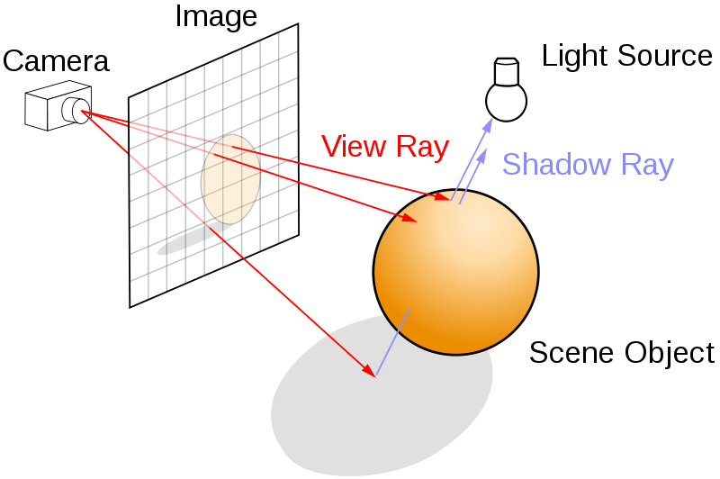
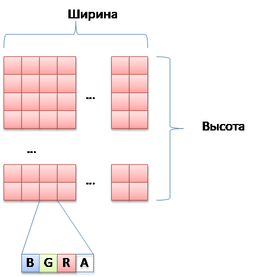
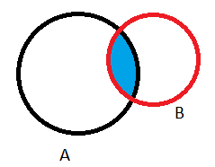

# **Оглавление**

[Основы визуализации трехмерных изображений с использованием трассировки лучей](#_toc103989483)

&emsp;[Разработка каркаса приложения трассировки лучей](#_toc103989484)

&emsp;&emsp;[Использование библиотеки boost](#_toc103989485)

&emsp;&emsp;[Использование библиотеки OpenMP](#_toc103989486)

&emsp;&emsp;[Использование библиотеки SDL](#_toc103989487)

&emsp;&emsp;[Класс «Буфер кадра»](#_toc103989488)

&emsp;&emsp;[Класс «Подсистема визуализации»](#_toc103989489)

&emsp;&emsp;[Визуализация буфера кадра](#_toc103989490)

&emsp;[Практические задания](#_toc103989491)

&emsp;&emsp;[Обязательная часть](#_toc103989492)

&emsp;&emsp;[Дополнительная часть](#_toc103989493)

&emsp;[Литература](#_toc103989494)

# <a name="_toc103989483"></a>**Основы визуализации трехмерных изображений с использованием трассировки лучей**

Трассировка лучей (англ. ray tracing) – технология построения изображения трехмерных моделей в компьютерных программах, при которых отслеживается
обратная траектория распространения лучей света, проходящих через каждый пиксель плоскости изображения и моделирование их взаимодействия с
виртуальными объектами сцены.



**Рисунок 1. Алгоритм трассировки лучей**

Данная технология обеспечивает высокую степень реализма генерируемых изображений по сравнению с традиционными методами, используемыми OpenGL и Direct
3D. Ценой реалистичности будет бо́льшее количество вычислений, поэтому трассировка лучей применяется в тех областях компьютерной графики, где
реалистичность изображения стоит на первом месте, например, для создания спецэффектов для кино и телевидения, и плохо подходит для визуализации
изображений в реальном времени, например, для компьютерных игр.

Трассировка лучей позволяет смоделировать широкий спектр оптических эффектов, таких как: отражение, преломление, рассеяние света, дисперсия.

## <a name="_toc103989484"></a>**Разработка каркаса приложения трассировки лучей**

Для начала разработаем каркас приложения, удовлетворяющий следующим требованиям:

- Построение изображения в отдельном потоке. Т.к. процесс построения изображения может занимать длительное время, недопустимо выполнять трассировку в
  основном потоке приложения, т.к. в таком случае приложение перестанет своевременно реагировать на действия пользователя и будет считаться зависшим.
- Использование вычислительных ресурсов многоядерных систем. Повышение быстродействия современных персональных компьютеров происходит не столько за
  счет повышения тактовой частоты, имеющей физический предел, сколько за счет использования многоядерных или многопроцессорных архитектур.
  Многопоточность позволяет распределить вычисления между процессорами или ядрами, сократив общее время работы приложения.
- Чтобы как можно скорее получить визуальный результат, упростим задачу: вместо построения изображения трехмерной сцены построим изображение некоторой
  области фрактала Мандрельброта. В следующей версии программы нам понадобится лишь немного изменить код вычисления цвета пикселя изображения, оставив
  оставшийся код без изменений.

### <a name="_toc103989485"></a>**Использование библиотеки boost**

[Boost](http://ru.wikipedia.org/wiki/Boost) ([www.boost.org](http://www.boost.org)) включает десятки кроссплатформенных библиотек, расширяющих
функциональность языка C++. Для разработки приложения будет использованы следующие библиотеки:

- Boost.thread. Предоставляет набор классов для создания многопоточных приложений и синхронизации между ними.
- Boost.interprocess. Из этой библиотеки нам понадобятся несколько функций для выполнения атомарных операций над целочисленными данными[^1].
- Boost.ptr_container. Библиотека, предоставляющая контейнеры для хранения указателей на объекты, создаваемые в куче.
- Boost.timer. Библиотека для работы с таймерами, позволяющими достаточно точно измерить время работы алгоритма.

#### ***Сборка библиотеки boost***

Для работы с некоторыми библиотеками boost достаточно просто задать в среде Visual Studio[^2] пути включения подключаемых файлов. Работа с остальными
библиотеками требует сборки библиотек boost.

Краткое руководство по сборке библиотек boost под Windows:

- Запустить файл **booststrap.bat** в каталоге установки boost. Будут собраны файлы
    - b2.exe
    - bjam.exe
- Запустить собранный **b2.exe**.
- Пойти пить чай
- В подкаталоге **<boost>**/**stage/lib** будут располагаться собранные библиотеки. Путь к данному каталогу нужно прописать в настройках Library Files
  среды Visual Studio.

### <a name="_toc103989486"></a>**Использование библиотеки OpenMP**

Трассировка лучей выполняется для каждого пикселя изображения независимо от других, поэтому эта задача может быть достаточно легко распределена между
несколькими ядрами процессора (или процессорами на многопроцессорной системе).

[OpenMP](http://ru.wikipedia.org/wiki/OpenMP) ([www.openmp.org](http://www.openmp.org)) – открытый стандарт для распараллеливания программ на языках
C, C++ и Фортран. При помощи специальных директив программист может указать компилятору участки программы, выполнение которых должно быть распределено
между потоками.

Для поддержки OpenMP необходимо включить соответствующую опцию компилятора. В Visual Studio 2008 данная настройка находится на странице C/C++->
Language окна свойств проекта. Поскольку разработка и отладка многопоточных приложений сложнее однопоточных, эта настройка будет включена только в
конфигурации Release-OMP.

Для запуска приложения, скомпилированного в Visual Studio 2008 с включенной поддержкой OpenMP требуется скопировать файлы *
*Microsoft.VC90.OpenMP.manifest** и **vcomp90.dll** из **<VC++InstallationFolder>\redist\x86\Microsoft.VC90.OPENMP**  в каталог с исполняемым файлом
приложения.


**Рисунок 2. Включение поддержки OpenMP в настройках компилятора**

### <a name="_toc103989487"></a>**Использование библиотеки SDL**

Для отображения построенного изображения можно использовать функции WinAPI напрямую либо через фреймворки вроде WTL или MFC.

Хочется также отметить свободную кроссплатформенную
библиотеку [SDL](http://ru.wikipedia.org/wiki/Simple_DirectMedia_Layer)  ([www.libsdl.org](http://www.libsdl.org), Simple DirectMedia Layer),
реализующую единый интерфейс к графической подсистеме, звуковым устройствам и средствам ввода для широкого спектра платформ. С помощью данной мы
создадим в нашем приложении окно для вывода построенного изображения.

Использование кроссплатформенных библиотек SDL и Boost позволит нашему приложению без каких-либо изменений[^3] быть скомпилированным различными
компиляторами для различных операционных систем.

Примеры программ трассировки лучей, были протестированы автором на следующих платформах:

- Windows XP, Windows 7. Для сборки использовался компилятор C++ в составе Visual Studio 2008
- Ubuntu Linux 12.04. Для сборки использовалась IDE Eclipse с компилятором gcc

### <a name="_toc103989488"></a>**Класс «Буфер кадра»**

Построение изображения будет выполняться в буфере кадра, двухмерном массиве, каждый элемент которого хранит цвет соответствующего пикселя.

Каждому пикселю будет соответствовать 32-битное целое число, хранящее цвет в формате **0xAARRGGBB**.



**Рисунок 3. Формат буфера кадра**

Элементы в буфере кадра хранятся внутри одномерного vector-а. Для доступа к пикселям используются соответствующие методы класса.

```cpp
/*
    Класс CFrameBuffer, представляющий из себя 32-битный буфер кадра
    фиксированного размера
*/
class CFrameBuffer
{
public:
    CFrameBuffer(unsigned width, unsigned height);

    // Ширина буфера в пикселях
    unsigned GetWidth()const throw()
    {
        return m_width;
    }

    // Высота буфера в пикселях
    unsigned GetHeight()const throw()
    {
        return m_height;
    }

    // Очистка содержимого буфера заданным цветом
    void Clear(boost::uint32_t color = 0);

    // Получение адреса начала соотв. строки пикселей (для чтения)
    const boost::uint32_t * GetPixels(unsigned row = 0)const throw()
    {
        assert(row < m_height);
        return &m_pixels[size_t(row * m_width)];
    }

    // Получение адреса начала соотв. строки пикселей (для записи)
    boost::uint32_t * GetPixels(unsigned row = 0)throw()
    {
        assert(row < m_height);
        return &m_pixels[size_t(row * m_width)];
    }

    // Получение цвета пикселя с заданными координатами
    boost::uint32_t GetPixel(unsigned x, unsigned y)const throw()
    {
        assert(x < m_width);
        assert(y < m_height);
        return m_pixels[size_t(y * m_width + x)];
    }

    // Установка цвета пикселя с заданными координатами
    void SetPixel(unsigned x, unsigned y, boost::uint32_t color) throw()
    {
        assert(x < m_width);
        assert(y < m_height);
        m_pixels[size_t(y * m_width + x)] = color;
    }

private:
    std::vector<boost::uint32_t> m_pixels;
    unsigned m_width;
    unsigned m_height;
};
```

Реализация конструктора и метода Clear():

```cpp
CFrameBuffer::CFrameBuffer(unsigned width, unsigned height)
:m_pixels(width * height)
,m_width(width)
,m_height(height)
{
}


void CFrameBuffer::Clear(boost::uint32_t color)
{
    std::fill(m_pixels.begin(), m_pixels.end(), color);
}
```

### <a name="_toc103989489"></a>**Класс «Подсистема визуализации»**

Класс CRenderer выполняет построение изображения в буфере кадра.

Класс предоставляет следующие публичные методы:

- **bool Render(frameBuffer)**. Запускает фоновый поток, выполняющий построение изображения в указанном буфере кадра. Метод возвращает управление
  сразу же, не дожидаясь окончания отрисовки. Для получения информации о прогрессе выполнения будут использоваться другие методы данного класса. Метод
  возвращает true, если произошел запуск процесса построения изображения, и false, если процесс не был запущен, т.к. не завершилась работа ранее
  вызванного процесса.
- **void Stop()**. Останавливает фоновый процесс построения изображения.
- **bool IsRendering()**. Информирует о том, происходит ли в данный момент построение изображения.
- **bool GetProgress(unsigned & renderedChunks, unsigned & totalChunks)**. Предоставляет информацию о прогрессе построения изображения: количество
  обработанных блоков изображения и общее количество блоков. Функция возвращает true, если в буфере кадра было завершено построение изображения.

Интерфейсная часть класса CRenderer:

```cpp
class CRenderer
{
public:
    CRenderer(void);
    ~CRenderer(void);

    bool IsRendering()const;

    bool GetProgress(unsigned & renderedChunks, unsigned & totalChunks)const;

    bool Render(CFrameBuffer & frameBuffer);


    void Stop();
private:
    // Приватные данные и методы класса
    …
};
```

Для получения и изменения информации о состоянии подсистемы визуализации нам понадобятся следующие приватные данные и методы:

- Методы
  - **void RenderFrame(frameBuffer)**. Выполняет построение изображения в буфере кадра. Данный метод запускается из метода Render в фоновом потоке.
  - **bool SetRendering(rendering)**. Позволяет изменить состояние «идет процесс визуализации». Возвращает true, если произошла смена данного
    состояния, и false, если состояние не изменилось.
  - **bool SetStopping(stopping)**. Устанавливает или сбрасывает флаг, сигнализирующий фоновому потоку о необходимости прервать процесс построения
    изображения. Возвращает true, если произошла смена состояния данного флага, и false, если состояние не изменилось.
  - **bool IsStopping()**. Информирует о состоянии флага о необходимости прервать процесс построения изображения.
  - **boost::uint32_t CalculatePixelColor(x, y, width, height)**. Вычисляет значение цвета пикселя с указанными координатами внутри буфера кадра с
    указанной шириной и высотой.
- Данные
  - Объект «фоновый поток». Создается при создании фонового потока. Позволяет дождаться окончания его выполнения.
  - Мьютекс для синхронизации доступа к данным класса из разных потоков. Например, информация о количестве обработанных блоков может обновляться в
    фоновом потоке, а запрашиваться из фонового потока.
  - Состояние флагов «Идет построение изображения» и «Прервать построение изображения»
  - Общее количество блоков изображения и количество обработанных блоков

Часть реализации класса CRenderer:

```cpp
class CRenderer
{
public:
    …
private:
    void RenderFrame(CFrameBuffer & frameBuffer);

    bool SetRendering(bool rendering);

    bool SetStopping(bool stopping);

    bool IsStopping()const;

    boost::uint32_t CalculatePixelColor(int x, int y,
        unsigned frameWidth, unsigned frameHeight)const;

private:
    boost::thread m_thread;
    mutable boost::mutex m_mutex;
    volatile boost::uint32_t m_rendering;
    volatile boost::uint32_t m_stopping;
    volatile boost::uint32_t m_totalChunks;
    volatile boost::uint32_t m_renderedChunks;
};
```

Переменная **m_mutex** объявлена с квалификатором **mutable**, т.к. будет модифицироваться в константных методах класса. Переменные класса, хранящие
состояние подсистемы визуализации, объявлены с квалификатором **volatile** для того, чтобы компилятор не делал никаких предположений о значении данных
переменных и всегда обращался к их значениям напрямую, т.к. значения этих переменных могут быть модифицированы в параллельно работающем потоке.

Реализация методов, позволяющих получить или изменить информацию о состоянии подсистемы визуализации:

```cpp
using namespace boost::interprocess::ipcdetail;
using boost::mutex;

bool CRenderer::IsRendering()const
{
    return atomic_read32(
        const_cast<volatile boost::uint32_t*>(&m_rendering)) != 0;
}

bool CRenderer::IsStopping()const
{
    return atomic_read32(
        const_cast<volatile boost::uint32_t *>(&m_stopping)) != 0;
}

bool CRenderer::SetRendering(bool rendering)
{
    bool wasRendering =
        atomic_cas32(&m_rendering, rendering, !rendering) != 0;


    return wasRendering != rendering;
}

bool CRenderer::SetStopping(bool stopping)
{
    bool wasStopping =
        atomic_cas32(&m_stopping, stopping, !stopping) != 0;

    return wasStopping != stopping;
}

bool CRenderer::GetProgress(
    unsigned & renderedChunks, unsigned & totalChunks)const
{
    // Захватываем мьютекс на время работы данного метода
    mutex::scoped_lock lock(m_mutex);

    renderedChunks = atomic_read32(
        const_cast<volatile boost::uint32_t*>(&m_renderedChunks));

    totalChunks = atomic_read32(
        const_cast<volatile boost::uint32_t*>(&m_totalChunks));;

    // Сообщаем, все ли блоки изображения были обработаны
    return (totalChunks > 0) && (renderedChunks == totalChunks);
}
```

Обратим внимание на использование следующих функций библиотеки boost пространства имен boost::interprocess::ipcdetail:

- **uin32_t atomic_read32(adr)**. Выполняет атомарное считывание значения 32-битного целого числа из указанного адреса памяти.
- **void atomic_write32(adr, value)**. Выполняет атомарную запись 32-битного целого числа по указанному адресу памяти.
- **uint32_t atomic_cas32(*X, Z, Y)**. Выполняет атомарное сравнение значения 32-битного целого числа, расположенного по адресу X с заданным
  значением Y. В случае равенства происходит замена содержимого ячейки памяти на значение Z. Функция возвращает значение, находившееся по адресу X до
  выполнения данной операции.
- **uin32_t atomic_inc32(adr)**. Выполняет атомарный инкремент значения 32-битного целого числа по указанному адресу и возвращает содержимое данной
  ячейки памяти до выполнения операции инкремента.

Данные атомарные функции вызывают соответствующие функции операционной системы для данной программно-аппаратной платформы. Использование данных
функций позволяет
избежать [состояния гонки](http://ru.wikipedia.org/wiki/%D0%A1%D0%BE%D1%81%D1%82%D0%BE%D1%8F%D0%BD%D0%B8%D0%B5_%D0%B3%D0%BE%D0%BD%D0%BA%D0%B8)[^4] при
параллельно происходящих операциях чтения и записи одних и тех же 32-битных областей памяти без введения тяжеловесных (для данного случая) механизмов
синхронизации, вроде мьютексов.

Реализация метода Render приведена ниже:

```cpp
bool CRenderer::Render(CFrameBuffer & frameBuffer)
{
    if (!SetRendering(true))                   // (1)
    {
        return false;
    }

    mutex::scoped_lock lock(m_mutex);          // (2)

    frameBuffer.Clear();

    atomic_write32(&m_totalChunks, 0);
    atomic_write32(&m_renderedChunks, 0);

    if (SetStopping(false))                   // (3)
    {
        SetRendering(false);
        return false;
    }

    m_thread = boost::thread(                  // (4)
        &CRenderer::RenderFrame, this, boost::ref(frameBuffer));

    return true;
}
```

Рассмотрим основные этапы работы данного метода более подробно:

1) Устанавливаем флаг «идет построение изображения». Если он уже был установлен (ранее запущенный фоновый поток еще не завершил свою работу), выходим,
   возвращая **false**.
2) Захватываем мьютекс, предотвращая доступ других потоков к переменным **m_totalChunks** и **m_renderedChunks** до момента выхода из метода
   Render[^5].
3) Сбрасываем флаг остановки. В случае, если он был ранее установлен (это может произойти, если был вызван метод Stop() из другого потока в процессе
   работы метода Render), сбрасываем флаг «Идет построение изображения» и выходим.
4) Создаем новый поток, запускающий при старте метод RenderFrame. В качестве дополнительных параметров передаются указатель this, который необходим
   для вызова методов класса, а также ссылка на буфер кадра. Использование boost::ref необходимо для того, чтобы произошла передача буфера кадра по
   ссылке, а не по значению. Затем происходит выход из метода Render, в то время как построение изображения будет происходить в методе **RenderFrame()
   **.

Реализация метода **RenderFrame()** приведена ниже:

```cpp
void CRenderer::RenderFrame(CFrameBuffer & frameBuffer)
{
    const int width = frameBuffer.GetWidth();                                          // (1)
    const int height = frameBuffer.GetHeight();

    atomic_write32(&m_totalChunks, height);

#ifdef _OPENMP                                                                           // (2)
    #pragma omp parallel for schedule(dynamic)
#endif
    for (int y = 0; y < height; ++y)
    {
        boost::uint32_t * rowPixels = frameBuffer.GetPixels(y);
        if (!IsStopping())                                                             // (3)
        {
            for (int x = 0; x < width; ++x)                                            // (4)
            {
                rowPixels[size_t(x)] = CalculatePixelColor(x, y, width, height);
            }
            atomic_inc32(&m_renderedChunks);                                           // (5)
        }
    }

    SetStopping(false);                                                                // (6)
    SetRendering(false);
}
```

Рассмотрим основные этапы работы данного метода:

1) Выполняется инициализация общего количества блоков изображения[^6], а также происходит инициализация констант для хранения размеров изображения.
2) Происходит запуск цикла построения изображения по строкам. В случае поддержки компилятором стандарта OpenMP, директива **#pragma omp parallel for**
   сообщает компилятору о том, чтобы распределить выполнение итераций цикла между имеющимися ядрами процессора.
3) Чтобы основной поток, осуществляющий взаимодействие с пользователем, мог остановить работу фонового потока, используется флаг **m_stopping**,
   значение которого проверяется перед обработкой каждой строки[^7] изображения. В случае, если флаг установлен, обработка строки не
   осуществляется[^8].
4) Цикл по столбцам, осуществляющий вычисление цветов пикселей текущей строки изображения
5) Увеличение количества обработанных блоков изображения
6) Сброс флагов **m_rendering** и **m_stopping** с последующим выходом из метода и завершением работы потока.

Метод CalculatePixelColor вычисляет цвет пикселя в указанных координатах. Пока в приложения разместим «заглушку». Вместо вычисления цвета пикселя
методом трассировки луча фактически будет выполняться более простая задача: вычисление цвета соответствующей
точки [фрактала Мандельброта](http://ru.wikipedia.org/wiki/%D0%9C%D0%BD%D0%BE%D0%B6%D0%B5%D1%81%D1%82%D0%B2%D0%BE_%D0%9C%D0%B0%D0%BD%D0%B4%D0%B5%D0%BB%D1%8C%D0%B1%D1%80%D0%BE%D1%82%D0%B0).

```cpp
boost::uint32_t CRenderer::CalculatePixelColor(
    int x, int y, unsigned frameWidth, unsigned frameHeight)const
{
    double x0 = 2.0 * x / frameWidth - 1.5;
    double y0 = 2.0 * y / frameHeight - 1.0;

    double rho = sqrt((x0 - 0.25) * (x0 - 0.25) + y0 * y0);
    double theta = atan2(y0, x0 - 0.25);
    double rhoC = 0.5 - 0.5 * cos(theta);
    if (rho <= rhoC)
    {
        return 0x000000;
    }

    double re = 0, im = 0;

    int iterCount = 10000;
    while ((iterCount > 0) && (re * re + im * im < 1e18))
    {
        double re1 = re * re - im * im + x0;
        im = 2 * re * im + y0;
        re = re1;
        --iterCount;
    }


    boost::uint8_t r = static_cast<boost::uint8_t>((iterCount / 3) & 0xff);
    boost::uint8_t g = static_cast<boost::uint8_t>(iterCount & 0xff);
    boost::uint8_t b = static_cast<boost::uint8_t>((iterCount / 2) & 0xff);
    boost::uint8_t a = 0xff;
    return (a << 24) | (r << 16) | (g << 8) | b;
}
```

Реализация метода Stop() приведена ниже.

```cpp
void CRenderer::Stop()
{
    // Если происходит построение изображения
    if (IsRendering())
    {
        // Сообщаем потоку, выполняющему построение изображения,
        // о необходимости завершить работу
        SetStopping(true);

        // Дожидаемся окончания работы рабочего потока
        m_thread.join();

        // Сбрасываем флаг остановки, если поток завершил свою
        // работу до вызова SetStopping(true)
        SetStopping(false);
    }
}
```

Конструктор класса CRenderer выполняет инициализацию членов-данных класса, а деструктор выполняет остановку процесса построения изображения, если он
еще не завершился к моменту разрушения экземпляра класса.

```cpp
CRenderer::CRenderer(void)
:m_rendering(0)    // Изначальное состояние: "не рисуем"
,m_stopping(0)    // Не останавливаемся
,m_totalChunks(0)    // Общее количество обрабатываемых блоков изображения
,m_renderedChunks(0)    // Количество обработанных блоков изображения
{
}

CRenderer::~CRenderer(void)
{
    // Останавливаем работу фонового потока, если он еще не закончился
    Stop();
}
```

### <a name="_toc103989490"></a>**Визуализация буфера кадра**

Для визуализации буфера кадра используем возможности библиотеки SDL. Основной код приложения разместим в классе CApplication, чтобы не вводить
глобальные переменные.

```cpp
#include "Renderer.h"
#include "FrameBuffer.h"
#include <SDL.h>

using namespace boost::interprocess::ipcdetail;

class CApplication
{
public:
    CApplication()
    {
        …
    }

    void MainLoop()
    {
        …
    }

    ~CApplication()
    {
        …
    }
};

#ifdef __cplusplus
extern "C"
#endif
int main(int /*argc*/, char* /*argv*/[])
{
    CApplication app;
    app.MainLoop();
    return 0;
}
```

#### ***Конструктор и деструктор класса CApplication***

В конструкторе приложения осуществляется инициализация переменных класса, библиотеки SDL (графическая подсистема и таймер), а также происходит
создание главного окна приложения и сохранение адреса поверхности, связанной с окном.

Деструктор завершает работу всех подсистем SDL.

```cpp
class CApplication
{
public:
    CApplication()
        :m_frameBuffer(800, 600)
        ,m_pMainSurface(NULL)
        ,m_timerId(NULL)
        ,m_mainSurfaceUpdated(0)
    {
        // Инициализация SDL (таймер и видео)
        SDL_Init(SDL_INIT_VIDEO | SDL_INIT_TIMER);
        SDL_WM_SetCaption("Raytracing example", NULL);

        // Создаем главное окно приложения и сохраняем указатель
        // на поверхность, связанную с ним
        m_pMainSurface = SDL_SetVideoMode(800, 600, 32,
            SDL_SWSURFACE | SDL_DOUBLEBUF);
    }

    ~CApplication()
    {
        // Завершаем работу всех подсистем SDL
        SDL_Quit();
    }
    …
private:
    // Буфер кадра
    CFrameBuffer m_frameBuffer;
    // Визуализатор
    CRenderer m_renderer;
    // Поверхность окна приложения
    SDL_Surface * m_pMainSurface;
    // Идентификатор SDL-таймера
    SDL_TimerID m_timerId;
    // Обновлена ли поверхность окна приложения (1 - да, 0 - нет)
    boost::uint32_t m_mainSurfaceUpdated;
};
```

#### ***Главный цикл приложения***

```cpp
class CApplication
{
public:
    …
    void MainLoop()
    {
        // Инициализация приложения
        Initialize();                                                             // (1)


        // Обновляем изначальное содержимое окна
        UpdateMainSurface();                                                      // (2)

        // Цикл обработки сообщений, продолжающийся пока не будет
        // получен запрос на завершение работы
        SDL_Event evt;                                                            // (3)
        while (SDL_WaitEvent(&evt) && evt.type != SDL_QUIT)
        {
            switch (evt.type)
            {
            case SDL_VIDEOEXPOSE:
                // Обновляем содержимое главного окна,
                // если оно нуждается в перерисовке
                UpdateMainSurface();                                              // (3.1)
                break;
            }
        }

        // Деинициализация приложения
        Uninitialize();                                                           // (4)
    }
    …
private:
    void Initialize()
    {
        // Запускаем построение изображения и таймер обновления экрана
        m_renderer.Render(m_frameBuffer);                                         // (1.1)
        m_timerId = SDL_AddTimer(500, &TimerCallback, this);
    }

    void Uninitialize()
    {
        // Останавливаем таймер обновления экрана и построение изображения
        SDL_RemoveTimer(m_timerId);                                               // (4.1)
        m_renderer.Stop();
    }

    // Обновление содержимого окна приложения
    void UpdateMainSurface()
    {
        …
    }
};
```

Рассмотрим ключевые элементы данного фрагмента программы:

1) Инициализация приложения
    1. Запуск процесса построения изображения в отдельном потоке и запуск таймера для периодического обновления содержимого окна приложения
2) Изначальное обновление содержимого окна приложения.
3) Цикл выборки сообщений. Функция [SDL_WaitEvent()](http://sdl.beuc.net/sdl.wiki/SDL_WaitEvent) является аналогом функции GetMessage() Win API,
   выполняющая ожидание события в очереди сообщений. Выход из цикла происходит при получении события SDL_QUIT, являющимся сигналом для выхода из
   приложения.
    1. Событие SDL_VIDEOEXPOSE является сигналом приложению о необходимости обновить содержимое окна приложения[^9]. В ответ на данное событие наше
       приложение будет обновлять содержимое окна.
4) После выхода из цикла выборки сообщений выполняется деинициализация приложения
    1. Происходит остановка таймера и процесса построения изображения, если он еще не завершился

#### ***Обновление содержимого окна приложения***

Разработанная нами подсистема визуализации выполняет построение изображения в буфере кадра, при этом ее код исполняется в отдельном потоке (или в
нескольких потоках, если собрать приложение с включенной поддержкой OpenMP).

Основной поток приложения выполняет периодическое обновление содержимого окна, копируя в его теневой (внеэкранный) буфер содержимое буфера кадра. Для
отображения содержимого внеэкранного буфера на экране будем использовать функцию [SDL_Flip](http://www.libsdl.org/cgi/docwiki.cgi/SDL_Flip).

Конечно, можно было бы спроектировать приложение таким образом, чтобы подсистема визуализации выполняла напрямую построение изображения во внеэкранном
буфере SDL, однако такое решение обладает следующими недостатками:

- Код подсистемы визуализации окажется зависящим от библиотеки SDL, что потребовало бы специальных доработок для использования совместно с WinAPI,
  WTL, MFC, QT или иными фреймворками.
- Формат пикселей поверхности, связанной с окном может быть произвольного формата в зависимости от используемой системы или графического режима.
  Поддержка различных форматов пикселей привело бы к усложнению подсистемы визуализации.


```cpp
**Рисунок 4 Схема построения изображения в окне нашего приложения**

    void UpdateMainSurface()
    {
        CopyFrameBufferToSDLSurface();                                            
// (1)
        SDL_Flip(m_pMainSurface);                                                 // (2)

        atomic_write32(&m_mainSurfaceUpdated, 1);                                 // (3)
    }

    // Копирование буфера кадра в область главного окна
    void CopyFrameBufferToSDLSurface()
    {
        SDL_LockSurface(m_pMainSurface);                                          // (1.1)
        const SDL_PixelFormat * pixelFormat = m_pMainSurface->format;

        if (pixelFormat->BitsPerPixel == 32)                                      // (1.2)
        {
            const Uint8 rShift = pixelFormat->Rshift;                             // (1.3)
            const Uint8 gShift = pixelFormat->Gshift;
            const Uint8 bShift = pixelFormat->Bshift;
            const Uint8 aShift = pixelFormat->Ashift;
            const Uint32 aMask = pixelFormat->Amask;                              // (1.4)

            const unsigned h = m_frameBuffer.GetHeight();
            const unsigned w = m_frameBuffer.GetWidth();
                                                                                  // (1.5)
            Uint8 * pixels = reinterpret_cast<Uint8*>(m_pMainSurface->pixels);
            for (unsigned y = 0; y < h; ++y, pixels += m_pMainSurface->pitch)
            {
                                                                                  // (1.6)
                boost::uint32_t const * srcLine = m_frameBuffer.GetPixels(y);
                Uint32 * dstLine = reinterpret_cast<Uint32*>(pixels);

                if (bShift == 0 && gShift == 8 && rShift == 16)                   // (1.7)
                {
                    memcpy(dstLine, srcLine, w * sizeof(Uint32));
                }
                else
                {
                    for (unsigned x = 0; x < w; ++x)                              // (1.8)
                    {
                        boost::uint32_t srcColor = srcLine[x];
                        Uint32 dstColor =
                            ((srcColor & 0xff) << bShift) |
                            (((srcColor >> 8) & 0xff) << gShift) |
                            (((srcColor >> 16) & 0xff) << rShift) |
                            ((((srcColor >> 24) ) << aShift) & aMask);
                        dstLine[x] = dstColor;
                    }
                }
            }
        }

        SDL_UnlockSurface(m_pMainSurface);                                        // (11)
    }
```

Рассмотрим данный фрагмент подробнее:

1) Выполняется перенос пикселей изображения из буфера кадра в теневой буфер поверхности, связанной с окном.
    1. Выполняется доступ к пикселям поверхности, связанной с главным окном приложения.
    2. Осуществляется проверка формата пикселей поверхности. Для простоты в нашем приложении будет реализована только поддержка 32-битных форматов
       пикселей:
        1. 0xAARRGGBB
        2. 0xAABBGGRR
        3. 0x00BBGGRR
        4. 0x00RRGGBB
    3. Извлекаются величины битовых сдвигов красного, синего, зеленого каналов и канала прозрачности.
    4. Сохраняется значение битовой маски, используемое каналом прозрачности (для корректного копирования пикселей на поверхность, не содержащую
       альфа-канал)
    5. Выполняется цикл, выполняющий построчное копирование пикселей изображения. Адрес каждой последующей строки теневого буфера смещен относительно
       адреса предыдущей строки на величину pitch структуры SDL_Surface
    6. Вычисляются адреса начала строки буфера кадра и теневого буфера окна.
    7. В случае, когда формат пикселей буфера кадра и теневого буфера окна совпадают (0xAARRGGBB или 0x00RRGGBB), для копирования данных достаточно
       использовать операцию memcpy для простого копирования пикселей строки
    8. В противном случае каждый пиксель буфера кадра трансформируется в требуемый формат с использованием операция манипулирования битами на основе
       величины битовых сдвигов красного, зеленого, синего и альфа-каналов, а также маски альфа канала. Пример преобразования цвета пикселя из формата
       BGBA в RGBA показан на следующем рисунке:
       
2) При помощи функции SDL_Flip происходит перенос изображения из внеэкранного буфера поверхности, связанной с окном, на экран.
3) Устанавливается флаг «Поверхность обновлена». Подробнее назначение данного флага будет описано чуть ниже.

#### ***Постепенное обновление содержимого окна***

Процесс визуализации сложной трехмерной сцены в буфере кадра с использованием трассировки лучей может занимать продолжительное время. Чтобы дать
пользователю возможность увидеть результат работы программы как можно раньше, необходимо с определенной периодичностью отображать текущее содержимое
буфера кадра на экране.

Периодическое выполнение заданного участка кода в библиотеке SDL осуществляется с использованием таймеров. При создании таймера, библиотека SDL
вызывает указанную пользователем функцию через определенные интервалы времени. При этом вызов функции-обработчика будет осуществлен из
вспомогательного потока. Из-за особенностей архитектуры библиотеки вызов функций SDL разрешается только из потока, выполнившего установку
видеорежима (в нашем случае это главный поток приложения). Исключением является
функция [SDL_PushEvent](http://www.libsdl.org/cgi/docwiki.cgi/SDL_PushEvent), которую можно вызывать из любого потока для помещения нового события в
очередь событий.

```cpp
    // Обработчик таймера, вызываемый SDL
    static Uint32 SDLCALL TimerCallback(Uint32 interval, void *param)
    {
        CApplication * pMyApp = reinterpret_cast<CApplication*>(param);   // (1)
        return pMyApp->OnTimer(interval);
    }

    // Обработчик таймера SDL объекта CApplication
    Uint32 OnTimer(Uint32 interval)
    {
        unsigned renderedChunks = 0;
        unsigned totalChunks = 0;
        if (m_renderer.GetProgress(renderedChunks, totalChunks))          // (2)
        {
            interval = 0;                                                 // (2.1)
        }

        InvalidateMainSurface();                                          // (2.2)
        return interval;
    }

    // Пометка содержимого окна, как нуждающейся в перерисовке
    void InvalidateMainSurface()
    {
        bool redrawIsNeeded =
            atomic_read32(&m_mainSurfaceUpdated) == 1;                    // (3)

        if (redrawIsNeeded)                                               // (3.1)
        {
            atomic_write32(&m_mainSurfaceUpdated, 0);                     // (3.2)

            SDL_Event evt;                                                // (3.3)
            evt.type = SDL_VIDEOEXPOSE;
            SDL_PushEvent(&evt);
        }
    }
```

Рассмотрим данный фрагмент кода подробнее.

1) Статический[^10] метод TimerCallback вызывается библиотекой SDL. Поскольку при инициализации таймера в качестве параметра таймера был передан
   указатель this экземпляра класса CApplication, здесь используется оператор приведения типа для обратного преобразования указателя void* к
   указателю на CApplication и происходит вызов метода OnTimer соответствующего экземпляра класса.
2) Происходит запрос текущего прогресса построения изображения у подсистемы визуализации.
    1. Если формирование изображения завершено, в переменную interval, хранящую период вызова таймера, заносится значение 0.
    2. Независимо от того, было ли завершено построение изображения, необходимо принудительно пометить окно для последующего обновления. Возвращенное
       обработчиком таймера значение сообщает SDL интервал времени, через который должен произойти последующий вызов обработчика. Возвращение нулевого
       значения из обработчика выполняет отключение текущего таймера, что и произойдет, когда подсистема визуализации завершит формирование
       изображения в буфере кадра
3) Считывается значение флага m_mainSurfaceUpdated. Значение данного флага, равное 1 сигнализирует о том, что основной поток приложения ранее
   выполнил обновление содержимого окна.
    1. Принудительное обновление содержимого окна приложения заключается в добавлении события SDL_VIDEOEXPOSE в очередь событий. Т.к. доабвление
       данного события в очередь и его обработка выполняются разными потоками, необходимо следить за тем, чтобы в очереди сообщений одновременно
       находилось не более одного[^11]  события SDL_VIDEOEXPOSE.
    2. Выполняется сброс флага m_mainsurfaceUpdated, благодаря чему последующее добавление события SDL_VIDEOEXPOSE будет возможно только после
       обновления содержимого окна.
    3. Событие SDL_VIDEOEXPOSE добавляется в очередь.

На этом задача разработки каркаса приложения может считаться выполненной.

## <a name="_toc103989491"></a>**Практические задания**

Для получения оценки «**удовлетворительно**» необходимо выполнить часть заданий из обязательной части работы, набрав **не менее 150 баллов**.

Для получения оценки «**хорошо**» необходимо выполнить часть обязательных заданий и часть дополнительных, набрав не **менее 250 баллов**.

Для получения оценки «отлично» необходимо выполнить часть заданий из обязательной части работы и часть дополнительных, набрав **не менее 400 баллов**.

### <a name="_toc103989492"></a>**Обязательная часть**

#### ***Задание 1. Расчет фоновой и зеркальной (с использованием модели освещения Фонга) составляющих отраженного света. 20 баллов***

Необходимо реализовать возможность учета фоновой (ambient) и зеркальной (specular) составляющих отраженного света при расчете цвета поверхности[^12].
Для этого источник света и материал должны обладать соответствующими свойствами:

- Источник света
  - Цвет диффузного излучения (уже реализовано в примере)
  - Цвет зеркального излучения
  - Цвет фонового излучения
- Материал
  - Цвет диффузного отражения (уже реализовано в примере)
  - Цвет зеркального отражения
  - Цвет фонового отражения
  - Степень зеркального блеска (для формулы Фонга)

#### ***Задание 2. Визуализация теней. 20 баллов***

Необходимо реализовать визуализацию трехмерной сцены с учетом теней, отбрасываемых объектами сцены. Для этого при расчете освещения точки поверхности
проверить отсутствие препятствий на пути света от источника к данной точке.

Вклад диффузной и зеркальной составляющих освещения в общую освещенность точки поверхности должен осуществляться лишь при отсутствии препятствий на
пути света от источника к данной точке.


##### Бонус в 20 баллов за создание мягких теней

Бонус начисляется за визуализацию плавных переходов на границе света и тени (полутеней). Для этого точечный источник света должен восприниматься
имеющим некоторые размеры (а не бесконечно малым). Вместо одного вторичного луча из поверхности в сторону источника света испускается несколько
вторичных лучей, направленных в различные точки источника света.


Результирующая интенсивность света, достигшего обрабатываемой точки, равна отношению количества лучей, дошедших до источника света без препятствий, к
общему количеству лучей, запущенному в сторону источника из данной точки.

#### ***Задание 3. Поддержка дополнительных видов трехмерных поверхностей***

**Допускается выполнение нескольких вариантов данного задания. Набранные баллы в этом случае будут суммироваться.**

##### Вариант 1 – Эллиптический параболоид. 50 баллов

Реализовать возможность построения с использованием трассировки лучей геометрический объект «Базовый геометрический параболоид»[^13], состоящий из
боковой поверхности и крышки (круга радиуса 1, лежащего в плоскости z=1).

$$
x^2+y^2-z=0
$$


Создать с использованием данного геометрического объекта композицию наподобие:


**Указание:** для нахождения точки пересечения луча с объектом найдите аналитическим способом точки пересечения луча с эллиптическим параболоидом, а
также с крышкой, отбрасывая решения, не удовлетворяющие ограничениям[^14].

Вектор нормали к боковой поверхности должен быть вычислен аналитически используя вектор градиента. Вектор нормали к крышке задать равным (0, 0, 1).

###### *Бонус в 10 баллов за возможность опционального включения и выключения «крышки»*

Бонус начисляется за возможность включения и выключения крышки, закрывающей верхнюю часть эллиптического параболоида.

**Внимание**: при отключенной крышке будет видна как внутренняя, так и внешняя сторона поверхности эллиптического параболоида. Для корректного
вычисления освещенности такой поверхности вектор нормали к поверхности в точке столкновения луча с параболоидом должен быть направлен в
полупространство, в котором находится точка испускания луча.

На следующем рисунке первый луч пересекает эллипсоид в точке P, а второй – в точке Q.


Направление нормали n<sub>1</sub>, восстановленной в точке P, выбирается внутрь эллипсоида, в то время как направление нормали n<sub>2</sub> – наружу.
Т.е. из двух возможных[^15] направлений нормального вектора выбирается то, для которого знак скалярного произведения вектора направления луча и
вектора нормали отрицателен.

Для демонстрации возможности отключения крышки объекта визуализируйте схематическую
модель [параболической антенны](http://ru.wikipedia.org/wiki/%D0%9F%D0%B0%D1%80%D0%B0%D0%B1%D0%BE%D0%BB%D0%B8%D1%87%D0%B5%D1%81%D0%BA%D0%B0%D1%8F_%D0%B0%D0%BD%D1%82%D0%B5%D0%BD%D0%BD%D0%B0) (
для этой цели также понадобится несколько конических цилиндров):


##### Вариант 2 – Гиперболический параболоид. 40 баллов

Реализовать возможность построения поверхности базового гиперболического параболоида[^16], заданного на диапазоне координат **x** и **y** от -1 до +1.
Точка пересечения луча с гиперболическим параболоидом должна вычисляться аналитически.


$x^{2}-y^{2}-z=0$

**Внимание**: при вычислении вектора нормали следует, как и в случае с эллиптическим параболоидом, выбирать направление нормального вектора, скалярное
произведение которого с вектором направления трассируемого луча является отрицательным.

Вектор нормали должен вычисляться аналитическим способом.

##### Вариант 3 – Тор. 100 баллов

Реализовать возможность построения поверхности тора. Должна иметься возможность применения матричных преобразований к тору.


$(x^{2}+y^{2}+z^{2}+R^{2}-r^{2})^{2}-4R^{2}(x^{2}+y^{2})=0$, где **R** – расстояние от центра трубы до центра тора, а **r** – радиус трубы.

Для нахождения точек пересечения луча с тором потребуется найти решение уравнения четвертой степени. Сделать это можно
как [аналитическим способом](http://ru.wikipedia.org/wiki/%D0%A3%D1%80%D0%B0%D0%B2%D0%BD%D0%B5%D0%BD%D0%B8%D0%B5_%D1%87%D0%B5%D1%82%D0%B2%D1%91%D1%80%D1%82%D0%BE%D0%B9_%D1%81%D1%82%D0%B5%D0%BF%D0%B5%D0%BD%D0%B8),
так и с использованием численных методов.

С использованием нескольких торов необходимо нарисовать разноцветную детскую пирамидку:


###### *Бонус в 50 баллов за аналитическое нахождение точек пересечения луча с тором*

Бонус начисляется за аналитическое нахождение точки пересечения луча с тором.

##### Вариант 5 – Куб. 30 баллов

Реализовать возможность построения поверхности базового куба. Центр базового куба располагается в точке (0, 0, 0). Стороны куба расположены
параллельно координатным осям. Сторона куба равна 2. Должна иметься возможность применения матричных преобразований к кубу для произвольного
размещения и ориентирования на сцене и создания с его помощью параллелепипеда.

##### Вариант 6 – Тетраэдр. 30 баллов

Реализовать возможность построения произвольного тетраэдра, заданного координатами четырех своих вершин. Должна иметься возможность применения
матричных преобразований к данному объекту для произвольного размещения и ориентирования на сцене.

##### Вариант 7 – Октаэдр. 40 баллов

Реализовать возможность построения базового октаэдра, центр которого расположен в начале координат, а сам октаэдр вписан в сферу единичного радиуса.
Должна иметься возможность применения матричных преобразований к данному объекту для произвольного размещения и ориентирования на сцене.

##### Вариант 8 – Додекаэдр. 50 баллов

Реализовать возможность построения базового додекаэдра, центр которого расположен в начале координат, а сам объект должен быть вписан в сферу
единичного радиуса. Должна иметься возможность применения матричных преобразований к данному объекту для произвольного размещения и ориентирования на
сцене.

##### Вариант 9 – Икосаэдр. 50 баллов

Реализовать возможность построения базового икосаэдра, центр которого расположен в начале координат, а сам объект должен быть вписан в сферу
единичного радиуса. Должна иметься возможность применения матричных преобразований к данному объекту для произвольного размещения и ориентирования на
сцене.

##### Вариант 10 – Метасферы. 120 баллов

Реализовать возможность визуализации гладких криволинейных поверхностей (например, капелек жидкости), задаваемых при помощи метасфер. Должна иметься
возможность применения матричных преобразований к области, содержащей метасферы, для произвольного размещения и ориентирования на сцене.

Для трассировки метасфер необходимо определить ограничивающую область нахождения метасфер (например, внутри прямоугольного параллелепипеда). При
пересечении луча с данным ограничивающим прямоугольником необходимо от точки пересечения выполнять адаптивное перемещение вдоль направления
трассировки с шагом, зависящим от градиента изоповерхности в обрабатываемой точке пространства до приближения к изоповерхности на нужное расстояние.


##### Вариант 11 – Трехмерные модели. 100 баллов

Реализовать возможность визуализации трехмерных полигональных моделей, заданных, например, в формате 3DS. Модель должна визуализироваться с учетом
параметров материалов, связанных с ее гранями. Освещение должно учитывать группы сглаживания граней.

###### *Бонус до 80 баллов за наложение текстуры на грани сетки*

Бонус начисляется за наложение текстуры на грани трехмерных моделей. Реализовать наложение текстуры можно, связав текстурные координаты с каждой
вершиной сетки. При пересечении луча с гранью необходимо выполнять интерполяцию текстурных координат.

За отсутствие фильтрации текстур будет начислено 50% от номинала, за применение билинейной (интерполяция по 4 текселям) фильтрации – 70%, а
трилинейной (интерполяция с применением mip-уровней, по 8 текселям) фильтрации – 100% от номинала данного бонуса.

###### *Бонус до 150 баллов за оптимизацию поиска пересечений с гранями сетки*

Сложные трехмерные модели могут содержать сотни, тысячи и даже десятки тысяч граней. Проверка пересечения луча со всеми гранями сетки в таком случае
сильно замедлит процесс построения изображения. Представление сетки в виде некоторой иерархической структуры (Oct-tree или BSP-tree) позволит
сократить вычислительную сложность трассировки модели с O(N) до O(log N).

Еще один возможный способ оптимизации – использование ограничивающих объемов. Он заключается в проверке пересечений луча с некоторым простым объектом,
например, параллелепипедом или сферой, целиком заключающим внутри себя полигональную сетку, до поиска пересечений луча с гранями сетки. Если
пересечений луча с ограничивающим объемом не найдено, их не будет и с самой сеткой, что позволяет сократить объем вычислений.

Данные способы могут применяться как по отдельности, так и одновременно друг друга. При их отдельной реализации за использование ограничивающих
объемов будет начислено **30 баллов**, а за иерархическое представление модели – **120 баллов**.

### <a name="_toc103989493"></a>**Дополнительная часть**

Задания из данной части принимаются после успешной защиты всех заданий из обязательной части расчетно-графической работы.

#### ***Задание 4. Возможность сохранения построенного в результате трассировки лучей изображения файл. 10 баллов***

При выборе пункта меню или нажатии кнопки панели управления пользователю должно предлагаться сохранить содержимое буфера кадра в файле формата PNG.

#### ***Задание 5. Предварительная интерактивная визуализация сцены с использованием OpenGL. 100 баллов***

Реализовать возможность предварительной визуализации сцены в реальном времени с использованием OpenGL для ориентирования камеры в желаемом
направлении.

После запуска приложение должно переходить в режим интерактивной визуализации.

При нажатии на кнопку на панели инструментов или выборе пункта меню в этом же окне запускается режим визуализации сцены с использованием трассировки
лучей (визуализация при помощи OpenGL в это время отсутствует).

Перед началом трассировки лучей в буфер кадра, используемый трассировщиком, копируется изображение буфера кадра, построенное OpenGL[^17], чтобы можно
было визуально наблюдать процесс обновления изображения и сравнить реалистичность данных подходов визуализации.

Прерывание режима визуализации сцены при помощи трассировки лучей и возврат в режим интерактивной визуализации происходит при щелчке мыши по
клиентской области окна либо изменении размеров окна. При нажатии на кнопку закрытия окна также происходит трассировки лучей и осуществляется закрытие
приложения.

#### ***Задание 6. Использование дополнительных типов источников света***

**Допускается выполнение нескольких вариантов данного задания. Набранные баллы в этом случае будут суммироваться.**

##### Вариант 1. Конический источник света. 30 баллов

Данный источник света характеризуется положением, направлением светового потока, углом разброса лучей, а также степенью ослабления света в зависимости
от отклонения луча от направления.

##### Вариант 2. Бесконечно удаленный источник света (направленный источник света). 20 баллов

Данный источник света характеризуется тем, что направление на него не зависит от положения точки на сцене, а также не происходит ослабления силы света
в зависимости от расстояния.

#### ***Задание 7. Устранение ступенчатости. 20 баллов***

При трассировке лучей возможно возникновение алиасинга (ступенчатых краев) на границах объектов, а также при трассировке удаленных частей сцены (см.
рисунок).


Реализовать устранение ступенчатости изображения с использованием Distributed Ray Tracing.

**Внимание**: использование данного подхода «в лоб» (т.е. испускание нескольких лучей внутри **каждого** пикселя) способно сильно снизить
быстродействие приложения. Поэтому на практике применяют адаптивные методы, выполняющие трассировку дополнительных лучей (после первого прохода)
только через те пиксели, цвет которых сильно отличается от усредненного значения цветов пикселей в окрестности.

#### ***Задание 8. Создание эффекта смазывания движения (Motion Blur) при визуализации движущихся объектов. 30 баллов***

Для реализации данного функционала с каждым объектом сцены должен быть связан его вектор скорости (расстояние, которое объект проходит за единицу
времени). Для трассировки движущихся объектов также используется подход Distributed Ray Tracing, при котором проверка на столкновение луча с
движущимися объектами осуществляется несколько раз со смещением объектов[^18] вдоль вектора скорости.

#### ***Задание 9. Создание эффекта Depth of field (глубина резкости). 50 баллов***

Данный эффект делает резкими только ту часть сцены, расположенную на определенном расстоянии от камеры. Части сцены, расположенные ближе или дальше
отображаются размыто.

Для создания данного эффекта также используется подход Distributed Ray Tracing.


#### ***Задание 10. Возможность задания отдельного шейдера для каждой поверхности сложного геометрического объекта. 20 баллов***

Перечисленные геометрические объекты состоят из нескольких поверхностей:

- Конический цилиндр
    - Боковая поверхность
    - Верхняя крышка
    - Нижняя крышка (основание)
- Эллиптический параболоид
    - Поверхность эллиптического параболоида
    - Крышка
- Куб
    - 6 граней
- Тетраэдр
    - 4 грани
- Октаэдр
    - 8 граней
- Додекаэдр
    - 12 граней
- Икосаэдр
    - 20 граней

Необходимо реализовать возможность задания отдельного шейдера для закрашивания каждой поверхности данных объектов, что позволит использовать разные
материалы и разные типы закрашивания.

Для реализации данного функционала потребуется доработать класс CHitInfo, добавив в него индекс поверхности объекта, с которой произошло данное
столкновение.

Также потребуется добавить специальный класс шейдера CMultiSurfaceShader, хранящего ссылки на шейдеры, используемые для закраски поверхностей сложного
объекта. При вызове метода Shade данный шейдер по индексу закрашиваемой поверхности должен поручить шейдеру, связанному с закраской данной
поверхности, задачу по вычислению цвета точки.

Продемонстрировать данный функционал, выполнив визуализацию объекта, входящие в состав которого поверхности используют разные материалы и модели
закрашивания.

#### ***Задание 11. Визуализация отражающих свет объектов. 50 баллов***

Реализовать возможность визуализации объектов, отражающих объекты окружающей среды

#### ***Задание 12. Визуализация преломляющих свет объектов. 80 баллов***

Реализовать физически-обоснованный эффект преломления лучей при прохождении через полупрозрачные объекты.

##### Бонус в 60 баллов за визуализацию эффекта преломления с учетом эффекта дисперсии

#### ***Задание 13. Визуализация трехмерных объектов с использованием физически обоснованных моделей освещения. 60 баллов***

Реализовать шейдер, использующий модель освещения Кука-Торренса (Cook-Torrance shading model).

#### ***Задание 14. Визуализация составных объектов (CSG-objects, - Constructive Solid Geometry или Compound Objects). 150 баллов***

Реализовать логические операции над объемными объектами:

- Пересечение (AND)



- Объединение (OR)


- Разность (A-B-C-…)


- Симметрическая разность (XOR)


#### ***Задание 15. Наложение текстуры на поверхности трехмерных объектов. До 80 баллов***

Реализовать возможность наложения растровых изображений в качестве текстур, задающих диффузную составляющую освещения на стороны объектов

- Плоское наложение
- Цилиндрическое наложение
- Сферическое наложение

#### ***Задание 16. Ускорение визуализации сцены с использованием проекционных экстентов. 40 баллов.***

Оптимизация заключается в следующем. Для каждого объекта сцены предварительно вычисляется проекция его ключевых точек на экране и их ограничивающий
прямоугольник (экстент). При поиске пересечений первичного луча (луча, проходящего из камеры через пиксель экранной плоскости) учитываются только те
объекты сцены, через проекционные экстенты которых проходит данный луч. Для поиска пересечений вторичных лучей (отраженные и преломленные лучи, а
также «щупы теней») этот способ уже не подходит, и следует использовать иные способы оптимизации.

#### ***Задание 17. Визуализация сцены с учетом глобальной освещенности. До 200 баллов.***

Реализовать визуализацию сцены с учетом глобальной освещенности, т.е. при освещении учитывать не только свет от источников света, но также свет,
отраженный от других объектов сцены, а также преломленный свет, что позволяет смягчить освещение, а также смоделировать каустику.

Пример сцены, визуализированной без учета и с учетом глобального освещения.

 

## <a name="_toc103989494"></a>**Литература**

1. [Ф. Хилл. OpenGL. Программирование трехмерной графики](http://www.ozon.ru/context/detail/id/1217778/) (есть также на rutracker.org).
2. [Depth of Field, Fresnel, Blobs](http://www.codermind.com/articles/Raytracer-in-C++-Depth-of-field-Fresnel-blobs.html)
3. [Global Illumination](http://en.wikipedia.org/wiki/Global_illumination) (Wiki)
    1. [Path tracing](http://en.wikipedia.org/wiki/Path_tracing)
    2. [Photon mapping](http://en.wikipedia.org/wiki/Photon_mapping)
    3. [Metropolis light transport](http://en.wikipedia.org/wiki/Metropolis_light_transport)
    4. [SmallPT. Простой трассировщик лучей на C, учитывающий глобальное освещение (алгоритм path tracing), в 99 строк кода.](http://www.kevinbeason.com/smallpt/)

[^1]: Строго говоря, можно было бы обойтись традиционными механизмами синхронизации вроде мьютексов, однако в ряде случаев для уменьшения накладных
расходов можно пользоваться неблокирующими атомарными операциями, чем мы и воспользуемся.

[^2]: Автор использует Visual Studio 2008, однако сборки приложения можно использовать и более свежие версии данной среды, а также иную среду
разработки и компилятор.

[^3]: На практике изменения всё же могут понадобиться, т.к. различные компиляторы языка C++ могут реализовывать Стандарт языка по-разному. Кроме того,
могут проявляться различия между операционными системами. Например, в системе Windows регистр символов в имени файла значения не имеет, в то время как
в *nix-системах все обстоит наоборот.

[^4]: Состояние гонки (race condition) – ошибка проектирования многопоточной системы или приложения, при которой работа системы или приложения зависит
от того, в каком порядке выполняются части кода. В нашем случае использование неатомарных операций над одними и теми же переменными из разных потоков
может привести к непредсказуемым результатам работы.

[^5]: Мьютекс будет освобожден в деструкторе класса mutex::scoped_lock.

[^6]: За один блок изображения для простоты примем одну строку изображения. Однако нет никаких препятствий для иного способа разбиения изображения на
блоки, например, на квадратные или прямоугольные блоки.

[^7]: Можно было бы проверять значение этого флага во внутреннем цикле перед обработкой каждого пикселя изображения, однако это повысило бы накладные
расходы на обеспечение синхронизации.

[^8]: Можно было бы воспользоваться директивой **break** для досрочного выхода из цикла, однако использование этой директивы недопустимо внутри
циклов, распараллеливаемых при помощи OpenMP.

[^9]: Ситуации, в которых окну посылается данное сообщение, различаются в реализациях SDL для разных операционных систем. Например, в ОС Windows это
сообщение посылается окну всякий раз, когда область экрана, принадлежащая окну, содержит недействительные данные. Оконная система X Window для
Unix-подобных ОС кеширует содержимое окна, поэтому данное событие окну может и не отправляться со стороны ОС.

[^10]: Т.к. библиотека SDL разработана на языке C, передать в качестве обработчика таймера нестатический метод класса не получится.

[^11]: Такое ограничение необходимо, чтобы избежать переполнения очереди сообщений в ситуации, когда по каким-либо причинам (например, при сильной
загрузке процессора или при высокой частоте таймера) поток, обновляющий содержимое окна, не будет успевать обновлять вслед за потоком таймера,
отдающим команды по обновлению.

[^12]: Для вычисления цвета поверхности в примере используются классы, реализующие интерфейс IShader (шейдер). Приведен пример простейшего шейдера,
выполняющего вычисление диффузного цвета поверхности. Вы можете создать свои классы шейдеров, либо усовершенствовать существующие.

[^13]: Должна иметься возможность применения к данному объекту аффинных преобразования с помощью матриц.

[^14]: Точки пересечения луча с эллиптическим параболоидом с координатой z>1 не должны приниматься в расчет, равно как и точки луча пересечения с
плоскостью z=1, для которых x2+y2>1.

[^15]: Эти направления равны, соответственно, вектору градиента и антиградиента функционально заданной поверхности в точке пересечения луча с
поверхностью.

[^16]: Должна иметься возможность применения к данному объекту аффинных преобразований при помощи матриц.

[^17]: Считать изображение буфера кадра в заданном формате можно при помощи функции OpenGL glReadPixels.

[^18]: На практике может оказаться более эффективным осуществить применение обратной трансформации к лучу, трассирующему объект, т.к. во время
трассировки объекты сцены считаются неизменными.
