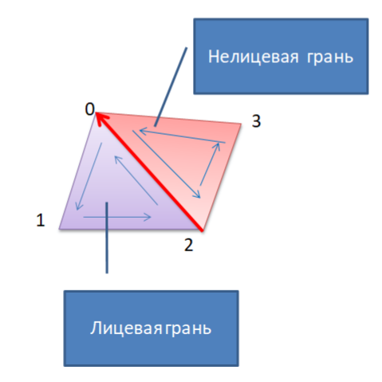
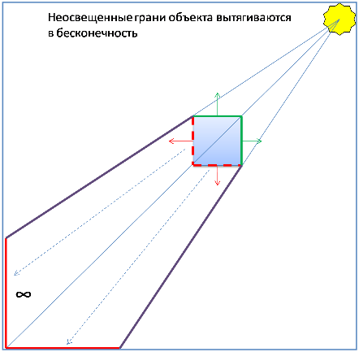
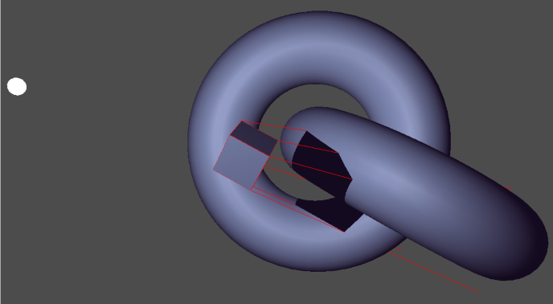
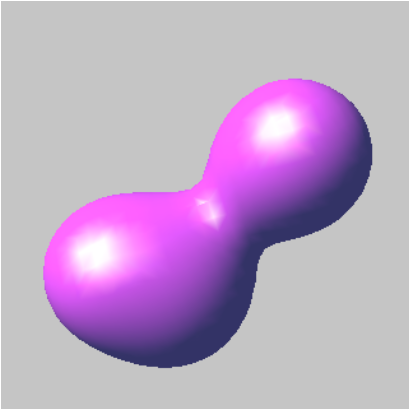
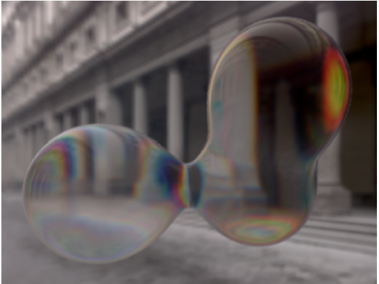

# **Оглавление**

[Лабораторная работа №11. Технологии визуализации теней в реальном времени. Визуализация замкнутых криволинейных поверхностей при помощи метасфер.](#_toc101941330)

&emsp;[Технология Stencil Shadow Volumes](#_toc101941331)

&emsp;&emsp;[Визуализация теневого объема куба](#_toc101941332)

&emsp;&emsp;[Визуализация сцены, содержащей отбрасывающие тень объекты](#_toc101941333)

&emsp;&emsp;[Анимация объектов](#_toc101941334)

&emsp;&emsp;[Результат работы программы](#_toc101941335)

&emsp;&emsp;[Визуализация теней от нескольких источников света](#_toc101941336)

&emsp;[Практические задания](#_toc101941339)

&emsp;&emsp;[Обязательные задания](#_toc101941340)

&emsp;&emsp;[Дополнительные задания](#_toc101941341)

# <a name="_toc101941330"></a>**Лабораторная работа №11. Технологии визуализации теней в реальном времени. Визуализация замкнутых криволинейных поверхностей при помощи метасфер.**

## <a name="_toc101941331"></a>**Технология Stencil Shadow Volumes**

Для иллюстрации технологии Stencil Shadow Volumes разработаем приложение, визуализирующее куб, отбрасывающий тени на окружающие его объекты. 

### <a name="_toc101941332"></a>**Визуализация теневого объема куба**

В качестве отбрасывающего тень объекта был выбран именно куб, поскольку данный геометрический объект легко представить в виде полигональной сетки. Описываемая технология может быть с легкостью адаптирована для использования при визуализации других объектов, задаваемых при помощи полигональных сеток.

В качестве основы воспользуемся классом **CCube**, разработанным в одной из предыдущих лабораторных работ. На следующем листинге приведен каркас видоизмененного класса CCube (изменения и дополнения выделены цветом).

```cpp
class CCube
{
public:
	enum CubeSide
	{
		CS_NEGATIVE_X,
		CS_POSITIVE_X,
		CS_NEGATIVE_Y,
		CS_POSITIVE_Y,
		CS_NEGATIVE_Z,
		CS_POSITIVE_Z,

		CS_MIN_CUBE_SIDE_INDEX = CS_NEGATIVE_X,
		CS_MAX_CUBE_SIDE_INDEX = CS_POSITIVE_Z,
	};
public:
	CCube(float size = 1);
	void Draw()const;
	void DrawShadowVolume(
		CVector3f const& lightPosition, float extrusionFactor)const;
	void SetSideColor(
		CubeSide side, GLubyte r, GLubyte g, GLubyte b, GLubyte a = 255);
private:
	// Рисуем боковые стороны теневого объема
	void DrawShadowVolumeSides(
		CVector3f const& lightPosition, float extrusionFactor)const;

	// Рисуем верх и низ теневого объема
	void DrawShadowVolumeCaps(
		CVector3f const& lightPosition, float extrusionFactor)const;

	// выполняем инициализицию информации о ребрах
	static void InitEdges();

	// Размер куба
	float m_size;

	// Цвета сторон куба
	GLubyte m_sideColors[6][4];

	// Массив вершин куба
	static const float m_vertices[8][3];

	// Массив граней губа
	static const unsigned short m_faces[6][4];
	static const size_t m_faceCount;

	// Информация о ребре полигональной сетки
	struct Edge
	{
		// индексы вершин, составляющих ребро
		short vStart, vEnd;

		// нормали прилегающих к ребру граней
		// frontFaceNormal - нормаль грани, в состав которой вершины 
		// ребра входят в последовательности vStart, vEnd
		// backFaceNormal - нормаль грани, в состав которой вершины
		// ребра входя в последовательности vEnd, vStart
		CVector3f frontFaceNormal;
		CVector3f backFaceNormal;

		// была ли задана нелицевая нормаль прилегающей грани
		// (используется при сборе информации о ребрах)
		bool backFaceNormalIsDefined;
	};

	// Массив ребер куба
	static std::vector<Edge> m_edges;
};
```

#### ***Сбор информации о ребрах полигональной сетки***

Технология Shadow Volumes предполагает выделение **силуэтных**[^1] ребер полигональной сетки, поэтому для построения теневого объема необходимо выделить из информации о вершинах и гранях сетки еще и информацию о ребрах. 

Подразумевается, что все грани рассматриваемых нами полигональных сеток имеют одинаковый порядок обхода вершин.

Для сбора информации о ребрах полигональной сетки предположим, что каждое ребро соединяет две и только две грани, что, в частности, требует отсутствия «дыр» в сетке. Многие полигональные сетки удовлетворяют данному требованию. 

Для определения того, является ребро силуэтным или не является необходимо знать нормали прилегающих к ребру граней. Поэтому с каждым ребром необходимо будет связать индексы лицевой и нелицевой прилегающих граней. Лицевой гранью ребра будет считаться та, в которой индексы начальной и конечной вершины ребра встречаются в прямом порядке. Например, на следующем рисунке грань 0-1-2 является лицевой гранью ребра  2-0, т.к. вершины 2 и 0 входят в данную грань в прямом направлении (совпадающем с направлением обхода вершин). Вторая грань (0-2-3) всегда будет являться нелицевой (вершины 2 и 0 в ней не совпадают с порядком обхода вершин грани).



Можно предложить следующий алгоритм сбора информации о ребрах полигональной сетки.

1. Для всех граней полигональной сетки
   
    a. Для каждой вершины грани
	
	- Текущая и следующая вершины грани могут сформировать новое ребро, либо дополнить уже существующее
	
	- Ищем среди ранее найденных ребер ребро, содержащее пару обрабатываемых вершин
		
	- Если ребро не нашли, то добавляем новое ребро, установив в качестве нормали лицевой грани нормаль текущей грани
	
	- Если же ребро нашли, то убеждаемся, что вершины ребра в него входят в обратном порядке (т.е. грань является по отношению к текущему ребру нелицевой) и задаем в качестве нормали нелицевой грани ребра нормаль текущей грани
2. Поскольку среди найденных ребер могут оказаться те, для которых нормаль нелицевой грани не задана (это произойдет в том случае, если сетка не удовлетворяет необходимым требованиям), удаляем данные не полностью заданные ребра из массива ребер.

```cpp
	/*
	   Y
	   |
	   |
	   |
	   +---X
	  /
	 /
	Z
	   3----2
	  /    /|
	 /    / |
	7----6  |
	|  0 |  1
	|    | /
	|    |/
	4----5
*/
// Массив координат вершин
const float CCube::m_vertices[8][3] = 
{
	{-1, -1, -1},	// 0
	{+1, -1, -1},	// 1
	{+1, +1, -1},	// 2
	{-1, +1, -1},	// 3
	{-1, -1, +1},	// 4
	{+1, -1, +1},	// 5
	{+1, +1, +1},	// 6
	{-1, +1, +1},	// 7
};

// Массив координат граней (в порядке, совпадающем с 
// порядком объявления их в массиве цветов)
// индексы вершин граней перечисляются в порядке их обхода
// против часовой стрелки (если смотреть на грань снаружи)
const unsigned short CCube::m_faces[6][4] = 
{
	{4, 7, 3, 0},	// грань x<0
	{5, 1, 2, 6},	// грань x>0
	{4, 0, 1, 5},	// грань y<0
	{7, 6, 2, 3},	// грань y>0
	{0, 3, 2, 1},	// грань z<0
	{4, 5, 6, 7},	// грань z>0
};
const size_t CCube::m_faceCount = sizeof(m_faces) / sizeof(*m_faces);

std::vector<CCube::Edge> CCube::m_edges;

void CCube::InitEdges()
{
	// пробегаем по всем граням
	for (size_t faceIndex = 0; faceIndex < m_faceCount; ++faceIndex)
	{
		const unsigned short * face = m_faces[faceIndex];

		// Вычисляем нормаль к грани
		CVector3f v0 = CVector3f(m_vertices[face[0]]);
		CVector3f v1 = CVector3f(m_vertices[face[1]]);
		CVector3f v2 = CVector3f(m_vertices[face[2]]);
		CVector3f normal = Cross(v1 - v0, v2 - v0);

		// пробегаем по всем вершинам грани
		for (size_t vertexIndex = 0; vertexIndex < 4; ++vertexIndex)
		{
			const unsigned short startVertex = face[vertexIndex];
			const unsigned short endVertex = face[(vertexIndex + 1) % 4];

			// Ищем среди существующих ребер ребро, 
			// содержащее вершины startVertex и endVertex
			size_t edgeIndex;
			for (edgeIndex = 0; edgeIndex < m_edges.size(); ++edgeIndex)
			{
				Edge & edge = m_edges[edgeIndex];
				if (
					(edge.vStart == startVertex && edge.vEnd == endVertex) ||
					(edge.vStart == endVertex && edge.vEnd == startVertex)				
					)
				{
					break;
				}
			}
			if (edgeIndex == m_edges.size()) // такого ребра нет
			{
				// добавляем новое ребро
				Edge newEdge;
				newEdge.vStart = startVertex;
				newEdge.vEnd = endVertex;
				newEdge.frontFaceNormal = normal;
				newEdge.backFaceNormalIsDefined = false;
				m_edges.push_back(newEdge);
			}
			else
			{
				// такое ребро уже есть
				Edge & edge = m_edges[edgeIndex];
				if (!edge.backFaceNormalIsDefined &&
					(edge.vStart == endVertex && edge.vEnd == startVertex)
					)
				{
					// Добавляем нормаль нелицевой грани ребра
					edge.backFaceNormalIsDefined = true;
					edge.backFaceNormal = normal;
				}
			}
		}
	}
	// Удаляем ребра, для которых не задана нормаль нелицевой грани
	for (int edgeIndex = m_edges.size() - 1; edgeIndex >=0; --edgeIndex)
	{
		if (!m_edges[edgeIndex].backFaceNormalIsDefined)
		{
			m_edges.erase(m_edges.begin() + edgeIndex);
		}
	}
}
```

#### ***Рисуем боковые грани теневого объема***
Для того, чтобы визуализировать боковые грани теневого объема  необходимо  выбрать из всех граней сетки те, которые являются  силуэтными. Определив знак скалярного произведение вектора нормали к грани и вектора направления на источник света, можно определить освещенность грани. Ребра, соединяющие освещенную и неосвещенную грань, будут являться силуэтными. Из такого ребра необходимо «вытянуть» четырехугольник, задающий одну из боковых граней полигональной сетки. 

Отметим, что четвертая координата w вытягиваемой вершины, обращается в 0, что автоматически устремляет ее в бесконечность.

```cpp
void CCube::DrawShadowVolumeSides(
	CVector3f const& lightPosition, float extrusionFactor)const
{
	// Среди всех ребер ищем те, которые являются силуэтными
	for (size_t edgeIndex = 0; edgeIndex < m_edges.size(); ++edgeIndex)
	{
		Edge const& edge = m_edges[edgeIndex];

		// Вектор направления на источник света
		CVector3f lightDirection = 
			lightPosition - CVector3f(m_vertices[edge.vStart]) * m_size;

		// Определяем освещенность прилегающих к ребру граней
		bool frontFaceIsLit = Dot(edge.frontFaceNormal, lightDirection) > 0;

		bool backFaceIsLit = Dot(edge.backFaceNormal, lightDirection) > 0;

		if (frontFaceIsLit != backFaceIsLit) // Это силуэтное ребро?
		{
			// Вытягиваем вершину от источника света через ребро
			// на заданный фактор вытягивания
			CVector3f v0 = CVector3f(m_vertices[edge.vStart]) * m_size;
			CVector3f v0e = 
				v0 + (v0 - lightPosition) * extrusionFactor;

			CVector3f v1 = CVector3f(m_vertices[edge.vEnd]) * m_size;
			CVector3f v1e = 
				v1 + (v1 - lightPosition) * extrusionFactor;

			// Задаем вершины четырехугольника в зависимости от того,
			// какая из прилегающих граней освещена
			if (frontFaceIsLit)
			{
				glVertex3fv(v1);
				glVertex3fv(v0);
				// четвертая координата, равная 0, вытягивает вершину
				// в бесконечность
				glVertex4f(v0e.x, v0e.y, v0e.z, 0);
				glVertex4f(v1e.x, v1e.y, v1e.z, 0);
			}
			else
			{
				glVertex3fv(v0);
				glVertex3fv(v1);
				// четвертая координата, равная 0, вытягивает вершину
				// в бесконечность
				glVertex4f(v1e.x, v1e.y, v1e.z, 0);
				glVertex4f(v0e.x, v0e.y, v0e.z, 0);
			}
		}	
	}
}
```

#### ***Рисуем «верхнюю» и «нижнюю» части теневого объема***

Depth-fail алгоритм (алгоритм Кармака) требует рисования «верхней» и «нижней» частей теневого объема в дополнение к боковым граням. Для их рисования необходимо выполнить «вытягивание» неосвещенных граней сетки в бесконечность. Освещенные грани остаются на своем месте.


Вытягивание неосвещенных граней в «бесконечность»

```cpp
void CCube::DrawShadowVolumeCaps(
	CVector3f const& lightPosition, float extrusionFactor)const
{
	for (size_t faceIndex = 0; faceIndex < m_faceCount; ++faceIndex)
	{
		const unsigned short * face = m_faces[faceIndex];

		CVector3f v0 = CVector3f(m_vertices[face[0]]) * m_size;
		CVector3f v1 = CVector3f(m_vertices[face[1]]) * m_size;
		CVector3f v2 = CVector3f(m_vertices[face[2]]) * m_size;
		CVector3f v3 = CVector3f(m_vertices[face[3]]) * m_size;

		// нормаль к грани
		CVector3f faceNormal = Cross(v1 - v0, v2 - v0);

		// Вычисляем направление на источник света
		CVector3f lightDirection = lightPosition - v0;

		bool faceIsLit = Dot(faceNormal, lightDirection) > 0;

		float w = 1;
		if (!faceIsLit)	// Освещенная грань?
		{
			w = 0;	// вершины будут "вытягиваться" в бесконечность
			v0 += (v0 - lightPosition) * extrusionFactor;
			v1 += (v1 - lightPosition) * extrusionFactor;
			v2 += (v2 - lightPosition) * extrusionFactor;
			v3 += (v3 - lightPosition) * extrusionFactor;
		}

		glVertex4f(v0.x, v0.y, v0.z, w);
		glVertex4f(v1.x, v1.y, v1.z, w);
		glVertex4f(v2.x, v2.y, v2.z, w);
		glVertex4f(v3.x, v3.y, v3.z, w);
	}
}
```

Добавим в класс **CVector3** недостающий оператор +=.

```cpp
template <class T>
class CVector3
{
public:
	…

	CVector3 & operator+=(CVector3 const& v)
	{
		x += v.x;
		y += v.y;
		z += v.z;
		return *this;
	}
	…
};
```

При первом вызове метода **CCube::DrawShadowVolume** класс выполнит инициализацию массива с информацией о ребрах модели, а затем выполнит вызов методов визуализации боковых граней, «верха» и «низа».

```cpp
void CCube::DrawShadowVolume(
	CVector3f const& lightPosition, float extrusionFactor)const
{
	// Инициализируем информацию о ребрах при первом вызове
	if (m_edges.empty())
	{
		InitEdges();
	}
	glBegin(GL_QUADS);
	// Рисуем боковые грани теневого объема, вытягивая силуэтные ребра
	DrawShadowVolumeSides(lightPosition, extrusionFactor);

	// Рисуем "верхнюю" и "нижнюю" части теневого объема,
	// вытягивая неосвещенные грани объекта в бесконечность
	DrawShadowVolumeCaps(lightPosition, extrusionFactor);
	glEnd();
}
```

### <a name="_toc101941333"></a>**Визуализация сцены, содержащей отбрасывающие тень объекты**

В классе CMyApplication выделены методы, осуществляющие визуализацию сцены, источника света, а также теневого объема.

```cpp
class CMyApplication 
	: public CGLApplication
	, private IRotationControllerListener
{
public:
	CMyApplication(const char * title, int width, int height);
private:
	virtual void OnIdle();
	virtual void OnInit();
	virtual void OnDisplay();
	virtual void OnReshape(int width, int height);
	virtual void OnRotationControllerUpdate();
private:
	// Рисуем источник света в виде сферы
	void DrawLightSource()const;
	// Рисуем освещенную, либо неосвещенную сцену
	void DrawScene(bool enableLighting)const;
	// Рисуем теневой объем куба
	void DrawShadowVolume()const;
	// Рисуем ребра теневого объема куба
	void DrawShadowVolumeEdges	()const;
private:
	CCube m_cube;

	// Параметры камеры (ZFAR = +бесконечность)
	static const double FOV;
	static const double ZNEAR;

	// Коэффициент вытягивания силуэтных граней
	static const float EXTRUSION_FACTOR;

	// Контроллеры вращения и анимации
	CRotationController m_rotationController;
	CAnimationController m_animationController;

	// Точечный источник света и его положение в пространстве
	COmniLight m_light;
	CVector3f m_lightPosition;

	// Материал объектов сцены
	CMaterial m_material;

	// Фаза анимации источника света (0..2pi)
	float m_lightAnimationPhase;

	// Фаза анимации (угол вращения) торов
	float m_torusAnimationPhase;
};
```
#### ***Установка матрицы проецирования***

Алгоритм Кармака может приводить к визуальным артефактам при  отсечении теневого объема дальней плоскостью отсечения. 


Вытягивание дальних вершин теневого объема в бесконечность позволяет решить данную проблему. Однако предварительно требуется подготовить матрицу проецирования должным образом, для случая 
$z_{far}\to\infty$. 
 Данную матрицу можно получить из обычной матрицы проецирования путем замены в ней двух коэффициентов.

$$ P = 
\begin{pmatrix}
	\frac{2N}{right - left} & 0 & \frac{right+left}{right-left} & 0\\
	0 & \frac{2N}{top-bottom} & \frac{top+bottom}{top-bottom} & 0\\
	0 & 0 & -\frac{F+N}{F-N} & \frac{-2FN}{F-N}\\
	0 & 0 & -1 & 0
\end{pmatrix}$$

$$ P_{inf} = \lim\limits_{F\to\infty} P = 
\begin{pmatrix}
	\frac{2N}{right - left} & 0 & \frac{right+left}{right-left} & 0\\
	0 & \frac{2N}{top-bottom} & \frac{top+bottom}{top-bottom} & 0\\
	0 & 0 & -1 & -2N\\
	0 & 0 & -1 & 0
\end{pmatrix} $$

Проделаем данные действия в обработчике события OnReshape.

```cpp
const double CMyApplication::FOV = 60;
const double CMyApplication::ZNEAR = 1;

...

void CMyApplication::OnReshape(int width, int height)
{
	// Задаем порт просмотра размером с клиентскую область окна
	glViewport(0, 0, width, height);

	// Вычисляем соотношение сторон окна
	double aspect = double(width) / height;

	glMatrixMode(GL_PROJECTION);
	glLoadIdentity();
	// Устанавливаем матрицу проецирования
	gluPerspective(FOV, aspect, ZNEAR, ZNEAR + 1);

	// Получаем коэффициенты матрицы проецирования
	double projectionMatrix[4][4];
	glGetDoublev(GL_PROJECTION_MATRIX, &projectionMatrix[0][0]);

	// И корректируем их для случая бесконечно удаленной дальней
	// плоскости отсечения
	projectionMatrix[2][2] = -1;
	projectionMatrix[3][2] = -2 * ZNEAR;

	// Загружаем модифицированную матрицу проецирования
	glLoadMatrixd(&projectionMatrix[0][0]);

	glMatrixMode(GL_MODELVIEW);
}
```

#### ***Инициализация приложения***

В конструкторе класса задаются параметры источника света и материала, а также выполняется подписка на события контроллера вращения.

```cpp
CMyApplication::CMyApplication(const char * title, int width, int height)
:CGLApplication(title, width, height, true, true)
,m_rotationController(width, height)
,m_lightAnimationPhase(0)
,m_torusAnimationPhase(0)
{
	AddEventListener(&m_rotationController);
	m_rotationController.AddEventListener(this);

	m_light.SetAmbientIntensity(0.2f, 0.2f, 0.2f);	m_light.SetPosition(CVector3f(3, 3, 2));

	m_material.SetShininess(30);
	m_material.SetAmbient(0.2, 0.1, 0.3);
	m_material.SetDiffuse(0.5, 0.6, 0.7);
	m_material.SetSpecular(0.3, 0.3, 0.3);
}

void CMyApplication::OnInit()
{
	glClearColor(0.3, 0.3, 0.3, 1);
	glLoadIdentity();
	CMatrix4d modelView;
	modelView.LoadLookAtRH(
		0, 0, 10, 
		0, 0, 0, 
		0, 1, 0);
	m_rotationController.SetModelViewMatrix(modelView);

	glEnable(GL_CULL_FACE);

	glEnable(GL_DEPTH_TEST);
}
```

#### ***Визуализация кадра***

Визуализация кадра состоит из нескольких этапов
- Сначала рисуется сам источник света, представленный в виде яркой сферы
- Сцена рисуется при отключенном освещении. Точнее, при фоновом освещении, равномерно заполняющем пространство
- При отключенной записи в буфер цвета и глубины рисуются теневые объемы всех объектов, отбрасывающих тень. В нашем случае таким объектом будет только куб
- Сцена рисуется при включенном освещении (включаются диффузная и зеркальная составляющая источника света) в тех местах, где в буфере трафарета отсутствуют тени. Тест глубины проходит успешно в том случае, когда глубина фрагмента равна глубине из буфера глубины. 
- На последнем, опциональном, этапе нарисуем ребра теневого объема.

```cpp
void CMyApplication::OnDisplay()
{
	glClear(GL_COLOR_BUFFER_BIT | GL_DEPTH_BUFFER_BIT | GL_STENCIL_BUFFER_BIT);
	
	glLoadMatrixd(m_rotationController.GetModelViewMatrix());

	// Рисуем источик света в виде сферы
	DrawLightSource();

	// Рисуем сцену без источников света
	DrawScene(false);

	// Рисуем теневой объем
	glColorMask(GL_FALSE, GL_FALSE, GL_FALSE, GL_FALSE);
	glDepthMask(GL_FALSE);
	glDisable(GL_LIGHTING);
	DrawShadowVolume();

	// Рисуем сцену со включенным источником света
	glColorMask(GL_TRUE, GL_TRUE, GL_TRUE, GL_TRUE);
	glDepthMask(GL_TRUE);
	glStencilFunc(GL_EQUAL, 0, ~0);
	glStencilOp(GL_KEEP, GL_KEEP, GL_KEEP);
	glDepthFunc(GL_EQUAL);
	DrawScene(true);
	glDepthFunc(GL_LESS);
	glDisable(GL_STENCIL_TEST);
	
	// Рисуем ребра граней теневого объема
	DrawShadowVolumeEdges();
}
```

#### ***Визуализация сцены***

Данный метод выполняет визуализацию объектов сцены, предварительно включив или выключив диффузный и зеркальный свет в зависимости от значения параметра **enableLighting**.

```cpp
void CMyApplication::DrawScene(bool enableLighting)const
{
	// Активизируем материал
	m_material.Activate(GL_FRONT);

	// Задаем параметры источника света
	glEnable(GL_LIGHTING);
	glEnable(GL_LIGHT0);

	COmniLight light(m_light);
	light.SetPosition(m_lightPosition);
	if (!enableLighting)
	{
		// При выключенном освещении источник света 
		// испускает только фоновый свет
		light.SetDiffuseIntensity(0, 0, 0);
		light.SetSpecularIntensity(0, 0, 0);
	}
	light.SetLight(GL_LIGHT0);

	// Рисуем куб
	m_cube.Draw();

	// Рисуем пару сцепленных торов
	glPushMatrix();
	glTranslatef(-2, -8, -2);
	glRotatef(m_torusAnimationPhase, 1, 0, 0);
	glutSolidTorus(1.5, 4, 30, 60);
	glTranslatef(-4, 0, 0);
	glRotatef(90, 1, 0, 0);
	glutSolidTorus(1.5, 4, 30, 60);
	glPopMatrix();
}
```

#### ***Визуализация теневого объема***

Теневой объем рисуется при включенном тесте трафарета. Согласно Depth-fail алгоритма, значение в буфере трафарета инкрементируется для фрагментов нелицевых граней, не прошедших тест  глубины, и декрементируется для фрагментов лицевых граней, не прошедших тест глубины. Содержимое буфера цвета и глубины при этом не изменяется.

Для того, чтобы не рисовать грани теневого объема дважды, можно воспользоваться расширением [GL_EXT_stencil_two_side](https://registry.khronos.org/OpenGL/extensions/EXT/EXT_stencil_two_side.txt), позволяющего задать различные операции и функции трафарета для лицевых и нелицевых граней.

Стандартные операции инкремента и декремента значений буфера трафарета работают по принципу насыщения[^2], что может вызвать нежелательные артефакты при использовании упомянутого расширения. Для их устранения можно использовать в качестве начального значения буфера трафарета число $2^{n-1}$, либо расширение [GL_EXT_stencil_wrap](https://registry.khronos.org/OpenGL/extensions/EXT/EXT_stencil_wrap.txt), вводящее операции циклического (т.е. без насыщения) инкремента и декремента значений буфера трафарета.

С целью упрощения кода в нашей реализации однопроходная визуализация теневого объема будет использоваться только при поддержке обоих упомянутых расширений, а для очистки буфера трафарета будет использоваться значение, равное 0.

```cpp
// Величина вытягивания вершин
const float CMyApplication::EXTRUSION_FACTOR = 100;

void CMyApplication::DrawShadowVolume()const
{
	glEnable(GL_STENCIL_TEST);
	glStencilFunc(GL_ALWAYS, 0, 0);

	// Задаем операции циклического либо нециклического инкремента
	// и декремента в зависимости от наличия расширения GL_EXT_stencil_wrap
	GLenum incrOp = GLEW_EXT_stencil_wrap ? GL_INCR_WRAP_EXT : GL_INCR;
	GLenum decrOp = GLEW_EXT_stencil_wrap ? GL_DECR_WRAP_EXT : GL_DECR;

	// Есть ли поддержка раздельных операций над буфером трафарета
	// для лицевых и нелицевых граней, а также оборачивания при
	// инкременте/декременте?
	if (GLEW_EXT_stencil_two_side && GL_EXT_stencil_wrap)
	{
		// Теневой объем будет нарисован за один этап

		// Включаем двусторонний тест трафарета
		glEnable(GL_STENCIL_TEST_TWO_SIDE_EXT);

		// Фрагменты нелицевых граней, не прошедшие тест глубины,
		// будут увеличивать значения в буфере трафарета
		glActiveStencilFaceEXT(GL_BACK);
		glStencilOp(GL_KEEP, GL_INCR_WRAP_EXT, GL_KEEP);
		glStencilFunc(GL_ALWAYS, 0, ~0);

		// Фрагменты лицевых граней, не прошедшие тест глубины,
		// будут уменьшать значения в буфере трафарета
		glActiveStencilFaceEXT(GL_FRONT);
		glStencilOp(GL_KEEP, GL_DECR_WRAP_EXT, GL_KEEP);
		glStencilFunc(GL_ALWAYS, 0, ~0);

		// Рисуем теневой объем, выключив режим отбраковки граней
		glDisable(GL_CULL_FACE);
		m_cube.DrawShadowVolume(m_lightPosition, EXTRUSION_FACTOR);

		// Включаем режим отбраковки граней
		glEnable(GL_CULL_FACE);
		// Выключаем двусторонний тест трафарета
		glDisable(GL_STENCIL_TEST_TWO_SIDE_EXT);
	}
	else	// Требуемые расширения не поддерживаются
	{
		// Теневой объем будет нарисован в два этапа

		// Рисуем нелицевые грани, увеличивая значения в буфере трафарета
		// при непрохождении теста глубины
		glCullFace(GL_FRONT);
		glStencilOp(GL_KEEP, incrOp, GL_KEEP);
		m_cube.DrawShadowVolume(m_lightPosition, EXTRUSION_FACTOR);

		// Рисуем лицевые грани, уменьшая значения в буфере трафарета
		// при непрохождении теста глубины
		glCullFace(GL_BACK);
		glStencilOp(GL_KEEP, decrOp, GL_KEEP);
		m_cube.DrawShadowVolume(m_lightPosition, EXTRUSION_FACTOR);
	}
}
```

Для визуализации ребер теневого объема просто нарисуем его в режиме рисования граней GL_LINE.

```cpp
void CMyApplication::DrawShadowVolumeEdges()const
{
	glDisable(GL_LIGHTING);
	glColor3f(1, 0, 0);
	glDisable(GL_CULL_FACE);
	glPolygonMode(GL_FRONT_AND_BACK, GL_LINE);
	m_cube.DrawShadowVolume(m_lightPosition, EXTRUSION_FACTOR);
	glPolygonMode(GL_FRONT_AND_BACK, GL_FILL);
	glEnable(GL_CULL_FACE);	
}
```

#### ***Визуализация источника света***

Для визуализации источника света нарисуем при отключенном освещении белую сферу с центром. 

```cpp
void CMyApplication::DrawLightSource()const
{
	// Рисуем источник света
	glDisable(GL_LIGHTING);
	glColor3f(1, 1, 1);
	glPushMatrix();
	glTranslatef(m_lightPosition.x, m_lightPosition.y, m_lightPosition.z);
	glutSolidSphere(0.1, 15, 10);
	glPopMatrix();
}
```

### <a name="_toc101941334"></a>**Анимация объектов**

Анимация объектов (вращение торов) будет осуществляться в обработчике события OnIdle.

```cpp
void CMyApplication::OnIdle()
{
	m_animationController.Tick();

	static const float LIGHT_ANIMATION_SPEED = 40.0f * M_PI / 180.0f;

	m_lightAnimationPhase = fmodf(
		m_lightAnimationPhase + 
		LIGHT_ANIMATION_SPEED * m_animationController.GetTimeDelta() * 0.001, 
		2 * M_PI);

	static const float LIGHT_ROTATION_RADIUS = 3;
	m_lightPosition.x = 
		cosf(m_lightAnimationPhase) * LIGHT_ROTATION_RADIUS + 2;
	m_lightPosition.y = 
		sinf(m_lightAnimationPhase) * LIGHT_ROTATION_RADIUS + 2;
	m_lightPosition.z = 
		sin(m_lightAnimationPhase * 2) * LIGHT_ROTATION_RADIUS + 1;

	static const float TORUS_ANIMATION_SPEED = 56;
	m_torusAnimationPhase = fmodf(
		m_torusAnimationPhase + 
		TORUS_ANIMATION_SPEED * m_animationController.GetTimeDelta() * 0.001, 
		360);

	PostRedisplay();
}
```

### <a name="_toc101941335"></a>**Результат работы программы**



Текущее решение требует, чтобы координаты источника света и координаты вершин теневого объема были заданы в одной и той же системе координат. В реальных ситуациях источники света задаются в своих системах координат, а объекты – в своих. Перед тем, как выполнять построение теневого объема необходимо привести координаты источника и объекта в одну и ту же систему координат. 

Сделать это можно следующим образом. Предположим, что $L$ – матрица трансформации источника света, а матрица $M$ – матрица трансформации вершин объекта, то перевод векторов и точек из системы координат $L$ в систему координат $M$ будет осуществлять матрица $K$, равная:

$$ K = ML^{-1}$$

Иными словами, зная матрицу $L$ моделирования-вида, которая использовалась при задании положения источника света, и матрицу $M$ моделирования-вида, используемую при задании объекта, координаты источника света перед передачей их в метод построения теневого объема, необходимо предварительно умножить на матрицу, обратную матрице $L$. Явно умножать на матрицу $M$ (матрицу моделирования-вида) координаты вершин построенного теневого объема не нужно, т.к. это преобразование будет выполнено OpenGL в процессе стандартной обработки вершин.

В случае, если $L$ - ортонормированная матрица аффинных преобразований (т.е. является композицией преобразований вращения и переноса), ее инвертирование может быть выполнено гораздо проще:


$$ L^{-1} = 
\begin{pmatrix}
	a & b & c& D
\end{pmatrix}^{-1} = 
\begin{pmatrix}
	a_x & b_x & c_x & d_x\\
	a_y & b_y & c_y & d_y\\
	a_z & b_z & c_z & d_z\\
	0 & 0 & 0 & 1
\end{pmatrix}^{-1} = 


\begin{pmatrix}
	a_x & a_y & a_z & -d*a\\
	b_x & b_y & b_z & -d*b\\
	c_x & c_y & c_z & -d*c\\
	0 & 0 & 0 & 1
\end{pmatrix} = $$


$$=\begin{pmatrix}
	a_x & a_y & a_z & -(a_xd_x + a_yd_y + a_zd_z)\\
	b_x & b_y & b_z & -(b_xd_x + b_yd_y + b_zd_z)\\
	c_x & c_y & c_z & -(c_xd_x + c_yd_y + c_zd_z)\\
	0 & 0 & 0 & 1
\end{pmatrix}$$

### <a name="_toc101941336"></a>**Визуализация теней от нескольких источников света**

Разработанное приложение визуализирует тени только от одного источника света. При наличии нескольких источников света построение теневых объемов и рисование освещенной части сцены потребуется выполнить по одному разу для каждого источника. При этом потребуется включить режим аддитивного смешивания цветов[^3]. Кроме того, фоновый свет источников света понадобится включить только для рисования неосвещенной сцены, а при рисовании освещенных фрагментов сцены следует использовать только диффузное и зеркальное освещение.

## <a name="_toc101941339"></a>**Практические задания**

Для получения оценки «**удовлетворительно**» необходимо выполнить все обязательные задания, набрав не менее **60 баллов**.

Для получения оценки «**хорошо**» необходимо выполнить все обязательные задания и часть дополнительных набрав не менее **150 баллов**.

Для получения оценки «**отлично**» необходимо выполнить все обязательные задания и часть дополнительных набрав не менее **400 баллов**.

### <a name="_toc101941340"></a>**Обязательные задания**

#### ***Задание 1***

Разработайте с использованием OpenGL приложение, визуализирующее сцену, соответствующую одному из следующих вариантов.

##### Вариант 1 –  Реализация технологии Stencil Shadow Volumes – 100 баллов

Разработайте OpenGL-приложение, визуализирующее несколько (не менее трех) достаточно сложных трехмерных моделей, загружаемых из .3ds-файлов. Объекты должны освещаться движущимся по сцене точечным источником света и отбрасывать тени, визуализируемые при помощи технологии Stencil Shadow Volumes (с использованием Depth-fail алгоритма). Объекты должны динамически изменять свое положение относительно друг друга и источника света, а также ориентацию в пространстве.

При визуализации объектов должны учитываться характеристики их материалов (зеркальный и диффузный цвет). Каждая модель должна использовать не менее 2 различных материалов.

Пользователь должен иметь возможность вращения камеры вокруг сцены.

###### *Бонус в 20 баллов за наличие текстуры на объектах*

Бонус начисляется за детализацию цвета поверхности трехмерных моделей с помощью текстуры.

###### *Бонус в 100 баллов за построение теневых объемов при помощи GPU*

Бонус начисляется за построение теневых объемов средствами графического ускорителя. Технология построения теневых объемов с помощью вершинного шейдера описана в лекции. Если ваша видеокарта поддерживает геометрические шейдеры, появившиеся в OpenGL 3.2, построение теневого объема на GPU можно выполнить с их помощью практически так же, как это выполняется средствами центрального процессора.

###### *Бонус в 20 баллов за визуализацию теней от нескольких источников света*

Бонус начисляется за присутствие в сцене нескольких (от 3 до 8) движущихся источников света, освещающих объекты.

###### *Бонус в 20 баллов за визуализацию моделей с использованием попиксельного диффузного и зеркального освещения*

Бонус начисляется за расчет диффузного и зеркального освещения объектов во фрагментного шейдера.

###### *Бонус в 30 баллов за передачу микрорельефа поверхности с использованием технологии bump mapping.*

Бонус начисляется за передачу деталей поверхности некоторых моделей с использованием технологии bump mapping.

##### Вариант 2 – Визуализация систем частиц – до 60 баллов

Разработайте OpenGL-приложение, визуализирующее анимированную трехмерную сцену, содержащую помимо нескольких достаточно сложных 3D объектов систему частиц.

- Салют в ночном городе
- Космический корабль, летящий в космосе вблизи кометы
- Зимний пейзаж с падающими снежинками
- Дом, из трубы которого идет дым
- Полет самолета в облаках
- Ракета, летящая в космосе. Из сопел ракеты вырывается струя раскаленных газов.

Допускаются альтернативные варианты сцен после предварительного согласования темы с преподавателем.

При оценке работы внимание будет обращаться на **зрелищность и реалистичность** визуализируемой трехмерной сцены (в особенности, системы частиц).

Объекты сцены должны быть освещены одним или несколькими источниками света (подберите параметры освещения таким образом, чтобы сцена выглядела от этого достаточно реалистично).

Программа должна позволять просматривать сцену с различных точек путем управления положением камеры с помощью мыши.

###### *Бонус в 20 баллов за попиксельный расчет освещения объектов сцены*

Бонус в начисляется за попиксельный расчет освещения объектов сцены с использованием шейдеров

###### *Бонус в 30 баллов за передачу микрорельефа поверхности с использованием технологии bump mapping.*

Бонус начисляется за передачу деталей поверхности некоторых моделей с использованием технологии bump mapping.

###### *Бонус в 50 баллов за вычисление анимации частиц на GPU*

Бонус начисляется за применение технологий, позволяющих вычислить анимацию частиц на стороне видеокарты с использованием вершинных (и, возможно, геометрических) шейдеров.


### <a name="_toc101941341"></a>**Дополнительные задания**

#### ***Задание 2 – Реализация технологии Shadow Mapping – 150 баллов***

Разработайте OpenGL-приложение, визуализирующее трехмерную сцену, содержащую несколько (не менее 4) достаточно сложных трехмерных объектов, загружаемых их .3ds файлов. Объекты должны освещаться при помощи динамического источника света типа «прожектор» (spot light) и отбрасывать тени с использованием технологии Shadow mapping. Объекты должны динамически изменять свое положение относительно друг друга и источника света, а также ориентацию в пространстве.

###### *Бонус в 20 баллов за наличие текстуры на объектах*

Бонус начисляется за детализацию цвета поверхности трехмерных моделей с помощью текстуры.

###### *Бонус в 30 баллов за визуализацию теней от нескольких источников света*

Бонус начисляется за присутствие в сцене нескольких (не менее 3) движущихся источников света, освещающих объекты.

###### *Бонус в 20 баллов за визуализацию моделей с использованием попиксельного диффузного и зеркального освещения*

Бонус начисляется за расчет диффузного и зеркального освещения объектов во фрагментного шейдера.

###### *Бонус в 30 баллов за передачу микрорельефа поверхности с использованием технологии bump mapping.*

Бонус начисляется за передачу деталей поверхности некоторых моделей с использованием технологии bump mapping.

###### *Бонус в 20 баллов за использование рисунка, проецируемого от источника света на освещаемые им объекты*

Бонус начисляется за проецирование источником света  некоторого рисунка на освещаемые объекты подобно тому, как это происходит в случае с обычным проектором – помимо отбрасывания теней на неосвещенные участки, такой источник света проецирует некоторое изображение на освещаемые части объектов.

###### *Бонус в 100 баллов за применение подходов, уменьшающих алиасинг теней*

Бонус начисляется за применение одного из подходов визуализации с использованием теневых карт, уменьшающих алиасинг изображения:
- Perspective shadow maps
- Trapezoidal shadow maps
- Light space perspective shadow maps
- Parallel Split shadow maps
и им подобных

###### *Бонус в 100 баллов за применение подходов, уменьшающих резкость теней*

Бонус начисляется за применение одного из подходов, позволяющих уменьшить резкость теней, таких как
- Percentage Closer Filtering
- Smoothies
- Variance shadow maps
и им подобных.

#### ***Задание 3 – Визуализация изоповерхности скалярного поля с использованием технологии Marching Cubes – 200 баллов***

Разработайте приложение, выполняющее визуализирующее взаимодействие нескольких (10-20) капелек жидкости (еще их называют meta-balls) в невесомости. Каждая «капля жидкости» представляет собой движущийся по плавной траектории источник напряженности скалярного поля, создающий в пространстве напряженность, обратно пропорциональную квадрату расстояния между точкой пространства и центром капли.

 

Суммарная напряженность в данной точке пространства является суперпозицией (суммой) напряжений, создаваемых в данной точке всеми каплями.

Линия изоповерхности скалярного поля – поверхность, определяющая геометрическое место точек, в которых напряженность скалярного поля равна некоторой константной величине. Визуализация таких поверхностей (построение полигональной сетки, описывающей изоповерхность) обычно осуществляется при помощи технологий Marching Cubes либо Marching Tetrahedrons.

Изоповерхность должна визуализироваться с имитацией эффекта преломления и отражения окружающей среды в каплях с использованием кубических текстур, а также имитацию эффекта дисперсии. Вектор нормали, необходимый для вычисления отражения и преломления может быть найден путем вычисления градиента (или антиградиента) скалярного поля в вершинах полигональной сетки.

###### *Бонус в 100 баллов за наличие в сцене отражающего свет кристалла*

Бонус начисляется за наличие в сцене вращающегося и движущегося многогранника, каждая грань которого представляет собой плоское зеркало, отражающее часть сцены. В данном многограннике должно происходить отражение изоповерхности и окружающей среды.

Поскольку свет, находясь между двумя зеркальными объектами, испытывает многократное отражение то от одного, то от другого объекта, необходимо также передать данный эффект путем рендеринга сцены в несколько проходов.

1. В 6 изображений кубической текстуры №1 выполняется рендеринг sky box (sky sphere), а также кристалла. При рендеринге кристалла в его гранях также строится отражение skybox, а также отражение изоповерхности, в качестве текстуры окружающей среды которой используется оригинальная кубическая текстура (загруженная из файла). На данном этапе будет построено самое глубокое отражение.
2. В 6 изображений кубической текстуры №2 выполняется рендеринг sky box, а также кристалла. При рендеринге кристалла в его гранях также строится отражение skybox, а также отражение изоповерхности, но в качестве текстуры окружающей среды должна использоваться кубическая текстура №1, содержащая самое глубокое отражение. На данном этапе будет построено отражение, предшествующее самому глубокому. Кроме того, в отражении кристалла будет содержаться его собственное отражение в изоповерхности.
3. Данный шаг аналогичен предыдущему, только рендеринг будет осуществляться в кубическую текстуру №1, а в качестве текстуры окружающей среды для рисования отраженной изоповерхности в кристалле будет использоваться кубическая текстура №2. На данном этапе у нас глубина отражений будет еще больше.
4. Шаги 2 и 3 можно повторить еще 1-2 раза (при большем количестве повторений особой разницы заметно не будет). В результате будет получена кубическая текстура окружающей среды, содержащая отражения заданной глубины.
5. Сцена рисуется в основном буфере кадра. При этом в сцене наконец-то рисуется еще и оригинальная изоповерхность, а не только ее отражение. В качестве текстуры отражаемой/преломляемой окружающей среды используется текстура, в которой было построено отражение в самую последнюю очередь.


[^1]: Силуэтным считается ребро, соединяющие видимую и невидимую из положения источника света грани.

[^2]: Например, операция декремента, примененная к значению 0, не изменит содержимое буфера трафарета. Аналогичное действие будет у команды инкремента: по достижении значения 2разрядность буфера трафарета-1 содержимое буфера трафарета не будет изменяться под действием команды инкремента.

[^3]: В OpenGL такой режим задается функцией смешивания glBlendFunc(GL_ONE, GL_ONE)