# **Оглавление**
[Лабораторная работа №10. Вспомогательный буфер кадра. Обработка изображений при помощи шейдеров](#_toc342938578)

&emsp;[Вспомогательные буферы кадра](#_toc342938579)

&emsp;&emsp;[Терминология](#_toc342938580)

&emsp;&emsp;[Операции над буфером кадра](#_toc342938581)

&emsp;&emsp;[Небольшой рефакторинг существующих классов](#_toc342938582)

&emsp;&emsp;[Основы графического вывода во вспомогательный буфер кадра](#_toc342938583)

&emsp;[Реализация фильтров изображений при помощи шейдеров](#_toc342938584)

&emsp;&emsp;[Разрабатываем классы для управления буфером кадра и буфером визуализации](#_toc342938585)

&emsp;&emsp;[Разрабатываем шейдеры, выполняющие Гауссово размытие изображения](#_toc342938586)

&emsp;&emsp;[Разрабатываем класс фильтра «Гауссово размытие»](#_toc342938587)

&emsp;&emsp;[Обновляем класс CTextureLoader](#_toc342938588)

&emsp;&emsp;[Применяем фильтр размытия на практике](#_toc342938589)

&emsp;[Практические задания](#_toc342938590)

&emsp;&emsp;[Обязательные задания](#_toc342938591)

&emsp;&emsp;[Дополнительные задания](#_toc342938592)

&emsp;[Список литературы](#_toc342938593)

# <a name="_toc342938578"></a>**Лабораторная работа №10. Вспомогательный буфер кадра. Обработка изображений при помощи шейдеров**
## <a name="_toc342938579"></a>**Вспомогательные буферы кадра**
Основное предназначение OpenGL  - построение растрового изображения трехмерных и двухмерных объектов в буфере кадра. С буфером кадра связано несколько буферов, используемых OpenGL для построения растрового изображения объекта. К ним относятся:

- Буфер цвета (color buffer) – хранит информацию о цвете каждого фрагмента растрового изображения
- Буфер глубины (depth buffer) – хранит информацию о глубине каждого фрагмента
- Буфер трафарета (stencil buffer) – буфер, хранящий целочисленные значения определенной разрядности, связанные с каждым фрагментом растрового изображения
- Накопительный буфер (буфер аккумулятора, accumulation buffer) – дополнительный буфер цвета, который может использоваться для композиции содержимого нескольких изображений из буфера цвета. Не все реализации OpenGL поддерживают данный тип буфера, и очень редко встречаются реализации, поддерживающие его аппаратное ускорение.

Основной буфер кадра (или буфер кадра «по умолчанию») предоставляется OpenGL оконной системой.

Помимо основного буфера кадра, реализация OpenGL может поддерживать также вспомогательные буферы кадра, что дает программисту возможность выполнять рендеринг трехмерных объектов в текстуру,  а также выполнять копирование данных из одного буфера кадра в другой. Реализации OpenGL могут поддерживать вспомогательные буферы кадра при помощи расширения [GL_EXT_framebuffer_object](http://www.opengl.org/registry/specs/EXT/framebuffer_object.txt) и его логического последователя, расширения [GL_ARB_framebuffer_object](http://www.opengl.org/registry/specs/ARB/framebuffer_object.txt). В данном разделе будет рассмотрено расширение GL\_EXT\_framebuffer\_object[^1].

Начиная с версии 3.2 вспомогательные кадровые буферы стали частью функционала OpenGL.

На следующей диаграмме показано устройство буфера кадра. Буфер кадра содержит несколько точек привязки (для своего типа буферов), к которым можно присоединить текстуру либо буфер визуализации (Render buffer).

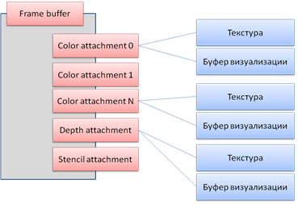
### <a name="_toc342938580"></a>**Терминология**
- **Изображение** (image) – двухмерный массив пикселей определенного формата
- **Многослойное изображение** (layered image) – последовательность изображений заданного размера
- **Текстура** (texture) – объект, содержащий некоторое количество изображений. Все изображения в текстуре имеют один и тот же формат, однако они могут иметь различные размеры (как, например, в случае мип-уровней). Текстура может быть привязана к шейдеру или к встроенному модулю наложения текстур и визуализирована
- **Буфер рендеринга** (render buffer) – объект, содержащий одно-единственное изображение. Буфер рендеринга не может быть привязан к шейдеру или визуализирован. Единственное, что с ним можно сделать – присоединить к буферу кадра
- **Изображение, присоединяемое к буферу кадра** (framebuffer-attachable image) – произвольное изображение, которое можно присоединить к буферу кадра
- **Многослойное изображение, присоединяемое к буферу кадра** (framebuffer-attachable layered image) – многослойное изображение, которое может быть присоединено к буферу кадра
- **Точка присоединения** (attachment point) – Именованное расположение внутри буфера кадра, к которому может быть присоединено изображение, присоединяемое у буферу кадра. Точки соединения могут иметь ограничения на формат изображений, присоединяемых к ним
- **Присоединение** (attachment) – соединение одного объекта с другим

### <a name="_toc342938581"></a>**Операции над буфером кадра**
#### ***Создание, привязка и удаление вспомогательного буфера кадра***
Перед тем, как создать вспомогательный буфер кадра, приложение должно сгенерировать для него уникальное имя (целочисленный идентификатор). Для этого расширение GL\_EXT\_framebuffer\_object предоставляет функцию **glGenFramebuffersEXT**, которая позволяет сгенерировать заданное количество имен буфера кадра.

По умолчанию используется буфер кадра, привязанный к окну, с именем, равным нулю. Для смены текущего буфера кадра служит функция **glBindFramebufferEXT**. Последующие операция управления буфером кадра будут производиться с выбранным буфером.

Удаление одного или нескольких буферов кадра осуществляется при помощи функции **glDeleteFramebuffersEXT**.
#### ***Создание, привязка и удаление буфера визуализации***
Создание буфера визуализации и привязка к нему осуществляются по схожему принципу. Сначала необходимо сгенерировать имя для буфера визуализации с помощью функции **glGenRenderbuffersEXT**. Затем можно выполнить к нему привязку при помощи функции **glBindRenderbufferEXT**. Для удаления одного или нескольких буферов визуализации служит функция **glDeleteRenderbuffersEXT**.
#### ***Присоединение текстуры к буферу кадра***
Текстура может быть присоединена к буферу кадра для использования в качестве одного из нескольких буферов цвета, буфера глубины либо буфера трафарета при помощи функции **glFramebufferTextureEXT**.
#### ***Присоединение буфера рендеринга к буферу кадра***
Как и текстура, буфер рендеринга может быть присоединен к буферу кадра в качестве буфера цвета, буфера глубины или буфера трафарета. Для этого используется функция **glFramebufferRenderbufferEXT**.
### <a name="_toc342938582"></a>**Небольшой рефакторинг существующих классов**
Прежде чем приступить к разработке приложений, хотелось бы внести ряд улучшений в некоторые из используемых в примерах классов.
#### ***Обновление механизма обработки событий***
Текущая реализация класса CGLApplication объявляет ряд виртуальных методов, вызываемых при получении определенных событий от библиотеки GLUT. Перегрузка виртуальных методов в наследниках класса CGLApplication позволяет классам конкретных приложений задавать собственные обработчики данных событий.

Тем не менее, часто возникает необходимость выполнить обработку событий от библиотеки GLUT не только в наследниках класса CGLApplication, например, в классе CMyApplication, но и в других классах. Например, CRotationController. Для этого нам приходилось в методы-обработчики событий класса CMyApplication добавлять код вызова необходимых методов класса CRotationController, что не совсем удобно.

Для улучшения архитектуры проекта изменим механизм оповещения классом CGLApplication о событиях от библиотеки GLUT, предоставив возможность экземплярам других классов подписываться на его события.

Введем шаблонный интерфейс IEventDispatcher, предоставляющий функционал по добавлению и удалению слушателей, реализующих интерфейс ListenerType, являющийся параметром шаблона IEventDispatcher.

```cpp
template <class ListenerType>
class IEventDispatcher
{
public:
    virtual void AddEventListener(ListenerType * pListener) = 0;
    virtual void RemoveEventListener(ListenerType * pListener) = 0;
protected:
    IEventDispatcher(void){}
    virtual ~IEventDispatcher(void){}
};
```

Конструктор и деструктор объявлены защищенными, чтобы сделать их доступными только для классов, реализующих интерфейс IEventDispatcher, и исключить возможность случайного удаления слушателей через интерфейс IEventDispatcher. Также благодаря этому нет нужды делать деструктор виртуальным.

Для облегчения создания реализаций данного интерфейса, объявим шаблонный класс CEventDispatcherImpl, использующий для хранения указателей на объекты-слушатели контейнер «множество» библиотеки STL. Также данный класс объявляет шаблонный метод DispatchEvent, позволяющий  применить некоторый функциональный объект event ко всем  добавленным слушателям.

```cpp
template <class Base, class ListenerType>
class CEventDispatcherImpl : public Base
{
public:
    // Добавляем указатель на слушателя событий в коллекцию слушателей
    virtual void AddEventListener(ListenerType * pListener)
    {
        m_listeners.insert(pListener);
    }
    // Удаляем указатель на слушателя событий из коллекции слушателей
    virtual void RemoveEventListener(ListenerType * pListener)
    {
        Listeners::const_iterator it = m_listeners.find(pListener);
        if (it != m_listeners.end())
        {
            m_listeners.erase(it);
        }
    }
    // Рассылаем всем слушателям событие, информация о котором
    // хранится в функциональном объекте event
    template <class EventType>
    void DispatchEvent(EventType const& event)const
    {
        // Создаем копию множества слушателей, т.к. в процессе рассылки
        // уведомления о событии обработчик может удалить слушателя из множества,
        // что сделает невалидными итераторы, передаваемые в for_each
        Listeners listeners(m_listeners);
        // оператор () объекта event будет вызван столько раз, сколько
        // слушателей у диспетчера событий.
        // Параметром оператора () будет являться каждый из слушателей
        // из коллекции listeners
        std::for_each(listeners.begin(), listeners.end(), event);
    }
private:
    typedef std::set<ListenerType *> Listeners;
    Listeners m_listeners;
};
```

#### ***Объявляем интерфейс слушателя событий базового OpenGL-приложения***
Каркасный класс приложения CGLApplication будет оповещать своих слушателей о происходящих в нем событиях через интерфейс IApplicationListener, в котором для оповещения о каждом событии будет использоваться соответствующий чисто виртуальный метод.

```cpp
// Интерфейс "Слушатель событий от приложения"
class IApplicationListener
{
public:
    // Методы, вызываемые при наступлении определенных событий
    // в приложении
    virtual void OnDisplay() = 0;
    virtual void OnReshape(int width, int height) = 0;
    virtual void OnKeyboard(unsigned char key, int x, int y) = 0;
    virtual void OnSpecialKey(int key, int x, int y) = 0;
    virtual void OnMouse(int button, int state, int x, int y) = 0;
    virtual void OnMotion(int x, int y) = 0;
    virtual void OnIdle() = 0;
    virtual ~IApplicationListener(void){}
};
```

Классы, желающие получать уведомления от класса CGLApplication, должны будут реализовать данный интерфейс. Поскольку часто возникает необходимость обработки не всех, а только одного или нескольких событий, добавим шаблон CApplicationListenerImpl:

```cpp
// Класс, содержащий реализацию методов слушателя, используемую по умолчанию
template <class Base>
class CApplicationListenerImpl : public Base
{
    virtual void OnDisplay()
    {
    }

    virtual void OnReshape(int width, int height)
    {
    }

    virtual void OnKeyboard(unsigned char key, int x, int y)
    {
    }

    virtual void OnSpecialKey(int key, int x, int y)
    {
    }

    virtual void OnMouse(int button, int state, int x, int y)
    {
    }

    virtual void OnMotion(int x, int y)
    {
    }

    virtual void OnIdle()
    {
    }
};

typedef CApplicationListenerImpl<IApplicationListener> CApplicationListener;
```

#### ***Вводим интерфейс приложения IApplication***
Интерфейс IApplication определяет сущность «Приложение» на основе интерфейса диспетчера сообщений.

```cpp
class IApplicationListener;
class IApplication : public IEventDispatcher<IApplicationListener>
{
public:
    virtual void MainLoop(void) = 0;
    virtual ~IApplication(void){}
}; 
```

#### ***Обновляем каркасный класс  приложения***
Класс CGLApplication будет подвергнут ряду изменений. Прежде всего, данный класс будет являться диспетчером событий; поэтому унаследуем его от класса CEventDispatcherImpl. Кроме того, для облегчения перегрузки событий в классах-наследниках, он (а точнее, его потомки), одновременно, будет являться еще и их слушателем. Кроме того, добавим недостающий метод обработки события библиотеки GLUT о нажатии специальной[^2] клавиши.

```cpp
class CGLApplication
    : public CEventDispatcherImpl<IApplication, IApplicationListener>
    , private CApplicationListener
{
public:
    void MainLoop(void);
protected:
    CGLApplication(
        const char * title, 
        int width = 0, 
        int height = 0, 
        bool needDepth = true, 
        bool needStencil = false
        );
    virtual ~CGLApplication(void);

    virtual void OnInit();
    // Данный метод всегда должен быть перегружен
    virtual void OnDisplay() = 0;

    // Инициирует перерисовку изображения в окне
    void PostRedisplay();

    // Установка обработчика таймера
    typedef void (*TimerProc)(int value);
    void SetTimer(int milliseconds, TimerProc proc, int value);
private:
    void InitEventHandlers();

    static void DisplayHandler();
    static void ReshapeHandler(int width, int height);
    static void KeyboardHandler(unsigned char key, int x, int y);
    static void SpecialKeyHandler(int key, int x, int y);
    static void MouseHandler(int button, int state, int x, int y);
    static void MotionHandler(int x, int y);
    static void IdleHandler();
    static CGLApplication * m_pApplication;
};
```

В конструкторе класса CGLApplication добавим сам класс (и его наследников) в свои собственные слушатели. Это облегчит обработку сообщений в классах-наследниках, для чего им достаточно будет лишь перегрузить один из виртуальных методов, объявленные в интерфейсе IApplicationListener.

```cpp
CGLApplication* CGLApplication::m_pApplication = nullptr;

CGLApplication::CGLApplication(
    const char * title, 
    int width, 
    int height, 
    bool needDepth, 
    bool needStencil
    )
{
    // Только один экземпляр приложения разрешено создать
    if (m_pApplication)
    {
        assert(!"Only one instance of the application is permitted");
        return;
    }
    m_pApplication = this;

    // Добавляем себя в слушатели своих же событий, что облегчит
    // получение уведомлений о них классами-наследниками
    AddEventListener(this);

    // Инициализируем библиотеку GLUT, подсовывая ей
    // фиктивные параметры командой строки
    int argc = 1;
    char const* argv[] = { "" };
    glutInit(&argc, const_cast<char**>(argv));

    // Задаем режим буфера кадра, запрошенный пользователем
    glutInitDisplayMode(
        GLUT_RGBA |
        GLUT_DOUBLE |
        (needDepth ? GLUT_DEPTH : 0) |
        (needStencil ? GLUT_STENCIL : 0)
        );

    // Если пользователь указал размеры окна, сообщаем о них GLUT
    if (width > 0 && height > 0)
    {
        glutInitWindowSize(width, height);
    }

    // Создаем окно приложения
    glutCreateWindow(title);

    // Задаем обработчики событий
    InitEventHandlers();
}
```

В методе **InitEventHandlers** добавилась подписка на событие о нажатии специальной клавиши:

```cpp
void CGLApplication::InitEventHandlers()
{
    // Инициализируем обработчики часто используемых событий
    glutDisplayFunc(&DisplayHandler);
    glutReshapeFunc(&ReshapeHandler);
    glutKeyboardFunc(&KeyboardHandler);
    glutSpecialFunc(&SpecialKeyHandler);
    glutMouseFunc(&MouseHandler);
    glutMotionFunc(&MotionHandler);
    glutIdleFunc(&IdleHandler);
    // При желании можно добавить обработчики остальных
    // событий, поддерживаемых glut
}
```

Методы-обработчики событий также обновились. В данных методах объявляются классы, несущие информацию о событии. При вызове оператора () данные классы выполняют вызов соответствующего метода слушателя.

```cpp
void CGLApplication::MotionHandler(int x, int y)
{
    // Событие о перемещении кнопки мыши мыши
    class CMotionEvent
    {
    public:
        CMotionEvent(int x, int y)
           :m_x(x), m_y(y)
        {
        }

        // Оператор () перенаправляет событие в метод OnMotion слушателя
        void operator()(IApplicationListener * pListener)const
        {
            pListener->OnMotion(m_x, m_y);
        }
    private:
        int m_x, m_y;
    };

    // Рассылаем событие всем слушателям
    m_pApplication->DispatchEvent(CMotionEvent(x, y));
}

void CGLApplication::MouseHandler(int button, int state, int x, int y)
{
    // Событие о нажатии/отпускании кнопки мыши мыши
    class CMouseEvent
    {
    public:
        CMouseEvent(int button, int state, int x, int y)
           :m_button(button), m_state(state), m_x(x), m_y(y)
        {
        }

        // Оператор () перенаправляет событие в метод OnMouse слушателя
        void operator()(IApplicationListener * pListener)const
        {
            pListener->OnMouse(m_button, m_state, m_x, m_y);
        }
    private:
        int m_button, m_state, m_x, m_y;
    };

    // Рассылаем событие всем слушателям
    m_pApplication->DispatchEvent(CMouseEvent(button, state, x, y));
}

void CGLApplication::DisplayHandler()
{
    // Событие о необходимости перерисовки окна
    class CDisplayEvent
    {
    public:
        // Оператор () перенаправляет событие в метод OnDisplay слушателя
        void operator()(IApplicationListener * pListener)const
        {
            pListener->OnDisplay();
        }
    };

    // Рассылаем событие всем слушателям
    m_pApplication->DispatchEvent(CDisplayEvent());
    // Обмениваем местами теневой и лицевой буферы кадра
    glutSwapBuffers();
}

void CGLApplication::IdleHandler()
{
    Sleep(1);

    // Событие о том, что приложению нечем заняться
    class CIdleEvent
    {
    public:
        // Оператор () перенаправляет событие в метод OnIdle слушателя
        void operator()(IApplicationListener * pListener)const
        {
            pListener->OnIdle();
        }
    };

    // Рассылаем событие всем слушателям
    m_pApplication->DispatchEvent(CIdleEvent());
}

void CGLApplication::ReshapeHandler(int width, int height)
{
    // Событие об изменении размеров окна
    class CReshapeEvent
    {
    public:
        CReshapeEvent(int width, int height)
            :m_width(width)
            , m_height(height)
        {
        }

        // Оператор () перенаправляет событие в метод OnReshape слушателя
        void operator()(IApplicationListener * pListener)const
        {
            pListener->OnReshape(m_width, m_height);
        }
    private:
        int m_width, m_height;
    };

    // Рассылаем событие всем слушателям
    m_pApplication->DispatchEvent(CReshapeEvent(width, height));
}

void CGLApplication::SpecialKeyHandler(int key, int x, int y)
{
    // Событие о нажатии специальной клавиши
    class CSpecialKeyEvent
    {
    public:
        CSpecialKeyEvent(int key, int x, int y)
           :m_key(key)
           , m_x(x)
           , m_y(y)
        {
        }
        // Оператор () перенаправляет событие в метод OnSpecialKey слушателя
        void operator()(IApplicationListener * pListener)const
        {
            pListener->OnSpecialKey(m_key, m_x, m_y);
        }
    private:
        int m_key;
        unsigned m_x, m_y;
    };

    // Рассылаем событие всем слушателям
    m_pApplication->DispatchEvent(CSpecialKeyEvent(key, x, y));
}

void CGLApplication::KeyboardHandler(unsigned char key, int x, int y)
{
    // Событие о нажатии клавиши на клавиатуре
    class CKeyboardEvent
    {
    public:
        CKeyboardEvent(unsigned char key, int x, int y)
           :m_key(key), m_x(x), m_y(y)
        {
        }
        // Оператор () перенаправляет событие в метод OnKeyboard слушателя
        void operator()(IApplicationListener * pListener)const
        {
            pListener->OnKeyboard(m_key, m_x, m_y);
        }
    private:
        unsigned char m_key;
        unsigned m_x, m_y;
    };

    // Рассылаем событие всем слушателям
    m_pApplication->DispatchEvent(CKeyboardEvent(key, x, y));
}
```

Проиллюстрируем использование событий на примере класса CRotationController
#### ***Совершенствуем класс CRotationController***
Рассмотрим усовершенствования класса CRotationController. Во-первых, данный класс будет являться слушателем класса CApplication, что позволит ему автоматически обновлять матрицу трансформации при движении мыши, а также следить за изменением размеров окна.

Во-вторых, он сам будет являться диспетчером событий и сможет уведомлять своих слушателей об изменении матрицы трансформации. Те, в свою очередь, например, могут инициировать процесс перерисовки экрана.

В-третьих, существующая реализация класса работает с текущей матрицей OpenGL, что усложняет его использование[^3] при планируемом изменении архитектуры. Кроме того, это плохо с точки зрения производительности, т.к. при получении текущей матрицы[^4] приложением OpenGL будет вынужден дождаться окончания выполнения[^5] предыдущих команд. Решить данные проблемы можно выполняя в классе CRotationController модификацию не текущей матрицы OpenGL, а просто какой-нибудь матрицы размером 4\*4.

Первое, что мы сделаем, объявим класс CMatrix4.

##### Разработка класса CMatrix4.
Данный шаблонный класс предназначен для хранения и обработки матриц 4\*4. В качестве элементов матрицы могут выступать числа с плавающей запятой как одинарной, так и двойной точности.

```cpp
template <class T>
class CMatrix4
{
public:
    CMatrix4(void)
    {
        LoadIdentity();
    }

    CMatrix4(T const * src)
    {
        memcpy(data, src, sizeof(data));
    }

    operator const T*()const
    {
        return &data[0];
    }

    operator T*()
    {
        return &data[0];
    }

    // Произведение матриц
    CMatrix4& operator*=(CMatrix4 const& rhs)
    {
        T result[4][4];

        result[0][0] = a00*rhs.a00 + a01*rhs.a10 + a02*rhs.a20 + a03*rhs.a30;
        result[0][1] = a10*rhs.a00 + a11*rhs.a10 + a12*rhs.a20 + a13*rhs.a30;
        result[0][2] = a20*rhs.a00 + a21*rhs.a10 + a22*rhs.a20 + a23*rhs.a30;
        result[0][3] = a30*rhs.a00 + a31*rhs.a10 + a32*rhs.a20 + a33*rhs.a30;

        result[1][0] = a00*rhs.a01 + a01*rhs.a11 + a02*rhs.a21 + a03*rhs.a31;
        result[1][1] = a10*rhs.a01 + a11*rhs.a11 + a12*rhs.a21 + a13*rhs.a31;
        result[1][2] = a20*rhs.a01 + a21*rhs.a11 + a22*rhs.a21 + a23*rhs.a31;
        result[1][3] = a30*rhs.a01 + a31*rhs.a11 + a32*rhs.a21 + a33*rhs.a31;

        result[2][0] = a00*rhs.a02 + a01*rhs.a12 + a02*rhs.a22 + a03*rhs.a32;
        result[2][1] = a10*rhs.a02 + a11*rhs.a12 + a12*rhs.a22 + a13*rhs.a32;
        result[2][2] = a20*rhs.a02 + a21*rhs.a12 + a22*rhs.a22 + a23*rhs.a32;
        result[2][3] = a30*rhs.a02 + a31*rhs.a12 + a32*rhs.a22 + a33*rhs.a32;

        result[3][0] = a00*rhs.a03 + a01*rhs.a13 + a02*rhs.a23 + a03*rhs.a33;
        result[3][1] = a10*rhs.a03 + a11*rhs.a13 + a12*rhs.a23 + a13*rhs.a33;
        result[3][2] = a20*rhs.a03 + a21*rhs.a13 + a22*rhs.a23 + a23*rhs.a33;
        result[3][3] = a30*rhs.a03 + a31*rhs.a13 + a32*rhs.a23 + a33*rhs.a33;

        memcpy(data, result, sizeof(data));
        return *this;
    }

    // Произведение матриц
    CMatrix4 const operator*(CMatrix4 const& rhs)const
    {
        T result[4][4];

        result[0][0] = a00*rhs.a00 + a01*rhs.a10 + a02*rhs.a20 + a03*rhs.a30;
        result[0][1] = a10*rhs.a00 + a11*rhs.a10 + a12*rhs.a20 + a13*rhs.a30;
        result[0][2] = a20*rhs.a00 + a21*rhs.a10 + a22*rhs.a20 + a23*rhs.a30;
        result[0][3] = a30*rhs.a00 + a31*rhs.a10 + a32*rhs.a20 + a33*rhs.a30;

        result[1][0] = a00*rhs.a01 + a01*rhs.a11 + a02*rhs.a21 + a03*rhs.a31;
        result[1][1] = a10*rhs.a01 + a11*rhs.a11 + a12*rhs.a21 + a13*rhs.a31;
        result[1][2] = a20*rhs.a01 + a21*rhs.a11 + a22*rhs.a21 + a23*rhs.a31;
        result[1][3] = a30*rhs.a01 + a31*rhs.a11 + a32*rhs.a21 + a33*rhs.a31;

        result[2][0] = a00*rhs.a02 + a01*rhs.a12 + a02*rhs.a22 + a03*rhs.a32;
        result[2][1] = a10*rhs.a02 + a11*rhs.a12 + a12*rhs.a22 + a13*rhs.a32;
        result[2][2] = a20*rhs.a02 + a21*rhs.a12 + a22*rhs.a22 + a23*rhs.a32;
        result[2][3] = a30*rhs.a02 + a31*rhs.a12 + a32*rhs.a22 + a33*rhs.a32;

        result[3][0] = a00*rhs.a03 + a01*rhs.a13 + a02*rhs.a23 + a03*rhs.a33;
        result[3][1] = a10*rhs.a03 + a11*rhs.a13 + a12*rhs.a23 + a13*rhs.a33;
        result[3][2] = a20*rhs.a03 + a21*rhs.a13 + a22*rhs.a23 + a23*rhs.a33;
        result[3][3] = a30*rhs.a03 + a31*rhs.a13 + a32*rhs.a23 + a33*rhs.a33;

        return CMatrix4(&result[0][0]);
    }

    // Загрузка матрицы переноса
    void LoadTranslation(T dx, T dy, T dz)
    {
        LoadIdentity();
        x = dx;
        y = dy;
        z = dz;
    }

    // Умножение текущей матрицы на матрицу переноса
    void Translate(T dx, T dy, T dz)
    {
        CMatrix4 translationMatrix;
        translationMatrix.x = dx;
        translationMatrix.y = dy;
        translationMatrix.z = dz;
        *this *= translationMatrix;
    }

    // Загрузка матрицы масштабирования
    void LoadScale(T sx0, T sy0, T sz0)
    {
        LoadIdentity();
        sx = sx0;
        sy = sy0;
        sz = sz0;
    }

    // Умножение на матрицу масштабирования
    void Scale(T sx0, T sy0, T sz0)
    {
        CMatrix4 scaleMatrix;
        scaleMatrix.sx = sx0;
        scaleMatrix.sy = sy0;
        scaleMatrix.sz = sz0;
        *this *= scaleMatrix;
    }

    // Загрузка матрицы вращения на угол вокруг заданной оси
    void LoadRotation(T angle, T ux, T uy, T uz)
    {
        angle = (T)(angle * 3.14159265358979323846 / 180);
        
        T inv_len = (T)(1.0 / sqrt(ux * ux + uy * uy + uz * uz));
        ux *= inv_len;
        uy *= inv_len;
        uz *= inv_len;

        T c = (T)cos(angle);
        T s = (T)sin(angle);
        T one_minus_c = (T)1 - c;

        T uxuy = ux * uy;
        T uxuz = ux * uz;
        T uyuz = uy * uz;

        T sux = s * ux;
        T suy = s * uy;
        T suz = s * uz;

        a00 = c + one_minus_c * ux * ux;
        a10 = one_minus_c * uxuy + suz;
        a20 = one_minus_c * uxuz - suy;

        a01 = one_minus_c * uxuy - suz;
        a11 = c + one_minus_c * uy * uy;
        a21 = one_minus_c * uyuz + sux;

        a02 = one_minus_c * uxuz + suy;
        a12 = one_minus_c * uyuz - sux;
        a22 = c + one_minus_c * uz * uz;

        a30 = a31 = a32 = a03 = a13 = a23 = 0;
        a33 = 1;
    }

    // Вращение на угол вокруг заданной оси
    void Rotate(T angle, T ux, T uy, T uz)
    {
        CMatrix4 rotationMatrix;
        rotationMatrix.LoadRotation(angle, ux, uy, uz);
        *this *= rotationMatrix;
    }

    // Установка значений строки матрицы
    void SetRow(size_t i, const CVector3<T>& v, T const & w = 0)
    {
        assert(i < 4);
        mat[0][i] = v.x;
        mat[1][i] = v.y;
        mat[2][i] = v.z;
        mat[3][i] = w;
    }

    // Установка значений столбца матрицы
    void SetColumn(size_t i, const CVector3<T> & v, T const& w = 0)
    {
        assert(i < 4);
        mat[i][0] = v.x;
        mat[i][1] = v.y;
        mat[i][2] = v.z;
        mat[i][3] = w;
    }

    // Загрузка правосторонней матрицы камеры (аналогично gluLookAt)
    void LoadLookAtRH(
        T eyeX, T eyeY, T eyeZ, T atX, T atY, T atZ, T upX, T upY, T upZ)
    {
        CVector3<T> eye(eyeX, eyeY, eyeZ);
        CVector3<T> at(atX, atY, atZ);
        CVector3<T> up(upX, upY, upZ);

        CVector3<T> zaxis = (eye - at);
        zaxis.Normalize();
        CVector3<T> xaxis = Cross(up, zaxis);
        xaxis.Normalize();
        CVector3<T> yaxis = Cross(zaxis, xaxis);
        yaxis.Normalize();

        SetRow(0, xaxis);
        SetRow(1, yaxis);
        SetRow(2, zaxis);
        ClearRow(3);
        x = -Dot(xaxis, eye);
        y = -Dot(yaxis, eye);
        z = -Dot(zaxis, eye);
        w = 1;
    }

    // Умножение текущей матрицы на матрицу камеры
    void LookAtRH(
        T eyeX, T eyeY, T eyeZ, T atX, T atY, T atZ, T upX, T upY, T upZ)
    {
        CMatrix4 lookAtMatrix;
        lookAtMatrix.LoadLookAtRH(
            eyeX, eyeY, eyeZ, atX, atY, atZ, upX, upY, upZ);
        *this *= lookAtMatrix;
    }

    // Очистка столбца
    void ClearColumn(size_t i)
    {
        assert(i < 4)
        mat[i][0] = 0;
        mat[i][1] = 0;
        mat[i][2] = 0;
        mat[i][3] = 0;
    }

    // Очистка строки
    void ClearRow(size_t i)
    {
        assert(i < 4);
        mat[0][i] = 0;
        mat[1][i] = 0;
        mat[2][i] = 0;
        mat[3][i] = 0;
    }

    // Загрузка единичной матрицы
    void LoadIdentity()
    {
        static const T identityMatrix[4][4] = 
        {
            {1, 0, 0, 0},
            {0, 1, 0, 0},
            {0, 0, 1, 0},
            {0, 0, 0, 1},
        };

        memcpy(data, identityMatrix, sizeof(identityMatrix));
    }

    // Нормализация матрицы
    void Normalize()
    {
        /*
        Ортонормирование - приведение координатных осей к единичной длине(нормирование) и взаимной перпендикулярности (ортогонализация)
        Достичь этого можно при помощи нормализации координатных осей и векторного произведения
        */

        CVector3<T> xAxis(data[0], data[4], data[8]);
        xAxis.Normalize();
        CVector3<T> yAxis(data[1], data[5], data[9]);
        yAxis.Normalize();

        // Ось Z вычисляем через векторное произведение X и Y
        // Z будет перпендикулярна плоскости векторов X и Y
        CVector3<T> zAxis = Cross(xAxis, yAxis);
        // И иметь единичную длину
        zAxis.Normalize();
        // То же самое проделываем с осями x и y
        xAxis = Cross(yAxis, zAxis);
        xAxis.Normalize();

        yAxis = Cross(zAxis, xAxis);
        yAxis.Normalize();

        // Сохраняем вектора координатных осей обратно в матрицу
        SetRow(0, xAxis, x);
        SetRow(1, yAxis, y);
        SetRow(2, zAxis, z);
    }
    // Коэффициенты матрицы
    union
    {
        struct 
        {
            union
            {
                T a00;
                T sx;
            };
            T a10, a20;
            union
            {
                T a30;
                T p;
            };

            T a01;
            union
            {
                T a11;
                T sy;
            };
            T a21;
            union
            {
                T a31;
                T q;
            };

            T a02;
            T a12;
            union
            {
                T a22;
                T sz;
            };
            union
            {
                T a32;
                T r;
            };
            union
            {
                T a03;
                T x;
            };
            union
            {
                T a13;
                T y;
            };
            union
            {
                T a23;
                T z;
            };
            union
            {
                T a33;
                T w;
            };
        };

        T mat[4][4];
        T data[16];
    };
};

typedef CMatrix4<double> CMatrix4d;
typedef CMatrix4<float> CMatrix4f; 
```

Несколько пояснений. В операторе умножения матриц циклы развернуты для того, чтобы обеспечить более быстрое произведение матриц. Для хранения коэффициентов матрицы используется объединение (union) для того, чтобы разместить в одной области памяти одномерный массив из 16 элементов, двухмерный массив 4\*4, а также 16 переменных.

#### Обновленная реализация класса CRotationController
Класс CRotationController, наследуется от класса CApplicationListener, что позволит подписать его на события приложения. Здесь мы перегружаем события о нажатии кнопки мыши и перемещении курсора, а также события об изменении размеров окна, перегрузив соответствующие виртуальные методы класса CApplicationListener. Кроме того, класс наследуется от класса CEventDispatcherImpl, что позволяет ему рассылать уведомления своим слушателям об обновлении своего состояния.

```cpp
class CRotationController 
    : public CApplicationListener
    , public CEventDispatcherImpl<
        IEventDispatcher<IRotationControllerListener>, 
        IRotationControllerListener>
{
public:
    CRotationController(int windowWidth, int windowHeight);

    // Установка и получение матрицы моделирования-вида,
    // которой управляет контроллер вращения
    void SetModelViewMatrix(CMatrix4d const& matrix);
    CMatrix4d const& GetModelViewMatrix()const;

private:
    // Обработчики событий о нажатии кнопки мыши и перемещении 
    // курсора, а также события об изменении размеров окна
    virtual void OnReshape(int windowWidth, int windowHeight);
    virtual void OnMouse(int button, int state, int x, int y);
    virtual void OnMotion(int x, int y);

    // Вращение камеры на заданные углы
    void RotateCamera(GLfloat rotateX, GLfloat rotateY);

    bool m_leftButtonPressed;
    int m_mouseX;
    int m_mouseY;
    int m_windowWidth;
    int m_windowHeight;

    // Матрица моделирования-вида, управляемая контроллером вращения
    CMatrix4d m_modelViewMatrix;
};
```

Реализация методов класса CRotationController представлена ниже.

```cpp
CRotationController::CRotationController(int windowWidth, int windowHeight)
    :m_leftButtonPressed(false)
    , m_windowWidth(windowWidth)
    , m_windowHeight(windowHeight)
{
}

void CRotationController::SetModelViewMatrix(CMatrix4d const& matrix)
{
    m_modelViewMatrix = matrix;
}

CMatrix4d const& CRotationController::GetModelViewMatrix()const
{
    return m_modelViewMatrix;
}

void CRotationController::OnReshape(int windowWidth, int windowHeight)
{
    m_windowWidth = windowWidth;
    m_windowHeight = windowHeight;
}

void CRotationController::OnMouse(int button, int state, int x, int y)
{
    // Событие от левой кнопки мыши
    if (button == GLUT_LEFT_BUTTON)
    {
        // Сохраняем состояние левой кнопки мыши
        m_leftButtonPressed = (state == GLUT_DOWN);
        // Сохраняем координаты мыши
        m_mouseX = x;
        m_mouseY = y;
    }
}

void CRotationController::OnMotion(int x, int y)
{
    // Если нажата левая кнопка мыши
    if (m_leftButtonPressed)
    {
        // Вычисляем смещение курсора мыши
        int dx = x - m_mouseX;
        int dy = y - m_mouseY;

        // Вычисляем угол поворота вокруг осей Y и X как линейно зависящие
        // от смещения мыши по осям X и Y
        GLfloat rotateX = GLfloat(dy) * 180 / m_windowHeight;
        GLfloat rotateY = GLfloat(dx) * 180 / m_windowWidth;

        RotateCamera(rotateX, rotateY);

        // Сохраняем текущие координаты мыши
        m_mouseX = x;
        m_mouseY = y;
    }
}

// Вращаем камеру вокруг начала координат на заданный угол
void CRotationController::RotateCamera(GLfloat rotateX, GLfloat rotateY)
{
    // Поворачиваем вокруг осей x и y камеры
    m_modelViewMatrix.Rotate(rotateX, 
        m_modelViewMatrix[0], 
        m_modelViewMatrix[4], 
        m_modelViewMatrix[8]);
    m_modelViewMatrix.Rotate(rotateY, 
        m_modelViewMatrix[1], 
        m_modelViewMatrix[5], 
        m_modelViewMatrix[9]);

    // В ходе умножения матриц могут возникать погрешности, которые,
    // накапливаясь могут сильно искажать картинку
    // Для их компенсации после каждой модификации матрицы моделирования-вида
    // проводим ее ортонормирование
    m_modelViewMatrix.Normalize();

    // Событие об обновлении матрицы моделирования-вида
    class CRotationEvent
    {
    public:
        void operator()(IRotationControllerListener * pListener)const
        {
            pListener->OnRotationControllerUpdate();
        }
    };

    // Диспетчеризуем событие
    DispatchEvent(CRotationEvent());
}
```

В методе CRotationController::RotateCamera мы встречаем уже знакомую нам конструкцию рассылки уведомлений слушателям.
#### ***Обновляем класс CVector3***
Добавим операцию скалярного произведения трехмерных векторов.

```cpp
// Вычисляем скалярное произведение векторов
template <class T>
T Dot(CVector3<T> const& a, CVector3<T> const& b)
{
    return (a.x * b.x + a.y * b.y + a.z * b.z);
}
```

### <a name="_toc342938583"></a>**Основы графического вывода во вспомогательный буфер кадра**
Теперь, когда часто используемые классы обновлены, настало время разработать приложение, осуществляющее графический вывод во вспомогательный буфер кадра. Сначала разработаем приложение, выполняющее рисование тора в текстуру, выступающую в качестве буфера цвета. Затем, данную текстуру нанесем на прямоугольник в трехмерном пространстве. В результате получится что-то вроде экрана виртуального телевизора, отображающего трехмерный объект.

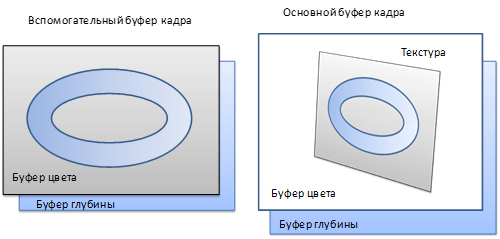
#### ***Объявление класса CMyApplication***
Класс **CMyApplication** будет реализовывать интерфейс **IRotationControllerListener**, что позволит ему получать уведомления от контроллера вращения. Объект, выводимый во вспомогательный буфер кадра, имеет собственную матрицу трансформации, отличную от трансформации прямоугольника, выводимого в основной буфер кадра. Матрица m\_modelViewFrameBuffer предназначена для хранения матрицы моделирования-вида, используемой для вывода во вспомогательный буфер кадра. Матрица моделирования-вида, связанная с основным буфером кадра, хранится в классе CRotationController.

```cpp
class CMyApplication 
    : public CGLApplication
    , private IRotationControllerListener
{
public:
    CMyApplication(const char * title, int width, int height);
    ~CMyApplication();
private:
    // Обработчики событий от приложения
    virtual void OnInit();
    virtual void OnDisplay();
    virtual void OnReshape(int width, int height);
    virtual void OnIdle();

    // Инициализация вспомогательного буфера кадра
    void InitFrameBuffer();

    // Рисуем объект во текстуру, выбранную в качестве 
    // буфера цвета вспомогательного буфера кадра
    void DrawObjectToTexture()const;

    // Получаем уведомление об обновлении состояния
    // контроллера вращения
    void OnRotationControllerUpdate();

    // Установка видового порта и матрицы проецирования
    static void SetupViewportAndProjectionMatrix(
        int width, int height, 
        double fov, double znear, double zfar);

    // Параметры камеры
    static const double FIELD_OF_VIEW;
    static const double ZNEAR;
    static const double ZFAR;

    // Скорость вращения объекта вокруг осей X, Y, Z
    static const double X_ROTATION_SPEED;
    static const double Y_ROTATION_SPEED;
    static const double Z_ROTATION_SPEED;

    // Ширина и высота вспомогательного буфера кадра
    static const GLuint FRAME_BUFFER_WIDTH;
    static const GLuint FRAME_BUFFER_HEIGHT;

    // Имя вспомогательного буфера кадра
    GLuint m_frameBuffer;
    // Имя вспомогательного буфера глубины
    GLuint m_depthBuffer;

    // Текстура, выполняющая роль буфера цвета во вспомогательном 
    // буфере кадра
    CTexture2D m_colorBufferTexture;

    // Ширина и высота окна
    int m_windowWidth;
    int m_windowHeight;

    // Матрица моделирования-вида, используемая для вывода объекта 
    // во вспомогательный буфер кадра
    CMatrix4d m_modelViewFrameBuffer;

    CRotationController m_rotationController;
    CAnimationController m_animationController;
};
```

#### ***Конструктор и деструктор класса CMyApplication***
В Конструкторе класса приложение добавляет контроллер вращения к числу своих слушателей, что позволит контроллеру обрабатывать события об изменении размеров окна и события от мыши. С другой стороны, при изменении матрицы трансформации контроллера вращения, пользователь должен увидеть результат данного преобразования. Поэтому приложение добавляет себя к списку слушателей контроллера вращения.

```cpp
const double CMyApplication::FIELD_OF_VIEW = 60;
const double CMyApplication::ZNEAR = 1;
const double CMyApplication::ZFAR = 10;
const double CMyApplication::X_ROTATION_SPEED = 43;
const double CMyApplication::Y_ROTATION_SPEED = -37;
const double CMyApplication::Z_ROTATION_SPEED = 29;

const GLuint CMyApplication::FRAME_BUFFER_WIDTH = 800;
const GLuint CMyApplication::FRAME_BUFFER_HEIGHT = 600;

CMyApplication::CMyApplication(const char * title, int width, int height)
    :CGLApplication(title, width, height)
    , m_frameBuffer(0)
    , m_depthBuffer(0)
    , m_windowWidth(width)
    , m_windowHeight(height)
    , m_rotationController(width, height)
{
    // Добавляем контроллер вращения к списку слушателей приложения
    AddEventListener(&m_rotationController);
    // В то же время, будем слушать события от контроллера вращения
    m_rotationController.AddEventListener(this);
}
```

Деструктор класса CMyApplication выполняет удаление вспомогательного буфера кадра и буфера визуализации, хранящего информацию о глубине вспомогательного буфера кадра.

```cpp
CMyApplication::~CMyApplication()
{
    // Удаляем буфер глубины вспомогательного буфера кадра
    if (m_depthBuffer)
    {
        glDeleteRenderbuffersEXT(1, &m_depthBuffer);
    }

    // Удаляем вспомогательный буфер кадра
    if (m_frameBuffer)
    {
        glDeleteFramebuffersEXT(1, &m_frameBuffer);
    }
}
```

#### ***Обработка событий от контроллера вращения***
При получении уведомления об изменении состояния контроллера вращения, приложение вызывает метод PostRedisplay для перерисовки сцены.

```cpp
void CMyApplication::OnRotationControllerUpdate()
{
    // Перерисовываем сцену при обновлении 
    // состояния контроллера вращения
    PostRedisplay();
}
```

#### ***Инициализация приложения***
В методе **OnInit** осуществляем инициализацию матриц моделирования вида, используемых для рисования в основном и вспомогательном буфере кадра, а также вызываем метод **InitFrameBuffer**, выполняющий инициализацию вспомогательного буфера кадра.

```cpp
void CMyApplication::OnInit()
{
    glEnable(GL_DEPTH_TEST);
    glClearColor(1, 1, 1, 1);
    glEnable(GL_CULL_FACE);

    // Загружаем матрицу камеры в матрицу моделирования-вида
    // вспомогательного буфера кадра
    m_modelViewFrameBuffer.LoadLookAtRH(
        0, 0, 5,
        0, 0, 0,
        0, 1, 0
        );

    // Инициализируем матрицу моделирования вида основного буфера кадра
    CMatrix4d modelView;
    modelView.LoadLookAtRH(
        0, 0, 4,
        0, 0, 0,
        0, 1, 0
        );
    // и загружаем ее в контроллер вращения
    m_rotationController.SetModelViewMatrix(modelView);
    
    // Инициализируем вспомогательный буфер кадра
    InitFrameBuffer();
}
```

#### Инициализация вспомогательного буфера кадра
Инициализация буфера кадра - достаточно трудоемкий процесс, поэтому рассмотрим его по шагам.

В качестве буфера цвета будет использоваться текстура, поэтому сначала подготовим должны образом текстурный объект. Обратим внимание на следующие моменты. Во-первых, зададим параметры **анизотропной фильтрации**[^6] текстуры, чтобы улучшить качество наложения данной текстуры.

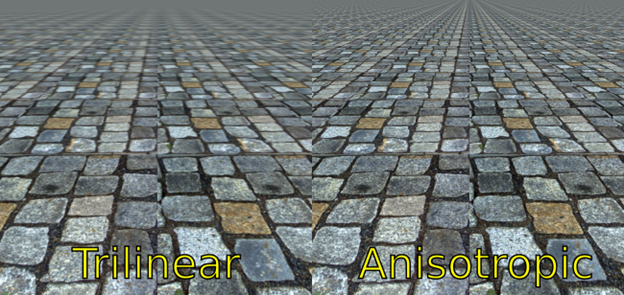

Сравнение трилинейной (слева) и анизотропной фильтрации текстур (справа)

Во-вторых, при задании изображения для текстурного объекта мы не будем задавать его содержимое, поскольку изображение в буфере цвета будет формироваться программно. Достичь этого можно, передавая нулевой указатель в качестве адреса пикселей текстуры. В-третьих, воспользуемся функцией **glGenerateMipmapEXT** для автоматического генерирования уровней детализации[^7] текстуры на основе уровня детализации №0. Это гораздо быстрее, нежели использование функции gluBuild2DMipmaps, поскольку  построение необходимых уровней детализации выполняется при помощи графического ускорителя.

```cpp
void CMyApplication::InitFrameBuffer()
{
    // Инициализируем текстуру, используемую для хранения 
    // буфера цвета вспомогательного буфера кадра
    m_colorBufferTexture.Create();
    m_colorBufferTexture.Bind();
    glTexParameteri(
        GL_TEXTURE_2D, 
        GL_TEXTURE_MIN_FILTER, 
        GL_LINEAR_MIPMAP_LINEAR);
    glTexParameteri(
        GL_TEXTURE_2D, 
        GL_TEXTURE_MAG_FILTER, 
        GL_LINEAR);

    // Задаем уровень анизотропной фильтрации для текстуры
    // (при поддержке со стороны OpenGL)
    if (GL_EXT_texture_filter_anisotropic)
    {
        GLint maxAnisotropy = 0;
        glGetIntegerv(
            GL_MAX_TEXTURE_MAX_ANISOTROPY_EXT, 
            &maxAnisotropy);
        glTexParameteri(
            GL_TEXTURE_2D, 
            GL_TEXTURE_MAX_ANISOTROPY_EXT, 
            maxAnisotropy);
    }
    // Создаем текстуру заданного размера, не инициализируя ее содержимое
    // (параметр pData) равен NULL
    m_colorBufferTexture.TexImage(
        0, 
        GL_RGBA, 
        FRAME_BUFFER_WIDTH, FRAME_BUFFER_HEIGHT, 
        0, GL_RGBA, 
        GL_UNSIGNED_BYTE, NULL);
    // Автоматически генерируем уровни детализации для текстуры
    // (данная функция вошла в состав расширения GL_EXT_framebuffer_object)
    glGenerateMipmapEXT(GL_TEXTURE_2D);
```

На следующем этапе создадим вспомогательный буфер кадра и присоединим к нему созданный текстурный объект (точнее, 0 уровень детализации).

```cpp
    // Генерируем имя для буфера кадра
    glGenFramebuffersEXT(1, &m_frameBuffer);
    // Выполняем привязку ко вспомогательному буферу кадра
    glBindFramebufferEXT(GL_FRAMEBUFFER_EXT, m_frameBuffer);
    // Присоединяем 0 уровень детализации текстуры в качестве буфера цвета №0
    glFramebufferTexture2DEXT(
        GL_FRAMEBUFFER_EXT,    // тип буфера кадра
        GL_COLOR_ATTACHMENT0_EXT,    // точка присоединения
        GL_TEXTURE_2D,       // тип текстуры
        m_colorBufferTexture,   // текстурный объект
        0);                  // mip-уровень
```

Для того, чтобы во вспомогательном буфере кадра мы могли корректно отображать трехмерные объекты, помимо буфера цвета нам понадобится буфер глубины. В качестве буфера глубины будет выступать буфер визуализации. При помощи функции **glRenderBufferStorageEXT** необходимо выделить в буфере визуализации память для хранения массива пикселей определенного изображения. Проинициализированный буфер визуализации присоединим к вспомогательному буферу кадра в качестве буфера глубины при помощи функции **glFramebufferRenderbufferEXT**.

```cpp
    // Генерируем имя для буфера визуализации
    glGenRenderbuffersEXT(1, &m_depthBuffer);
    // Выполняем привязку к буферу визуализации
    glBindRenderbufferEXT(GL_RENDERBUFFER_EXT, m_depthBuffer);
    // Выделяем в буфере визуализации память для хранения 
    // двухмерного массива пикселей глубины
    glRenderbufferStorageEXT(
        GL_RENDERBUFFER_EXT, 
        GL_DEPTH_COMPONENT, 
        FRAME_BUFFER_WIDTH, 
        FRAME_BUFFER_HEIGHT);
    // Присоединяем буфер визуализации в качестве буфера глубины
    glFramebufferRenderbufferEXT(
        GL_FRAMEBUFFER_EXT,   // цель использования буфера кадра
        GL_DEPTH_ATTACHMENT_EXT,    // точка присоединения
        GL_RENDERBUFFER_EXT,    // цель использования буфера визуализации
        m_depthBuffer);    // буфер визуализации
```

После присоединения изображений и буферов  к вспомогательному буферу кадра нужно проверить его состояние с помощью функции **glCheckFramebufferStatusEXT**, чтобы убедиться в том, что данный буфер кадра может использоваться[^8] OpenGL.

```cpp
    // Проверяем статус буфера кадра
    GLenum frameBufferStatus = glCheckFramebufferStatusEXT(GL_FRAMEBUFFER_EXT);

    // Буфер кадра должен быть полным 
    // (содержать необходимый набор изображений)
    if (frameBufferStatus != GL_FRAMEBUFFER_COMPLETE_EXT)
    {
        throw std::logic_error("Framebuffer is incomplete");
    }

    // Переключаемся на использование основного буфера кадра
    glBindFramebufferEXT(GL_FRAMEBUFFER_EXT, 0);
}
```

#### ***Обработка события об изменении размеров окна***
Изменению подвергся и обработчик события об изменении размеров окна. Если раньше нам было достаточно изменить матрицу проецирования и порт просмотра при изменении размеров окна, то теперь это нужно будет сделать как перед рисованием во вспомогательный буфер кадра, так и перед рисованием в основной буфер кадра. Дело в том, что размеры вспомогательного буфера кадра могут отличаться от размеров основного буфера кадра (особенно при изменении размеров окна), поэтому матрицу проецирования и порт просмотра задавать придется непосредственно в коде рисования.

В методе **OnReshape** мы будем лишь сохранять новые размеры окна в переменных класса. Для переопределения матрицы проецирования и видового порта будет использоваться метод **SetupViewportAndProjectionMatrix**.

```cpp
void CMyApplication::OnReshape(int width, int height)
{
    m_windowWidth = width;
    m_windowHeight = height;
}

void CMyApplication::SetupViewportAndProjectionMatrix(
    int width, int height, 
    double fov, double znear, double zfar)
{
    glViewport(0, 0, width, height);

    // Вычисляем соотношение сторон клиентской области окна
    double aspect = double(width) / double(height);

    glMatrixMode(GL_PROJECTION);
    glLoadIdentity();
    gluPerspective(fov, aspect, znear, zfar);
    glMatrixMode(GL_MODELVIEW);
}
```

#### ***Рисование во вспомогательный буфер кадра***
Для того, чтобы нарисовать объект во вспомогательном буфере кадра, необходимо выполнить привязку к данному буферу с помощью функции **glBindFramebufferEXT**. Затем необходимо очистить стандартным образом буфер цвета и буфер глубины, настроить видовой порт, матрицу проецирования и моделирования-вида и нарисовать объект.

Важно, чтобы при рисовании во вспомогательном буфере кадра привязанный к нему в качестве буфера цвета текстурный объект не был использован в качестве текстуры при рисовании. В противном случае содержимое буфера кадра будет не определено. Поскольку для текстуры, в которую выполняется визуализация тора, включено использование мип-уровней, необходимо обновить их содержимое после окончания рисования в буфер кадра. Для этого текстурный объект необходимо сделать активным и сгенерировать при помощи **glGenerateMipmapEXT** необходимые mip-уровни на основе 0-го уровня детализации.

```cpp
void CMyApplication::DrawObjectToTexture()const
{
    // Привязываемся к текстурному объекту с идентификатором 0
    // и запрещаем наложение текстуры
    glBindTexture(GL_TEXTURE_2D, 0);
    glDisable(GL_TEXTURE_2D);

    // Делаем вспомогательный буфер активным
    glBindFramebufferEXT(GL_FRAMEBUFFER_EXT, m_frameBuffer);

    // Очищаем связанные с ним буферы цвета и глубины
    glClearColor(0.5, 0.5, 0.5, 1);
    glClear(GL_COLOR_BUFFER_BIT | GL_DEPTH_BUFFER_BIT);

    // Настраиваем матрицу проецирования для рендеринга
    // во вспомогательный буфер кадра
    SetupViewportAndProjectionMatrix(
        FRAME_BUFFER_WIDTH, FRAME_BUFFER_HEIGHT, 
        FIELD_OF_VIEW, 
        ZNEAR, ZFAR);

    // Загружаем матрицу моделирования вида для 
    // рисования во вспомогательный буфер
    glLoadMatrixd(m_modelViewFrameBuffer);

    // Рисуем тор во вспомогательный буфер
    glutWireTorus(0.2, 2, 20, 50);

    // Привязываемся к текстуре, присоединенной к буферу цвета
    // вспомогательного буфера кадра
    m_colorBufferTexture.Bind();
    // И генерируем mip-уровни
    glGenerateMipmapEXT(GL_TEXTURE_2D);
}
```

#### ***Рисование в основной буфер кадра***
После того, как изображение во вспомогательном буфере кадра было построено, необходимо привязаться к основному буферу кадра и выполнить рисование текстурированного прямоугольника, предварительно выбрав текстуру, использованную в качестве буфера цвета во вспомогательном буфере кадра.

```cpp
void CMyApplication::OnDisplay()
{
    // Рисуем объект в текстуру
    DrawObjectToTexture();

    // Привязываемся к основному буферу кадра
    glBindFramebufferEXT(GL_FRAMEBUFFER_EXT, 0);

    // Очищаем основной буфер кадра
    glClearColor(1, 1, 1, 1);
    glClear(GL_COLOR_BUFFER_BIT | GL_DEPTH_BUFFER_BIT);

    // Обновляем матрицу проецирования и видовой порт
    SetupViewportAndProjectionMatrix(
        m_windowWidth, m_windowHeight, 
        FIELD_OF_VIEW, ZNEAR, ZFAR);

    // Загружаем матрицу моделирования-вида, получив ее
    // у контроллера вращения
    glLoadMatrixd(m_rotationController.GetModelViewMatrix());

    // Выбираем текстуру, используемую в качестве буфера цвета
    // во вспомогательном буфере кадра
    glEnable(GL_TEXTURE_2D);
    m_colorBufferTexture.Bind();

    // Рисуем прямоугольник
    glBegin(GL_QUADS);
    {
        glTexCoord2f(0, 0);
        glVertex2f(-2, -1.5);

        glTexCoord2f(1, 0);
        glVertex2f(2, -1.5);

        glTexCoord2f(1, 1);
        glVertex2f(2, 1.5);

        glTexCoord2f(0, 1);
        glVertex2f(-2, 1.5);
    }
    glEnd();
}
```

#### ***Анимация объекта***
В обработчик события OnIdle включим код, выполняющий вращение объекта вокруг координатных осей X, Y и Z. Реализуется это при помощи вызова соответствующих методов матрицы **m\_modelViewFrameBuffer**. Чтобы устранить накопление ошибок, после каждой серии вращений матрицы, выполняем ее нормализацию. После изменения матрицы трансформации объекта необходимо выполнить перерисовку сцены.

```cpp
void CMyApplication::OnIdle()
{
    m_animationController.Tick();
    double delta = m_animationController.GetTimeDelta() * 0.001;

    // Осуществляем вращение объекта, выводимого во вспомогательный 
    // буфер кадра, вокруг осей X, Y и Z
    m_modelViewFrameBuffer.Rotate(delta * X_ROTATION_SPEED, 1, 0, 0);
    m_modelViewFrameBuffer.Rotate(delta * Y_ROTATION_SPEED, 0, 1, 0);
    m_modelViewFrameBuffer.Rotate(delta * Z_ROTATION_SPEED, 0, 0, 1);
    m_modelViewFrameBuffer.Normalize();

    // Иниициируем перерисовку кадра
    PostRedisplay();
}
```

#### ***Результат работы программы***
В результате работы программы будет нарисовано изображение прямоугольника, внутри которого вращается тор.

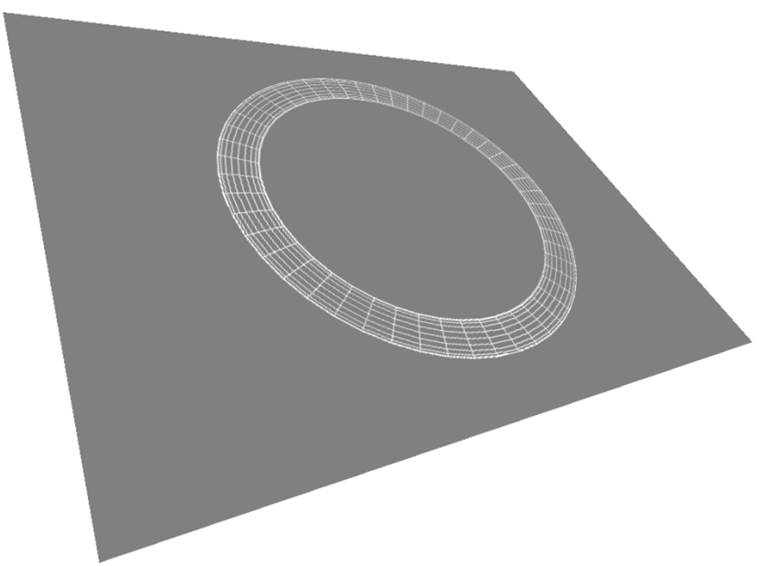
## <a name="_toc342938584"></a>**Реализация фильтров изображений при помощи шейдеров**
Рассмотрим совместное применение рендеринга в текстуру и шейдеров для фильтрации изображений в реальном времени.
### <a name="_toc342938585"></a>**Разрабатываем классы для управления буфером кадра и буфером визуализации**
Для автоматизации управления буфером кадра разработаем класс CFrameBufferBase и шаблонный класс CFrameBufferImpl. Параметр <t\_managed> класса CFrameBufferImpl задает необходимость автоматического управления временем жизни соответствующего объекта OpenGL.

```cpp
// Базовый класс "Буфер кадра"
class CFrameBufferBase
{
public:
    // Создание нового буфера кадра
    void Create()
    {
        assert(!m_frameBuffer);
        glGenRenderbuffersEXT(1, &m_frameBuffer);
    }

    // Привязка буфера кадра к указанной цели
    static void Bind(GLuint target, GLuint framebuffer)
    {
        glBindFramebufferEXT(target, framebuffer);
    }

    // Привязка текущего буфера кадра
    void Bind(GLenum target = GL_FRAMEBUFFER_EXT)const
    {
        assert(m_frameBuffer != 0);
        glBindFramebufferEXT(target, m_frameBuffer);
    }

    // Присоединение буфера визуализации к буферу кадра
    static void SetRenderBuffer(
        GLenum target, GLenum attachment, 
        GLenum renderbuffertarget, GLuint renderbuffer)
    {
        glFramebufferRenderbufferEXT(
            target, attachment, renderbuffertarget, renderbuffer);
    }

    // Присоединение двухмерной текстуры к буферу кадра
    static void SetTexture2D(
        GLenum target, GLenum attachment, 
        GLenum textarget, GLuint texture, GLint level)
    {
        glFramebufferTexture2DEXT(
            target, attachment, textarget, texture, level);
    }

    // Проверка статуса буфера кадра

    static GLenum CheckStatus(GLenum target)
    {
        return glCheckFramebufferStatusEXT(target);
    }

    // Удаление буфера кадра
    void Delete()
    {
        assert(m_frameBuffer != 0);
        glDeleteFramebuffersEXT(1, &m_frameBuffer);
        m_frameBuffer = 0;
    }

    // Получение идентификатора буфера кадра
    GLuint Get()const
    {
        return m_frameBuffer;
    }

    // Получение идентификатора буфера кадра
    operator GLuint()const
    {
        return m_frameBuffer;
    }

protected:
    CFrameBufferBase(GLuint frameBuffer = 0)
        :m_frameBuffer(0)
    {
    }

    ~CFrameBufferBase()
    {
    }

    // Задание идентификатора буфера кадра
    void SetFrameBuffer(GLuint frameBuffer)
    {
        m_frameBuffer = frameBuffer;
    }

private:
    // Запрещаем копирование и присваивание
    // экземпляров класса CFrameBufferBase
    CFrameBufferBase(CFrameBufferBase const&);
    CFrameBufferBase& operator=(CFrameBufferBase const&);

    GLuint m_frameBuffer;
};

// Управляемая или неуправляемая реализация буфера кадра
template <bool t_managed>
class CFrameBufferImpl : public CFrameBufferBase
{
public:
    CFrameBufferImpl(GLuint frameBuffer = 0)
        :CFrameBufferBase(frameBuffer)
    {
    }

    ~CFrameBufferImpl()
    {
        // Удаляем буфер кадра, если класс управляет временем
        // его жизни
        if (t_managed && (Get() != 0))
        {
            Delete();
        }
    }
private:
};

// Буфер кадра (класс управляет временем жизни объекта OpenGL)
typedef CFrameBufferImpl<true> CFrameBuffer;

// Дескриптор буфера кадра (класс не управляет временем 
// жизни объекта OpenGL)
typedef CFrameBufferImpl<false> CFrameBufferHandle;
```

Аналогичным образом разработаем классы CRenderBufferBase и CRenderBufferImpl для управления буфером визуализации.

```cpp
// Базовый буфер физуализации
class CRenderBufferBase
{
public:
    // Создание буфера визуализации
    void Create()
    {
        assert(!m_renderBuffer);
        glGenRenderbuffersEXT(1, &m_renderBuffer);
    }

    // Привязка к текущему буферу визуализации
    void Bind(GLenum target = GL_RENDERBUFFER_EXT)const
    {
        assert(m_renderBuffer != 0);
        glBindRenderbufferEXT(target, m_renderBuffer);
    }

    // Привязка к заданному буферу визуализации
    static void Bind(GLenum target, GLenum renderBuffer)
    {
        glBindRenderbufferEXT(target, renderBuffer);
    }

    // Удаление буфера визуализации
    void Delete()
    {
        assert(m_renderBuffer != 0);
        glDeleteRenderbuffersEXT(1, &m_renderBuffer);
        m_renderBuffer = 0;
    }

    // Получение идентификатора буфера визуализации
    GLuint Get()const
    {
        return m_renderBuffer;
    }

    // Получение идентификатора буфера визуализации
    operator GLuint()const
    {
        return m_renderBuffer;
    }

    // Выделение памяти под хранение буфера кадра заданного размера
    static void SetStorage(
        GLenum target, GLenum internalformat, 
        GLsizei width, GLsizei height)
    {
        glRenderbufferStorageEXT(target, internalformat, width, height);
    }

protected:
    CRenderBufferBase(GLuint renderBuffer = 0)
        :m_renderBuffer(renderBuffer)
    {
    }

    // Задание идентификатора буфера визуализации
    void SetRenderBuffer(GLuint renderBuffer)
    {
        m_renderBuffer = renderBuffer;
    }

    ~CRenderBufferBase()
    {
    }
private:
    // Запрещаем конструктор копирования и оператор присваивания
    CRenderBufferBase(CRenderBufferBase const&);
    CRenderBufferBase& operator=(CRenderBufferBase const&);

    GLuint m_renderBuffer;
};

// Управляемая, либо неуправляемая реализация 
// класса "Буфер визуализации"
template <bool t_managed>
class CRenderBufferImpl : public CRenderBufferBase
{
public:
    CRenderBufferImpl(GLuint renderBuffer = 0)
        :CRenderBufferBase(renderBuffer)
    {
    }

    ~CRenderBufferImpl()
    {
        // Удаляем буфер визуализации
        if (t_managed && (Get() != 0))
        {
            Delete();
        }
    }
};

// Буфер визуализации (класс управляем временем жизни объекта OpenGL)
typedef CRenderBufferImpl<true> CRenderBuffer;

// Дескриптор буфера визуализации
// (класс не управляет временем жизни объекта OpenGL)
typedef CRenderBufferImpl<false> CRenderBufferHandle;
```

### <a name="_toc342938586"></a>**Разрабатываем шейдеры, выполняющие Гауссово размытие изображения**
Принцип работы фильтр фильтра Гаусса достаточно прост. Необходимо к пикселям исходного изображения применить фильтр свертки, коэффициенты которого вычисляются с использованием функции плотности распределения Гаусса:

$$f(x)=\frac{1}{\sqrt{2πσ^{2}}}e^{-\frac{(x-μ)^2}{2σ^2}}$$

Или для двухмерного случая:

$$f(x,y)=\frac{1}{\sqrt{2πσ^{2}}}e^{\frac{(\sqrt{(x-μ_x)^2+(y-μ_y)^2})^2}{2σ^2}}=\frac{1}{\sqrt{2πσ^{2}}}e^{\frac{(x-μ_x)^2+(y-μ_y)^2}{2σ^2}}$$

Если в качестве $μ_x$ и $μ_y$ взять значение 0, то формула несколько упростится:

$$f(x,y)=\frac{1}{\sqrt{2πσ^{2}}}e^{-\frac{x^2+y^2}{2σ^2}}$$

Однако вычисления фильтра по-прежнему будет требовать использования двойного цикла и трудоемкость O($n_2$). Попробуем улучшить производительность. Для этого воспользуемся свойством круговой симметрии двухмерного гауссова распределения и заменим одно применение двухмерной свертки на два одномерных. Сначала картинка будет размыта по горизонтали, а затем по вертикали. Результат будет идентичным[^9].


Вершинный шейдер (**blur.vsh**), будет лишь выполнять трансформацию вершин и передачу текстурных координат фрагментному шейдеру.

```cpp
void main()
{
    gl_Position = ftransform();
    gl_TexCoord[0] = gl_MultiTexCoord0;
}
```

Код фрагментного шейдера требует некоторых пояснений.

Во-первых, как видно из формулы нормального распределения, применение фильтра требует многократного вычисления коэффициентов  свертки с использованием дорогостоящей экспоненциальной функции. В то же время коэффициенты свертки являются постоянными для каждого пикселя изображения. Поэтому имеет смысл вычислить коэффициенты фильтра свертки в основной программе, а затем передать их фрагментному шейдеру через uniform-переменную.

Во-вторых, график нормального распределения симметричен относительно x=μ, что позволяет использовать один и тот же коэффициент свертки сразу для двух пикселей.

В-третьих, при фиксированном размере ядра свертки имеет смысл развернуть циклы, что также может повысить быстродействие шейдера.

В-четвертых, один и тот же шейдер можно использовать как для размытия по горизонтали, так и для размытия по вертикали, если задать величину шага выборки из текстуры в виде двухмерного вектора. В таком случае при вертикальном размытии шаг будет равен (0, $\frac{1}{высота\ текстуры}$), а при горизонтальном - ($\frac{1}{ширина\ текстуры}$, 0).

Исходный код фрагментного шейдера (**blur.fsh**) приведен ниже.

```cpp
uniform sampler2D image;
// sampling step
uniform vec2 step;
// convolution filter coefficients
uniform float coefficients[10];

void main()
{
    vec2 pos = gl\_TexCoord[0].st;

    vec4 color = 
        texture2D(image, pos) * coefficients[0] + 
        (texture2D(image, pos - step) + 
            texture2D(image, pos + step)) * coefficients[1] +
        (texture2D(image, pos - 2.0 * step) + 
            texture2D(image, pos + 2.0 * step)) * coefficients[2] +
        (texture2D(image, pos - 3.0 * step) + 
            texture2D(image, pos + 3.0 * step)) * coefficients[3] +
        (texture2D(image, pos - 4.0 * step) + 
            texture2D(image, pos + 4.0 * step)) * coefficients[4] +
        (texture2D(image, pos - 5.0 * step) + 
            texture2D(image, pos + 5.0 * step)) * coefficients[5] +
        (texture2D(image, pos - 6.0 * step) + 
            texture2D(image, pos + 6.0 * step)) * coefficients[6] +
        (texture2D(image, pos - 7.0 * step) + 
            texture2D(image, pos + 7.0 * step)) * coefficients[7] +
        (texture2D(image, pos - 8.0 * step) + 
            texture2D(image, pos + 8.0 * step)) * coefficients[8] +
        (texture2D(image, pos - 9.0 * step) + 
            texture2D(image, pos + 9.0 * step)) * coefficients[9];

    gl_FragColor = color;
}
```

### <a name="_toc342938587"></a>**Разрабатываем класс фильтра «Гауссово размытие»**
Данный класс будет выполнять конфигурирование шейдерной программы, выполняющей Гауссово размытие и применять фильтр размытия к заданному текстурному изображению. При помощи метода **SetProgram** фильтру сообщаются сведения о шейдерной программе. При помощи метода **Blur** выполняется размытие изображения в текстуре. Метод возвращает идентификатор текстурного объекта, содержащего размытое изображение

```cpp
class CGaussianBlurFilter
{
public:
    CGaussianBlurFilter(void);

    // Сообщаем фильтру сведения о программе, выполняющей гауссово размытие
    void SetProgram(
        GLuint program,           // программа
        GLint stepLocation,       // расположение переменной step
        GLint imageLocation,      // расположение переменной image
        GLint coefficientsLocation,     // Расположение массива коэффициентов
        size_t filterRadius);    // Радиус фильтра

    // Выполняем размытие изображения в переданной текстуре
    // и возвращаем идентификатор текстурного объекта с результатом
    // Идентификатор текстуры, возвращаемый в качестве результата,
    // хранится внутри данного класса
    GLuint Blur(
        GLuint texture,                        // Текстурный объект
        GLfloat sigma,                         // Среднеквадратическое отклонение
        int width, int height,                 // Размеры текстуры
        bool generateMipmaps = true)const;     // Необходимость генерирования mip-уровней
private:
    // Вычисляем коэффициенты размытия фильтра
    static std::vector<float> CalcGauss(size_t size, float sigma);

    // Подготавливаем вспомогательный буфер кадра для 
    // обработки изображения заданного размера
    void PrepareFrameBuffer(
        int width, 
        int height, 
        bool generateMipmaps = true)const;

    // Рисуем текстурированный прямоугольник
    void DrawRectangle()const;

    // Выполняем настройку матриц и видового порта
    void SetupViewportAndMatrices()const;

    // Восстанавливаем параметры видового порта и матрицы
    void RestoreViewportAndMatrices()const;

    // Активизируем программу и конфигурируем ее uniform-переменные
    void ActivateProgram(float sigma)const;

    // Выполняем размытие по горизонтали
    void BlurHorizontal(GLuint texture)const;

    // Выполняем размытие по вертикали
    void BlurVertical()const;

    // Программный объект
    CProgramHandle m_program;

    // Расположение переменной, хранящей шаг выборки данных из текстуры
    GLint m_stepLocation;
    
    // Расположение переменной, хранящей расположение изображения фильтра
    GLint m_imageLocation;

    // Расположение массива коэффициентов фильтра
    GLint m_coefficientsLocation;

    // Радиус фильтра
    size_t m_filterRadius;

    // Флаг, задающий необходимость генерирования mip-уровней текстуры
    mutable bool m_generateMipmaps;

    // Вспомогательный буфер кадра
    mutable CFrameBuffer m_frameBuffer;
    // Текстура, используемая для хранения изображения, размытое по горизонтали
    mutable CTexture2D m_colorBuffer0;
    // Текстура, используемая для хранения финального изображения
    mutable CTexture2D m_colorBuffer1;

    // Ширина и высота текстуры
    mutable unsigned m_width;
    mutable unsigned m_height;
};
```

##### Конструктор класса CGaussianBlur
Конструктор класса содержит лишь инициализацию приватных переменных класса.

```cpp
CGaussianBlurFilter::CGaussianBlurFilter(void)
:m_generateMipmaps(false)
,m_width(0)
,m_height(0)
,m_stepLocation(-1)
,m_imageLocation(-1)
,m_coefficientsLocation(-1)
,m_filterRadius(0)
{
}
```

##### Подготовка вспомогательного буфера кадра
Метод PrepareFrameBuffer выполняет инициализацию вспомогательного буфера кадра и текстурных объектов, используемых для хранения промежуточных результатов фильтра размытия.

```cpp
void CGaussianBlurFilter::PrepareFrameBuffer(
    int width, int height, bool generateMipmaps)const
{
    // Определяем, какие объекты буфера кадра нуждаются
    // в создании или обновлении
    bool createFrameBuffer = !m_frameBuffer;

    bool createTexture = 
      createFrameBuffer || 
      !m_colorBuffer0 || 
      !m_colorBuffer1;

    bool updateTextureImage = 
      createTexture || 
      (m_width != width) || 
      (m_height != height);

    bool updateMipmaps = 
      (m_generateMipmaps != generateMipmaps) || 
      updateTextureImage || 
      createTexture;

    m_generateMipmaps = generateMipmaps;

    // Prepare frame buffer
    if (createFrameBuffer)
    {
        m_frameBuffer.Create();
    }

    // Инициализируем буферы цвета
    if (createTexture)
    {
        m_colorBuffer0.Create();
        m_colorBuffer1.Create();
    }

    m_width = width;
    m_height = height;

    // Выбираем текстуру 0 буфера цвета
    if (updateTextureImage || updateMipmaps)
    {
        m_colorBuffer0.Bind();
    }

    if (updateTextureImage)
    {
        m_colorBuffer0.Bind();
        // Для первого буфера цвета фильтрация будет осуществляться с выбором
        // ближайшего пикселя
        glTexParameteri(GL_TEXTURE_2D, GL_TEXTURE_MIN_FILTER, GL_NEAREST);
        glTexParameteri(GL_TEXTURE_2D, GL_TEXTURE_MAG_FILTER, GL_NEAREST);

        // Объявляем 0 уровень детализации текстурного изображения
        m_colorBuffer0.TexImage(
            0, GL_RGBA, 
            width, height, 
            0, GL_RGBA, 
            GL_UNSIGNED_BYTE, NULL);
    }

    // Выбираем текстуру 1 буфера цвета
    if (updateTextureImage || updateMipmaps)
    {
        m_colorBuffer1.Bind();
    }

    if (updateTextureImage)
    {
        // Объявляем 0 уровень детализации текстурного изображения
        m_colorBuffer1.TexImage(
            0, GL_RGBA, 
            m_width, m_height, 
            0, GL_RGBA, 
            GL_UNSIGNED_BYTE, NULL);
    }

    if (updateMipmaps)
    {
        // Для второго буфера буфера цвета фильтрация будет осуществляться
        // согласно параметру generateMipmaps
        if (generateMipmaps)
        {
            glTexParameteri(
              GL_TEXTURE_2D, 
              GL_TEXTURE_MIN_FILTER, 
              GL_LINEAR_MIPMAP_LINEAR);
            glTexParameteri(
              GL_TEXTURE_2D, 
              GL_TEXTURE_MAG_FILTER, 
              GL_LINEAR);
            glGenerateMipmapEXT(GL_TEXTURE_2D);
        }
        else
        {
            glTexParameteri(
              GL_TEXTURE_2D, 
              GL_TEXTURE_MIN_FILTER, 
              GL_NEAREST);
            glTexParameteri(
              GL_TEXTURE_2D, 
              GL_TEXTURE_MAG_FILTER, 
              GL_NEAREST);
        }
    }
}
```

##### Сообщаем параметры шейдерной программы
Метод **SetProgram** сохраняет дескриптор шейдерной программы, выполняющей размытие гаусса, а также расположение uniform-переменных программы и радиус фильтра.

```cpp
void CGaussianBlurFilter::SetProgram(
    GLuint program, 
    GLint stepLocation, 
    GLint imageLocation, 
    GLint coefficientsLocation, 
    size_t filterRadius)
{
    assert(program);
    assert(stepLocation >= 0);
    assert(imageLocation >= 0);
    assert(coefficientsLocation >= 0);
    assert(filterRadius > 0 && filterRadius < 20);

    m_program = program;
    m_stepLocation = stepLocation;
    m_imageLocation = imageLocation;
    m_coefficientsLocation = coefficientsLocation;
    m_filterRadius = filterRadius;
}
```

##### Инициализируем видовой порт и матрицы и подключаем программу
Метод **SetupViewportAndMatrices** конфигурирует видовой порт, предварительно сохранив сведения о нем в стеке атрибутов OpenGL, а также матрицы моделирования-вида и проецирования, сохранив прежние значения  в соответствующих стеках матриц.

```cpp
void CGaussianBlurFilter::SetupViewportAndMatrices()const
{
    // Сохраняем параметры видового порта в стеке атрибутов
    glPushAttrib(GL_VIEWPORT_BIT);
    // и задаем видовой порт размером со вспомогательный буфер кадра
    glViewport(0, 0, m_width, m_height);

    // Сохраняем матрицу моделирования-вида в стеке матриц
    glMatrixMode(GL_MODELVIEW);
    glPushMatrix();
    // и загружаем единичную матрицу моделирования вида
    glLoadIdentity();

    // Сохраняем матрицу проецирования в стеке матриц
    glMatrixMode(GL_PROJECTION);
    glPushMatrix();
    // и задаем новую матрицу проецирования
    glLoadIdentity();
    glOrtho(0, m_width, m_height, 0, -1, 1);
}
```

Подключение шейдерной программы осуществляется при помощи метода **ActivateProgram**. Значения uniform-переменных программы задаются при помощи соответствующих вызовов функций glUniform\*.

```cpp
void CGaussianBlurFilter::ActivateProgram(float sigma)const
{
    glUseProgram(m_program);
    glUniform1i(m_imageLocation, 0);
    std::vector<float> gauss = CalcGauss(m_filterRadius, sigma);
    glUniform1fv(m_coefficientsLocation, gauss.size(), &gauss[0]);
}
```

Коэффициенты фильтра размытия вычисляются при помощи метода **CalcGauss**. Из особенностей данного метода стоит отметить нормализацию коэффициентов фильтра, а также учет симметрии нормального распределения относительно оси y.

```cpp
std::vector<float> CGaussianBlurFilter::CalcGauss(size_t size, float sigma)
{
    std::vector<float> gauss(size);
    // Вычисляем коэффициенты гауссова распределения
    const float k1 = 1.0f / sqrtf(2 * M_PI * sigma * sigma);
    const float k2 = 1.0f / (2 * sigma * sigma);

    float sum = 0;

    for (size_t i = 0; i < size; ++i)
    {
        // Вычисляем плотность вероятности в данной точке
        float k = k1 * expf(-k2 * (i * i));
        gauss[i] = k;

        sum += k;

        // Учитываем симметричность функции распределения 
        // относительно оси x=0
        // (сумма расположенных на одинаковом расстоянии коэффициентов
        // фильтра в шейдерной программе умножается на один коэффициент)
        if (i > 0)
        {
            sum += k;
        }
    }

    // Выполняем нормализацию коэффициентов фильтра
    sum = 1.0f / sum;
    for (size_t i = 0; i < size; ++i)
    {
        gauss[i] *= sum;
    }

    return gauss;
}
```

#### Выполняем размытие
Для выполнения размытия изображения по горизонтали необходимо вывести во вспомогательный буфер кадра (буфер цвета 0) прямоугольник с нанесенной на него текстурой, переданной в качестве аргумента метода Blur. Зададим шаг выборки данных из текстуры, соответствующий смещению по горизонтали ровно на 1 пиксель внутри текстуры и присоединим 0 уровень детализации в качестве буфера цвета вспомогательного буфера кадра. Затем останется только нарисовать прямоугольник.

```cpp
void CGaussianBlurFilter::BlurHorizontal(GLuint texture)const
{
    // Выполняем привязку к переданному текстурному объекту
    glEnable(GL_TEXTURE_2D);
    glBindTexture(GL_TEXTURE_2D, texture);

    // Задаем шаг выборки значений из текстуры
    glUniform2f(m_stepLocation, 1.0f / m_width, 0);

    // Присоединяем 0 уровень деталей текстуры m_colorBuffer0 
    // в качестве буфера цвета во вспомогательном буфере кадра
    CFrameBuffer::SetTexture2D(
        GL_FRAMEBUFFER_EXT,
        GL_COLOR_ATTACHMENT0_EXT,
        GL_TEXTURE_2D,
        m_colorBuffer0,
        0);

    assert(
        CFrameBuffer::CheckStatus(GL_FRAMEBUFFER_EXT) == 
        GL_FRAMEBUFFER_COMPLETE_EXT);

    DrawRectangle();
}
```

Исходный код метода рисования прямоугольника ничем особенным не выделяется, кроме того что координаты задаются в диапазоне от 0 до m_width и от 0 до m_height.

```cpp
void CGaussianBlurFilter::DrawRectangle()const
{
    glBegin(GL_QUADS);
    {
        glTexCoord2f(0, 1);
        glVertex2f(0, 0);
        glTexCoord2f(0, 0);
        glVertex2f(0, m_height);
        glTexCoord2f(1, 0);
        glVertex2f(m_width, m_height);
        glTexCoord2f(1, 1);
        glVertex2f(m_width, 0);
    }
    glEnd();
}
```

Перед тем, как выполнить размытие по вертикали, необходимо выполнить привязку текстуры с размытым по горизонтали изображением к контексту визуализации OpenGL, а в качестве буфера цвета вспомогательного буфера кадра присоединить текстурный объект **m\_colorBuffer1**.

```cpp
void CGaussianBlurFilter::BlurVertical()const
{
    m_colorBuffer0.Bind();
    glUniform2f(m_stepLocation, 0, 1.0f / m_height);
    // Устанавливаем 0 уровень деталей текстуры m_colorBuffer0 
    // в качестве буфера цвета во вспомогательном буфере кадра
    m_frameBuffer.SetTexture2D(
        GL_FRAMEBUFFER_EXT,
        GL_COLOR_ATTACHMENT0_EXT,
        GL_TEXTURE_2D,
        m_colorBuffer1,
        0);

    assert(CFrameBuffer::CheckStatus(GL_FRAMEBUFFER_EXT) == 
        GL_FRAMEBUFFER_COMPLETE_EXT);

    DrawRectangle();
}
```

#### Восстанавливаем параметры видового порта и матриц трансформации
После построения изображения во вспомогательном буфере кадра  необходимо восстановить ранее сохраненные матрицы трансформации и видовой порт из стека.

```cpp
void CGaussianBlurFilter::RestoreViewportAndMatrices()const
{
    // Восстанавливаем матрицу проецироваиня
    glMatrixMode(GL_PROJECTION);
    glPopMatrix();
    // Восстанавливаем матрицу моделирования-вида
    glMatrixMode(GL_MODELVIEW);
    glPopMatrix();
    // Восстанавливаем видовой порт
    glPopAttrib();
}
```

#### Реализация метода Blur
Метод **Blur** содержит вызовы описанных выше методов. В случае если параметр **generateMipmaps** был равен **true**, производится генерирование изображения для mip-уровней текстуры **m\_colorBuffer1**. В качестве результата возвращается идентификатор данного текстурного объекта, содержащего размытое изображение.

```cpp
GLuint CGaussianBlurFilter::Blur(
    GLuint texture, 
    GLfloat sigma, 
    int width, int height, 
    bool generateMipmaps)const
{
    // Выполняем подготовку вспомогательного буфера кадра
    PrepareFrameBuffer(width, height, generateMipmaps);

    assert(m_program);
    assert(m_frameBuffer);

    // Выполняем привязку к вспомогательному буферу кадра
    m_frameBuffer.Bind();

    // Устанавливаем видовой порт, а также матрицы 
    // проецирования и моделирования-вида
    SetupViewportAndMatrices();

    // Активируем шейдерную программу
    ActivateProgram(sigma);

    // Выполняем размытие по горизонтали
    BlurHorizontal(texture);

    // Затем выполняем размытие обработанного изображения по вертикали
    BlurVertical();

    // Отключаем использование вспомогательного буфера кадра
    CFrameBuffer::Bind(GL_FRAMEBUFFER_EXT, 0);
    // а также шейдерную программу.
    glUseProgram(0);

    // Восстанавливаем параметры видового порта и матриц трансформации
    RestoreViewportAndMatrices();

    // Генерируем mip-уровни для результирующей текстуры в
    // соответствии с требованиями пользователя пользователя
    if (generateMipmaps)
    {
        m_colorBuffer1.Bind();
        glGenerateMipmapEXT(GL_TEXTURE_2D);
    }

    return m_colorBuffer1;
}
```

### <a name="_toc342938588"></a>**Обновляем класс CTextureLoader**
Для применения фильтра размытия Гаусса необходимо знать ширину и высоту изображения текстуры. Однако текущая версия класса CTextureLoader не предоставляет такой информации. Внесем необходимые изменения в метод LoadTexture2D.

```cpp
class CTextureLoader
{
public:
    …
    // Выполняем загрузку двухмерной текстуры из файла
    // Если параметр textureName равен 0, то текстура будет загружена в 
    // новый текстурный объект. В противном случае - в существующий
    GLuint LoadTexture2D(
        std::wstring const& fileName, 
        GLuint textureName = 0, GLint level = 0, 
        unsigned * pWidth = NULL, unsigned * pHeight = NULL)const;
    …
private:
    …
};
```

```cpp
GLuint CTextureLoader::LoadTexture2D(
    std::wstring const& fileName, GLuint textureName, GLint level,
    unsigned * pWidth, unsigned * pHeight)const
{
    …
    // Сообщаем о ширине и высоте изображения вызывающему коду
    if (pWidth != NULL)
    {
        *pWidth = bmp.GetWidth();
    }

    if (pHeight != NULL)
    {
        *pHeight = bmp.GetHeight();
    }

    // Возвращаем идентификатор созданного изображения
    return texture;
}
```

### <a name="_toc342938589"></a>**Применяем фильтр размытия на практике**
В класс **CMyApplication** добавим поля, ответственные за работу фильтра Гаусса,  хранение текстурного изображения и его размеров, а также программного объекта.

```cpp
class CMyApplication : public CGLApplication
{
public:
    CMyApplication(const char \* title, int width, int height);
protected:
    virtual void OnInit();
    virtual void OnDisplay();
    virtual void OnReshape(int width, int height);
    virtual void OnMouse(int button, int state, int x, int y);
    virtual void OnSpecialKey(int key, int x, int y);
private:
    void LoadTextures();
    void LoadShaders();

    // Фильтр размытия
    CGaussianBlurFilter m_blurFilter;
    // Флаг, сигнализирующий о необходимости применения фильтра
    bool m_blur;
    // Среднеквадратическое отклонение
    GLfloat m_sigma;
    // Радиус фильтра
    static const int BLUR_RADIUS;

    // Текстура 
    CTexture2D m_texture;
    // Размеры текстурного изображения
    unsigned m_textureWidth;
    unsigned m_textureHeight;

    // Шейдерная программа, выполняющая размытие Гаусса
    CProgram m_blurProgram;
};
```

### ***Инициализация приложения***
В процессе инициализации приложение проверяет наличие необходимых расширений, а затем выполняет загрузку текстур и шейдеров.

```cpp
// Радиус фильтра (должен совпадать с радиусом фильтра в шейдере)
const int CMyApplication::BLUR_RADIUS = 10;
CMyApplication::CMyApplication(const char * title, int width, int height)
:CGLApplication(title, width, height)
,m_blur(true)
,m_sigma(3)
,m_textureWidth(0)
,m_textureHeight(0)
{
}

void CMyApplication::OnInit()
{
    if (!GLEW_EXT_framebuffer_object)
    {
        throw std::runtime_error(
            "GL_EXT_framebuffer_object extension is not available");
    }

    if (!GLEW_ARB_shader_objects)
    {
        throw std::runtime_error(
            "GLEW_ARB_shader_objects extension is not available");
    }

    LoadTextures();
    LoadShaders();
}
```

#### ***Загрузка шейдеров и текстур***
После компоновки шейдерной программы получаем расположение ее uniform-переменных и передаем эту информацию фильтру размытия Гаусса.

```cpp
void CMyApplication::LoadShaders()
{
    CShaderLoader loader;
    CShader vertexShader = loader.LoadShader(GL_VERTEX_SHADER, "blur.vsh");
    CShader fragmentShader = loader.LoadShader(GL_FRAGMENT_SHADER, "blur.fsh");

    m_blurProgram.Create();
    m_blurProgram.AttachShader(vertexShader);
    m_blurProgram.AttachShader(fragmentShader);

    CShaderCompiler compiler;
    compiler.CompileShader(vertexShader);
    compiler.CompileShader(fragmentShader);

    compiler.CheckStatus();

    CProgramLinker linker;
    linker.LinkProgram(m_blurProgram);
    linker.CheckStatus();

    CProgramInfo info(m_blurProgram);
    info.Print(std::cout);

    // Получаем расположение uniform-переменных шейдерной программы
    GLint imageLocation = 
      m_blurProgram.GetUniformLocation("image");
    GLint stepLocation = 
      m_blurProgram.GetUniformLocation("step");
    GLint coefficientsLocation = 
      m_blurProgram.GetUniformLocation("coefficients");
    // Выполняем инициализацию фильтра размытия
    m_blurFilter.SetProgram(
        m_blurProgram, 
        stepLocation, 
        imageLocation, 
        coefficientsLocation, 
        BLUR_RADIUS);
}

void CMyApplication::LoadTextures()
{
    CTextureLoader loader;
    loader.SetMagFilter(GL_NEAREST);
    loader.SetMinFilter(GL_NEAREST);
    loader.SetWrapMode(GL_CLAMP_TO_EDGE, GL_CLAMP_TO_EDGE);

    m_texture = loader.LoadTexture2D(
        L"car.jpg", 0, 0, &m_textureWidth, &m_textureHeight);
}
```

#### ***Обработка действий пользователя***
При изменении размеров окна программа будет загружать матрицу ортографического преобразования.

```cpp
void CMyApplication::OnReshape(int width, int height)
{
    glViewport(0, 0, width, height);
    
    // Устанавливаем матрицу ортографического проекцирования
    glMatrixMode(GL_PROJECTION);
    glLoadIdentity();
    gluOrtho2D(0, width, height, 0);
    glMatrixMode(GL_MODELVIEW);
}
```

Щелчок левой кнопки мыши включает и выключает применение фильтра размытия к загруженному изображению

```cpp
void CMyApplication::OnMouse(int button, int state, int x, int y)
{
    x; y;
    // Включаем/выключаем применение фильтра по щелчку 
    // левой кнопкой мыши
    if (button == GLUT_LEFT_BUTTON && state == GLUT_UP)
    {
        m_blur = !m_blur;
        PostRedisplay();
    }
}
```

Нажатие клавиш управления курсором выполняет увеличение и уменьшение величины среднеквадратического отклонения, что визуально отражается на степени размытия изображения.

```cpp
void CMyApplication::OnSpecialKey(int key, int x, int y)
{
    x, y;
    // Управляем величиной среднеквадратического отклонения фильтра Гаусса
    // при помощи клавиш управления курсором
    bool refresh = false;
    switch(key)
    {
    case GLUT_KEY_UP:
        m_blur = true;
        m_sigma = min(m_sigma + 0.1f, BLUR_RADIUS);
        refresh = true;
        break;
    case GLUT_KEY_DOWN:
        m_blur = true;
        m_sigma = max(m_sigma - 0.1f, 0.1f);
        refresh = true;
        break;
    }

    // Обновляем экран при изменении величины среднеквадратического отклонения
    if (refresh)
    {
        PostRedisplay();
    }
}
```

#### ***Обновляем содержимое окна***
В методе OnDisplay выполняем размытие оригинального изображения

```cpp
void CMyApplication::OnDisplay()
{
    // Очищаем буфер цвета
    glClearColor(1, 1, 1, 1);
    glClear(GL_COLOR_BUFFER_BIT);

    CTexture2DHandle image;

    // Опционально применяем фильтр размытия к текстуре
    if (m_blur)
    {
        image = m_blurFilter.Blur(
            m_texture, 
            m_sigma, 
            m_textureWidth, 
            m_textureHeight,
            false);
    }
    else
    {
        image = m_texture;
    }

    // Выводим прямоугольник с текстурой размытого либо оригинального
    // изображения
    image.Bind();
    glEnable(GL_TEXTURE_2D);
    glBegin(GL_QUADS);
    {
        glTexCoord2f(0, 0);
        glVertex2f(0, 0);
        glTexCoord2f(0, 1);
        glVertex2f(0, m_textureHeight);
        glTexCoord2f(1, 1);
        glVertex2f(m_textureWidth, m_textureHeight);
        glTexCoord2f(1, 0);
        glVertex2f(m_textureWidth, 0);
    }
    glEnd();
}
```

#### ***Результаты работы программы***
Оригинальное изображение.

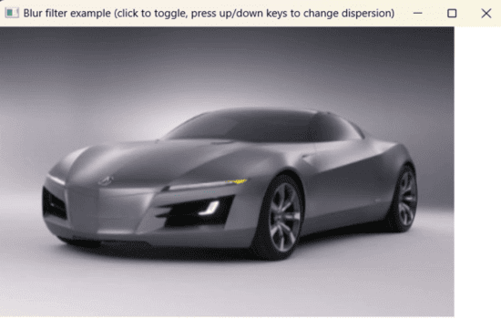

Размытые версии изображения со среднеквадратическим отклонением, равным 3 (слева) и 10 (справа).

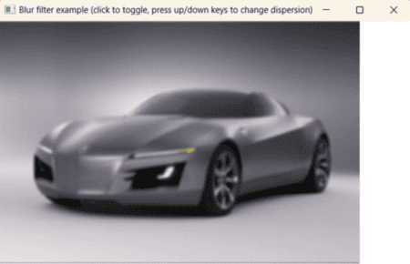 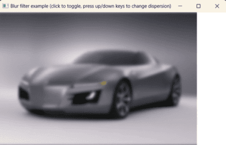

Основным достоинством программы является ее быстродействие. Применение фильтра гауссова размытия радиусом 10 (19x19) к изображению размером 4000x3000 занимает менее 200 миллисекунд на достаточно старом (2006 года) графическом ускорителе nVidia GeForce 7600 GS, что соответствует скорости обработки порядка 70-75 миллионов пикселей в секунду[^10]. На более современном графическом железе скорость будет в несколько раз больше.

## <a name="_toc342938590"></a>**Практические задания**
Для получения оценки «**удовлетворительно**» необходимо выполнить все обязательные задания, набрав не менее 50 баллов.

Для получения оценки «**хорошо**» необходимо выполнить все обязательные задания и, возможно, часть дополнительных, набрав не менее 180 баллов.

Для получения оценки «**отлично**» необходимо выполнить все обязательные и часть дополнительных заданий, набрав не менее 400 баллов.

Дополнительные задания принимаются только после успешной защиты обязательных.
### <a name="_toc342938591"></a>**Обязательные задания**
#### ***Задание 1 – фильтрация изображений***
Разработайте OpenGL-приложение, применяющее к загруженному изображению фильтр с помощью шейдеров, соответствующий одному из следующих вариантов.
###### *Бонус в 50 баллов за применение фильтра к изображению анимированного трехмерного объекта*
Бонус начисляется за возможность применения фильтра не к статической текстуре, а к изображению невыпуклого трехмерного объекта (например, тора или чайника). Объект должен иметь сплошную заливку и быть освещен при помощи точечного или направленного источника света. Пользователь должен иметь возможность вращения камеры вокруг объекта при помощи мыши.

Указание: трехмерный объект необходимо нарисовать во вспомогательном буфере кадра, к которому присоединена текстура в качестве буфера цвета (не забыть про буфер глубины). Затем полученная текстура выводится на экран с использованием шейдерной программы, реализующей заданный фильтр.
##### Вариант №1 – Фильтр повышения резкости (Sharpen) – 50 баллов
 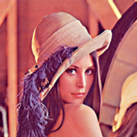
###### *Бонус в 30 баллов за возможность управления величиной резкости*
Бонус начисляется за реализацию возможности управления величиной повышения резкости при помощи клавиш управления курсором по аналогии с тем, как это сделано в программе Paint .NET.
##### Вариант №2 – Фильтр выделения краев (Edge Detection) – 60 баллов
 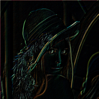
###### *Бонус в 40 баллов за возможность управления углом*
Бонус начисляется за возможность изменения угла применения фильтра при помощи клавиш управления курсора по аналогии с тем, как это сделано в программе Paint .NET. Должна иметься возможность задать любое целочисленное значение угла от 0 до 360 градусов.
##### Вариант №3 – Фильтр тиснения (Emboss) – 60 баллов
  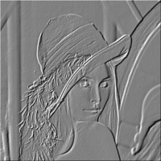
###### *Бонус в 40 баллов за возможность изменения угла тиснения*
Бонус начисляется за возможность изменения угла применения фильтра при помощи клавиш управления курсора по аналогии с тем, как это сделано в программе Paint .NET. Должна иметься возможность задать любое целочисленное значение угла тиснения от 0 до 360 градусов.
##### Вариант №4 – Фильтр рельефа (Relief) – 65 баллов
  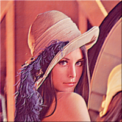
###### *Бонус в 40 баллов за возможность изменения угла наложения фильтра*
Бонус начисляется за возможность изменения угла применения фильтра при помощи клавиш управления курсора по аналогии с тем, как это сделано в программе Paint .NET. Должна иметься возможность задать любое целочисленное значение угла от 0 до 360 градусов.
##### Вариант №5 – Медианный фильтр – 100 баллов
  
###### *Бонус в 50 баллов за возможность изменения радиуса фильтра*
Бонус начисляется за возможность изменения радиуса медианного фильтра при помощи клавиш управления курсором. Допустимое значение радиуса фильтра от 1 до 7.
##### Вариант №6 – HSL-коррекция изображений – 50 баллов
 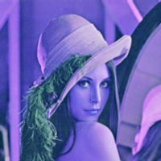
###### *Бонус в 30 баллов за возможность управления цветности и насыщенностью изображения*
Бонус начисляется за возможность изменения цветности и насыщенности при помощи клавиш управления курсором: влево/вправо – управление цветностью, вверх/вниз – управление насыщенностью.
### <a name="_toc342938592"></a>**Дополнительные задания**
#### ***Задание 2 – создание эффекта Glow (свечение) – до 300 баллов***
Разработать OpenGL приложение, визуализирующее в реальном времени трехмерную сцену, содержащую светящиеся объекты.

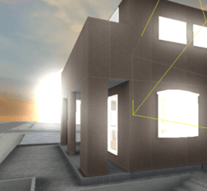  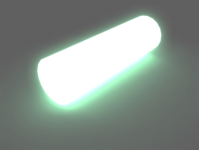

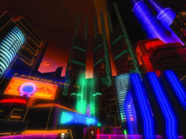 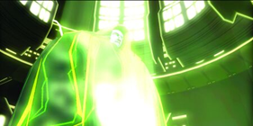
##### Реализация эффекта Glow
Для реализации данного эффекта потребуется нарисовать сцену дважды. В основном буфере кадра сцена рисуется как обычно. Во вспомогательном буфере кадра объекты, излучающие свет рисуются светлыми цветами, остальные объекты – черным. К текстуре, связанной со вспомогательным буфером кадра, применяется фильтр сильного размытия. В результате, излучающие свет объекты окажутся сильно размытыми. Полученная текстура накладывается на прямоугольник размером с основной буфер кадра в режиме сложения цветов[^11]. В результате будет получен желаемый результат.

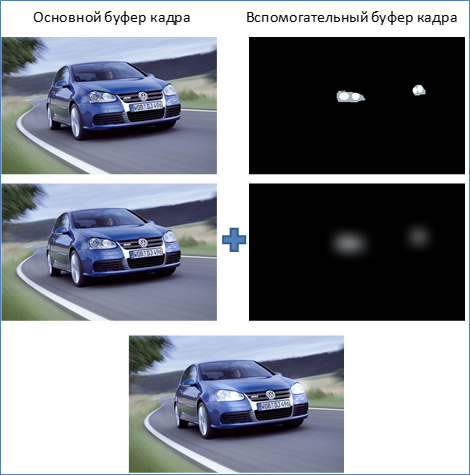

*Принцип реализации эффекта Glow*

Вспомогательный буфер кадра должен иметь связанный с ним буфер глубины, чтобы излучающие свет объекты могли перекрываться объектами, которые свет не излучают.
###### *Улучшения и оптимизации*
Разрешение вспомогательного буфера может быть меньше разрешения основного буфера кадра (в 2-4 раза). Это не только увеличит быстродействие приложения, но и придаст дополнительное размытие светящимся объектам.

Если при размытии текстуры вспомогательного буфера кадра перед формированием результирующего цвета складывать вычисленный цвет с цветом соответствующего фрагмента на предыдущем кадре, умноженным на некоторый коэффициент в диапазоне от 0 до 1, светящиеся объекты будут оставлять инерционный след. Такой эффект (назовем его **light motion blur**) можно наблюдать, например, на снимках ночных городов, сделанных с большой экспозицией.


Для реализации данного эффекта понадобится завести дополнительную текстуру, хранящую содержимое буфера цвета на предыдущем кадре. Фрагментный шейдер при осуществлении размытия в таком случае будет использовать две входные текстуры.
##### Требования к заданию
Сцена должна содержать несколько излучающих и неизлучающих свет объектов. Пользователь должен иметь возможность осуществлять вращение камеры вокруг сцены. Приветствуется изменение положения объектов относительно друг друга.

Примеры сцен со светящимися объектами

- Вращение Земли вокруг Солнца. Вокруг Солнца сияющий ореол.
- Дом со светящимися окнами
- Автомобиль со светящимися фарами
- Светящаяся неоновая вывеска

Выбор не ограничивается данными сценами. Вы можете предложить собственный вариант эффектно выглядящей сцены со светящимися объектами. Рекомендуется предварительно проконсультироваться с преподавателем.
###### *Бонус в 50 баллов за реализацию эффекта light motion blur*
Бонус начисляется за смешивание цвета размытой текстуры со слегка приглушенным цветом размытой текстуры предыдущего кадра.
## <a name="_toc342938593"></a>**Список литературы**
1. Расширение GL_EXT_framebuffer_object
   <http://www.opengl.org/wiki/GL_EXT_framebuffer_object>
   <http://www.opengl.org/registry/specs/EXT/framebuffer_object.txt>

[^1]: Драйвер используемой автором видеокарты GeForce 7600, поддерживает лишь расширение GL_EXT_framebuffer_object.
[^2]: Под специальной клавишей понимается клавиша, которой не соответствует какой-либо символ, например, одна из клавиш управления курсором, функциональная клавиша.
[^3]: Поскольку диспетчер событий не определяет какого-либо порядка вызова обработчиков событий, обработчик мыши в классе CRotationController может быть вызван при заранее неизвестном состоянии OpenGL и модификация текущей матрицы может не возыметь желаемого эффекта.
[^4]: Строго говоря, это может касаться любой команды, запрашивающей текущее состояние OpenGL. Поэтому при разработке высокопроизводительных OpenGL-приложений следует стремиться к тому, чтобы минимизировать использование команд, запрашивающих состояние. Это позволит обеспечить параллельную работу центрального процессора и графического ускорителя.
[^5]: Команды в OpenGL выполняются в процессе их отправки приложением. Однако Стандарт не гарантирует их немедленного исполнения после отправки. Стандарт позволяет реализациям буферизировать команды и начать их исполнение по мере заполнения буфера или при вызове функций glFlush()/glFinish().
[^6]: [Анизотропная фильтрация](http://ru.wikipedia.org/wiki/%D0%90%D0%BD%D0%B8%D0%B7%D0%BE%D1%82%D1%80%D0%BE%D0%BF%D0%BD%D0%B0%D1%8F_%D1%84%D0%B8%D0%BB%D1%8C%D1%82%D1%80%D0%B0%D1%86%D0%B8%D1%8F) -  в трехмерной графике метод улучшения качества изображения текстур на поверхностях, сильно наклоненных относительно камеры.
[^7]: Уровни детализации необходимы, поскольку в параметрах фильтрации текстурного объекта указано использование mip-уровней. 
[^8]: OpenGL не сможет использовать буфер кадра, если в нем будут содержаться изображения разного размера, или будут отсутствовать необходимые изображения.
[^9]: Строго говоря, результаты будут несколько отличаться из-за ошибок квантования цвета изображения в буфере кадра – после первого применения фильтра значения составляющих цвета с плавающей запятой будут округлены до ближайших целочисленных значений. В результате, при втором применении фильтра будут обрабатываться квантованные значения цвета.
[^10]: Обработка каждого пикселя вовлекает использование 19 выборок из текстуры для горизонтального и вертикального размытия.
[^11]: В OpenGL данному режиму смешивания цветов соответствует функция смешивания цветов glBlendFunc(GL_ONE, GL_ONE).
