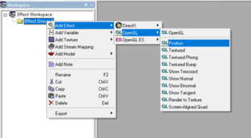
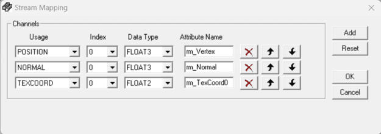
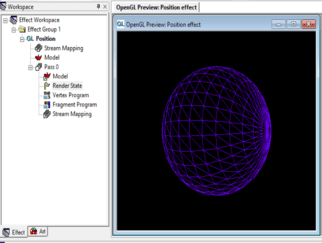
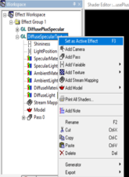
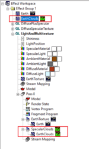

# **Оглавление**
[Лабораторная работа №11. Знакомство со средой разработки шейдеров Render Monkey. Модели освещения. Визуализация зеркальных и преломляющих свет объектов](#_toc343021980)

&emsp;[Знакомство со средой разработки шейдеров Render Monkey](#_toc343021981)

&emsp;&emsp;[Окно программы](#_toc343021982)

&emsp;&emsp;[Создание простейшего эффекта диффузного освещения](#_toc343021983)

&emsp;[Комбинирование текстуры и освещения](#_toc343021984)

&emsp;[Комбинируем мультитекстурирование с освещением](#_toc343021985)

&emsp;&emsp;[Добавим немножко облачности](#_toc343021986)

&emsp;&emsp;[Создаем различные параметры зеркального отражения для земли и суши.](#_toc343021987)

&emsp;&emsp;[Повышаем реалистичность ночных участков земной поверхности](#_toc343021988)

&emsp;[Использование карт нормалей для создания эффекта микрорельефа поверхности.](#_toc343021989)

&emsp;[Практические задания](#_toc343021990)

&emsp;&emsp;[Обязательные задания](#_toc343021991)

&emsp;&emsp;[Дополнительные задания](#_toc343021992)

&emsp;[Ссылки](#_toc343021993)


# <a name="_toc343021980"></a>**Лабораторная работа №11. Знакомство со средой разработки шейдеров Render Monkey. Модели освещения. Визуализация зеркальных и преломляющих свет объектов**
## <a name="_toc343021981"></a>**Знакомство со средой разработки шейдеров Render Monkey**
[Render Monkey](https://gpuopen.com/archived/rendermonkey-toolsuite/) – среда разработки шейдеров для программистов и дизайнеров, поддерживающая языки программирования шейдеров для DirectX 9.1, OpenGL 2.0 и OpenGL ES (2.0). Данный инструмент ускоряет разработку сложных шейдеров, поскольку берет на себя решение большей части сопутствующих задач, позволяя сосредоточиться на процессе создания шейдера.

В настоящее время компания AMD остановила развитие проекта Render Monkey. Тем не менее, последняя версия доступна для свободного скачивания с сайта [developer.amd.com](https://gpuopen.com/archived/rendermonkey-toolsuite/) и содержит большое количество примеров шейдеров.
### <a name="_toc343021982"></a>**Окно программы**
Окно программы разделено на несколько панелей.


Рабочая область эффектов (Effect workspace) отображает древовидную структуру объектов (моделей, эффектов, шейдеров, переменных, текстур и др.), входящих в состав рабочей области. Двойной щелчок по объекту открывает его в редакторе, либо в отдельном окне. Два одинарных щелчка позволяют изменить имя атрибута на более информативное.

Панель вывода (**Output**) предназначена для вывода диагностической информации, например, об ошибках во время компиляции шейдеров.

Остальную область окна занимают панели редактора объектов.
### <a name="_toc343021983"></a>**Создание простейшего эффекта диффузного освещения**
Для начала добавим пустую группу эффектов к нашей рабочей области. Внутри группы эффектов может располагаться несколько эффектов, совместно использующих объекты, входящие в состав рабочей области. Добавить пустую группу эффектов можно при помощи контекстного меню рабочей области:


К созданной группе эффектов добавим новый OpenGL-эффект на основе шаблона **Position**.



При этом в состав эффекта по умолчанию войдет несколько узлов:


**Stream mapping** – перечень и свойства атрибутов, передаваемых шейдеру через атрибутивные переменные. Двойной клик по данному узлу открывает окно настроек Stream mapping, в котором можно добавить, удалить или отредактировать параметры атрибутов.



**Model** – трехмерная модель в одном из поддерживаемых форматов. Двойной клик позволяет выбрать другую модель.

**Pass** – шаг (этап, проход) рендеринга. С каждым шагом связана ссылка на модель, ссылка на stream mapping, а также вершинный и фрагментный шейдеры. Среда Render Monkey позволяет создавать многопроходные эффекты, на каждом проходе которых рисуется та или иная часть сцены.

Двойной клик по вершинному, либо фрагментному шейдеру открывает его исходный код в окне редактора шейдеров.


Вершинный и фрагментный шейдеры добавленного нами эффекта выполняют минимум действий, а именно – стандартную трансформацию вершины и задание константного цвета фрагмента.
#### ***Редактирование режимов визуализации OpenGL***
Попробуем изменить состояние OpenGL на данном проходе рендеринга, например, чтобы нарисовать модель в режиме wireframe.

Для этого добавим при помощи контекстного меню узел «Render State Block» и в режиме его редактирования зададим переменной состояния GL\_PolyFrontMode режим LINES, что аналогично вызову команды glPolygonMode(GL\_FRONT, GL\_LINES).

 

В результате модель сферы будет изображена при помощи линий


#### ***Добавляем Uniform-переменные, задающие параметры источника света***
Для того, чтобы передать шейдеру координаты источника света в мировой системе координат, добавим uniform-переменную LightPosition, типа Float3, что соответствует типу vec3 языка шейдеров GLSL:


Зададим параметры переменной LightPosition, равными (100, 100, 100) в окне редактирования свойств переменной, вызываемом по двойному щелчку:


#### ***Разрабатываем шейдер простейшего диффузного освещения***
В окне редактирования вершинного шейдера напишем следующий код:

```cpp
uniform vec3 LightPosition;
varying vec3 LightDirection;
varying vec3 Normal;
void main(void)
{
    gl_Position = ftransform();
    Normal = gl_Normal;
    LightDirection = LightPosition - gl_Vertex.xyz;
}
```

Данный шейдер передает фрагментному шейдеру направление вектора нормали и направление на источник света через varying-переменные LightDirection и Normal.

Фрагментный шейдер будет вычислять коэффициент диффузного отражения по формуле Ламберта и задавать на его основе цвет фрагмента.

```cpp
varying vec3 LightDirection;
varying vec3 Normal;
void main(void)
{
    vec3 n = normalize(Normal);
    vec3 l = normalize(LightDirection);
    float diffuse = max(0.0, dot(n, l));
    gl_FragColor = vec4(diffuse, diffuse, diffuse, 1.0);
}
```

Нажмем клавишу F5 для компиляции шейдеров и переключимся на окно визуализации.


Изменяя координаты источника света, убедимся в том, что изменяется положение светового пятна.
#### ***Задаем цвет материала и источника света***
Цвет можно было бы передать шейдеру через uniform-переменную аналогично позиции источника света. Однако Render Monkey предоставляет более удобный способ – в качестве типа переменной выберем пункт **Color** в контекстном меню, а затем переименуем добавленную переменную в **DiffuseMaterial**.

 

Аналогичным образом зададим цвет материала **DiffuseLight**.

Модифицируем код фрагментного шейдера, добавив в него формирование отраженного цвета на основе цвета источника света и материала, а также фактора диффузного отражения:

```cpp
uniform vec4 DiffuseMaterial;
uniform vec4 DiffuseLight;
varying vec3 LightDirection;
varying vec3 Normal;
void main(void)
{
    vec3 n = normalize(Normal);
    vec3 l = normalize(LightDirection);
    float diffuseFactor = max(0.0, dot(n, l));
    vec4 diffuseIntensity = 
        DiffuseMaterial * DiffuseLight * diffuseFactor;
    gl_FragColor = diffuseIntensity;
}
```

Откомпилируем шейдеры и убедимся, что изменение цвета материала и источника света немедленно сказывается на цвете результирующего изображения.


#### ***Задаем параметры фоновой освещенности и фонового цвета материала***
Добавим переменные типа Color с именами AmbientMaterial и AmbientLight, задающие фоновый цвет материала и источника света, и добавим поддержку фоновой освещенности в код фрагментного шейдера.

```cpp
uniform vec4 DiffuseMaterial;
uniform vec4 DiffuseLight;
uniform vec4 AmbientMaterial;
uniform vec4 AmbientLight;
varying vec3 LightDirection;
varying vec3 Normal;
void main(void)
{
    vec3 n = normalize(Normal);
    vec3 l = normalize(LightDirection);

    float diffuseFactor = max(0.0, dot(n, l));
    vec4 diffuseIntensity = 
        DiffuseMaterial * DiffuseLight * diffuseFactor;
    vec4 ambientIntensity = AmbientLight * AmbientMaterial;
    gl_FragColor = diffuseIntensity + ambientIntensity;
}
```

#### ***Задаем параметры зеркальной освещенности материала***
Зададим параметры зеркального цвета материала (**SpecularMaterial**) и источника света (**SpecularLight**), а также параметр степени зеркального блеска **Shininess**, используемые в модели освещения Фонга.

Поскольку в модели Фонга для расчета зеркальной составляющей освещения используется положение наблюдателя, удобнее вычислять освещение в системе координат наблюдателя, а не в мировой системе координат. Направление видового вектора, направленного из вершины примитива в сторону наблюдателя, будет передаваться вершинному шейдеру через varying-переменную View.

```cpp
uniform vec3 LightPosition;
varying vec3 LightDirection;
varying vec3 Normal;
varying vec3 View;
void main(void)
{
    // Transform coordinate
    gl_Position = ftransform();

    // Transform normal to eye space
    Normal = gl_NormalMatrix * gl_Normal;

    // Vertex to light in eye space
    LightDirection = gl_NormalMatrix * (LightPosition - gl_Vertex.xyz);

    // Vertex position in eye space
    vec4 pos = gl_ModelViewMatrix * gl_Vertex;

    // Calculate view vector
    View = -vec3(pos);
}
```

Во фрагментный шейдер добавится вычисление зеркальной составляющей освещения по формуле Фонга.

```cpp
uniform vec4 DiffuseMaterial;
uniform vec4 DiffuseLight;
uniform vec4 AmbientMaterial;
uniform vec4 AmbientLight;
uniform vec4 SpecularMaterial;
uniform vec4 SpecularLight;
uniform float Shininess;
varying vec3 LightDirection;
varying vec3 Normal;
varying vec3 View;
void main(void)
{
    vec3 n = normalize(Normal);
    vec3 l = normalize(LightDirection);
    vec3 v = normalize(View);

    float diffuseFactor = max(0.0, dot(n, l));
    vec4 diffuseIntensity = 
        DiffuseMaterial * DiffuseLight * diffuseFactor;

    vec4 ambientIntensity = AmbientLight * AmbientMaterial;

    vec3 r = reflect(-l, n);
    float specularFactor = max(0.0, dot(r, v));
    vec4 specularIntensity = 
        SpecularMaterial * SpecularLight * pow(specularFactor, Shininess);

    gl_FragColor = 
        diffuseIntensity + 
        ambientIntensity + 
        specularIntensity;
}
```


## <a name="_toc343021984"></a>**Комбинирование текстуры и освещения**
Скопируем эффект, разработанный в предыдущем разделе, в буфер обмена, воспользовавшись командой контекстного меню, и вставим копию внутрь группы эффектов. Это позволит нам сэкономить время на проделывании данных операций. Зададим скопированному эффекту осмысленное имя, и сделаем его активным при помощи клавиши F3, либо команды контекстного меню.

  

На следующем этапе добавим в состав группы эффектов текстуру Земли (Earth.jpg) из набора текстур программы Render Monkey..


Текстура поверхности планеты Земля:


Поскольку текстурные координаты используемой модели сферы подразумевают нахождение начала координат в левом нижнем углу изображения, необходимо установить параметр Origin текстурного объекта в **Bottom Left Origin**:


Для того, чтобы текстуру можно было использовать в составе созданного нами эффекта, необходимо добавить внутрь прохода рендеринга текстурный объект, ссылающийся на добавленную нами текстуру.


Зададим имя для добавленного текстурного объекта **EarthTexture**. Под этим именем можно будет обращаться к текстурному объекту из шейдерных программ. Доработаем вершинный шейдер таким образом, чтобы он передавал текстурные координаты вершины фрагментному шейдеру.

```cpp
uniform vec3 LightPosition;
varying vec3 LightDirection;
varying vec3 Normal;
varying vec3 View;
varying vec2 TexCoords;
void main(void)
{
    // Transform coordinate
    gl_Position = ftransform();

    // Transform normal to eye space
    Normal = gl_NormalMatrix * gl_Normal;

    // Vertex to light in eye space
    LightDirection = gl_NormalMatrix * (LightPosition - gl_Vertex.xyz);

    // Vertex position in eye space
    vec4 pos = gl_ModelViewMatrix * gl_Vertex;

    // Calculate view vector
    View = -vec3(pos);
    // Pass texture coordinates to the fragment shader
    TexCoords = gl_MultiTexCoord0.xy;
}
```

Фрагментный шейдер также подвергнется небольшим изменениям. Вместо диффузного цвета материала будет использоваться 2D текстура **EarthTexture**.

```cpp
//uniform vec4 DiffuseMaterial;
uniform vec4 DiffuseLight;
uniform vec4 AmbientMaterial;
uniform vec4 AmbientLight;
uniform vec4 SpecularMaterial;
uniform vec4 SpecularLight;
uniform float Shininess;
uniform sampler2D EarthTexture;
varying vec3 LightDirection;
varying vec3 Normal;
varying vec3 View;
varying vec2 TexCoords;

void main(void)
{
    vec3 n = normalize(Normal);
    vec3 l = normalize(LightDirection);
    vec3 v = normalize(View);

    vec4 textureColor = texture2D(EarthTexture, TexCoords);

    float diffuseFactor = max(0.0, dot(n, l));
    vec4 diffuseIntensity = 
        textureColor * DiffuseLight * diffuseFactor;

    vec4 ambientIntensity = AmbientLight * AmbientMaterial;

    vec3 r = reflect(-l, n);
    float specularFactor = max(0.0, dot(r, v));
    vec4 specularIntensity = 
        SpecularMaterial * SpecularLight * pow(specularFactor, Shininess);

    gl_FragColor = 
        diffuseIntensity + 
        ambientIntensity + 
        specularIntensity;
}
```

После перекомпиляции шейдерных программ (клавиша F5), мы увидим изображение планеты, с освещением.


## <a name="_toc343021985"></a>**Комбинируем мультитекстурирование с освещением**
Создадим копию эффекта и дадим ей новое имя – **LightAndMultitexture**. Для создания эффекта нам понадобится текстура, задающая информацию об облачности и участках, покрытых водой и сушей. Эти данные могут быть закодированы в одной текстуре в разных цветовых каналах. Красный канал будет нести информацию об интенсивности облаков, а зеленый – информацию о воде и суше. Области, занимаемые водой, будут иметь максимальную интенсивность зеленого цвета, а сушей – минимальную. Области, занимаемые водой, будут иметь как диффузную, так и зеркальную составляющие отраженного света, а области, занимаемые сушей – только диффузную.


Добавим данную текстуру к рабочей области, а соответствующий ей текстурный объект **SpecularClouds** добавим в первый проход рендеринга эффекта.


### <a name="_toc343021986"></a>**Добавим немножко облачности**
Фрагментный шейдер извлекает из текстуры облаков красную составляющую и использует ее для комбинирования цвета планеты с цветом облаков (в нашем случае цвет облаков будет равен фактору диффузного освещения фрагмента).

```cpp
uniform vec4 DiffuseLight;
uniform vec4 AmbientMaterial;
uniform vec4 AmbientLight;
uniform vec4 SpecularMaterial;
uniform vec4 SpecularLight;
uniform float Shininess;
uniform sampler2D EarthTexture;
uniform sampler2D SpecularClouds;
varying vec3 LightDirection;
varying vec3 Normal;
varying vec3 View;
varying vec2 TexCoords;
void main(void)
{
    vec3 n = normalize(Normal);
    vec3 l = normalize(LightDirection);
    vec3 v = normalize(View);

    // Fetch Earth color and clouds density from the texture
    vec4 earthColor = texture2D(EarthTexture, TexCoords);
    vec4 sc = texture2D(SpecularClouds, TexCoords);
    float cloudsDensity = sc.r;

    // Calculate diffuse lighting
    float diffuseFactor = max(0.0, dot(n, l));

    // Combine earth and clouds color
    vec4 diffuseColor = 
        mix(earthColor, vec4(diffuseFactor), cloudsDensity);

    vec4 diffuseIntensity = 
        diffuseColor * DiffuseLight * diffuseFactor;

    vec4 ambientIntensity = AmbientLight * AmbientMaterial;
    vec3 r = reflect(-l, n);
    float specularFactor = max(0.0, dot(r, v));
    vec4 specularIntensity = 
        SpecularMaterial * SpecularLight * pow(specularFactor, Shininess);

    gl_FragColor = 
        diffuseIntensity + 
        ambientIntensity + 
        specularIntensity;
}
```

На рисунке представлен внешний вид планеты с добавленными облаками.


### <a name="_toc343021987"></a>**Создаем различные параметры зеркального отражения для земли и суши.**
Следующим улучшением фрагментного шейдера станет вычисление зеркальной составляющей освещения только для областей, покрытых водой (в используемой нами текстуре облаков коэффициент зеркального отражения хранится в зеленом канале). Для этого необходимо выполнить модуляцию интенсивности зеркальной составляющей отраженного цвета с коэффициентом зеркального отражения.

Обновленный код фрагментного шейдера.

```cpp
//uniform vec4 DiffuseMaterial;
uniform vec4 DiffuseLight;
uniform vec4 AmbientMaterial;
uniform vec4 AmbientLight;
uniform vec4 SpecularMaterial;
uniform vec4 SpecularLight;
uniform float Shininess;
uniform sampler2D EarthTexture;
uniform sampler2D SpecularClouds;
varying vec3 LightDirection;
varying vec3 Normal;
varying vec3 View;
varying vec2 TexCoords;
void main(void)
{
    vec3 n = normalize(Normal);
    vec3 l = normalize(LightDirection);
    vec3 v = normalize(View);

    // Fetch Earth color and clouds density from the texture
    vec4 earthColor = texture2D(EarthTexture, TexCoords);
    vec4 sc = texture2D(SpecularClouds, TexCoords);
    float cloudsDensity = sc.r;
    float specularMask = sc.g;

    // Calculate diffuse lighting
    float diffuseFactor = max(0.0, dot(n, l));

    // Combine earth and clouds color
    vec4 diffuseColor =
        mix(earthColor, vec4(diffuseFactor), cloudsDensity);

    vec4 diffuseIntensity = 
        diffuseColor * DiffuseLight * diffuseFactor;

    vec4 ambientIntensity = AmbientLight * AmbientMaterial;

    vec3 r = reflect(-l, n);

    // Modulate specular light with specular map
    float specularFactor = max(0.0, dot(r, v)) * specularMask;

    vec4 specularIntensity = 
        SpecularMaterial * SpecularLight * pow(specularFactor, Shininess);

    gl_FragColor = 
        diffuseIntensity + 
        ambientIntensity + 
        specularIntensity;
}
```

Сравним два изображения планеты Земля. На изображении справа зеркальной составляющей освещения обладают только занятые водой, что визуально подчеркивает различия между сущей и водой.


### <a name="_toc343021988"></a>**Повышаем реалистичность ночных участков земной поверхности**
Жизнедеятельность человека изменила внешний облик Земли. В том числе это проявляется и в том, как наша планета выглядит из Космоса. Способствует этому ночная жизнь обитателей крупных населенных пунктов.

|Такой Земля выглядела до появления человека:|А такой она выглядит сегодня:|
| - | - |
|||

Для улучшения внешнего вида Земли в ночное время суток необходимо использовать дополнительную текстуру, задающую внешний вид неосвещенных Солнцем участков нашей планеты.

Добавим данную текстуру в рабочую область и дадим имя соответствующему текстурному объекту **EarthNightTexture**.


Текстура ночной поверхности планеты можно было бы использовать для тех фрагментов, для которых интенсивность диффузной составляющей освещения равняется нулю. Однако это вызвало бы неестественно резкий переход между днем и ночью[^1]:


Поэтому лучше сделать плавный переход между использованием дневной и ночной текстуры с помощью функции **mix** в зависимости от интенсивности диффузного освещения. Интенсивность, при которой будет использоваться только дневная текстура, обозначим константой TwilightFactor, которой зададим значение, равное 0.3. При диффузной освещенности в диапазоне от 0 до TwilightFactor будет наблюдаться плавный переход от ночной к дневной текстуре.

Облака в ночное время также никуда не деваются. Только в отличие от светлого времени суток, когда они отражали свет от Солнца, в ночное время они будут поглощать часть света от Земной поверхности. Для этого цвет ночной текстуры будет промодулирован чистотой ночного неба[^2].

Благодаря использованию ночной текстуры Земли, нет необходимости в использовании интенсивности фоновой интенсивности источника света и фонового цвета материала.

```cpp
uniform vec4 DiffuseLight;
uniform vec4 SpecularMaterial;
uniform vec4 SpecularLight;
uniform float Shininess;
uniform sampler2D EarthTexture;
uniform sampler2D SpecularClouds;
uniform sampler2D EarthNightTexture;
varying vec3 LightDirection;
varying vec3 Normal;
varying vec3 View;
varying vec2 TexCoords;
const float TwilightFactor = 0.3;
void main(void)
{
    vec3 n = normalize(Normal);
    vec3 l = normalize(LightDirection);
    vec3 v = normalize(View);

    // Fetch Earth color and clouds density from the texture
    vec4 earthDayColor = texture2D(EarthTexture, TexCoords);
    vec4 sc = texture2D(SpecularClouds, TexCoords);
    float cloudsDensity = sc.r;
    float specularMask = sc.g;
    // Calculate diffuse lighting
    float diffuseFactor = max(0.0, dot(n, l));

    // Combine earth and clouds color
    vec4 dayColor = 
        mix(earthDayColor, vec4(diffuseFactor), cloudsDensity);

    // calculate day diffuse color
    vec4 day = 
        dayColor * DiffuseLight * diffuseFactor;
    // fetch night color from texture
    vec4 night = 
        texture2D(EarthNightTexture, TexCoords) * (1.0 - cloudsDensity);

    // calculate day/night factor
    float dayNightFactor = 
        clamp(diffuseFactor / TwilightFactor, 0.0, 1.0);

    // calculate diffuse color
    vec4 diffuseColor = mix(night, day, dayNightFactor);

    // calculate specular reflection
    vec3 r = reflect(-l, n);
    float specularFactor = max(0.0, dot(r, v)) * specularMask;
    vec4 specularColor = 
        SpecularMaterial * SpecularLight * pow(specularFactor, Shininess);

    gl_FragColor = 
        diffuseColor + 
        specularColor;
}
```

Результат работы шейдерной программы представлен на рисунке.


## <a name="_toc343021989"></a>**Использование карт нормалей для создания эффекта микрорельефа поверхности.**
Для создания эффекта микрорельефа поверхности воспользуемся картой высот Земной поверхности. Яркие фрагменты соответствуют более возвышенностям, а темные – низинам.


Сама по себе данная текстура нам не подойдет, т.к. для создания эффекта Bump Mapping требуется карта нормалей. Однако на основе данного изображения можно с легкостью сгенерировать карту нормалей при помощи специальных утилит. Например, можно создать карту нормалей онлайн на [сайте](https://recoshet.github.io/services/normal_map/).

Сохраним сгенерированный при помощи программы файл карты нормалей и добавим его как текстурный объект с именем NormalMapTexture.


Вычисление освещенности при использовании карт нормалей удобно выполнять в [касательном пространстве](http://en.wikipedia.org/wiki/Tangent_space). Для задания касательного пространства с каждой вершиной модели должны быть связаны 3 вектора: касательная (tangent), бинормаль (binormal) и нормаль (normal). В окне Stream Mapping эффекта добавим дополнительный канал TANGENT и свяжем с ним имя атрибутивной переменной Tangent. Бинормаль можно будет вычислить при помощи вершинного шейдера через векторное произведение вектора нормали и касательного вектора.


В задачи вершинного шейдера входит вычисление бинормали и трансформация видового вектора и вектора направления на источник света в касательное пространство.

```cpp
uniform vec3 LightPosition;
varying vec3 LightDirection;
varying vec3 View;
varying vec2 TexCoords;
attribute vec3 Tangent;
void main(void)
{
    // Transform coordinate
    gl_Position = ftransform();

    // Transform normal to eye space
    vec3 normal = normalize(gl_NormalMatrix * gl_Normal);
    vec3 tangent = normalize(gl_NormalMatrix * Tangent);
    vec3 binormal = cross(normal, tangent);

    // Vertex position in eye space
    vec3 pos = (gl_ModelViewMatrix * gl_Vertex).xyz;
    // Calculate view vector
    vec3 v = -pos;
    // transform view vector to tangent space
    View = vec3(dot(tangent, v), dot(binormal, v), dot(normal, v));
    // Vertex to light in eye space
    vec3 l = gl_NormalMatrix * (LightPosition - gl_Vertex.xyz);
    // Light direction in tangent space
    LightDirection = 
        vec3(dot(tangent, l), dot(binormal, l), dot(normal, l));

    // Pass texture coordinates to the fragment shader
    TexCoords = gl_MultiTexCoord0.xy;
}
```

Фрагментный шейдер извлекает из карты нормалей направление вектора нормали и распаковывает его. Вычисление освещенности планеты выполняется с использованием данного вектора нормали. Для вычисления освещенности облаков используется неискаженный вектор нормали[^3].

```cpp
uniform vec4 DiffuseLight;
uniform vec4 SpecularMaterial;
uniform vec4 SpecularLight;
uniform float Shininess;
uniform sampler2D EarthTexture;
uniform sampler2D SpecularClouds;
uniform sampler2D EarthNightTexture;
uniform sampler2D NormalMapTexture;
varying vec3 LightDirection;
varying vec3 View;
varying vec2 TexCoords;
const float TwilightFactor = 0.3;
void main(void)
{
    vec3 n = 
        normalize(texture2D(NormalMapTexture, TexCoords).xyz - 0.5);
    vec3 l = normalize(LightDirection);
    vec3 v = normalize(View);

    // Fetch Earth color and clouds density from the texture
    vec4 earthDayColor = texture2D(EarthTexture, TexCoords);
    vec4 sc = texture2D(SpecularClouds, TexCoords);
    float cloudsDensity = sc.r;
    float specularMask = sc.g;
    // Calculate diffuse lighting
    float diffuseFactor = max(0.0, dot(n, l));

    vec4 cloudColor = vec4(max(0.0, l.z));
    // Combine earth and clouds color
    vec4 dayColor = mix(earthDayColor, cloudColor, cloudsDensity);

    // calculate day diffuse color
    vec4 day = 
        dayColor * DiffuseLight * diffuseFactor;
    // fetch night color from texture
    vec4 night = 
        texture2D(EarthNightTexture, TexCoords) * (1.0 - cloudsDensity);

    // calculate day/night factor
    float dayNightFactor = 
        clamp(diffuseFactor / TwilightFactor, 0.0, 1.0);

    // calculate diffuse color
    vec4 diffuseColor = mix(night, day, dayNightFactor);

    // calculate specular reflection
    vec3 r = reflect(-l, n);
    float specularFactor = max(0.0, dot(r, v)) * specularMask;
    vec4 specularColor = 
        SpecularMaterial * SpecularLight * pow(specularFactor, Shininess);

    gl_FragColor = 
        diffuseColor +
        specularColor;
}
```

Сравнение изображения Земли без микрорельефа и с микрорельефом представлено на следующих рисунках.

 

## <a name="_toc343021990"></a>**Практические задания**
С данной лабораторной работой поставляются примеры программ и проектов для среды Render Monkey, иллюстрирующих в той или иной степени использование технологий визуализации, необходимых для выполнения практических заданий.

Для получения оценки «**удовлетворительно**» необходимо выполнить все обязательные задания, набрав не менее 40 баллов.

Для получения оценки «**хорошо**» необходимо выполнить все обязательные задания и часть дополнительных, набрав не менее 300 баллов

Для получения оценки «**отлично**» необходимо выполнить все обязательные задания и часть дополнительных, набрав не менее 500 баллов
### <a name="_toc343021991"></a>**Обязательные задания**
#### ***Задание 1 – визуализация трехмерных объектов с использованием диффузной и зеркальной моделей освещения – 50 баллов***
Разработайте OpenGL-приложение, выполняющее визуализацию нетривиальной[^4] трехмерной модели, загружаемой из .3DS файла[^5] и освещаемой при помощи точечного источника света, **вращающегося вокруг модели по эллиптической орбите**. Расчет диффузной и зеркальной составляющей отраженного света должен вычисляться для каждого пикселя при помощи фрагментного шейдера с использованием моделей освещения Ламберта и Фонга. Модель должна визуализироваться с учетом параметров материалов ее полигональных сеток.

Пользователь должен иметь возможность вращения камеры вокруг модели при помощи мыши. Источник света должен быть визуализирован в виде маленькой сферы соответствующего цвета. При вычислении освещения в шейдере должны учитываться параметры материала граней полигональных сеток модели.
##### Бонус в 50 баллов за использование нескольких источников света
Бонус начисляется за освещение модели большим (порядка 10-15) количеством точечных источников света, каждый из которых имеет свой цвет и траекторию движения. Пользователь должен иметь возможность изменять количество активных источников света от 1 до максимума при помощи клавиатуры.
##### Бонус в 20 баллов за поддержку текстур у трехмерных моделей
Бонус начисляется за поддержку текстурных карт, задающих цвет диффузного отражения поверхности объекта.
##### Бонус в 100 баллов за поддержку карт нормалей у трехмерных моделей
Бонус начисляется за визуализацию трехмерной модели, содержащей помимо карты диффузного отражения еще и карту нормали, задающей параметры микрорельефа поверхности (bump mapping). Для реализации данного эффекта требуется для каждой вершины помимо вектора нормали рассчитать касательный вектор. Как и вектор нормали, касательный вектор в вершинах должен быть задан с учетом групп сглаживания граней полигональной сетки.
### <a name="_toc343021992"></a>**Дополнительные задания**
Дополнительные задания принимаются только после успешной защиты обязательных заданий.
#### ***Задание 2 – визуализация зеркальных и преломляющих свет трехмерных объектов – 100 баллов***
Разработайте OpenGL приложение, выполняющее визуализацию трехмерной модели, загружаемой из .3DS файла и выполненной из материала, частично отражающего и частично преломляющего свет (используйте кубические карты текстур).

Пользователь должен иметь возможность вращения камеры вокруг объекта при помощи мыши.


##### Бонус в 30 баллов за имитацию эффекта дисперсии
Бонус начисляется за имитацию эффекта дисперсии (разложения света на радужные составляющие).


##### Бонус в 70 баллов за наличие микрорельефа на поверхности трехмерной модели
Бонус начисляется за добавление микрорельефа к поверхности модели.
##### Бонус в 100 баллов за динамическое формирование карты окружающей среды
Бонус начисляется за наличие в сцене еще одной трехмерной модели, отражающейся и преломляющейся в «стеклянной» модели. Для этого перед визуализацией преломляющего свет объекта необходимо выполнить рендеринг остальных объектов сцены в 6 изображений кубической текстуры и использовать эту текстуру в качестве текстуры окружающей среды выводимого объекта.
##### Бонус в 100 баллов за наличие в сцене плоского зеркала
Бонус начисляется за наличие в сцене плоского зеркала, отражающего объекты сцены и задний фон окружающей среды. Визуализация плоского зеркала должна выполняться с использованием соответствующей технологии, рассмотренной в лекции и проиллюстрированной в примерах к данной лабораторной работе.

#### ***Задание 3 – нефотореалистичный рендеринг***
Разработайте OpenGL- приложение, выполняющее нефотореалистичную визуализацию трехмерной модели, загружаемой из .3DS файла с использованием одной из технологий, соответствующей номеру Вашего варианта. При визуализации модели должен учитываться цвет диффузной составляющей материалов полигональных сеток, модулирующий цвет освещения, вычисленного с использованием той или иной технологии визуализации.
Пользователь должен иметь возможность вращения камеры вокруг трехмерной модели.
#### Вариант №1 – штриховка (hatching) – 100 баллов


#### Вариант №2 – Toon shading – 80 баллов
 

#### Вариант №3 – Metallic cartoon shading – 80 баллов
 

#### Вариант №4 – Освещение Гуча + выделение силуэта – 80 баллов
 

## <a name="_toc343021993"></a>Ссылки
1.	Создание GLSL-шейдеров в среде Render Monkey
    <http://www.dtf.ru/articles/read.php?id=38592&page=2>  
2.  Графический редактор Paint.NET
    <http://www.getpaint.net/>
3.  Плагин Normal Map для редактора Paint.NET
    <http://forums.getpaint.net/index.php?/topic/2534-normal-map/>
4.  Сайт для создания Normal Map онлайн
    <https://recoshet.github.io/services/normal_map/>

[^1]: Сразу вспоминается известный армейский афоризм: «По команде «отбой» наступает темное время суток».
[^2]: В нашем случае это будет величина (1.0 - cloudsDensity). Чем чище небо, тем отчетливее будет видно земную поверхность.
[^3]: В касательном пространстве данный вектор всегда имеет координаты (0, 0, 1).
[^4]: Под нетривиальной моделью понимается трехмерная модель, отличная от примитивных трехмерных объектов вроде сферы, куба и т.п.
[^5]: Допускается визуализация моделей, хранящихся в файлах иного формата.
